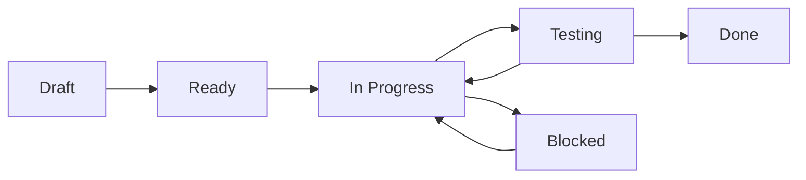
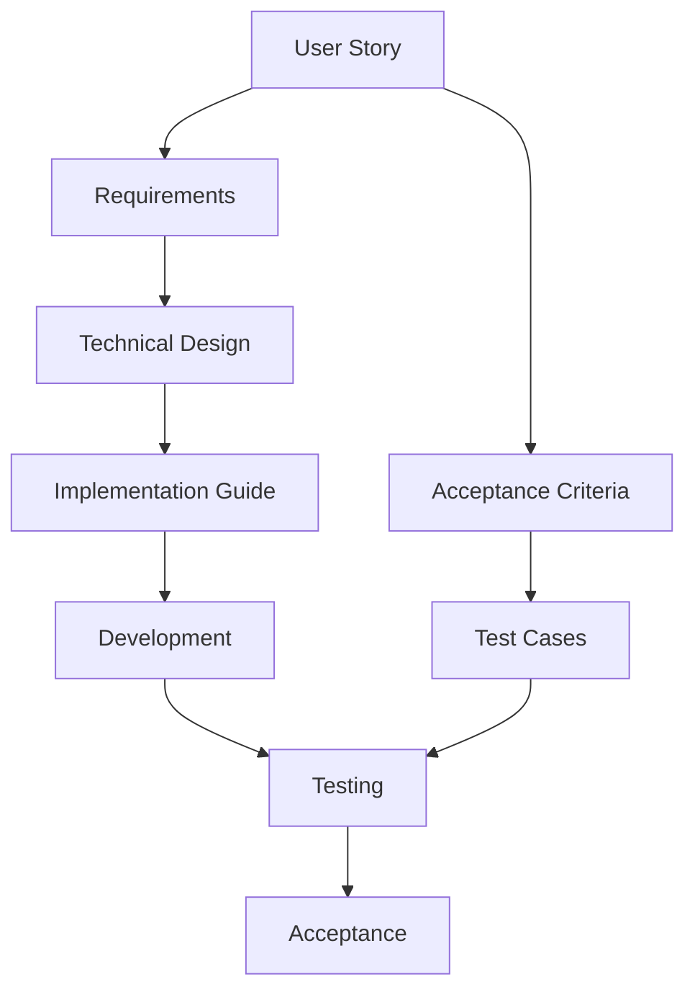

# User Story Principles

**Version:** 1.0  
**Date:** 2025-07-17  
**Purpose:** This document provides comprehensive guidance on writing effective user stories, using the User Story Template, and integrating stories with requirements, implementation, and testing.

## Table of Contents

1. [Introduction to User Stories](#1-introduction-to-user-stories)
2. [Anatomy of a Good User Story](#2-anatomy-of-a-good-user-story)
3. [INVEST Criteria](#3-invest-criteria)
4. [Writing Effective User Stories](#4-writing-effective-user-stories)
5. [User Story Types](#5-user-story-types)
6. [Acceptance Criteria Best Practices](#6-acceptance-criteria-best-practices)
7. [Story Sizing and Estimation](#7-story-sizing-and-estimation)
8. [User Story Lifecycle](#8-user-story-lifecycle)
9. [Common Patterns and Anti-patterns](#9-common-patterns-and-anti-patterns)
10. [Integration with Development Process](#10-integration-with-development-process)

## 1. Introduction to User Stories

### 1.1 What is a User Story?

A user story is a short, simple description of a feature told from the perspective of the person who desires the new capability, usually a user or customer of the system. It follows the format:

> **As a** [type of user]  
> **I want** [some goal]  
> **So that** [some reason]

### 1.2 Why User Stories?

User stories:
- **Focus on value**: Emphasize business value over technical implementation
- **Encourage conversation**: Serve as placeholders for detailed discussions
- **Enable flexibility**: Allow for changes as understanding evolves
- **Promote user-centric thinking**: Keep the user's needs at the forefront
- **Support iterative development**: Can be broken down and delivered incrementally

### 1.3 User Stories vs Requirements

| Aspect | User Stories | Traditional Requirements |
|--------|--------------|-------------------------|
| Format | Conversational | Formal specification |
| Focus | User value | System behavior |
| Detail | Emerges through discussion | Defined upfront |
| Flexibility | Highly flexible | Change-controlled |
| Ownership | Shared team ownership | Often analyst-owned |

## 2. Anatomy of a Good User Story

### 2.1 The Three C's

#### Card
The story itself - written on a card (physical or digital):
```
As a frequent shopper
I want to save my payment methods
So that I can checkout faster on future purchases
```

#### Conversation
The discussions that happen around the story:
- What payment methods should we support?
- How many cards can a user save?
- What about security concerns?
- How do we handle expired cards?

#### Confirmation
The acceptance criteria that confirm the story is complete:
- User can save up to 5 payment methods
- Saved cards show only last 4 digits
- User can delete saved payment methods
- Expired cards are flagged but not auto-removed

### 2.2 Essential Components

```xml
<UserStory>
    <StoryStatement>
        <AsA>registered user</AsA>
        <IWant>to bookmark articles</IWant>
        <SoThat>I can easily find and read them later</SoThat>
    </StoryStatement>
    
    <Context>
        <Background>Users often find interesting articles but don't have time to read them immediately</Background>
        <UserPersona>
            <Name>Rachel the Researcher</Name>
            <Goals>Collect and organize articles for her research</Goals>
        </UserPersona>
    </Context>
    
    <AcceptanceCriteria>
        <!-- Specific testable criteria -->
    </AcceptanceCriteria>
</UserStory>
```

## 3. INVEST Criteria

Good user stories follow the INVEST criteria:

### 3.1 **I**ndependent
Stories should be self-contained and deliverable independently.

❌ **Bad**: "As a user, I want to log in" (depends on user registration)  
✅ **Good**: "As a registered user, I want to log in with my email and password"

### 3.2 **N**egotiable
Stories are not contracts but starting points for discussion.

❌ **Bad**: Specifying exact implementation details  
✅ **Good**: Focusing on the goal, letting the team decide how

### 3.3 **V**aluable
Each story must deliver value to users or customers.

❌ **Bad**: "As a developer, I want to refactor the database"  
✅ **Good**: "As a user, I want faster search results" (which may require DB refactoring)

### 3.4 **E**stimable
The team should be able to estimate the story's size.

❌ **Bad**: "As a user, I want a perfect system"  
✅ **Good**: "As a user, I want to filter products by price range"

### 3.5 **S**mall
Stories should be completable within one sprint.

❌ **Bad**: "As a user, I want a complete e-commerce system"  
✅ **Good**: "As a user, I want to add items to my shopping cart"

### 3.6 **T**estable
Clear criteria for determining when the story is done.

❌ **Bad**: "As a user, I want a nice interface"  
✅ **Good**: "As a user, I want to complete checkout in under 3 clicks"

## 4. Writing Effective User Stories

### 4.1 Start with the User

Always identify the specific user or persona:
- ❌ "As a user..." (too generic)
- ✅ "As a first-time visitor..."
- ✅ "As a premium subscriber..."
- ✅ "As a system administrator..."

### 4.2 Focus on the What, Not the How

Stories should describe goals, not solutions:
- ❌ "I want a dropdown menu to select categories"
- ✅ "I want to filter products by category"

### 4.3 Include the Value Proposition

The "so that" clause explains why this matters:
- ❌ "So that the feature exists"
- ✅ "So that I can find products faster"
- ✅ "So that I don't have to re-enter my information"

### 4.4 Use Active Voice

Write stories in active, engaging language:
- ❌ "Products should be able to be searched"
- ✅ "I want to search for products"

### 4.5 Keep It Conversational

Stories should sound natural when spoken:
```
"As a busy parent, I want to reorder my previous grocery list
so that I can quickly shop for my weekly essentials"
```

## 5. User Story Types

### 5.1 Feature Stories

New functionality for users:
```xml
<UserStory>
    <Type>Feature</Type>
    <StoryStatement>
        <AsA>content creator</AsA>
        <IWant>to schedule posts for future publication</IWant>
        <SoThat>I can maintain a consistent posting schedule</SoThat>
    </StoryStatement>
</UserStory>
```

### 5.2 Enhancement Stories

Improvements to existing features:
```xml
<UserStory>
    <Type>Enhancement</Type>
    <StoryStatement>
        <AsA>mobile user</AsA>
        <IWant>faster page load times</IWant>
        <SoThat>I can browse content on slow connections</SoThat>
    </StoryStatement>
</UserStory>
```

### 5.3 Bug Stories

Fixing defects framed as user value:
```xml
<UserStory>
    <Type>Bug</Type>
    <StoryStatement>
        <AsA>customer</AsA>
        <IWant>accurate order totals in my cart</IWant>
        <SoThat>I know exactly what I'll be charged</SoThat>
    </StoryStatement>
</UserStory>
```

### 5.4 Technical Stories

Infrastructure or technical improvements:
```xml
<UserStory>
    <Type>Technical</Type>
    <StoryStatement>
        <AsA>application user</AsA>
        <IWant>the system to remain responsive during peak hours</IWant>
        <SoThat>I can complete my tasks without delays</SoThat>
    </StoryStatement>
</UserStory>
```

### 5.5 Spike Stories

Research or investigation tasks:
```xml
<UserStory>
    <Type>Spike</Type>
    <StoryStatement>
        <AsA>development team</AsA>
        <IWant>to investigate payment gateway options</IWant>
        <SoThat>we can choose the best solution for our users</SoThat>
    </StoryStatement>
</UserStory>
```

## 6. Acceptance Criteria Best Practices

### 6.1 Given-When-Then Format

Structure criteria for clarity:
```xml
<Criterion id="AC_001">
    <Given>I am viewing my shopping cart with items</Given>
    <When>I click "Apply Coupon" and enter a valid code</When>
    <Then>The discount should be applied to my order total</Then>
    <And>I should see the discount amount displayed</And>
    <And>The new total should reflect the discount</And>
</Criterion>
```

### 6.2 Make Criteria Testable

Each criterion should be verifiable:
- ❌ "The page should load quickly"
- ✅ "The page should load in under 2 seconds on 3G connection"

### 6.3 Cover Different Scenarios

Include:
- **Happy path**: Normal successful flow
- **Edge cases**: Boundary conditions
- **Error cases**: How failures are handled
- **Performance**: Speed and scalability needs

### 6.4 Acceptance Criteria Examples

#### E-commerce Checkout
```xml
<AcceptanceCriteria>
    <Criterion id="AC_001" priority="Must Have">
        <Given>I have items in my cart</Given>
        <When>I proceed to checkout</When>
        <Then>I should see all items with prices</Then>
        <And>I should see the total including tax and shipping</And>
    </Criterion>
    
    <Criterion id="AC_002" priority="Must Have">
        <Given>I am on the payment page</Given>
        <When>I enter invalid credit card details</When>
        <Then>I should see specific error messages</Then>
        <And>The form should highlight the invalid fields</And>
    </Criterion>
    
    <Criterion id="AC_003" priority="Should Have">
        <Given>I have successfully placed an order</Given>
        <When>The payment is processed</When>
        <Then>I should receive an order confirmation email within 5 minutes</Then>
    </Criterion>
</AcceptanceCriteria>
```

## 7. Story Sizing and Estimation

### 7.1 Story Points

Use relative sizing based on:
- **Complexity**: How difficult is the implementation?
- **Effort**: How much work is involved?
- **Risk**: How much uncertainty exists?

Common scales:
- Fibonacci: 1, 2, 3, 5, 8, 13
- T-shirt sizes: XS, S, M, L, XL
- Powers of 2: 1, 2, 4, 8, 16

### 7.2 Breaking Down Large Stories

When a story is too large (>8 points):

#### Vertical Slicing
Split by user value:
```
Original: "As a user, I want to manage my profile"

Split into:
- "As a user, I want to view my profile"
- "As a user, I want to update my basic information"
- "As a user, I want to upload a profile picture"
- "As a user, I want to change my password"
```

#### Workflow Steps
Split by process:
```
Original: "As a user, I want to buy products"

Split into:
- "As a user, I want to add products to cart"
- "As a user, I want to view my cart"
- "As a user, I want to enter shipping information"
- "As a user, I want to complete payment"
```

### 7.3 Story Sizing Guidelines

| Points | Description | Example |
|--------|-------------|---------|
| 1 | Trivial change | Update button text |
| 2 | Simple feature | Add a new field to a form |
| 3 | Standard feature | Basic CRUD operations |
| 5 | Complex feature | Integration with external service |
| 8 | Very complex | New workflow with multiple steps |
| 13 | Too large | Should be broken down |

## 8. User Story Lifecycle

### 8.1 Story States



### 8.2 Definition of Ready

Before development starts:
- [ ] Story follows INVEST criteria
- [ ] Acceptance criteria defined
- [ ] Dependencies identified
- [ ] Mockups/designs available (if needed)
- [ ] Technical approach discussed
- [ ] Story estimated by team

### 8.3 Definition of Done

Story is complete when:
- [ ] All acceptance criteria met
- [ ] Code reviewed and approved
- [ ] Unit tests written and passing
- [ ] Integration tests passing
- [ ] Documentation updated
- [ ] Deployed to staging
- [ ] Product owner accepted

## 9. Common Patterns and Anti-patterns

### 9.1 Effective Patterns

#### The Permission Story
```
As a [role]
I want to [access/restrict] [resource]
So that [security/privacy benefit]
```

#### The Performance Story
```
As a [user type]
I want [action] to complete in [time]
So that I can [benefit of speed]
```

#### The Data Story
```
As a [role]
I want to [see/export/analyze] [data]
So that I can [make decision/take action]
```

### 9.2 Anti-patterns to Avoid

#### The Technical Story
❌ **Bad**:
```
As a developer
I want to refactor the authentication module
So that the code is cleaner
```

✅ **Better**:
```
As a user
I want faster login response times
So that I can access my account quickly
```

#### The Vague Story
❌ **Bad**:
```
As a user
I want a better experience
So that I'm happier
```

✅ **Better**:
```
As a mobile user
I want to complete forms with fewer taps
So that I can submit information quickly on my phone
```

#### The Compound Story
❌ **Bad**:
```
As a user
I want to search, filter, sort, and export products
So that I can find what I need
```

✅ **Better**: Split into separate stories for each action

## 10. Integration with Development Process

### 10.1 From Story to Implementation



### 10.2 Linking Stories to Requirements

```xml
<RequirementReferences>
    <Requirement id="REQ-AUTH-001" path="requirements/auth.xml">
        <Description>Authentication requirements</Description>
        <Coverage>Login functionality</Coverage>
    </Requirement>
</RequirementReferences>
```

### 10.3 Linking to Implementation

```xml
<ImplementationReferences>
    <ImplementationGuide id="LOGIN_FEATURE_001">
        <Description>Login feature implementation</Description>
        <Tasks>5</Tasks>
        <EstimatedHours>16</EstimatedHours>
    </ImplementationGuide>
</ImplementationReferences>
```

### 10.4 Test Strategy Integration

Each acceptance criterion should map to test cases:

```xml
<TestingStrategy>
    <TestTypes>
        <TestType name="Unit" coverage="90%">
            <TestFiles>
                <TestFile>tests/unit/login.test.xml</TestFile>
            </TestFiles>
        </TestType>
    </TestTypes>
</TestingStrategy>
```

### 10.5 Metrics and Success Tracking

Define how to measure story success:

```xml
<Analytics>
    <SuccessMetrics>
        <Metric name="Login Success Rate" target="95%">
            <MeasurementMethod>Track successful vs failed login attempts</MeasurementMethod>
        </Metric>
        <Metric name="Login Time" target="<2 seconds">
            <MeasurementMethod>Measure from submit to dashboard load</MeasurementMethod>
        </Metric>
    </SuccessMetrics>
</Analytics>
```

## Best Practices Summary

### Do's ✅
1. **Start with user value** - Always focus on what the user gains
2. **Keep stories small** - Aim for completion within one sprint
3. **Write testable criteria** - Be specific and measurable
4. **Collaborate** - Stories are conversation starters
5. **Include context** - Help the team understand the why
6. **Consider all users** - Including edge cases and personas
7. **Link to requirements** - Maintain traceability

### Don'ts ❌
1. **Don't be too technical** - Avoid implementation details
2. **Don't be vague** - "Better" or "faster" need specifics
3. **Don't combine multiple goals** - One story, one objective
4. **Don't skip the value** - Always include "so that"
5. **Don't work in isolation** - Involve the team
6. **Don't ignore non-functional needs** - Performance matters
7. **Don't forget edge cases** - Happy path isn't enough

## Templates and Examples

### Feature Story Template
```
As a [specific user type]
I want to [accomplish specific goal]
So that [receive specific benefit]

Context: [1-2 sentences of background]

Acceptance Criteria:
- Given [context], when [action], then [outcome]
- Given [context], when [error], then [graceful handling]
- Performance: [specific metric]
- Security: [specific requirement]
```

### Bug Story Template
```
As a [affected user]
I want [correct behavior]
So that [impact of fix]

Current behavior: [what's broken]
Expected behavior: [what should happen]

Acceptance Criteria:
- Given [steps to reproduce], when [trigger], then [correct behavior]
- Existing functionality remains intact
- No performance degradation
```

## Conclusion

User stories are powerful tools for capturing requirements in a user-centric way. By following these principles and using the provided template, teams can create stories that:

- Deliver clear value to users
- Enable effective planning and estimation  
- Provide clear acceptance criteria
- Integrate seamlessly with technical implementation
- Support comprehensive testing
- Maintain traceability throughout the development lifecycle

Remember: User stories are about collaboration and communication. They're starting points for conversations that lead to great software.

---

**Related Resources:**
- [User_Story_Template.xml](./User_Story_Template.xml) - Comprehensive story template
- [Requirements_Template.xml](./Requirement_Template.xml) - Formal requirements structure
- [Implementation_Guide_Template.xml](./Implementation_Guide_Template.xml) - Technical implementation
- [Unit_Test_Template.xml](./Unit_Test_Template.xml) - Test specifications