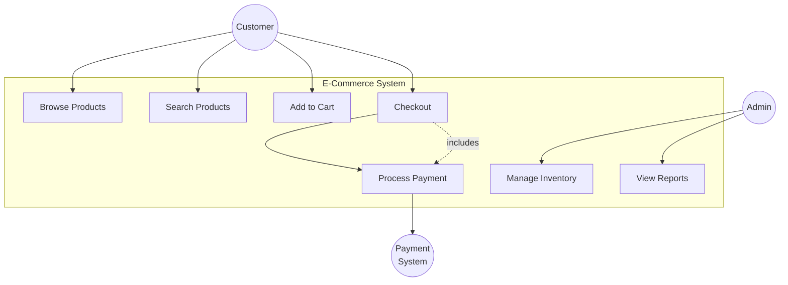
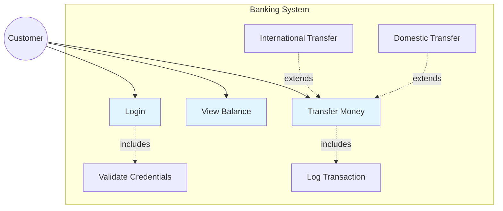
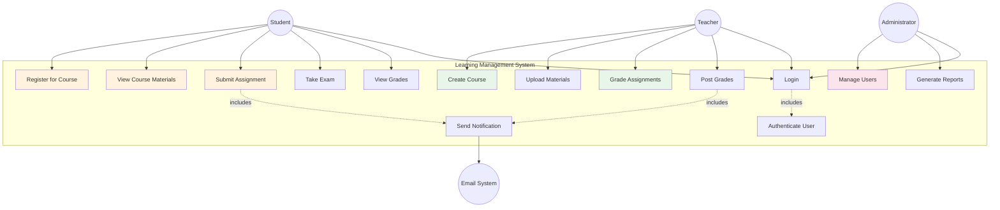
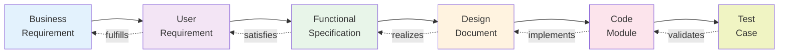
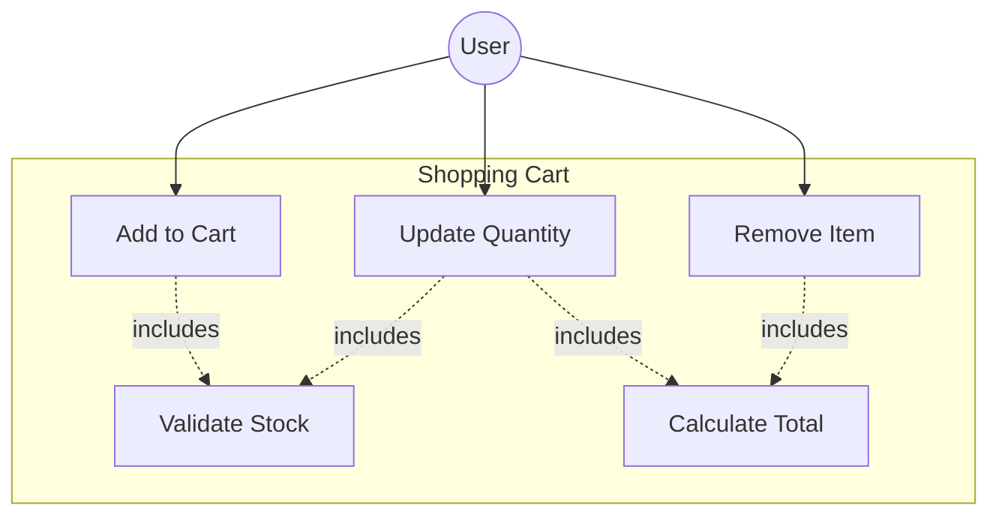

# Requirements Engineering Principles

**Version:** 1.0  
**Date:** 2025-07-16  
**Purpose:** This document establishes comprehensive principles and best practices for capturing, documenting, and managing software requirements using modern techniques including user stories, use case diagrams, and acceptance criteria.

## Table of Contents

1. [Introduction](#1-introduction)
2. [User Stories](#2-user-stories)
3. [Use Case Diagrams with Mermaid](#3-use-case-diagrams-with-mermaid)
4. [Requirements Types and Formats](#4-requirements-types-and-formats)
5. [Acceptance Criteria Patterns](#5-acceptance-criteria-patterns)
6. [Requirements Traceability](#6-requirements-traceability)
7. [Best Practices](#7-best-practices)
8. [Templates and Examples](#8-templates-and-examples)

## 1. Introduction

Well-written requirements are the foundation of successful software projects. This guide provides principles and patterns for creating clear, testable, and traceable requirements that bridge the gap between user needs and technical implementation.

### Core Principles

1. **User-Centric**: Focus on user value and outcomes
2. **Testable**: Every requirement must be verifiable
3. **Clear**: Unambiguous and understandable
4. **Complete**: Cover all aspects of the feature
5. **Traceable**: Link to source and implementation

## 2. User Stories

### 2.1 The User Story Format

User stories capture requirements from the user's perspective, focusing on the value delivered.

#### Classic Format
```
As a [type of user]
I want [to perform some action]
So that [I achieve some benefit/value]
```

#### Extended Format with Context
```
As a [type of user]
I want [to perform some action]
So that [I achieve some benefit/value]
When [context/condition]
Given [preconditions]
```

### 2.2 User Story Examples

#### Basic User Story
```
As a customer
I want to filter products by price range
So that I can find items within my budget
```

#### Context-Rich User Story
```
As a mobile app user
I want to save articles for offline reading
So that I can read content during my commute
When I don't have internet connectivity
Given I have previously downloaded the articles
```

### 2.3 INVEST Criteria

Good user stories follow the INVEST principle:

- **I**ndependent: Can be developed and delivered separately
- **N**egotiable: Details can be discussed and refined
- **V**aluable: Delivers value to the user
- **E**stimable: Can be sized/estimated
- **S**mall: Fits in a single iteration
- **T**estable: Has clear acceptance criteria

### 2.4 User Story Hierarchy

```
Epic
├── Feature
│   ├── User Story
│   │   ├── Task
│   │   └── Task
│   └── User Story
└── Feature
```

#### Epic Example
```
Epic: E-Commerce Checkout System
├── Feature: Shopping Cart Management
│   ├── Story: Add items to cart
│   ├── Story: Update quantities
│   └── Story: Remove items
├── Feature: Payment Processing
│   ├── Story: Credit card payment
│   ├── Story: PayPal integration
│   └── Story: Apply discount codes
└── Feature: Order Confirmation
    ├── Story: Display order summary
    └── Story: Send email confirmation
```

### 2.5 Writing Effective User Stories

#### DO:
- ✅ Focus on user goals, not implementation
- ✅ Keep stories small and focused
- ✅ Include acceptance criteria
- ✅ Use active voice
- ✅ Be specific about the user role

#### DON'T:
- ❌ Include technical implementation details
- ❌ Combine multiple features in one story
- ❌ Use vague terms like "user-friendly"
- ❌ Write from the system's perspective

## 3. Use Case Diagrams with Mermaid

Use case diagrams visualize the interactions between users (actors) and the system, showing what the system does from the user's perspective.

### 3.1 Basic Use Case Diagram



### 3.2 Use Case with Extend and Include



### 3.3 Complex Use Case Example



### 3.4 Use Case Documentation Template

For each use case in the diagram, create detailed documentation:

```markdown
## Use Case: [Name]

**ID:** UC-001  
**Actor:** [Primary Actor]  
**Description:** [Brief description]  

### Preconditions
- [What must be true before this use case can start]

### Main Flow
1. Actor performs [action]
2. System responds with [response]
3. Actor provides [input]
4. System validates and [action]
5. Use case ends successfully

### Alternative Flows
**3a.** Invalid input provided:
   1. System displays error message
   2. Return to step 3

### Postconditions
- [What is true after successful completion]

### Business Rules
- [Any business constraints or rules]
```

## 4. Requirements Types and Formats

### 4.1 Functional Requirements

Functional requirements describe what the system must do.

#### Format Template
```markdown
**ID:** FR-XXX
**Title:** [Descriptive title]
**Priority:** High | Medium | Low
**Category:** [Feature area]

**Description:**
[Detailed description of the functionality]

**Acceptance Criteria:**
- [ ] Criterion 1
- [ ] Criterion 2
- [ ] Criterion 3

**Dependencies:** [List any dependent requirements]
**Notes:** [Additional context or constraints]
```

#### Example
```markdown
**ID:** FR-101
**Title:** Password Reset Functionality
**Priority:** High
**Category:** Authentication

**Description:**
Users must be able to reset their password through a secure email-based process when they forget their current password.

**Acceptance Criteria:**
- [ ] User can request password reset from login page
- [ ] System sends reset link to registered email within 2 minutes
- [ ] Reset link expires after 24 hours
- [ ] User must enter new password twice for confirmation
- [ ] Password must meet security requirements (8+ chars, mixed case, number, special char)
- [ ] User receives confirmation email after successful reset
- [ ] Old password no longer works after reset

**Dependencies:** FR-001 (User Registration), FR-100 (Email Service)
**Notes:** Reset tokens must be cryptographically secure and single-use
```

### 4.2 Non-Functional Requirements

Non-functional requirements specify how the system should perform.

#### Categories and Examples

**Performance Requirements**
```markdown
**ID:** NFR-001
**Category:** Performance
**Metric:** Page Load Time

**Requirement:**
95% of all page loads must complete within 2 seconds under normal load conditions (up to 1000 concurrent users).

**Measurement Method:**
- Synthetic monitoring from 3 geographic locations
- Real user monitoring (RUM) data
- Load testing with JMeter

**Target:** < 2 seconds (95th percentile)
**Threshold:** < 3 seconds (99th percentile)
```

**Security Requirements**
```markdown
**ID:** NFR-010
**Category:** Security
**Aspect:** Data Encryption

**Requirement:**
All sensitive data must be encrypted both in transit and at rest using industry-standard encryption methods.

**Implementation:**
- Transit: TLS 1.3 minimum
- Rest: AES-256 encryption
- Key management: HSM-based key storage
- Compliance: PCI-DSS Level 1
```

**Usability Requirements**
```markdown
**ID:** NFR-020
**Category:** Usability
**Metric:** Task Completion Rate

**Requirement:**
New users must be able to complete core tasks without training or documentation.

**Success Criteria:**
- 80% task completion rate for first-time users
- Average task time < 3 minutes
- System Usability Scale (SUS) score > 70
```

### 4.3 Business Rules

Business rules capture domain-specific logic and constraints.

```markdown
**ID:** BR-001
**Title:** Order Cancellation Policy
**Category:** Order Management

**Rule:**
Orders can only be cancelled if:
1. Order status is "Pending" or "Processing"
2. No items have been shipped
3. Less than 24 hours have passed since order placement

**Exception:**
Premium members can cancel up to 48 hours after placement

**Implementation:**
```
IF (order.status IN ['Pending', 'Processing']) 
   AND (order.shipped_items = 0)
   AND (NOW() - order.created_at < 24 hours 
        OR (customer.tier = 'Premium' AND NOW() - order.created_at < 48 hours))
THEN allow_cancellation = TRUE
ELSE allow_cancellation = FALSE
```

## 5. Acceptance Criteria Patterns

### 5.1 Given-When-Then (Gherkin)

Best for behavior-driven development (BDD):

```gherkin
Given [initial context/state]
When [action/event occurs]
Then [expected outcome]
And [additional outcomes]
```

#### Example
```gherkin
Scenario: Successful login with valid credentials
  Given I am on the login page
  And I have a registered account with email "user@example.com"
  When I enter "user@example.com" in the email field
  And I enter "ValidPass123!" in the password field
  And I click the "Login" button
  Then I should be redirected to the dashboard
  And I should see "Welcome back!" message
  And my session should be active for 24 hours
```

### 5.2 Checklist Format

Best for features with multiple requirements:

```markdown
**Feature:** User Profile Management

**Acceptance Criteria:**
- [ ] User can upload profile picture (JPEG, PNG only, max 5MB)
- [ ] User can edit first name, last name, and bio
- [ ] Bio is limited to 500 characters with character counter
- [ ] Changes are saved automatically after 2 seconds of inactivity
- [ ] User sees confirmation message after successful save
- [ ] Validation errors appear inline without page refresh
- [ ] Profile picture is resized to 200x200 for display
- [ ] Original image is preserved for future use
```

### 5.3 Rule-Based Format

Best for complex business logic:

```markdown
**Feature:** Discount Calculation

**Rules:**
1. IF cart total > $100 THEN apply 10% discount
2. IF user is VIP member THEN apply additional 5% discount
3. IF coupon code is valid THEN apply coupon discount
4. Discounts are cumulative but cannot exceed 30% total
5. Shipping is free for orders > $50 after discounts

**Examples:**
- Regular user, $120 cart: $120 - 10% = $108
- VIP user, $120 cart: $120 - 10% - 5% = $102
- VIP user, $120 cart, 20% coupon: $120 - 10% - 5% - 20% = $84 (30% max = $84)
```

### 5.4 Specification by Example

Best for data-driven requirements:

```markdown
**Feature:** Age Verification

**Examples Table:**
| Birth Date | Today's Date | Expected Age | Can Purchase Alcohol |
|------------|--------------|--------------|---------------------|
| 2000-01-01 | 2023-01-01  | 23           | Yes                 |
| 2002-01-01 | 2023-01-01  | 21           | Yes                 |
| 2002-01-02 | 2023-01-01  | 20           | No                  |
| 2005-12-31 | 2023-01-01  | 17           | No                  |

**Rule:** User must be 21 or older on the day of purchase
```

## 6. Requirements Traceability

### 6.1 Traceability Matrix

Link requirements through the development lifecycle:

```markdown
| Requirement ID | User Story | Design Doc | Code Module | Test Case | Status |
|----------------|------------|------------|-------------|-----------|---------|
| FR-001 | US-101 | DD-3.2 | auth/login.py | TC-001-005 | Complete |
| FR-002 | US-102 | DD-3.3 | auth/register.py | TC-006-010 | In Progress |
| NFR-001 | US-101 | DD-4.1 | config/perf.py | TC-101-103 | Pending |
```

### 6.2 Bi-Directional Traceability



### 6.3 Impact Analysis

When requirements change, trace the impact:

```markdown
## Change Impact Analysis: FR-001 Update

**Change:** Add biometric authentication option

**Impacted Items:**
- User Stories: US-101, US-103 (update)
- Design Docs: DD-3.2 (major revision)
- Code Modules: 
  - auth/login.py (modify)
  - auth/biometric.py (new)
  - config/security.py (update)
- Test Cases:
  - TC-001-005 (update)
  - TC-201-210 (new)
- Dependencies:
  - NFR-010 (security review needed)
  - FR-050 (device capability check)
```

## 7. Best Practices

### 7.1 Requirements Writing Guidelines

1. **Use Active Voice**
   - ✅ "The system shall validate the user's credentials"
   - ❌ "User credentials shall be validated by the system"

2. **Be Specific and Measurable**
   - ✅ "Response time shall be less than 200ms for 95% of requests"
   - ❌ "The system shall be fast"

3. **Avoid Ambiguity**
   - ✅ "The system shall display an error message within 2 seconds"
   - ❌ "The system shall display an error message quickly"

4. **One Requirement Per Statement**
   - ✅ "The system shall encrypt passwords using bcrypt"
   - ✅ "The system shall enforce minimum password length of 8 characters"
   - ❌ "The system shall encrypt passwords and enforce complexity rules"

### 7.2 Requirements Review Checklist

Before finalizing requirements, verify:

- [ ] **Completeness**: All user needs addressed
- [ ] **Consistency**: No conflicting requirements
- [ ] **Feasibility**: Can be implemented with available resources
- [ ] **Testability**: Clear pass/fail criteria
- [ ] **Traceability**: Linked to business objectives
- [ ] **Clarity**: Understood by all stakeholders
- [ ] **Priority**: Importance clearly indicated
- [ ] **Dependencies**: Relationships identified

### 7.3 Common Anti-Patterns to Avoid

1. **Solution Bias**
   - ❌ "Use PostgreSQL database for storage"
   - ✅ "Persist user data with ACID compliance"

2. **Negative Requirements**
   - ❌ "The system shall not crash"
   - ✅ "The system shall maintain 99.9% uptime"

3. **Compound Requirements**
   - ❌ "Users shall login and view their dashboard and update profile"
   - ✅ Separate into three distinct requirements

4. **Vague Quantities**
   - ❌ "Support many users"
   - ✅ "Support 10,000 concurrent users"

## 8. Templates and Examples

### 8.1 Complete User Story Template

```markdown
## User Story: [Title]

**ID:** US-XXX  
**Epic:** [Parent Epic]  
**Sprint:** [Target Sprint]  
**Points:** [Story Points]  

### Story
As a [user type]  
I want to [action]  
So that [benefit]  

### Acceptance Criteria
```gherkin
Scenario 1: [Happy Path]
  Given [context]
  When [action]
  Then [outcome]

Scenario 2: [Edge Case]
  Given [context]
  When [alternative action]
  Then [alternative outcome]
```

### Definition of Done
- [ ] Code complete and reviewed
- [ ] Unit tests written and passing
- [ ] Integration tests passing
- [ ] Documentation updated
- [ ] Deployed to staging
- [ ] Product owner approval

### Technical Notes
[Implementation considerations]

### Dependencies
- [Dependent stories/tasks]
```

### 8.2 Complete Use Case Template

```markdown
## Use Case: [Name]

**ID:** UC-XXX  
**Priority:** [High/Medium/Low]  
**Actors:** 
- Primary: [Main actor]
- Secondary: [Supporting actors]

### Brief Description
[1-2 sentence summary]

### Preconditions
1. [Condition 1]
2. [Condition 2]

### Basic Flow
1. [Actor] initiates [action]
2. System displays [interface/response]
3. [Actor] provides [input]
4. System validates [input]
5. System performs [operation]
6. System displays [result]
7. Use case ends

### Alternative Flows

#### Alternative Flow 1: [Name]
**At step 3:** If [condition]
1. System displays [alternative response]
2. [Actor] performs [alternative action]
3. Resume at step 5

#### Alternative Flow 2: [Name]
**At step 4:** If validation fails
1. System displays error: "[specific error message]"
2. System highlights invalid fields
3. Return to step 3

### Exception Flows

#### Exception 1: [System unavailable]
**At any step:** If system timeout occurs
1. System displays "Service temporarily unavailable"
2. System logs error with timestamp
3. Use case ends with failure

### Postconditions
1. [What is true after success]
2. [What has changed in system state]

### Business Rules
- [Rule 1]
- [Rule 2]

### Non-Functional Requirements
- Response time: < 2 seconds
- Availability: 99.9%
- Security: Requires authentication

### Wireframe/Mockup Reference
[Link to design artifacts]
```

### 8.3 Requirements Specification Example

```markdown
# Shopping Cart Requirements Specification

## Functional Requirements

### FR-201: Add to Cart
**Priority:** High (MVP)  
**User Story:** US-045  

**Description:**
Users shall be able to add products to their shopping cart from product listing and detail pages.

**Acceptance Criteria:**
```gherkin
Scenario: Add single item from product page
  Given I am viewing a product detail page
  And the product is in stock
  When I click "Add to Cart"
  Then the item is added to my cart
  And the cart icon shows updated item count
  And I see a confirmation message "Added to cart"
  And the message auto-dismisses after 3 seconds

Scenario: Add item with quantity selection
  Given I am viewing a product detail page
  And I have selected quantity "3"
  When I click "Add to Cart"
  Then 3 units of the item are added to my cart
  And the cart total reflects the correct quantity

Scenario: Add out-of-stock item
  Given I am viewing an out-of-stock product
  When I view the product page
  Then the "Add to Cart" button is disabled
  And I see message "Currently out of stock"
```

**Technical Requirements:**
- Cart state persists across browser sessions
- Cart data syncs across devices when logged in
- Maximum 99 items per product in cart
- Cart supports up to 50 unique products

**API Endpoint:**
```
POST /api/cart/items
{
  "product_id": "string",
  "quantity": "integer",
  "variant_id": "string (optional)"
}
```

### FR-202: Update Cart Quantity
**Priority:** High (MVP)  
**User Story:** US-046  

**Description:**
Users shall be able to update item quantities directly from the cart view.

**Use Case Diagram:**


## Non-Functional Requirements

### NFR-201: Cart Performance
**Category:** Performance  
**Measurement:** Response Time  

**Requirements:**
| Operation | Target (95th %) | Maximum |
|-----------|----------------|---------|
| Add to cart | < 200ms | 500ms |
| Update quantity | < 150ms | 300ms |
| Load cart page | < 1s | 2s |
| Calculate totals | < 100ms | 200ms |

### NFR-202: Cart Reliability
**Category:** Reliability  
**Measurement:** Data Integrity  

**Requirements:**
- Cart data must not be lost during:
  - Browser refresh
  - Network interruption (with retry)
  - Server restart (persisted state)
- Implement optimistic UI updates with rollback on failure
- Sync conflicts resolved using last-write-wins strategy


## Summary

Effective requirements engineering is both an art and a science. By following these principles and using the provided templates, you can create requirements that are:

- **Clear** to all stakeholders
- **Complete** in capturing user needs  
- **Testable** with specific criteria
- **Traceable** throughout development
- **Valuable** to end users

Remember: Requirements are not just documentation—they're the foundation of successful software delivery.

---

*For practical application of these principles, see the [AI-Driven Development Workflow](./AI_Driven_Development_Workflow.md) guide.*