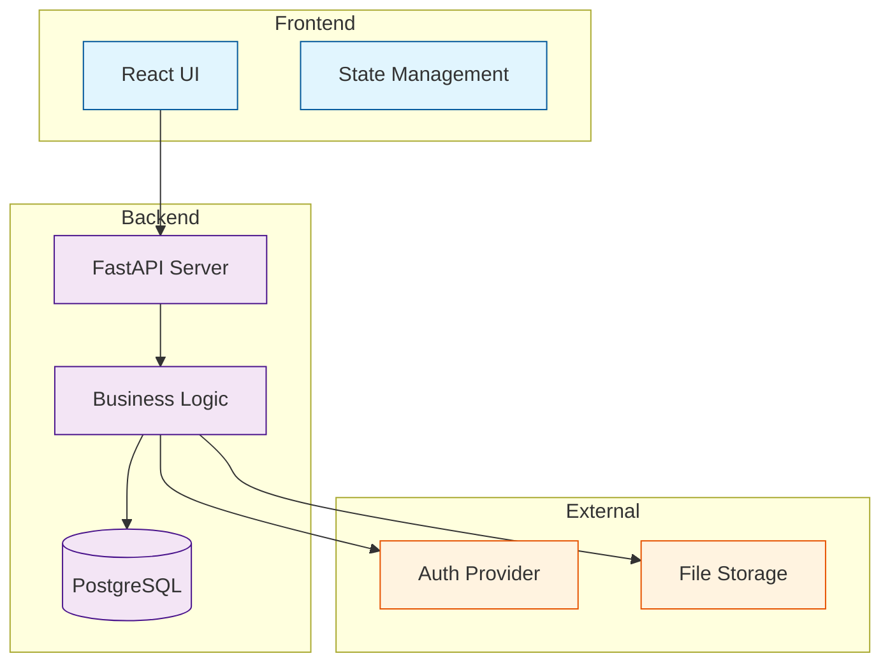
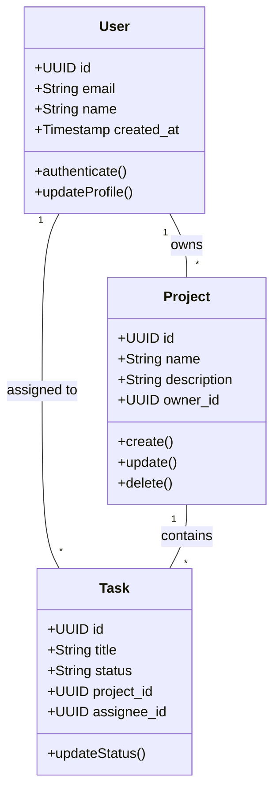
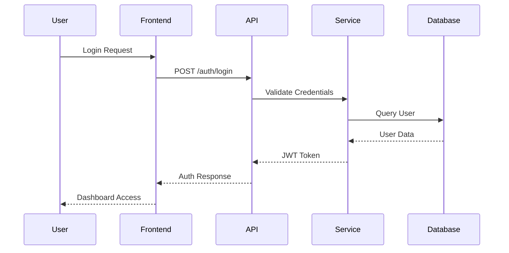
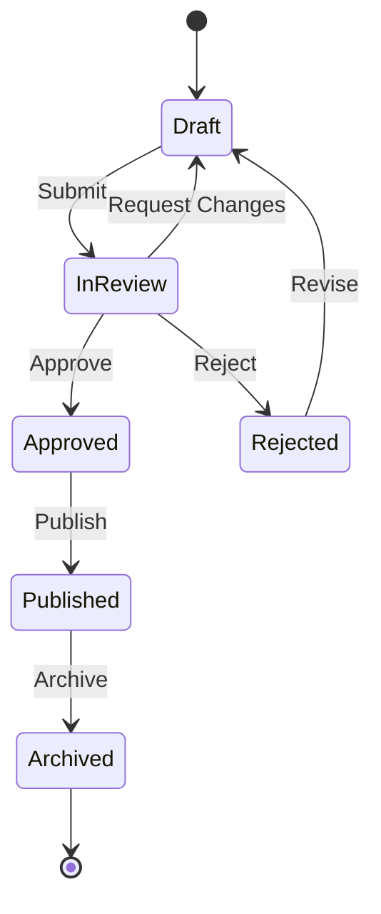
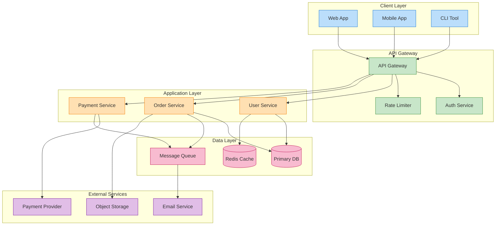
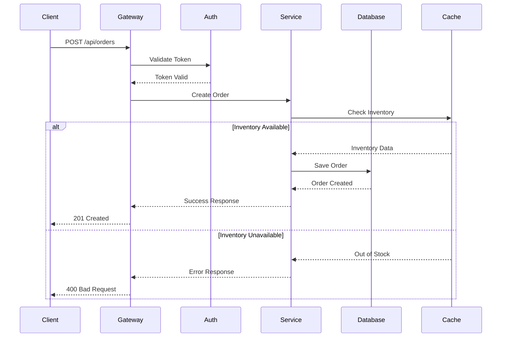

# Application Design Principles and Documentation Standards

**Version:** 1.0  
**Date:** 2025-07-16  
**Purpose:** This document establishes comprehensive design principles and documentation standards for application development, ensuring consistency, clarity, and maintainability across all technical documentation.

## Table of Contents

1. [Introduction](#1-introduction)
2. [Documentation Structure Standards](#2-documentation-structure-standards)
3. [Formatting Conventions](#3-formatting-conventions)
4. [Mermaid Diagram Guidelines](#4-mermaid-diagram-guidelines)
5. [Content Organization Principles](#5-content-organization-principles)
6. [Document Templates](#6-document-templates)
7. [Best Practices](#7-best-practices)
8. [Examples](#8-examples)

## 1. Introduction

Well-structured documentation is essential for successful software development. This guide provides a comprehensive framework for documenting applications, based on proven patterns that ensure:

- **Consistency**: Uniform structure across all documentation
- **Clarity**: Clear communication of technical concepts
- **Maintainability**: Easy updates and version control
- **Completeness**: Coverage of all essential aspects
- **Accessibility**: Easy navigation and understanding

## 2. Documentation Structure Standards

### 2.1 Directory Organization

```
project-name/
├── doc/
│   └── ComponentName/
│       ├── 00_Executive_Summary.md
│       ├── 01_System_Architecture.md
│       ├── 02_Data_Model.md
│       ├── 03_Component_Design.md
│       ├── 04_API_Specification.md
│       ├── 05_UI_UX_Design.md
│       ├── 06_Integration_Guide.md
│       ├── 07_Development_Guide.md
│       ├── 08_Security_Practices.md
│       └── 09_Testing_Strategy.md
```

### 2.2 Document Numbering System

- **00-09**: Core design documents
- **10-19**: Implementation guides
- **20-29**: Operations and maintenance
- **30-39**: Advanced topics and extensions

### 2.3 Standard Document Set

Each major component should include:

1. **00_Executive_Summary.md**: High-level overview for stakeholders
2. **01_System_Architecture.md**: Technical architecture and design decisions
3. **02_Data_Model.md**: Database schemas, relationships, and data flow
4. **03_Component_Design.md**: Detailed component specifications
5. **04_API_Specification.md**: RESTful API endpoints, WebSocket protocols
6. **05_UI_UX_Design.md**: User interface design and interaction patterns
7. **06_Integration_Guide.md**: How to integrate with other systems
8. **07_Development_Guide.md**: Setup, development workflow, and conventions
9. **08_Security_Practices.md**: Security considerations and implementations
10. **09_Testing_Strategy.md**: Testing approach, tools, and requirements

## 3. Formatting Conventions

### 3.1 Document Header

Every document must start with:

```markdown
# Document Title

**Version:** X.Y  
**Date:** YYYY-MM-DD  
**Status:** Draft | Review | Approved | Deprecated  
**Author(s):** Name(s)  

## Overview

Brief description of what this document covers and its purpose.
```

### 3.2 Section Hierarchy

```markdown
# Main Title (Document Title)
## 1. Major Section
### 1.1 Subsection
#### 1.1.1 Sub-subsection
##### Details Level
```

### 3.3 Code Blocks

Always specify the language for syntax highlighting:

````markdown
```python
def example_function():
    """Docstring with purpose."""
    return "Example"
```

```sql
CREATE TABLE example (
    id SERIAL PRIMARY KEY,
    name VARCHAR(255) NOT NULL
);
```

```json
{
  "key": "value",
  "nested": {
    "property": "example"
  }
}
```
````

### 3.4 Tables

Use tables for structured data:

```markdown
| Column | Type | Description |
|--------|------|-------------|
| id | UUID | Unique identifier |
| name | String | Display name |
| created_at | Timestamp | Creation timestamp |
```

### 3.5 Lists

- Use bullet points for unordered lists
- Use numbered lists for sequential steps or ordered items
- Indent nested lists with 2 spaces

## 4. Mermaid Diagram Guidelines

### 4.1 System Architecture Diagrams

Use `graph TD` (Top-Down) or `graph LR` (Left-Right) for system architecture:



### 4.2 Entity Relationship Diagrams

Use `classDiagram` for data models:



### 4.3 Sequence Diagrams

Use for API flows and interactions:



### 4.4 State Diagrams

Use for component or entity states:



## 5. Content Organization Principles

### 5.1 Progressive Disclosure

1. Start with high-level overview
2. Progress to detailed specifications
3. Include examples and edge cases
4. Reference related documents

### 5.2 Cross-References

Use relative links for internal references:

```markdown
See [Data Model](../02_Data_Model.md) for database schema details.
Refer to [API Specification](../04_API_Specification.md#authentication) for auth endpoints.
```

### 5.3 Versioning

- Include version history at document end
- Use semantic versioning (Major.Minor)
- Document breaking changes clearly

### 5.4 Glossary

Include a glossary for domain-specific terms:

```markdown
## Glossary

- **API**: Application Programming Interface
- **JWT**: JSON Web Token
- **RBAC**: Role-Based Access Control
```

## 6. Document Templates

### 6.1 Executive Summary Template

```markdown
# [Component Name]: Executive Summary

**Version:** 1.0  
**Date:** YYYY-MM-DD  

## Overview

[2-3 paragraph description of the component and its purpose]

## Key Features

- **Feature 1**: Brief description
- **Feature 2**: Brief description
- **Feature 3**: Brief description

## Business Benefits

1. **Benefit 1**: How it helps the organization
2. **Benefit 2**: Efficiency improvements
3. **Benefit 3**: Risk reduction or cost savings

## Technical Highlights

- **Technology Stack**: Key technologies used
- **Integration Points**: How it connects with other systems
- **Scalability**: How it handles growth

## Success Metrics

- Metric 1: Target value
- Metric 2: Target value
- Metric 3: Target value
```

### 6.2 System Architecture Template

```markdown
# [Component Name]: System Architecture

**Version:** 1.0  
**Date:** YYYY-MM-DD  

## 1. Introduction

[Purpose and scope of this architecture document]

## 2. Architectural Goals

- **Goal 1**: Description
- **Goal 2**: Description
- **Goal 3**: Description

## 3. Architectural Principles

- **Principle 1**: Explanation
- **Principle 2**: Explanation
- **Principle 3**: Explanation

## 4. System Components

### 4.1 Component A
[Description, responsibilities, interfaces]

### 4.2 Component B
[Description, responsibilities, interfaces]

## 5. Architecture Diagram

[Mermaid diagram showing system architecture]

## 6. Technology Stack

| Layer | Technology | Purpose |
|-------|------------|---------|
| Frontend | React | UI Framework |
| Backend | FastAPI | API Server |
| Database | PostgreSQL | Data Storage |

## 7. Data Flow

[Description and diagram of how data flows through the system]

## 8. Security Architecture

[Security layers, authentication, authorization]

## 9. Deployment Architecture

[How the system is deployed, containers, orchestration]

## 10. Non-Functional Requirements

- **Performance**: Requirements and approach
- **Scalability**: How system scales
- **Reliability**: Availability targets
```

### 6.3 Data Model Template

```markdown
# [Component Name]: Data Model

**Version:** 1.0  
**Date:** YYYY-MM-DD  

## 1. Overview

[Description of the data model and its purpose]

## 2. Schema Design

### 2.1 Schema Name: `component_name`

[Purpose of this schema]

## 3. Core Entities

### 3.1 Table: `table_name`

[Purpose and description]

```sql
CREATE TABLE schema_name.table_name (
    id UUID PRIMARY KEY DEFAULT gen_random_uuid(),
    field_name TYPE NOT NULL,
    created_at TIMESTAMPTZ NOT NULL DEFAULT NOW(),
    updated_at TIMESTAMPTZ NOT NULL DEFAULT NOW()
);
```

| Column | Type | Description | Constraints |
|--------|------|-------------|-------------|
| id | UUID | Primary key | PK, NOT NULL |
| field_name | TYPE | Description | Constraints |

## 4. Entity Relationship Diagram

[Mermaid ERD showing relationships]

## 5. Indexes

```sql
CREATE INDEX idx_table_column ON schema_name.table_name(column);
```

## 6. Constraints

- **Foreign Keys**: List of FK relationships
- **Check Constraints**: Business rules
- **Unique Constraints**: Uniqueness rules

## 7. Data Validation Rules

- Rule 1: Description
- Rule 2: Description

## 8. Migration Strategy

[How to migrate from existing schema if applicable]
```

### 6.4 API Specification Template

```markdown
# [Component Name]: API Specification

**Version:** 1.0  
**Date:** YYYY-MM-DD  
**Base URL:** `/api/v1/component`

## 1. Overview

[API purpose and design principles]

## 2. Authentication

[Authentication method, token format, headers]

## 3. Common Response Formats

### Success Response
```json
{
  "status": "success",
  "data": { ... }
}
```

### Error Response
```json
{
  "status": "error",
  "error": {
    "code": "ERROR_CODE",
    "message": "Human readable message",
    "details": { ... }
  }
}
```

## 4. Endpoints

### 4.1 Resource Management

#### List Resources
- **Endpoint:** `GET /resources`
- **Description:** Retrieve paginated list of resources
- **Authentication:** Required
- **Query Parameters:**
  - `page` (int): Page number (default: 1)
  - `limit` (int): Items per page (default: 20)
  - `sort` (string): Sort field
  - `filter` (object): Filter criteria

**Response (200 OK):**
```json
{
  "status": "success",
  "data": {
    "items": [...],
    "pagination": {
      "page": 1,
      "limit": 20,
      "total": 100
    }
  }
}
```

## 5. WebSocket Events

### Event: `resource.created`
```json
{
  "event": "resource.created",
  "data": { ... }
}
```

## 6. Rate Limiting

- Default: 100 requests per minute
- Authenticated: 1000 requests per minute

## 7. API Versioning

[Versioning strategy and migration guide]
```

## 7. Best Practices

### 7.1 Writing Guidelines

1. **Be Concise**: Avoid unnecessary verbosity
2. **Be Precise**: Use exact technical terms
3. **Be Consistent**: Follow established patterns
4. **Be Complete**: Cover all relevant aspects
5. **Be Clear**: Write for your audience

### 7.2 Review Checklist

- [ ] Version and date are current
- [ ] All sections are complete
- [ ] Code examples are tested and working
- [ ] Diagrams are clear and properly labeled
- [ ] Cross-references are valid
- [ ] No sensitive information included
- [ ] Grammar and spelling checked

### 7.3 Maintenance

1. Update documentation with code changes
2. Review quarterly for accuracy
3. Archive deprecated versions
4. Track major changes in version history

## 8. Examples

### 8.1 Complete System Architecture Example



### 8.2 API Flow Example



## Version History

| Version | Date | Changes | Author |
|---------|------|---------|--------|
| 1.0 | 2025-07-16 | Initial version | System |

---

*This document is part of the AI Development Flow documentation series. For questions or suggestions, please contact the documentation team.*