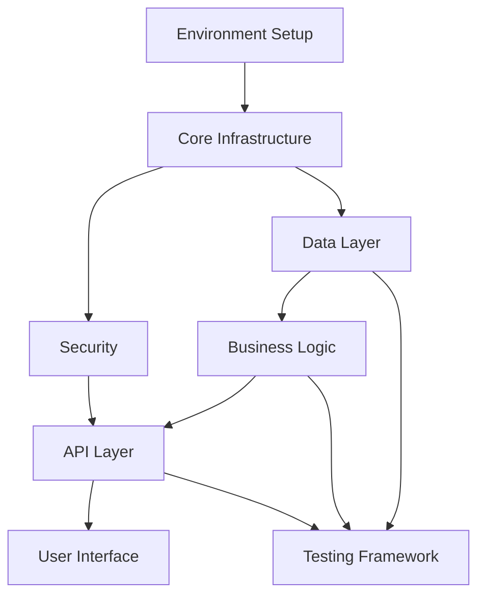
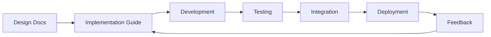

# Implementation Principles

**Version:** 2.0  
**Date:** 2025-07-16  
**Purpose:** This document establishes universal principles and best practices for creating and using implementation guides to transform software designs into working code systematically, regardless of technology stack or project type.

## Table of Contents

1. [Introduction](#1-introduction)
2. [Implementation Guide Structure](#2-implementation-guide-structure)
3. [Development Methodologies](#3-development-methodologies)
4. [XML Implementation Guide Components](#4-xml-implementation-guide-components)
5. [Code Organization Principles](#5-code-organization-principles)
6. [Testing and Validation](#6-testing-and-validation)
7. [Integration Patterns](#7-integration-patterns)
8. [Best Practices](#8-best-practices)
9. [Technology-Specific Examples](#9-technology-specific-examples)

## 1. Introduction

Implementation guides bridge the gap between design documentation and working code. They provide step-by-step instructions for developers (human or AI) to implement complex systems consistently and correctly.

### Core Principles

1. **Systematic**: Follow a logical progression from foundation to features
2. **Traceable**: Link implementation to design documentation
3. **Testable**: Include validation criteria for each component
4. **Modular**: Break complex systems into manageable tasks
5. **Reproducible**: Anyone can achieve the same result

### When to Use Implementation Guides

- **Large Systems**: Breaking down complex architectures
- **Team Development**: Ensuring consistency across developers
- **AI-Assisted Development**: Providing structured tasks for AI
- **Onboarding**: Helping new developers understand the codebase
- **Compliance**: Meeting regulatory or quality requirements

## 2. Implementation Guide Structure

### 2.1 Standard XML Structure

Each implementation guide follows this structure:

```xml
<?xml version="1.0" encoding="UTF-8"?>
<ImplementationGuide>
    <Metadata>...</Metadata>
    <DocumentationReferences>...</DocumentationReferences>
    <Prerequisites>...</Prerequisites>
    <Purpose>...</Purpose>
    <Features>...</Features>
    <ImplementationDetails>...</ImplementationDetails>
    <SecurityImplementation>...</SecurityImplementation>
    <IntegrationPoints>...</IntegrationPoints>
    <TestingRequirements>...</TestingRequirements>
    <ValidationCriteria>...</ValidationCriteria>
    <Notes>...</Notes>
</ImplementationGuide>
```

### 2.2 Guide Identification

```xml
<Metadata>
    <GuideID>[Unique_ID_Following_Project_Convention]</GuideID>
    <Title>[Descriptive Title]</Title>
    <Version>1.0</Version>
    <Category>[Foundation|Core|Feature|Integration|Testing|Deployment]</Category>
    <Priority>[High|Medium|Low]</Priority>
    <EstimatedTime>[2 hours|1 day|1 week]</EstimatedTime>
    <Description>Comprehensive description...</Description>
    <Tags>backend, api, database, security</Tags>
</Metadata>
```

**Flexible Naming Conventions:**
- Sequential: `001_Database_Setup`, `002_API_Framework`
- Feature-based: `AUTH_User_Login`, `PAYMENT_Stripe_Integration`
- Category-based: `CORE_Authentication`, `FEAT_Shopping_Cart`
- Custom: Follow your project's existing conventions

### 2.3 Documentation Linking

Always reference the design documentation:

```xml
<DocumentationReferences>
    <Reference type="Requirements" href="docs/requirements.md">
        System Requirements Document
    </Reference>
    <Reference type="Architecture" href="docs/architecture.md">
        System Architecture
    </Reference>
    <Reference type="API" href="docs/api-spec.md">
        API Specification
    </Reference>
    <Reference type="External" href="https://example.com/docs">
        Framework Documentation
    </Reference>
</DocumentationReferences>
```

**Reference Types:**
- `Requirements`: Business and functional requirements
- `Architecture`: System and technical architecture
- `Design`: Detailed design documents
- `API`: API specifications and contracts
- `DataModel`: Database schemas and relationships
- `UI`: User interface designs and wireframes
- `Security`: Security requirements and protocols
- `External`: Third-party documentation

## 2.4 Implementation Guide File Structure and Numbering

To ensure consistency and traceability, implementation guides should follow a structured file organization and numbering system.

### 2.4.1 Directory Organization

Implementation guides should be organized within the `docs/implementation/guides/` directory, typically grouped by phase or major component.

```
project-root/
├── docs/
│   └── implementation/
│       └── guides/
│           ├── phase-1-foundation/
│           │   ├── 001_Database_Setup.xml
│           │   └── 002_Core_Models.xml
│           ├── phase-2-features/
│           │   ├── 101_User_Management.xml
│           │   └── 102_Authentication.xml
│           └── phase-3-integration/
│               ├── 201_External_APIs.xml
│               └── 202_Messaging.xml
```

### 2.4.2 Phase and Task Numbering System

Each implementation guide and its internal steps should follow a clear numbering convention:

- **Guide ID**: `[PHASE_NUMBER]_[SEQUENCE_NUMBER]_[DESCRIPTIVE_NAME]`
    - `PHASE_NUMBER`: Corresponds to the development phase (e.g., `0` for Foundation, `1` for Core Features, `2` for Extended Features, `3` for Integration, `4` for Optimization).
    - `SEQUENCE_NUMBER`: A three-digit sequential number within the phase (e.g., `001`, `002`).
    - `DESCRIPTIVE_NAME`: A concise, kebab-case name reflecting the guide's content.
    
    **Example Guide IDs:**
    - `0_001_Environment-Setup.xml`
    - `1_010_User-Authentication-Service.xml`
    - `2_005_Payment-Gateway-Integration.xml`

- **Internal Step Numbering**: Use sequential numbers for `<Step>` elements within an implementation guide (e.g., `Step number="1"`).

## 3. Development Methodologies

### 3.1 Flexible Development Approaches

Implementation guides support various development methodologies:

#### 3.1.1 Phased Development

Organize implementation into logical phases:

1. **Foundation Phase**
   - Environment setup
   - Core infrastructure
   - Basic configuration
   - Security setup

2. **Core Features Phase**
   - Primary business logic
   - Essential data models
   - Core APIs

3. **Extended Features Phase**
   - Additional functionality
   - Third-party integrations
   - Advanced features

4. **Optimization Phase**
   - Performance tuning
   - Scaling preparations
   - Monitoring setup

#### 3.1.2 Feature-Based Development

Organize by feature or user story:

```
├── User Authentication
│   ├── Login functionality
│   ├── Registration
│   └── Password reset
├── Shopping Cart
│   ├── Add items
│   ├── Update quantities
│   └── Checkout process
└── Payment Processing
    ├── Credit card handling
    └── Payment gateway integration
```

#### 3.1.3 Layer-Based Development

Build from bottom up:

1. **Data Layer** - Database, models, repositories
2. **Business Layer** - Services, business logic
3. **API Layer** - REST endpoints, GraphQL schemas
4. **Presentation Layer** - UI components, views

### 3.2 Dependency Management


## 4. XML Implementation Guide Components

### 4.1 Prerequisites

Define what must be completed before starting:

```xml
<Prerequisites>
    <Prerequisite type="Guide" id="001_Environment_Setup">
        Development environment configured
    </Prerequisite>
    <Prerequisite type="Tool">
        Node.js 18+ or Python 3.10+ installed
    </Prerequisite>
    <Prerequisite type="Environment">
        Database server running and accessible
    </Prerequisite>
    <Prerequisite type="Knowledge">
        Understanding of REST API principles
    </Prerequisite>
</Prerequisites>
```

**Prerequisite Types:**
- `Guide`: Other implementation guides
- `Tool`: Software, frameworks, or tools
- `Environment`: System setup, services running
- `Knowledge`: Required skills or understanding

### 4.2 Test References

Link implementation to unit test XML files:

```xml
<TestReferences>
    <!-- Reference unit test XML files that validate this implementation -->
    <UnitTest id="USER_SERVICE_CREATE" path="tests/unit/services/UserService.test.xml">
        <Description>Tests user creation functionality</Description>
        <Coverage>Constructor, createUser method, validation</Coverage>
    </UnitTest>
    <UnitTest id="USER_API_ENDPOINTS" path="tests/unit/api/users.test.xml">
        <Description>Tests REST API endpoints</Description>
        <Coverage>POST /users, GET /users/:id, error handling</Coverage>
    </UnitTest>
</TestReferences>
```

This creates traceability between implementation and tests.

### 4.3 Scope and Objectives

Define clear boundaries:

```xml
<ScopeAndObjectives>
    <Objective>Implement user authentication system</Objective>
    <Objective>Create secure session management</Objective>
    <OutOfScope>Social media login integration (future phase)</OutOfScope>
</ScopeAndObjectives>
```

### 4.4 Technical Stack

Specify the technologies:

```xml
<TechnicalStack>
    <Language>JavaScript/TypeScript</Language>
    <Framework>Express.js / React</Framework>
    <Database>PostgreSQL / MongoDB</Database>
    <Dependencies>jsonwebtoken, bcrypt, express-validator</Dependencies>
</TechnicalStack>
```

### 4.5 Implementation Steps

Organize by logical progression:

```xml
<ImplementationSteps>
    <Step number="1" name="Project Structure">
        <Description>Set up the basic project structure</Description>
        <Tasks>
            <Task type="directory" path="src/models">
                Create models directory
            </Task>
            <Task type="file" path="src/index.js">
                Create application entry point
            </Task>
        </Tasks>
    </Step>
    
    <Step number="2" name="Data Layer">
        <Description>Implement data models and database setup</Description>
        <Tasks>
            <Task type="database" id="create_users_table">
                <Description>Create users table schema</Description>
                <Code language="sql"><![CDATA[
CREATE TABLE users (
    id SERIAL PRIMARY KEY,
    email VARCHAR(255) UNIQUE NOT NULL,
    password_hash VARCHAR(255) NOT NULL,
    created_at TIMESTAMP DEFAULT NOW()
);
                ]]></Code>
            </Task>
        </Tasks>
    </Step>
    
    <Step number="3" name="Business Logic">
        <Description>Implement core business logic</Description>
        <Tasks>
            <Task type="code" id="auth_service">
                <Description>Create authentication service</Description>
                <Code language="javascript" file="services/auth.js"><![CDATA[
class AuthService {
    async login(email, password) {
        // Implementation
    }
    
    async register(userData) {
        // Implementation
    }
}
                ]]></Code>
                <TestValidation>
                    <TestFile>tests/unit/services/AuthService.test.xml</TestFile>
                    <TestCases>
                        <TestCase id="test_login_valid">Valid login credentials</TestCase>
                        <TestCase id="test_login_invalid">Invalid credentials</TestCase>
                        <TestCase id="test_register_new">New user registration</TestCase>
                    </TestCases>
                </TestValidation>
            </Task>
        </Tasks>
    </Step>
</ImplementationSteps>
```

### 4.6 Quality Assurance

Define quality standards:

```xml
<QualityAssurance>
    <CodeStandards>
        <Standard>ESLint / Prettier for JavaScript</Standard>
        <Standard>PEP 8 for Python</Standard>
        <Standard>Consistent naming conventions</Standard>
    </CodeStandards>
    
    <Testing>
        <TestType type="unit">
            <Description>Unit tests for all services</Description>
            <Coverage>80% minimum</Coverage>
        </TestType>
        <TestType type="integration">
            <Description>API endpoint testing</Description>
        </TestType>
    </Testing>
    
    <SecurityConsiderations>
        <Consideration type="Authentication">
            Secure token generation and validation
        </Consideration>
        <Consideration type="DataProtection">
            Encryption for sensitive data
        </Consideration>
    </SecurityConsiderations>
</QualityAssurance>
```

## 5. Code Organization Principles

### 5.1 Universal Directory Patterns

Choose a structure that fits your technology:

#### Backend Services (Node.js/Python/Java)
```
project-root/
├── src/
│   ├── controllers/     # Request handlers
│   ├── services/        # Business logic
│   ├── models/          # Data models
│   ├── routes/          # API routes
│   ├── middleware/      # Custom middleware
│   ├── utils/           # Helper functions
│   └── config/          # Configuration
├── tests/
│   ├── unit/
│   ├── integration/
│   └── e2e/
├── docs/
└── package.json / requirements.txt / pom.xml
```

#### Frontend Applications (React/Vue/Angular)
```
project-root/
├── src/
│   ├── components/      # Reusable components
│   ├── pages/          # Page components
│   ├── services/       # API services
│   ├── store/          # State management
│   ├── assets/         # Static assets
│   ├── styles/         # Global styles
│   └── utils/          # Utilities
├── public/
├── tests/
└── package.json
```

#### Full-Stack Monorepo
```
project-root/
├── apps/
│   ├── frontend/
│   ├── backend/
│   └── mobile/
├── packages/
│   ├── shared/         # Shared utilities
│   ├── ui/            # UI component library
│   └── api-client/    # API client library
├── docs/
└── package.json
```

### 5.2 Naming Conventions by Language

#### JavaScript/TypeScript
- **Files**: `camelCase.js` or `PascalCase.tsx` for components
- **Classes/Components**: `PascalCase`
- **Functions/Variables**: `camelCase`
- **Constants**: `UPPER_SNAKE_CASE`
- **CSS Classes**: `kebab-case`

#### Python
- **Files**: `snake_case.py`
- **Classes**: `PascalCase`
- **Functions/Variables**: `snake_case`
- **Constants**: `UPPER_SNAKE_CASE`
- **Private**: `_leading_underscore`

#### Java/C#
- **Files**: `PascalCase.java`
- **Classes/Interfaces**: `PascalCase`
- **Methods/Variables**: `camelCase`
- **Constants**: `UPPER_SNAKE_CASE`
- **Packages**: `com.company.project`

### 5.3 Separation of Concerns

Organize code by responsibility:

```javascript
// Controller - Handle HTTP requests
class UserController {
    async createUser(req, res) {
        const userData = req.body;
        const user = await userService.create(userData);
        res.json(user);
    }
}

// Service - Business logic
class UserService {
    async create(userData) {
        // Validate data
        // Apply business rules
        // Call repository
        return await userRepository.save(userData);
    }
}

// Repository - Data access
class UserRepository {
    async save(userData) {
        // Database operations
        return await db.users.insert(userData);
    }
}
```

## 6. Testing and Validation

### 6.1 Testing Strategy with XML Integration

Define comprehensive testing approach linking to test XML files:

```xml
<Testing>
    <!-- Reference to unit test XML files -->
    <RequiredTests>
        <TestReference id="USER_SERVICE_TESTS" path="tests/unit/services/UserService.test.xml">
            <TestCases>
                <TestCase>test_create_valid_user</TestCase>
                <TestCase>test_validate_email</TestCase>
                <TestCase>test_handle_duplicate</TestCase>
            </TestCases>
            <MinimumCoverage>85</MinimumCoverage>
        </TestReference>
    </RequiredTests>
    
    <TestType type="unit">
        <Description>Test individual components in isolation</Description>
        <Coverage>80% minimum for critical paths</Coverage>
        <TestFiles>
            <TestFile path="tests/unit/services/UserService.test.xml">
                Comprehensive user service tests
            </TestFile>
            <TestFile path="tests/unit/models/User.test.xml">
                User model validation tests
            </TestFile>
        </TestFiles>
    </TestType>
    
    <TestType type="integration">
        <Description>Test component interactions</Description>
        <Example><![CDATA[
// API integration test
it('should handle complete authentication flow', async () => {
    // Register user
    const registerRes = await request(app)
        .post('/api/auth/register')
        .send({ email: 'test@example.com', password: 'password123' });
    expect(registerRes.status).toBe(201);
    
    // Login
    const loginRes = await request(app)
        .post('/api/auth/login')
        .send({ email: 'test@example.com', password: 'password123' });
    expect(loginRes.status).toBe(200);
    expect(loginRes.body.token).toBeDefined();
});
        ]]></Example>
    </TestType>
    
    <TestType type="e2e">
        <Description>Test complete user workflows</Description>
    </TestType>
</Testing>
```

### 6.2 Validation and Verification

```xml
<ValidationAndVerification>
    <Checklist>
        <Item>All files created as specified</Item>
        <Item>Code compiles/runs without errors</Item>
        <Item>All tests pass</Item>
        <Item>Documentation is complete</Item>
        <Item>Security requirements met</Item>
        <Item>Performance targets achieved</Item>
    </Checklist>
    
    <AcceptanceCriteria>
        <Criterion>Users can successfully authenticate</Criterion>
        <Criterion>API responds within 200ms</Criterion>
        <Criterion>Data is properly validated and sanitized</Criterion>
    </AcceptanceCriteria>
</ValidationAndVerification>
```

### 6.3 Testing Best Practices

#### Test Structure (AAA Pattern)
```javascript
// Arrange, Act, Assert pattern
test('should calculate order total correctly', () => {
    // Arrange
    const items = [
        { price: 10.00, quantity: 2 },
        { price: 5.50, quantity: 3 }
    ];
    
    // Act
    const total = calculateOrderTotal(items);
    
    // Assert
    expect(total).toBe(36.50);
});
```

#### Test Data Management
```javascript
// Test fixtures
const fixtures = {
    validUser: {
        email: 'test@example.com',
        name: 'Test User',
        role: 'user'
    },
    adminUser: {
        email: 'admin@example.com',
        name: 'Admin User',
        role: 'admin'
    }
};

// Test data builders
class UserBuilder {
    constructor() {
        this.user = { ...fixtures.validUser };
    }
    
    withEmail(email) {
        this.user.email = email;
        return this;
    }
    
    withRole(role) {
        this.user.role = role;
        return this;
    }
    
    build() {
        return this.user;
    }
}
```

## 7. Integration Patterns

### 7.1 Common Integration Methods

```xml
<IntegrationPoints>
    <Integration>
        <Component>Authentication Service</Component>
        <Method>REST API</Method>
        <DataFlow>Request token → Validate → Return user data</DataFlow>
    </Integration>
    <Integration>
        <Component>Message Queue</Component>
        <Method>Async Messaging</Method>
        <DataFlow>Publish event → Queue → Consumer processes</DataFlow>
    </Integration>
    <Integration>
        <Component>Database</Component>
        <Method>Direct Connection</Method>
        <DataFlow>Query → Transform → Return results</DataFlow>
    </Integration>
</IntegrationPoints>
```

### 7.2 Integration Patterns by Type

#### REST API Integration
```javascript
// Generic API client pattern
class ApiClient {
    constructor(baseUrl, options = {}) {
        this.baseUrl = baseUrl;
        this.headers = {
            'Content-Type': 'application/json',
            ...options.headers
        };
    }
    
    async request(endpoint, options = {}) {
        const url = `${this.baseUrl}${endpoint}`;
        const config = {
            ...options,
            headers: { ...this.headers, ...options.headers }
        };
        
        const response = await fetch(url, config);
        
        if (!response.ok) {
            throw new ApiError(response.status, await response.text());
        }
        
        return response.json();
    }
    
    get(endpoint) {
        return this.request(endpoint, { method: 'GET' });
    }
    
    post(endpoint, data) {
        return this.request(endpoint, {
            method: 'POST',
            body: JSON.stringify(data)
        });
    }
}
```

#### Message Queue Integration
```javascript
// Generic message publisher pattern
class MessagePublisher {
    constructor(connection) {
        this.connection = connection;
    }
    
    async publish(topic, message) {
        const payload = {
            id: generateId(),
            timestamp: new Date().toISOString(),
            topic,
            data: message
        };
        
        await this.connection.publish(topic, JSON.stringify(payload));
    }
}

// Generic message consumer pattern
class MessageConsumer {
    constructor(connection) {
        this.connection = connection;
        this.handlers = new Map();
    }
    
    subscribe(topic, handler) {
        this.handlers.set(topic, handler);
        this.connection.subscribe(topic, async (message) => {
            const payload = JSON.parse(message);
            await handler(payload.data);
        });
    }
}
```

#### Database Integration
```javascript
// Generic repository pattern
class Repository {
    constructor(db, tableName) {
        this.db = db;
        this.tableName = tableName;
    }
    
    async findById(id) {
        return this.db.query(
            `SELECT * FROM ${this.tableName} WHERE id = ?`,
            [id]
        );
    }
    
    async create(data) {
        const fields = Object.keys(data);
        const values = Object.values(data);
        const placeholders = fields.map(() => '?').join(', ');
        
        return this.db.query(
            `INSERT INTO ${this.tableName} (${fields.join(', ')}) 
             VALUES (${placeholders})`,
            values
        );
    }
    
    async update(id, data) {
        const updates = Object.keys(data)
            .map(field => `${field} = ?`)
            .join(', ');
        const values = [...Object.values(data), id];
        
        return this.db.query(
            `UPDATE ${this.tableName} SET ${updates} WHERE id = ?`,
            values
        );
    }
}
```

## 8. Best Practices

### 8.1 Implementation Guide Best Practices

1. **Complete Prerequisites First**
   - Never skip prerequisites
   - Verify each is working before proceeding
   - Document any missing prerequisites

2. **Follow the Order**
   - Implement guides in sequence based on dependencies
   - Complete foundation before features
   - Test integration points as you go

3. **Test as You Go**
   - Run tests after each major component
   - Don't wait until the end to test
   - Fix issues immediately

4. **Document Deviations**
   - If you must deviate from the guide, document why
   - Update the guide for future use
   - Share learnings with the team

### 8.2 Code Quality Standards

#### Type Safety Examples

**Python:**
```python
def get_user_by_email(db: Session, email: str) -> Optional[User]:
    return db.query(User).filter(User.email == email).first()
```

**TypeScript:**
```typescript
function getUserByEmail(email: string): Promise<User | null> {
    return userRepository.findOne({ email });
}
```

**Java:**
```java
public Optional<User> getUserByEmail(String email) {
    return userRepository.findByEmail(email);
}
```

#### Error Handling Patterns

**Try-Catch Pattern:**
```javascript
try {
    const user = await getUserByEmail(email);
    if (!user) {
        throw new NotFoundException('User not found');
    }
    return user;
} catch (error) {
    logger.error('Database error:', error);
    throw new DatabaseException('Database operation failed');
}
```

**Result Type Pattern:**
```typescript
type Result<T, E> = { ok: true; value: T } | { ok: false; error: E };

async function getUser(email: string): Promise<Result<User, Error>> {
    try {
        const user = await db.findUser(email);
        return { ok: true, value: user };
    } catch (error) {
        return { ok: false, error };
    }
}
```

#### Logging Best Practices

**Structured Logging:**
```javascript
const logger = require('winston').createLogger({
    format: winston.format.json(),
    transports: [new winston.transports.Console()]
});

function createUser(userData) {
    logger.info('Creating user', { 
        action: 'user_create',
        email: userData.email,
        timestamp: new Date().toISOString()
    });
    // ... implementation ...
    logger.info('User created', { 
        action: 'user_created',
        userId: user.id,
        timestamp: new Date().toISOString()
    });
}
```

### 8.3 Security Best Practices

#### 1. Never Log Sensitive Data
```javascript
// Bad - exposes password
logger.info(`User login: ${username}, password: ${password}`);

// Good - logs only safe information
logger.info('User login attempt', { username, timestamp: Date.now() });
```

#### 2. Input Validation

**Schema Validation (Generic):**
```javascript
const userSchema = {
    name: { type: 'string', minLength: 1, maxLength: 100 },
    email: { type: 'string', format: 'email' },
    age: { type: 'number', minimum: 0, maximum: 150 }
};

function validateUser(data) {
    return validator.validate(data, userSchema);
}
```

**Framework Examples:**
```python
# Python with Pydantic
class UserCreate(BaseModel):
    name: str = Field(..., min_length=1, max_length=100)
    email: EmailStr
    age: int = Field(..., ge=0, le=150)
```

```java
// Java with Bean Validation
public class UserDto {
    @NotBlank
    @Size(min = 1, max = 100)
    private String name;
    
    @Email
    private String email;
    
    @Min(0) @Max(150)
    private Integer age;
}
```

#### 3. Safe Database Queries

**Parameterized Queries:**
```javascript
// Bad - SQL injection risk
const query = `SELECT * FROM users WHERE email = '${email}'`;

// Good - Parameterized query
const query = 'SELECT * FROM users WHERE email = ?';
db.execute(query, [email]);

// Good - ORM query
const user = await User.findOne({ where: { email } });
```

#### 4. Authentication Patterns

**Token-based Authentication:**
```javascript
// Generate token
function generateToken(user) {
    return jwt.sign(
        { id: user.id, email: user.email },
        process.env.JWT_SECRET,
        { expiresIn: '24h' }
    );
}

// Verify token
function verifyToken(token) {
    try {
        return jwt.verify(token, process.env.JWT_SECRET);
    } catch (error) {
        throw new UnauthorizedException('Invalid token');
    }
}
```

#### 5. Data Encryption

**Encryption at Rest:**
```javascript
const crypto = require('crypto');

function encrypt(text, key) {
    const iv = crypto.randomBytes(16);
    const cipher = crypto.createCipheriv('aes-256-cbc', key, iv);
    let encrypted = cipher.update(text, 'utf8', 'hex');
    encrypted += cipher.final('hex');
    return iv.toString('hex') + ':' + encrypted;
}

function decrypt(encryptedText, key) {
    const parts = encryptedText.split(':');
    const iv = Buffer.from(parts[0], 'hex');
    const encrypted = parts[1];
    const decipher = crypto.createDecipheriv('aes-256-cbc', key, iv);
    let decrypted = decipher.update(encrypted, 'hex', 'utf8');
    decrypted += decipher.final('utf8');
    return decrypted;
}
```

### 8.4 Performance Best Practices

#### 1. Caching Strategies
```javascript
// Simple in-memory cache
class Cache {
    constructor(ttl = 3600) {
        this.cache = new Map();
        this.ttl = ttl * 1000; // Convert to milliseconds
    }
    
    set(key, value) {
        this.cache.set(key, {
            value,
            expiry: Date.now() + this.ttl
        });
    }
    
    get(key) {
        const item = this.cache.get(key);
        if (!item) return null;
        if (Date.now() > item.expiry) {
            this.cache.delete(key);
            return null;
        }
        return item.value;
    }
}
```

#### 2. Database Optimization
```javascript
// Batch operations
async function createUsers(users) {
    // Bad - N queries
    for (const user of users) {
        await db.insert('users', user);
    }
    
    // Good - 1 query
    await db.batchInsert('users', users);
}

// Query optimization
// Bad - N+1 problem
const posts = await Post.findAll();
for (const post of posts) {
    post.author = await User.findById(post.authorId);
}

// Good - Eager loading
const posts = await Post.findAll({
    include: [{ model: User, as: 'author' }]
});
```

#### 3. Async Processing
```javascript
// Queue for heavy operations
class TaskQueue {
    constructor() {
        this.queue = [];
        this.processing = false;
    }
    
    async add(task) {
        this.queue.push(task);
        if (!this.processing) {
            await this.process();
        }
    }
    
    async process() {
        this.processing = true;
        while (this.queue.length > 0) {
            const task = this.queue.shift();
            try {
                await task();
            } catch (error) {
                console.error('Task failed:', error);
            }
        }
        this.processing = false;
    }
}
```

## 9. Technology-Specific Examples

### 9.1 Complete Implementation Example

Here's how the components work together for a user authentication feature:

#### Design Documentation Example
```markdown
## Authentication API

POST /api/auth/login
- Request: {"email": "string", "password": "string"}
- Response: {"token": "string", "user": {"id": "string", "email": "string"}}
- Error: 401 if credentials invalid
- Error: 429 if rate limit exceeded
```

#### Implementation Guide Example
```xml
<ImplementationGuide>
    <Metadata>
        <GuideID>AUTH_001_Login_System</GuideID>
        <Title>User Authentication System</Title>
        <Category>Core</Category>
        <Priority>High</Priority>
    </Metadata>
    
    <Features>
        <Feature>
            <Name>Login Endpoint</Name>
            <Description>Token-based authentication endpoint</Description>
        </Feature>
        <Feature>
            <Name>Password Hashing</Name>
            <Description>Secure password storage with bcrypt</Description>
        </Feature>
    </Features>
    
    <ImplementationSteps>
        <Step number="1" name="Database Schema">
            <Tasks>
                <Task type="database" id="create_users_table">
                    <Code language="sql"><![CDATA[
CREATE TABLE users (
    id UUID PRIMARY KEY DEFAULT gen_random_uuid(),
    email VARCHAR(255) UNIQUE NOT NULL,
    password_hash VARCHAR(255) NOT NULL,
    created_at TIMESTAMP DEFAULT NOW(),
    last_login TIMESTAMP
);

CREATE INDEX idx_users_email ON users(email);
                    ]]></Code>
                </Task>
            </Tasks>
        </Step>
        
        <Step number="2" name="Authentication Service">
            <Tasks>
                <Task type="code" id="auth_service">
                    <Code language="typescript"><![CDATA[
export class AuthService {
    async login(email: string, password: string): Promise<AuthResult> {
        const user = await this.userRepository.findByEmail(email);
        if (!user) {
            throw new UnauthorizedException('Invalid credentials');
        }
        
        const isValid = await bcrypt.compare(password, user.passwordHash);
        if (!isValid) {
            throw new UnauthorizedException('Invalid credentials');
        }
        
        const token = this.generateToken(user);
        await this.updateLastLogin(user.id);
        
        return { token, user: this.sanitizeUser(user) };
    }
}
                    ]]></Code>
                </Task>
            </Tasks>
        </Step>
    </ImplementationSteps>
</ImplementationGuide>
```

#### Test Implementation Examples

**JavaScript/TypeScript (Jest):**
```typescript
describe('AuthService', () => {
    let authService: AuthService;
    let mockUserRepository: jest.Mocked<UserRepository>;
    
    beforeEach(() => {
        mockUserRepository = createMockRepository();
        authService = new AuthService(mockUserRepository);
    });
    
    test('should authenticate valid user', async () => {
        const mockUser = {
            id: '123',
            email: 'test@example.com',
            passwordHash: await bcrypt.hash('password123', 10)
        };
        
        mockUserRepository.findByEmail.mockResolvedValue(mockUser);
        
        const result = await authService.login('test@example.com', 'password123');
        
        expect(result.token).toBeDefined();
        expect(result.user.email).toBe('test@example.com');
        expect(result.user.passwordHash).toBeUndefined();
    });
    
    test('should reject invalid credentials', async () => {
        mockUserRepository.findByEmail.mockResolvedValue(null);
        
        await expect(
            authService.login('wrong@example.com', 'password')
        ).rejects.toThrow(UnauthorizedException);
    });
});
```

**Python (pytest):**
```python
import pytest
from unittest.mock import Mock, AsyncMock
from auth_service import AuthService
from exceptions import UnauthorizedException

@pytest.fixture
def auth_service():
    user_repository = Mock()
    return AuthService(user_repository)

@pytest.mark.asyncio
async def test_login_success(auth_service):
    # Arrange
    mock_user = {
        'id': '123',
        'email': 'test@example.com',
        'password_hash': bcrypt.hashpw(b'password123', bcrypt.gensalt())
    }
    auth_service.user_repository.find_by_email = AsyncMock(return_value=mock_user)
    
    # Act
    result = await auth_service.login('test@example.com', 'password123')
    
    # Assert
    assert result['token'] is not None
    assert result['user']['email'] == 'test@example.com'
    assert 'password_hash' not in result['user']

@pytest.mark.asyncio
async def test_login_invalid_credentials(auth_service):
    auth_service.user_repository.find_by_email = AsyncMock(return_value=None)
    
    with pytest.raises(UnauthorizedException):
        await auth_service.login('wrong@example.com', 'password')
```

### 9.2 Database Migration Examples

#### SQL Migrations
```sql
-- Migration: 001_create_users_table.sql
-- Up
CREATE TABLE IF NOT EXISTS users (
    id UUID PRIMARY KEY DEFAULT gen_random_uuid(),
    email VARCHAR(255) UNIQUE NOT NULL,
    username VARCHAR(50) UNIQUE NOT NULL,
    password_hash VARCHAR(255) NOT NULL,
    is_active BOOLEAN DEFAULT true,
    created_at TIMESTAMP WITH TIME ZONE DEFAULT NOW(),
    updated_at TIMESTAMP WITH TIME ZONE DEFAULT NOW()
);

CREATE INDEX idx_users_email ON users(email);
CREATE INDEX idx_users_username ON users(username);
CREATE INDEX idx_users_active ON users(is_active) WHERE is_active = true;

-- Down
DROP TABLE IF EXISTS users;
```

#### ORM Migrations (TypeORM Example)
```typescript
import { MigrationInterface, QueryRunner, Table, Index } from 'typeorm';

export class CreateUsersTable1234567890 implements MigrationInterface {
    public async up(queryRunner: QueryRunner): Promise<void> {
        await queryRunner.createTable(
            new Table({
                name: 'users',
                columns: [
                    {
                        name: 'id',
                        type: 'uuid',
                        isPrimary: true,
                        generationStrategy: 'uuid',
                        default: 'uuid_generate_v4()'
                    },
                    {
                        name: 'email',
                        type: 'varchar',
                        length: '255',
                        isUnique: true
                    },
                    {
                        name: 'password_hash',
                        type: 'varchar',
                        length: '255'
                    },
                    {
                        name: 'created_at',
                        type: 'timestamp',
                        default: 'now()'
                    }
                ]
            }),
            true
        );
        
        await queryRunner.createIndex('users', new Index({
            name: 'IDX_USER_EMAIL',
            columnNames: ['email']
        }));
    }
    
    public async down(queryRunner: QueryRunner): Promise<void> {
        await queryRunner.dropIndex('users', 'IDX_USER_EMAIL');
        await queryRunner.dropTable('users');
    }
}
```

### 9.3 API Implementation Examples

#### REST API (Express.js)
```javascript
const express = require('express');
const router = express.Router();
const { body, validationResult } = require('express-validator');

// Login endpoint
router.post('/login',
    body('email').isEmail().normalizeEmail(),
    body('password').isLength({ min: 8 }),
    async (req, res, next) => {
        try {
            // Validate input
            const errors = validationResult(req);
            if (!errors.isEmpty()) {
                return res.status(400).json({ errors: errors.array() });
            }
            
            // Authenticate user
            const { email, password } = req.body;
            const result = await authService.login(email, password);
            
            // Set secure cookie
            res.cookie('auth_token', result.token, {
                httpOnly: true,
                secure: process.env.NODE_ENV === 'production',
                sameSite: 'strict',
                maxAge: 24 * 60 * 60 * 1000 // 24 hours
            });
            
            res.json({
                user: result.user,
                token: result.token
            });
        } catch (error) {
            next(error);
        }
    }
);
```

#### GraphQL (Apollo Server)
```typescript
import { gql } from 'apollo-server';

export const typeDefs = gql`
    type User {
        id: ID!
        email: String!
        username: String!
        createdAt: DateTime!
    }
    
    type AuthPayload {
        token: String!
        user: User!
    }
    
    type Mutation {
        login(email: String!, password: String!): AuthPayload!
        register(input: RegisterInput!): AuthPayload!
    }
    
    input RegisterInput {
        email: String!
        username: String!
        password: String!
    }
`;

export const resolvers = {
    Mutation: {
        login: async (_, { email, password }, { authService }) => {
            return await authService.login(email, password);
        },
        
        register: async (_, { input }, { authService }) => {
            return await authService.register(input);
        }
    }
};
```

### 9.4 Frontend Integration Examples

#### React Hook
```typescript
import { useState, useCallback } from 'react';
import { useNavigate } from 'react-router-dom';

export function useAuth() {
    const [isLoading, setIsLoading] = useState(false);
    const [error, setError] = useState<string | null>(null);
    const navigate = useNavigate();
    
    const login = useCallback(async (email: string, password: string) => {
        setIsLoading(true);
        setError(null);
        
        try {
            const response = await fetch('/api/auth/login', {
                method: 'POST',
                headers: { 'Content-Type': 'application/json' },
                body: JSON.stringify({ email, password })
            });
            
            if (!response.ok) {
                const error = await response.json();
                throw new Error(error.message || 'Login failed');
            }
            
            const data = await response.json();
            localStorage.setItem('auth_token', data.token);
            navigate('/dashboard');
            
            return data;
        } catch (err) {
            setError(err.message);
            throw err;
        } finally {
            setIsLoading(false);
        }
    }, [navigate]);
    
    return { login, isLoading, error };
}
```

#### Vue Composable
```typescript
import { ref } from 'vue';
import { useRouter } from 'vue-router';
import { authApi } from '@/api/auth';

export function useAuth() {
    const isLoading = ref(false);
    const error = ref<string | null>(null);
    const router = useRouter();
    
    const login = async (email: string, password: string) => {
        isLoading.value = true;
        error.value = null;
        
        try {
            const { token, user } = await authApi.login(email, password);
            
            localStorage.setItem('auth_token', token);
            await router.push('/dashboard');
            
            return { token, user };
        } catch (err) {
            error.value = err.message;
            throw err;
        } finally {
            isLoading.value = false;
        }
    };
    
    return {
        login,
        isLoading,
        error
    };
}
```

## Summary

Effective implementation guides enable systematic development by:

1. **Bridging Design and Code**: Translating documentation into actionable steps
2. **Ensuring Consistency**: Standardized patterns across teams and projects
3. **Managing Complexity**: Breaking large systems into manageable tasks
4. **Maintaining Quality**: Built-in testing and validation requirements
5. **Supporting Multiple Technologies**: Flexible enough for any tech stack
6. **Enabling Collaboration**: Clear communication between developers

### Key Success Factors

- **Clear Structure**: Well-organized guides with logical progression
- **Complete Information**: All details needed for implementation
- **Technology Agnostic**: Principles that apply universally
- **Quality Focus**: Testing, security, and performance built in
- **Continuous Improvement**: Guides evolve with lessons learned

### Implementation Workflow



By following these principles and using the provided templates, teams can:
- Reduce implementation errors
- Improve code consistency
- Accelerate development
- Facilitate knowledge transfer
- Ensure comprehensive testing
- Maintain high security standards

---

**Related Resources:**
- XML Template: [Implementation_Guide_Template.xml](./Implementation_Guide_Template.xml)
- Development Workflow: [AI_Driven_Development_Workflow.md](./AI_Driven_Development_Workflow.md)
- Design Principles: [Application_Design_Principles.md](./Application_Design_Principles.md)
- Requirements Guide: [Requirements_Principles.md](./Requirements_Principles.md)
- Git Workflow: [Git Workflow and Best Practices](../../docs/SOPs/git_sop.md)