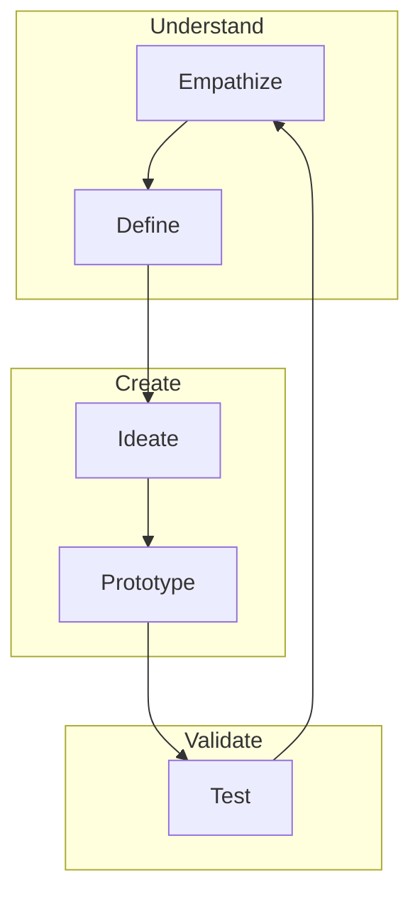

# UI/UX Design Principles

**Version:** 1.0  
**Date:** 2025-07-22  
**Purpose:** This document establishes the core principles for User Interface (UI) and User Experience (UX) design to ensure our products are intuitive, accessible, and enjoyable for all users.

## Table of Contents

1. [Introduction to UI/UX](#1-introduction-to-uiux)
2. [Core Principles](#2-core-principles)
3. [User-Centered Design Process](#3-user-centered-design-process)
4. [Accessibility Guidelines](#4-accessibility-guidelines)
5. [Best Practices Summary](#5-best-practices-summary)

## 1. Introduction to UI/UX

- **UI (User Interface) Design** is the design of graphical control elements and the visual layout of a user's interface. It focuses on aesthetics and how the user interacts with the product's visual and interactive elements.
- **UX (User Experience) Design** is the process of enhancing user satisfaction by improving the usability, accessibility, and pleasure provided in the interaction between the user and the product. It's about the overall *feel* of the experience.

## 2. Core Principles

### 2.1 User-Centricity: The North Star
**Principle:** The user is the center of our design universe. Every design decision must be justified by the value it provides to the user.
- **Action:** Conduct user research, create personas, and validate designs with real users. Never assume you are the user.

### 2.2 Clarity and Simplicity: "Don't Make Me Think"
**Principle:** The interface should be clear, intuitive, and easy to understand. Reduce cognitive load wherever possible.
- **Action:** Use clear language, logical hierarchy, and familiar patterns. Avoid jargon and complexity.

### 2.3 Consistency: Predictability Builds Trust
**Principle:** Elements and interactions should be consistent throughout the application (internal consistency) and with platform conventions (external consistency).
- **Action:** Develop and adhere to a design system (style guides, component libraries). A button should always look and act like a button.

### 2.4 Feedback: Keep the User Informed
**Principle:** The system should always provide immediate and clear feedback for every user action.
- **Action:** Use visual cues for states (hover, active, disabled), loading indicators, success messages, and clear error notifications. The user should never wonder if an action was successful.

### 2.5 Accessibility (A11y): Design for Everyone
**Principle:** Our products must be usable by people with the widest possible range of abilities.
- **Action:** Adhere to WCAG 2.1 AA standards. Ensure proper color contrast, keyboard navigation, screen reader support, and touch target sizes.

### 2.6 Hierarchy: Guide the Eye
**Principle:** Visual hierarchy should guide the user's attention to the most important elements on the screen.
- **Action:** Use size, color, contrast, and placement to create a clear path for the user to follow.

### 2.7 Forgiveness: Encourage Exploration
**Principle:** Users should feel confident to explore the interface without fear of irreversible consequences.
- **Action:** Provide clear "undo" options, confirmation dialogs for destructive actions, and an easy way to go back.

### 2.8 Efficiency: Respect the User's Time
**Principle:** The interface should allow users to perform tasks as quickly and efficiently as possible.
- **Action:** Streamline workflows, reduce the number of steps, and provide shortcuts for expert users.

## 3. User-Centered Design Process

Our design process follows a continuous loop of discovery, ideation, and validation.

## 4. Accessibility Guidelines

| Guideline | Requirement | Example |
|-----------|-------------|---------|
| **Color Contrast** | Minimum 4.5:1 for normal text | Use a contrast checker tool |
| **Keyboard Nav** | All interactive elements must be focusable and operable | Test using only the Tab, Enter, and Space keys |
| **Alt Text** | All meaningful images must have descriptive alt text | `` |
| **Labels** | All form inputs must have associated labels | `<label for="email">Email</label><input id="email">` |
| **Touch Targets** | Minimum 44x44px for all touch targets | Ensure buttons and links are easy to tap on mobile |

## 5. Best Practices Summary

### Do's ✅
1. **Talk to users** early and often.
2. **Create and use a design system** for consistency.
3. **Prioritize content** and functionality over decoration.
4. **Design for mobile-first**, then scale up.
5. **Test your designs** with a diverse group of users.
6. **Annotate your designs** for developers.

### Don'ts ❌
1. **Don't use color alone** to convey information.
2. **Don't hide primary actions** in menus.
3. **Don't use jargon** or system-centric language.
4. **Don't break platform conventions** without a very good reason.
5. **Don't sacrifice clarity for aesthetics**.
6. **Don't forget empty states, error states, and loading states**.

---
**Related Resources:**
- [WCAG 2.1 Guidelines](https://www.w3.org/TR/WCAG21/)
- [Nielsen Norman Group](https://www.nngroup.com/)
