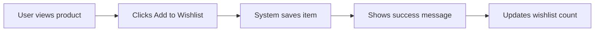
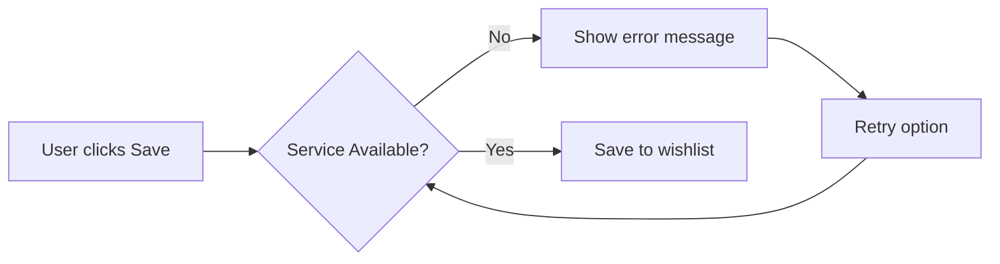
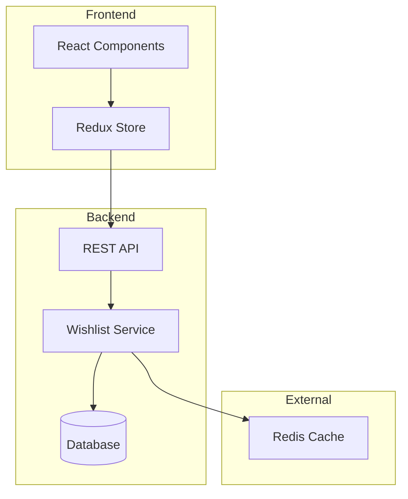

# User Story: [Story Title]

**Story ID:** [US-XXX-001]  
**Epic:** [Parent Epic/Feature]  
**Sprint:** [Sprint Number]  
**Created:** [YYYY-MM-DD]  
**Last Updated:** [YYYY-MM-DD]  
**Author:** [Name/Email]  

## Story Card

**As a** [type of user]  
**I want** [goal/desire]  
**So that** [benefit/value]

### Example
> As a registered user  
> I want to save items to my wishlist  
> So that I can purchase them later when I'm ready

## Story Details

**Type:** Feature | Enhancement | Bug | Technical | Spike  
**Priority:** Critical | High | Medium | Low  
**Story Points:** [1, 2, 3, 5, 8, 13]  
**Business Value:** High | Medium | Low  
**Risk:** High | Medium | Low  
**Status:** Draft | Ready | In Progress | Testing | Done | Blocked

**Tags:** `frontend` `backend` `api` `database` `security` `performance`

## Context & Background

### User Persona
**Name:** [Persona Name, e.g., "Sarah the Shopper"]  
**Description:** [Brief description of this user type]  
**Goals:** 
- [What this persona wants to achieve]
- [Their primary motivations]

**Pain Points:**
- [Current frustrations]
- [Problems to solve]

### Business Context
[Explain why this story exists, what problem it solves, and any relevant background information]

### Current State vs Desired State
| Current State | Desired State |
|--------------|---------------|
| [How things work today] | [How things should work] |

## Acceptance Criteria

### AC-1: [Criterion Title] 
**Priority:** Must Have | Should Have | Nice to Have

**Given** [initial context/state]  
**When** [action/event occurs]  
**Then** [expected outcome]  
**And** [additional outcomes if applicable]

### AC-2: [Criterion Title]
**Priority:** Must Have

**Given** I am on the shopping cart page with items  
**When** I click "Save for Later" on an item  
**Then** the item should move to my wishlist  
**And** the cart total should update  
**And** I should see a success message

### AC-3: [Error Handling]
**Priority:** Must Have

**Given** the wishlist service is unavailable  
**When** I try to save an item  
**Then** I should see an error message "Unable to save item. Please try again."  
**And** the item should remain in my cart

## User Flows

### Happy Path Flow


### Error Flow


## Technical Considerations

### Architecture Impact


### API Endpoints
| Method | Endpoint | Description |
|--------|----------|-------------|
| GET | `/api/wishlist` | Retrieve user's wishlist |
| POST | `/api/wishlist/items` | Add item to wishlist |
| DELETE | `/api/wishlist/items/{id}` | Remove item from wishlist |
| PUT | `/api/wishlist/items/{id}` | Update item in wishlist |

### Request/Response Examples
```json
// POST /api/wishlist/items
{
  "productId": "12345",
  "quantity": 1,
  "notes": "Birthday gift idea"
}

// Response
{
  "success": true,
  "data": {
    "wishlistItemId": "wl-98765",
    "productId": "12345",
    "addedAt": "2024-01-20T10:30:00Z"
  }
}
```

### Performance Requirements
- Response time: < 200ms (p95)
- Support 1000 concurrent wishlist operations
- Wishlist limited to 100 items per user

### Security Requirements
- Authenticated users only
- Users can only access their own wishlist
- Rate limiting: 100 requests per minute per user

## Dependencies

### Story Dependencies
- [ ] [US-AUTH-001] User Authentication - **Status:** Complete
- [ ] [US-PROD-005] Product Catalog API - **Status:** Complete

### Technical Dependencies
- [ ] Redis cache implementation - **Status:** In Progress
- [ ] Database schema update - **Status:** Ready

### External Dependencies
- [ ] Marketing team approval for wishlist email notifications
- [ ] Legal review for data retention policy

## UI/UX Mockups

### Desktop View


### Mobile View


### Interaction Notes
- Smooth animation when moving items between cart and wishlist
- Toast notification for success/error messages
- Loading spinner during save operation

## Business Rules

1. **BR-1:** Maximum 100 items in wishlist
2. **BR-2:** Items in wishlist for >1 year are auto-removed
3. **BR-3:** Out-of-stock items remain in wishlist but show availability
4. **BR-4:** Price changes are tracked and users notified
5. **BR-5:** Wishlist items are not reserved (no inventory hold)

## Test Strategy

### Unit Tests
- [ ] Wishlist service logic (90% coverage required)
- [ ] API endpoint validations
- [ ] Business rule enforcement

### Integration Tests
- [ ] Cart to wishlist flow
- [ ] Database persistence
- [ ] Cache synchronization

### E2E Tests
- [ ] Complete user journey from product page to wishlist
- [ ] Error scenarios and recovery
- [ ] Performance under load

### Test Data Requirements
```yaml
testUsers:
  - email: test-empty-wishlist@example.com
    wishlistItems: 0
  - email: test-full-wishlist@example.com  
    wishlistItems: 100
  - email: test-regular-user@example.com
    wishlistItems: 5
```

## Definition of Done

- [ ] Code complete and follows coding standards
- [ ] Unit tests written and passing (>85% coverage)
- [ ] Integration tests passing
- [ ] Code reviewed and approved by 2 developers
- [ ] API documentation updated
- [ ] Performance requirements met
- [ ] Security review completed
- [ ] Accessibility standards met (WCAG 2.1 AA)
- [ ] Deployed to staging environment
- [ ] QA testing passed
- [ ] Product Owner acceptance
- [ ] Monitoring and alerts configured

## Implementation Links

### Requirements
- [REQ-WISHLIST-001](../requirements/wishlist-requirements.md) - Wishlist Feature Requirements

### Implementation Guide
- [IG-WISHLIST-001](../implementation/wishlist-implementation.xml) - Technical Implementation Guide

### Test Specifications
- [TS-WISHLIST-001](../tests/wishlist-tests.xml) - Test Specifications

## Success Metrics

### KPIs to Track
| Metric | Target | Measurement Method |
|--------|--------|-------------------|
| Wishlist Adoption Rate | 40% of active users | Users with >0 wishlist items / Total active users |
| Cart to Wishlist Conversion | 15% | Items moved to wishlist / Total cart abandonment |
| Wishlist to Purchase Rate | 25% | Wishlist items purchased / Total wishlist items |
| Feature Performance | <200ms p95 | APM monitoring |

### Analytics Events
```javascript
// Track when item added to wishlist
analytics.track('Wishlist Item Added', {
  productId: '12345',
  productName: 'Example Product',
  price: 29.99,
  category: 'Electronics',
  source: 'product-page' // or 'cart'
});

// Track wishlist conversion
analytics.track('Wishlist Item Purchased', {
  productId: '12345',
  daysInWishlist: 7,
  priceChange: -5.00
});
```

## Release Notes

### User-Facing Changes
- New "Save for Later" button on cart items
- Dedicated wishlist page accessible from user menu
- Email notifications for price drops on wishlist items

### Technical Changes
- New `wishlists` database table
- Redis caching for wishlist data
- New API endpoints under `/api/wishlist`

### Migration Requirements
- No data migration required (new feature)
- Feature flag: `enable_wishlist_feature`

### Rollback Plan
1. Disable feature flag
2. Hide wishlist UI elements
3. API endpoints return 404
4. No database rollback needed (data preserved)

## Risks & Mitigation

| Risk | Impact | Probability | Mitigation |
|------|--------|-------------|------------|
| High wishlist usage overloads database | High | Medium | Implement caching and pagination |
| Users lose cart items when moving to wishlist | Medium | Low | Implement "undo" functionality |
| Wishlist becomes shopping cart duplicate | Medium | Medium | Clear UX differentiation |

## Discussion & Decisions

### 2024-01-15 - Team Discussion
**Participants:** Product, Engineering, UX  
**Decision:** Limit wishlist to 100 items to prevent abuse  
**Rationale:** Analysis showed 99% of users have <50 items

### 2024-01-18 - Technical Review
**Participants:** Backend team  
**Decision:** Use Redis for wishlist caching  
**Rationale:** Better performance than database-only solution

## Notes

### Important Considerations
- ⚠️ **Performance:** Monitor closely during initial rollout
- 💡 **Future Enhancement:** Consider sharing wishlist functionality
- 📊 **Analytics:** Set up dashboard before launch

### Assumptions
- Users are already authenticated
- Product catalog API is stable
- Redis infrastructure is available

### Out of Scope
- Social sharing of wishlists
- Public wishlists
- Wishlist collaboration
- Price tracking history UI (backend only)

---

**Status:** Ready for Development  
**Last Review:** 2024-01-20  
**Next Review:** Start of Sprint 15