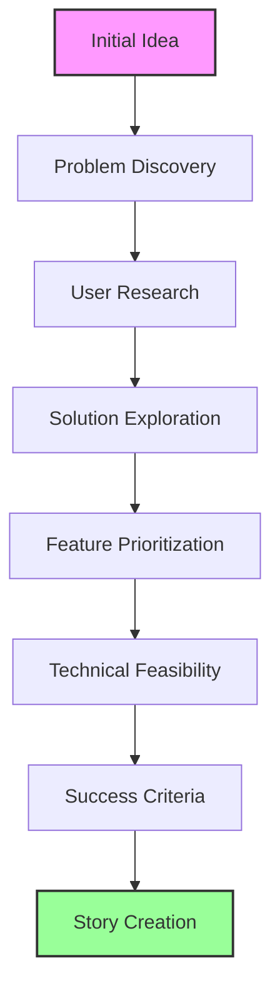
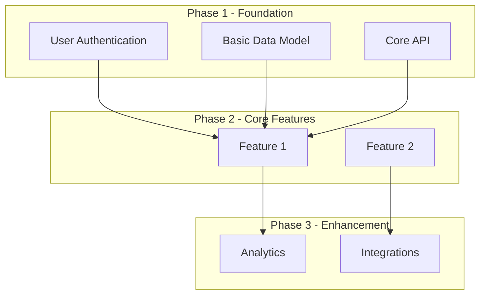
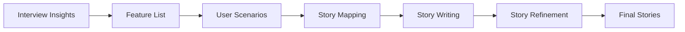

# Interview to User Stories: Complete Transformation Guide

**Version:** 1.0  
**Date:** 2025-07-18  
**Purpose:** This guide provides detailed techniques for conducting AI-powered interviews and brainstorming sessions, then transforming those insights into comprehensive user stories.

## Table of Contents

1. [The Interview Process](#1-the-interview-process)
2. [Brainstorming Techniques](#2-brainstorming-techniques)
3. [Capturing and Organizing Ideas](#3-capturing-and-organizing-ideas)
4. [Transforming Interviews to User Stories](#4-transforming-interviews-to-user-stories)
5. [AI Prompts for Each Stage](#5-ai-prompts-for-each-stage)
6. [Interview Templates](#6-interview-templates)
7. [Common Patterns and Examples](#7-common-patterns-and-examples)
8. [Quality Assurance](#8-quality-assurance)
9. [Tools and Automation](#9-tools-and-automation)
10. [Best Practices](#10-best-practices)

## 1. The Interview Process

### 1.1 Interview Stages



### 1.2 Setting Up the Interview

#### Initial Context Setting
```markdown
## Prompt: Initialize AI Interview Session

I want you to act as an experienced business analyst and product manager. 
You'll be interviewing me about my software idea. Your goal is to:

1. Understand the problem deeply
2. Identify all stakeholders
3. Explore potential solutions
4. Define success metrics
5. Uncover hidden requirements

Use the following interview structure:
- Start with open-ended questions
- Dig deeper with follow-ups
- Challenge assumptions
- Explore edge cases
- Summarize periodically

Begin by asking me to describe my idea in 2-3 sentences.
```

### 1.3 The Five Levels of Why

For each feature or problem, dig deeper:

```markdown
## Example: Five Levels Deep

User: "I want a notification system"

Level 1: Why do you want notifications?
"To keep users informed"

Level 2: Why do users need to be kept informed?
"So they don't miss important updates"

Level 3: Why might they miss updates?
"Because they don't check the app frequently"

Level 4: Why don't they check frequently?
"The current process requires too many steps"

Level 5: Why are there too many steps?
"We haven't optimized the user flow"

Real Need: Streamlined user flow with smart notifications
```

### 1.4 Interview Question Framework

#### Problem Space Questions
```markdown
## Core Problem Questions

1. **Problem Identification**
   - What problem are you solving?
   - Who experiences this problem?
   - How painful is this problem? (1-10 scale)
   - What happens if we don't solve it?

2. **Current State Analysis**
   - How is this handled today?
   - What tools/processes are currently used?
   - What's broken about the current approach?
   - What works well that we should keep?

3. **Impact Assessment**
   - How many people/organizations are affected?
   - What's the frequency of this problem?
   - What's the cost (time/money/frustration)?
   - What other problems does this create?
```

#### Solution Space Questions
```markdown
## Solution Exploration Questions

1. **Vision Questions**
   - What does success look like?
   - Describe the ideal user experience
   - What's the "wow" moment for users?
   - What would make this indispensable?

2. **Feature Discovery**
   - What's the core feature that solves the main problem?
   - What supporting features are needed?
   - What features are "nice to have"?
   - What should we explicitly NOT build?

3. **User Journey**
   - Walk me through a typical user's day
   - When would they use this solution?
   - What triggers the need?
   - What happens after they use it?
```

## 2. Brainstorming Techniques

### 2.1 Structured Brainstorming

```markdown
## Prompt: Structured Feature Brainstorming

Based on our discussion about [problem], let's brainstorm solutions using 
these techniques:

1. **SCAMPER Method**:
   - Substitute: What can we replace?
   - Combine: What can we merge?
   - Adapt: What can we adjust?
   - Modify/Magnify: What can we emphasize?
   - Put to other uses: Alternative applications?
   - Eliminate: What can we remove?
   - Reverse/Rearrange: What can we flip?

2. **Mind Mapping**: Create a mind map with:
   - Core problem at center
   - Major branches for different aspects
   - Sub-branches for specific features
   - Connections between related ideas

3. **Crazy 8s**: Generate 8 wildly different approaches:
   - The premium solution (cost no object)
   - The bare minimum (MVP)
   - The mobile-first approach
   - The AI-powered version
   - The social/collaborative angle
   - The gamified solution
   - The completely automated version
   - The human-centered design

Provide 5 ideas for each category.
```

### 2.2 Feature Prioritization Matrix

```markdown
## Prompt: Create Feature Priority Matrix

Organize all brainstormed features into this matrix:

| Impact ↑ | Low Effort | High Effort |
|----------|-----------|-------------|
| **High** | 🎯 Quick Wins | 💎 Major Features |
| **Low** | 🔧 Nice to Have | ❌ Avoid |

For each feature, assess:
- User Impact (1-10)
- Development Effort (1-10)
- Business Value (1-10)
- Technical Risk (1-10)

Create a prioritized backlog with reasoning.
```

### 2.3 User Persona Development

```markdown
## Prompt: Develop User Personas

Based on our interview, create 3-5 detailed user personas:

# Persona Template

## [Persona Name] - [Role/Type]

**Demographics:**
- Age: [Range]
- Tech Savvy: [Low/Medium/High]
- Role: [Professional title]
- Location: [Geographic considerations]

**Goals:**
- Primary: [Main objective]
- Secondary: [Supporting goals]

**Pain Points:**
- [Current frustration 1]
- [Current frustration 2]

**Day in the Life:**
[Narrative describing their typical workflow]

**How Our Solution Helps:**
[Specific benefits for this persona]

**Key Features Needed:**
1. [Feature specific to this persona]
2. [Another key feature]

**Success Metrics:**
- [How they measure success]
```

## 3. Capturing and Organizing Ideas

### 3.1 Interview Transcript Structure

```markdown
# [Project Name] Interview Transcript

**Date:** [Date]
**Participants:** [Names/Roles]
**Duration:** [Time]

## 1. Problem Statement
### Initial Description
[Interviewee's original problem statement]

### Refined Problem
[Problem after clarification through questions]

### Root Causes Identified
- [Cause 1]
- [Cause 2]

## 2. Stakeholders Identified
### Primary Users
- [User Type 1]: [Description]
- [User Type 2]: [Description]

### Secondary Stakeholders
- [Stakeholder 1]: [Impact/Interest]

## 3. Current State Analysis
### Existing Solutions
- [Current approach 1]
- [Current approach 2]

### Pain Points
1. [Pain point with evidence]
2. [Pain point with evidence]

## 4. Desired Future State
### Vision Statement
[One paragraph vision]

### Success Criteria
- [Measurable outcome 1]
- [Measurable outcome 2]

## 5. Feature Ideas Generated
### Must Have (MVP)
1. [Feature]: [Why it's essential]
2. [Feature]: [Why it's essential]

### Should Have
1. [Feature]: [Value proposition]

### Nice to Have
1. [Feature]: [Future enhancement]

## 6. Constraints & Considerations
### Technical Constraints
- [Constraint 1]

### Business Constraints
- [Budget/Time/Resource limits]

## 7. Next Steps
1. Create user stories for MVP features
2. Technical feasibility assessment
3. Create prototypes for key workflows
```

### 3.2 Idea Clustering

```markdown
## Prompt: Cluster and Organize Ideas

Take all the ideas from our brainstorming session and:

1. **Group by Theme**:
   - User Management
   - Core Functionality  
   - Reporting/Analytics
   - Integration
   - Administration

2. **Identify Patterns**:
   - Common user needs across personas
   - Recurring technical requirements
   - Shared business rules

3. **Find Dependencies**:
   - What must be built first?
   - What can be built in parallel?
   - What requires external input?

4. **Create Feature Map**:


## 4. Transforming Interviews to User Stories

### 4.1 The Transformation Process



### 4.2 Feature to Story Mapping

```markdown
## Prompt: Transform Features to Stories

For each feature identified in our interview, create user stories:

1. **Identify the Actor**: Who needs this feature?
2. **Define the Action**: What are they trying to do?
3. **Clarify the Benefit**: Why do they need it?
4. **Add Context**: When/where does this happen?
5. **Include Constraints**: What limitations exist?

Example Transformation:

**Interview Statement**: "Users complain they can't find old reports"

**Analysis**:
- Actor: Report consumers (managers, analysts)
- Problem: Discoverability and organization
- Need: Search and categorization

**Resulting Stories**:
1. "As a manager, I want to search reports by date range so that I can find quarterly summaries quickly"
2. "As an analyst, I want to tag reports with categories so that I can organize them by project"
3. "As a user, I want to see my recently viewed reports so that I can quickly return to my work"
```

### 4.3 Story Generation Template

```markdown
## Prompt: Generate Comprehensive User Stories

Based on the feature "[Feature Name]" from our interview, create:

1. **Epic Story** - High-level feature story
2. **User Stories** - 3-5 specific stories
3. **Technical Stories** - Backend requirements
4. **Edge Cases** - Error handling stories

For each story include:
- Story statement (As a... I want... So that...)
- Acceptance criteria (Given... When... Then...)
- Technical notes
- UI/UX considerations
- Dependencies

Use both XML and Markdown formats from AIDevFlow templates.
```

### 4.4 Story Writing Patterns

#### Pattern 1: CRUD Operations
```markdown
For any entity (e.g., "Project"), generate standard stories:

1. **Create**: As a [user], I want to create a new [entity]
2. **Read**: As a [user], I want to view [entity] details  
3. **Update**: As a [user], I want to edit [entity] information
4. **Delete**: As a [user], I want to remove obsolete [entity]
5. **List**: As a [user], I want to see all my [entities]
6. **Search**: As a [user], I want to find specific [entities]
```

#### Pattern 2: Workflow Stories
```markdown
For any process, map the workflow:

1. **Initiate**: As a [initiator], I want to start [process]
2. **Review**: As a [reviewer], I want to review [submissions]
3. **Approve/Reject**: As a [approver], I want to make decisions
4. **Notify**: As a [stakeholder], I want to be informed of [outcomes]
5. **Track**: As a [manager], I want to monitor [process] status
```

## 5. AI Prompts for Each Stage

### 5.1 Interview Initialization

```markdown
## Prompt Set 1: Starting the Interview

**For Problem Discovery:**
"I'd like to understand the problem you're trying to solve. Start by telling me 
about a specific situation where this problem occurs. What happened? Who was 
involved? What was the outcome?"

**For Depth:**
"That's interesting. Can you give me a specific example of when this happened 
recently? Walk me through exactly what occurred."

**For Clarity:**
"When you say [term], what exactly does that mean in your context? Can you 
give me an example?"
```

### 5.2 Brainstorming Facilitation

```markdown
## Prompt Set 2: Facilitating Brainstorming

**Expansion Prompt:**
"Let's think outside the box. If you had unlimited resources and no technical 
constraints, how would you solve this? Now, what's the simplest possible 
solution? Let's find something in between."

**Alternative Approaches:**
"What if we approached this from a completely different angle? Instead of 
[current approach], what if we [alternative]? What would that look like?"

**Edge Case Exploration:**
"What's the worst-case scenario for a user? What could go wrong? How should 
the system handle that?"
```

### 5.3 Story Generation

```markdown
## Prompt Set 3: Creating User Stories

**Story Generation:**
"Based on our discussion about [feature], create 5 user stories that cover:
- The happy path (normal use)
- An edge case
- An error scenario  
- A power user need
- An administrative need"

**Acceptance Criteria:**
"For the story '[story title]', create comprehensive acceptance criteria 
that cover:
- All user interactions
- System responses
- Error handling
- Performance expectations
- Security requirements"

**Technical Considerations:**
"What technical implications does this story have? Consider:
- API design
- Database impact
- Performance requirements
- Security considerations
- Integration needs"
```

## 6. Interview Templates

### 6.1 SaaS Product Interview Template

```markdown
# SaaS Product Interview Guide

## 1. Market & Problem
- What industry problem are you solving?
- Who are your target customers? (company size, industry, role)
- What's the current solution cost them?
- What's your unique value proposition?

## 2. Users & Workflow
- Who are the different user types?
- What's the typical user journey?
- How often will they use this?
- What integrations are critical?

## 3. Business Model
- Pricing strategy? (per user, per usage, flat fee?)
- Free trial or freemium?
- Enterprise vs self-service?
- Expected customer lifetime value?

## 4. Technical Requirements
- Expected scale? (users, data, transactions)
- Compliance needs? (GDPR, HIPAA, SOC2?)
- Mobile requirements?
- Offline capabilities?

## 5. Success Metrics
- How do you measure product success?
- What are the key user actions?
- Churn reduction targets?
- Growth expectations?
```

### 6.2 Internal Tool Interview Template

```markdown
# Internal Tool Interview Guide

## 1. Current Process
- Walk me through the current process
- How many people are involved?
- How long does it take?
- What are the pain points?
- What works well?

## 2. Users & Roles
- Who will use this tool?
- What are their technical skills?
- How often will they use it?
- What devices will they use?

## 3. Workflow & Features
- What's the ideal workflow?
- What decisions need to be made?
- What approvals are required?
- What notifications are needed?

## 4. Data & Integration
- What data sources exist?
- What systems need integration?
- What reports are required?
- Data retention needs?

## 5. Constraints
- Timeline requirements?
- Budget limitations?
- Technical constraints?
- Change management concerns?
```

### 6.3 Mobile App Interview Template

```markdown
# Mobile App Interview Guide

## 1. User Context
- When/where will users use this app?
- What are they doing before/after?
- Internet connectivity assumptions?
- Device types and OS versions?

## 2. Core Features
- What's the #1 thing users need to do?
- What can wait for v2?
- Native vs hybrid requirements?
- Offline functionality needs?

## 3. User Experience
- Onboarding requirements?
- Push notification needs?
- Social sharing features?
- Personalization requirements?

## 4. Technical Considerations
- Backend API requirements?
- Third-party services needed?
- Payment processing?
- Analytics requirements?

## 5. Launch & Growth
- App store optimization needs?
- User acquisition strategy?
- Retention features?
- Update frequency?
```

## 7. Common Patterns and Examples

### 7.1 E-commerce Platform Example

```markdown
## Interview Excerpt → User Stories

**Interview Statement**: 
"Customers abandon carts because they can't see shipping costs until checkout"

**Follow-up Questions**:
- Q: "At what point do they abandon?"
- A: "When they see the total with shipping at the final step"
- Q: "What would be the ideal experience?"
- A: "Know shipping costs early, maybe on product page"

**Generated Stories**:

1. **Shipping Calculator Story**
   - As a shopper
   - I want to see estimated shipping costs on the product page
   - So that I can make informed purchase decisions

2. **Cart Shipping Estimate**
   - As a shopper with items in cart
   - I want to see shipping options and costs
   - So that I know the total cost before checkout

3. **Shipping Threshold Indicator**
   - As a budget-conscious shopper
   - I want to see how much more I need for free shipping
   - So that I can optimize my order value
```

### 7.2 Project Management Tool Example

```markdown
## Interview Excerpt → User Stories

**Interview Statement**:
"Teams struggle to track dependencies between tasks"

**Deep Dive**:
- Current Pain: Tasks fail because dependencies weren't visible
- Frequency: Weekly occurrence causing delays
- Impact: Projects slip by 20% on average

**Generated Stories**:

1. **Dependency Visualization**
   - As a project manager
   - I want to see a visual map of task dependencies
   - So that I can identify critical paths and bottlenecks

2. **Dependency Alerts**
   - As a task owner  
   - I want to be notified when my dependencies are complete
   - So that I can start my work immediately

3. **Circular Dependency Detection**
   - As a project planner
   - I want the system to detect circular dependencies
   - So that I can fix planning errors before they cause issues
```

## 8. Quality Assurance

### 8.1 Interview Quality Checklist

```markdown
## Interview Completeness Check

Before creating stories, verify:

☐ **Problem Understanding**
  - Root cause identified
  - Impact quantified
  - Urgency established

☐ **User Research**
  - All user types identified
  - User journeys mapped
  - Pain points documented

☐ **Solution Exploration**
  - Multiple approaches considered
  - Constraints identified
  - Success criteria defined

☐ **Feature Completeness**
  - Core features listed
  - Edge cases considered
  - Future vision outlined

☐ **Technical Feasibility**
  - Technical constraints noted
  - Integration needs identified
  - Performance requirements set
```

### 8.2 Story Quality Validation

```markdown
## Prompt: Validate Story Quality

Review the generated user stories and check:

1. **Completeness**
   - Does each story have clear actor, action, and benefit?
   - Are acceptance criteria testable?
   - Are edge cases covered?

2. **Independence**
   - Can each story be developed independently?
   - Are dependencies clearly marked?
   - Is the scope appropriate?

3. **Clarity**
   - Would a developer understand what to build?
   - Would a tester know how to verify?
   - Would a user recognize the value?

4. **Traceability**
   - Can we trace each story back to interview insights?
   - Are business goals reflected?
   - Is prioritization justified?

Flag any issues and suggest improvements.
```

## 9. Tools and Automation

### 9.1 Interview Analysis Script

```python
# analyze_interview.py
import re
from collections import defaultdict

class InterviewAnalyzer:
    def __init__(self, transcript):
        self.transcript = transcript
        self.insights = defaultdict(list)
    
    def extract_pain_points(self):
        """Extract pain points from interview"""
        pain_indicators = [
            r"problem is",
            r"struggle with", 
            r"difficult to",
            r"can't",
            r"frustrated by",
            r"takes too long",
            r"waste time"
        ]
        
        for indicator in pain_indicators:
            matches = re.finditer(indicator, self.transcript, re.I)
            for match in matches:
                context = self.get_context(match.start(), 100)
                self.insights['pain_points'].append(context)
    
    def extract_feature_requests(self):
        """Extract feature ideas"""
        feature_indicators = [
            r"would be great if",
            r"wish we could",
            r"need to be able to",
            r"should have",
            r"want to"
        ]
        
        for indicator in feature_indicators:
            matches = re.finditer(indicator, self.transcript, re.I)
            for match in matches:
                context = self.get_context(match.start(), 100)
                self.insights['features'].append(context)
    
    def generate_story_suggestions(self):
        """Suggest user stories based on insights"""
        stories = []
        
        for pain_point in self.insights['pain_points']:
            # Convert pain point to story suggestion
            story = self.pain_to_story(pain_point)
            stories.append(story)
        
        return stories
    
    def pain_to_story(self, pain_point):
        """Convert a pain point to a story suggestion"""
        # AI would do this better, but here's a simple version
        return {
            'pain': pain_point,
            'suggested_story': f"As a user, I want to [solution] so that [pain is resolved]",
            'priority': self.assess_priority(pain_point)
        }
```

### 9.2 Story Generation Automation

```bash
#!/bin/bash
# generate_stories_from_interview.sh

# Input: Interview transcript file
TRANSCRIPT=$1
PROJECT_NAME=$2

# Step 1: Analyze interview
echo "Analyzing interview transcript..."
python analyze_interview.py "$TRANSCRIPT" > analysis.json

# Step 2: Generate story suggestions
echo "Generating story suggestions..."
cat analysis.json | python suggest_stories.py > story_suggestions.md

# Step 3: Create story files
echo "Creating user story files..."
python create_story_files.py story_suggestions.md "$PROJECT_NAME"

# Step 4: Validate stories
echo "Validating generated stories..."
python validate_stories.py stories/*.md > validation_report.md

echo "Stories generated in ./stories directory"
echo "Review validation_report.md for quality check"
```

## 10. Best Practices

### 10.1 Interview Best Practices

#### DO's ✅
1. **Listen More Than Talk**: 80/20 rule
2. **Ask Open-Ended Questions**: Avoid yes/no
3. **Probe Deeper**: Use the 5 whys
4. **Capture Everything**: Record or detailed notes
5. **Summarize Regularly**: Confirm understanding
6. **Explore Emotions**: "How did that make you feel?"
7. **Get Specific**: Ask for concrete examples

#### DON'Ts ❌
1. **Don't Lead**: Avoid suggesting solutions
2. **Don't Judge**: Accept all input neutrally
3. **Don't Rush**: Give time for thinking
4. **Don't Assume**: Clarify terminology
5. **Don't Skip Context**: Understand the full picture

### 10.2 Story Creation Best Practices

#### Story Quality Criteria
1. **Independent**: Can be developed separately
2. **Negotiable**: Details can be discussed
3. **Valuable**: Clear value to users
4. **Estimable**: Team can size it
5. **Small**: Fits in a sprint
6. **Testable**: Clear acceptance criteria

#### Common Anti-Patterns to Avoid
1. **Technical Stories**: "As a developer, I want a database"
2. **Vague Benefits**: "So that it's better"
3. **Multiple Actions**: "I want to create, edit, and delete"
4. **Missing Context**: No background or scenarios
5. **Untestable Criteria**: "Should be fast"

### 10.3 Continuous Improvement

```markdown
## Retrospective Questions

After each interview-to-story session:

1. **What insights surprised us?**
2. **What questions should we have asked?**
3. **Which stories needed the most refinement?**
4. **What patterns are emerging?**
5. **How can we improve the process?**

Track these learnings to improve future sessions.
```

## Conclusion

The journey from interview to user stories is where ideas transform into actionable plans. By following this guide and using AI assistance effectively, you can:

- Conduct thorough interviews that uncover real needs
- Brainstorm comprehensively without losing focus  
- Transform insights into well-structured user stories
- Maintain traceability from problem to solution
- Create a foundation for successful development

Remember: The quality of your user stories directly impacts the quality of your final product. Invest time in getting them right.

---

**Next Steps:**
1. Review [AI_Interview_Templates.md](./AI_Interview_Templates.md) for ready-to-use prompts
2. See [Idea_Exploration_Examples.md](./Idea_Exploration_Examples.md) for real examples
3. Use [User_Story_Template.md](./User_Story_Template.md) for story formatting

**Related Documents:**
- [AIDevFlow_Complete_Guide.md](./AIDevFlow_Complete_Guide.md)
- [User_Story_Principles.md](./User_Story_Principles.md)
- [User_Stories_to_Requirements_Guide.md](./User_Stories_to_Requirements_Guide.md)