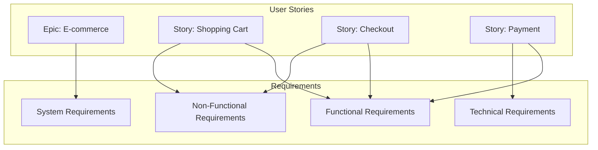
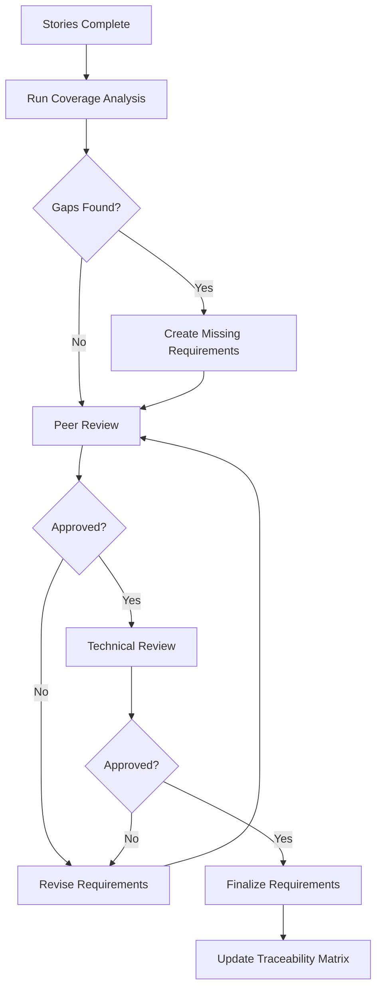

# User Stories to Requirements: Complete Transformation Guide

**Version:** 1.0  
**Date:** 2025-07-17  
**Purpose:** This guide provides a systematic approach for transforming User Stories into comprehensive Requirements, including AI prompts, workflows, and best practices for ensuring complete coverage.

## Table of Contents

1. [Overview](#1-overview)
2. [The Transformation Process](#2-the-transformation-process)
3. [AI Prompts for Requirements Generation](#3-ai-prompts-for-requirements-generation)
4. [Mapping User Stories to Requirements](#4-mapping-user-stories-to-requirements)
5. [Ensuring Complete Coverage](#5-ensuring-complete-coverage)
6. [Quality Assurance Checklist](#6-quality-assurance-checklist)
7. [Automation and Tools](#7-automation-and-tools)
8. [Common Patterns and Examples](#8-common-patterns-and-examples)
9. [Troubleshooting Guide](#9-troubleshooting-guide)
10. [Best Practices Summary](#10-best-practices-summary)

## 1. Overview

### 1.1 Why Transform Stories to Requirements?

User Stories and Requirements serve different purposes:

| User Stories | Requirements |
|--------------|--------------|
| Focus on user value | Define system behavior |
| Conversational format | Formal specification |
| Flexible and negotiable | Precise and measurable |
| Sprint-level scope | System-level scope |
| Acceptance criteria | Technical specifications |

### 1.2 The Relationship



### 1.3 When to Create Requirements

Create formal requirements when:
- Building a new system or major feature
- Regulatory compliance is needed
- Multiple teams/vendors are involved
- Long-term documentation is required
- Contractual obligations exist

## 2. The Transformation Process

### 2.1 High-Level Workflow


### 2.2 Step-by-Step Process

#### Step 1: Collect and Organize Stories
```bash
# Gather all user stories for the feature/system
user-stories/
├── epic-shopping/
│   ├── US-CART-001.md    # Add to cart
│   ├── US-CART-002.md    # Update quantity
│   ├── US-CART-003.md    # Remove items
│   ├── US-CHECK-001.md   # Guest checkout
│   ├── US-CHECK-002.md   # Express checkout
│   └── US-PAY-001.md     # Payment processing
```

#### Step 2: Analyze Story Patterns
- Group related stories by feature area
- Identify common acceptance criteria
- Find cross-cutting concerns
- Note technical constraints mentioned

#### Step 3: Create Requirements Structure
```
requirements/
├── REQ-SHOP-001.xml      # Shopping Cart Management
├── REQ-SHOP-002.xml      # Checkout Process
├── REQ-PAY-001.xml       # Payment Processing
├── REQ-PERF-001.xml      # Performance Requirements
└── REQ-SEC-001.xml       # Security Requirements
```

## 3. AI Prompts for Requirements Generation

### 3.1 Complete System Requirements Generation

```markdown
## Prompt: Generate Complete Requirements from User Stories

Study all user stories in the following directory: [user-stories/epic-shopping/]

Using the Requirements_Template.xml and Requirements_Principles.md as reference, 
and following the Requirements_Template_Guide.md, create comprehensive requirements that:

1. Cover all functional aspects mentioned in user stories
2. Extract and consolidate non-functional requirements
3. Define technical requirements and constraints
4. Ensure traceability back to source stories
5. Include complete acceptance criteria
6. Add technical specifications not in stories
7. Define data models and interfaces
8. Specify security and compliance needs

For each requirement:
- Use proper requirement ID conventions
- Link to source user stories
- Define measurable acceptance criteria
- Include implementation and test references
- Add risk assessment where appropriate

Output format: Requirements_Template.xml structure
Group by: Functional, Non-Functional, Technical, Data
```

### 3.2 Functional Requirements Extraction

```markdown
## Prompt: Extract Functional Requirements from Stories

Given these user stories:
[List of user story files or paste content]

Create functional requirements that:

1. Consolidate related story functionalities
2. Define system behavior precisely
3. Specify input/output requirements
4. Include business rules from all stories
5. Define error handling requirements
6. Specify integration points

For each functional requirement, include:
- Clear description of what the system must do
- Input data specifications with validation rules
- Output data formats and content
- Business rules and calculations
- Error conditions and handling
- Performance targets for the function

Reference specific acceptance criteria from stories using IDs.
```

### 3.3 Non-Functional Requirements Synthesis

```markdown
## Prompt: Synthesize Non-Functional Requirements

Analyze all user stories in [directory] and extract non-functional requirements for:

1. Performance:
   - Response time requirements mentioned in stories
   - Throughput and concurrent user expectations
   - Resource utilization constraints

2. Security:
   - Authentication/authorization mentioned
   - Data protection requirements
   - Compliance needs (PCI, GDPR, etc.)

3. Usability:
   - UI/UX requirements from stories
   - Accessibility requirements
   - Device/browser compatibility

4. Reliability:
   - Availability expectations
   - Error recovery requirements
   - Data integrity needs

Create comprehensive non-functional requirements that consolidate all these aspects,
ensuring each requirement is measurable and testable.
```

### 3.4 Technical Requirements Discovery

```markdown
## Prompt: Discover Technical Requirements

Based on the user stories and their technical considerations sections:

Generate technical requirements covering:

1. Platform and Technology Stack
   - Required technologies mentioned
   - Integration requirements
   - API specifications

2. Data Requirements
   - Data models implied by stories
   - Storage and retention needs
   - Data volume projections

3. Infrastructure Requirements
   - Scalability needs
   - Deployment requirements
   - Monitoring and logging

4. Development Constraints
   - Coding standards implied
   - Architectural patterns required
   - Third-party dependencies

Include specific version requirements, compatibility needs, and technical constraints
that may not be explicitly stated in user stories but are necessary for implementation.
```

### 3.5 Gap Analysis Prompt

```markdown
## Prompt: Identify Requirement Gaps

Compare the user stories in [directory] with standard requirement categories:

1. What requirements are implied but not explicitly stated?
2. What edge cases might be missing?
3. What error scenarios need requirements?
4. What performance requirements are assumed?
5. What security requirements are industry standard but not mentioned?
6. What compliance requirements might apply?
7. What operational requirements are needed?

Generate additional requirements to fill these gaps, ensuring comprehensive coverage
beyond what's explicitly in the user stories.
```

## 4. Mapping User Stories to Requirements

### 4.1 Traceability Matrix Template

| Requirement ID | Requirement Title | Source Stories | Coverage |
|----------------|------------------|----------------|----------|
| REQ-SHOP-001 | Shopping Cart Management | US-CART-001, US-CART-002, US-CART-003 | 100% |
| REQ-SHOP-002 | Checkout Process | US-CHECK-001, US-CHECK-002 | 100% |
| REQ-PAY-001 | Payment Processing | US-PAY-001, US-PAY-002 | 90% |
| REQ-PERF-001 | System Performance | US-CART-001, US-CHECK-001 | Partial |

### 4.2 Mapping Example

#### User Story: Add to Cart
```markdown
# US-CART-001: Add Items to Cart

**As a** shopper  
**I want** to add items to my cart  
**So that** I can purchase multiple items

### Acceptance Criteria
- AC1: Item added with single click
- AC2: Cart count updates immediately
- AC3: Success confirmation shown
- AC4: Out of stock items cannot be added
```

#### Resulting Requirement
```xml
<Requirement>
    <Metadata>
        <RequirementID>REQ-SHOP-001</RequirementID>
        <Title>Shopping Cart Management</Title>
        <Type>Functional</Type>
        <Priority>Critical</Priority>
        <Category>E-commerce</Category>
    </Metadata>
    
    <Description>
        <Summary>System must provide shopping cart functionality for item collection</Summary>
        <Details>
            The system shall provide a persistent shopping cart that allows users 
            to collect items for purchase. This includes adding, updating, and 
            removing items with real-time inventory validation.
        </Details>
    </Description>
    
    <UserStory>
        <AsA>shopper</AsA>
        <IWant>to manage items in a shopping cart</IWant>
        <SoThat>I can purchase multiple items in one transaction</SoThat>
    </UserStory>
    
    <FunctionalRequirements>
        <FunctionalReq id="FR_001" priority="High">
            <Description>Add items to shopping cart</Description>
            <InputData>
                <DataItem name="productId" type="string" required="true">
                    <Validation>Must exist in product catalog</Validation>
                </DataItem>
                <DataItem name="quantity" type="integer" required="true">
                    <Validation>Between 1 and 99</Validation>
                </DataItem>
            </InputData>
            <BusinessRules>
                <Rule id="BR_001">Validate inventory before adding</Rule>
                <Rule id="BR_002">Maximum 99 per item type</Rule>
                <Rule id="BR_003">Cart persists for 30 days</Rule>
            </BusinessRules>
        </FunctionalReq>
    </FunctionalRequirements>
    
    <TestReferences>
        <TestSuite id="TS_CART_001" path="tests/cart/add-to-cart.xml">
            <TestCases>
                <TestCase id="TC_001" verifiesAC="AC1">Single click add</TestCase>
                <TestCase id="TC_002" verifiesAC="AC2">Cart count update</TestCase>
                <TestCase id="TC_003" verifiesAC="AC3">Success message</TestCase>
                <TestCase id="TC_004" verifiesAC="AC4">Out of stock handling</TestCase>
            </TestCases>
        </TestSuite>
    </TestReferences>
</Requirement>
```

### 4.3 Consolidation Patterns

#### Pattern 1: Multiple Stories → Single Requirement
```
US-CART-001 (Add to cart) ┐
US-CART-002 (Update qty)  ├─→ REQ-SHOP-001 (Cart Management)
US-CART-003 (Remove item) ┘
```

#### Pattern 2: Single Story → Multiple Requirements
```
US-CHECK-001 (Checkout) → REQ-SHOP-002 (Checkout Process)
                       → REQ-PERF-001 (Performance)
                       → REQ-SEC-001 (Security)
```

#### Pattern 3: Cross-Cutting Concerns
```
Performance mentions across stories → REQ-PERF-001 (System Performance)
Security mentions across stories → REQ-SEC-001 (Security Requirements)
```

## 5. Ensuring Complete Coverage

### 5.1 Coverage Checklist

```markdown
## Requirements Coverage Checklist

### Functional Coverage
- [ ] All user story acceptance criteria mapped
- [ ] Business rules consolidated and numbered
- [ ] Input validation requirements defined
- [ ] Output format specifications complete
- [ ] Error scenarios identified and specified
- [ ] Integration points documented

### Non-Functional Coverage
- [ ] Performance targets from all stories
- [ ] Security requirements comprehensive
- [ ] Usability requirements included
- [ ] Reliability metrics defined
- [ ] Scalability needs addressed
- [ ] Compliance requirements identified

### Technical Coverage
- [ ] Platform requirements specified
- [ ] API contracts defined
- [ ] Data models complete
- [ ] Infrastructure needs documented
- [ ] Development constraints listed
- [ ] Third-party dependencies identified

### Quality Coverage
- [ ] Test requirements linked
- [ ] Acceptance criteria traceable
- [ ] Success metrics defined
- [ ] Monitoring requirements included
```

### 5.2 Gap Analysis Script

```python
# analyze_coverage.py
import os
import re
from collections import defaultdict

def analyze_story_coverage():
    stories = {}
    requirements = {}
    
    # Parse user stories
    for story_file in os.listdir('user-stories'):
        with open(f'user-stories/{story_file}', 'r') as f:
            content = f.read()
            story_id = re.search(r'Story ID:.*?(US-\w+-\d+)', content).group(1)
            ac_criteria = re.findall(r'AC-\d+:', content)
            stories[story_id] = {
                'file': story_file,
                'criteria': ac_criteria,
                'covered': False
            }
    
    # Parse requirements
    for req_file in os.listdir('requirements'):
        with open(f'requirements/{req_file}', 'r') as f:
            content = f.read()
            req_id = re.search(r'RequirementID>(.*?)<', content).group(1)
            linked_stories = re.findall(r'US-\w+-\d+', content)
            requirements[req_id] = {
                'file': req_file,
                'stories': linked_stories
            }
            
            # Mark stories as covered
            for story in linked_stories:
                if story in stories:
                    stories[story]['covered'] = True
    
    # Report uncovered stories
    print("Uncovered User Stories:")
    for story_id, info in stories.items():
        if not info['covered']:
            print(f"  - {story_id}: {info['file']}")
    
    # Report coverage statistics
    total_stories = len(stories)
    covered_stories = sum(1 for s in stories.values() if s['covered'])
    coverage_percent = (covered_stories / total_stories) * 100
    
    print(f"\nCoverage: {covered_stories}/{total_stories} ({coverage_percent:.1f}%)")

if __name__ == "__main__":
    analyze_story_coverage()
```

## 6. Quality Assurance Checklist

### 6.1 Pre-Transformation Review

Before transforming stories to requirements:

```markdown
## Pre-Transformation Checklist

### Story Quality
- [ ] All stories follow standard format
- [ ] Acceptance criteria are clear and testable
- [ ] Technical considerations documented
- [ ] Dependencies identified
- [ ] Business value stated

### Story Completeness
- [ ] All epic stories identified
- [ ] Edge cases covered in stories
- [ ] Error scenarios included
- [ ] Performance expectations stated
- [ ] Security concerns addressed
```

### 6.2 Post-Transformation Validation

After creating requirements:

```markdown
## Post-Transformation Validation

### Requirement Quality
- [ ] Each requirement has unique ID
- [ ] Requirements are atomic (single aspect)
- [ ] Language is precise and unambiguous
- [ ] Measurable criteria included
- [ ] Priority and category assigned

### Traceability
- [ ] All stories mapped to requirements
- [ ] Bidirectional links maintained
- [ ] Test references included
- [ ] Implementation guides referenced
- [ ] No orphaned requirements

### Completeness
- [ ] Functional requirements complete
- [ ] Non-functional requirements comprehensive
- [ ] Technical requirements specified
- [ ] Data requirements defined
- [ ] Interface requirements documented
```

### 6.3 Review Process



## 7. Automation and Tools

### 7.1 Story to Requirement Converter

```javascript
// story-to-requirement.js
const fs = require('fs');
const path = require('path');
const yaml = require('js-yaml');

class StoryToRequirementConverter {
    constructor(storyDir, reqDir) {
        this.storyDir = storyDir;
        this.reqDir = reqDir;
        this.requirements = new Map();
    }
    
    parseStory(filePath) {
        const content = fs.readFileSync(filePath, 'utf8');
        const story = {
            id: this.extractField(content, 'Story ID'),
            type: this.extractField(content, 'Type'),
            asA: this.extractField(content, 'As a'),
            iWant: this.extractField(content, 'I want'),
            soThat: this.extractField(content, 'So that'),
            criteria: this.extractCriteria(content),
            businessRules: this.extractBusinessRules(content),
            performance: this.extractPerformance(content),
            security: this.extractSecurity(content)
        };
        return story;
    }
    
    extractField(content, field) {
        const regex = new RegExp(`\\*\\*${field}:\\*\\*\\s*(.+)`, 'i');
        const match = content.match(regex);
        return match ? match[1].trim() : '';
    }
    
    extractCriteria(content) {
        const criteria = [];
        const regex = /### AC-\d+:.*?\n([\s\S]*?)(?=###|##|$)/g;
        let match;
        while ((match = regex.exec(content))) {
            criteria.push(match[1].trim());
        }
        return criteria;
    }
    
    consolidateStories(stories) {
        // Group by feature area
        const grouped = {};
        stories.forEach(story => {
            const area = story.id.split('-')[1];
            if (!grouped[area]) grouped[area] = [];
            grouped[area].push(story);
        });
        
        // Create requirements for each group
        Object.entries(grouped).forEach(([area, storyGroup]) => {
            this.createRequirement(area, storyGroup);
        });
    }
    
    createRequirement(area, stories) {
        const reqId = `REQ-${area}-001`;
        const requirement = {
            id: reqId,
            title: `${area} Management Requirements`,
            type: 'Functional',
            priority: 'High',
            description: this.consolidateDescriptions(stories),
            functionalReqs: this.consolidateFunctionalReqs(stories),
            nonFunctionalReqs: this.consolidateNonFunctionalReqs(stories),
            sourceStories: stories.map(s => s.id),
            acceptanceCriteria: this.consolidateCriteria(stories)
        };
        
        this.requirements.set(reqId, requirement);
    }
    
    generateXML(requirement) {
        // Convert requirement object to XML format
        // Implementation depends on XML library choice
    }
    
    async convertAll() {
        const storyFiles = fs.readdirSync(this.storyDir)
            .filter(f => f.endsWith('.md'));
        
        const stories = storyFiles.map(f => 
            this.parseStory(path.join(this.storyDir, f))
        );
        
        this.consolidateStories(stories);
        
        // Generate requirement files
        for (const [reqId, req] of this.requirements) {
            const xml = this.generateXML(req);
            const outputPath = path.join(this.reqDir, `${reqId}.xml`);
            fs.writeFileSync(outputPath, xml);
            console.log(`Generated: ${outputPath}`);
        }
    }
}

// Usage
const converter = new StoryToRequirementConverter(
    './user-stories/epic-shopping',
    './requirements'
);
converter.convertAll();
```

### 7.2 Validation Script

```bash
#!/bin/bash
# validate-requirements.sh

echo "Validating Requirements Generation..."

# Check story coverage
echo "=== Story Coverage ==="
find user-stories -name "*.md" | while read story; do
    story_id=$(grep -m1 "Story ID:" "$story" | sed 's/.*: //')
    if grep -r "$story_id" requirements/ > /dev/null; then
        echo "✅ $story_id - Covered"
    else
        echo "❌ $story_id - Not covered"
    fi
done

# Check requirement format
echo -e "\n=== Requirement Format ==="
find requirements -name "*.xml" | while read req; do
    if xmllint --noout "$req" 2>/dev/null; then
        echo "✅ $req - Valid XML"
    else
        echo "❌ $req - Invalid XML"
    fi
done

# Check acceptance criteria mapping
echo -e "\n=== Acceptance Criteria Mapping ==="
python3 check_ac_mapping.py

# Generate coverage report
echo -e "\n=== Coverage Report ==="
python3 analyze_coverage.py > coverage-report.txt
echo "Report generated: coverage-report.txt"
```

## 8. Common Patterns and Examples

### 8.1 E-commerce Pattern

User Stories → Requirements mapping:

```
User Stories:
├── Shopping Cart Stories
│   ├── Add to cart → REQ-CART-001 (Cart Operations)
│   ├── Update quantity → REQ-CART-001
│   ├── Remove item → REQ-CART-001
│   └── Save for later → REQ-CART-002 (Wishlist)
├── Checkout Stories
│   ├── Guest checkout → REQ-CHECK-001 (Checkout Process)
│   ├── Express checkout → REQ-CHECK-001
│   └── Multi-address → REQ-CHECK-002 (Advanced Checkout)
└── Payment Stories
    ├── Credit card → REQ-PAY-001 (Payment Processing)
    ├── PayPal → REQ-PAY-001
    └── Installments → REQ-PAY-002 (Payment Plans)

Cross-cutting Requirements:
├── REQ-PERF-001 (Performance) ← All stories with timing
├── REQ-SEC-001 (Security) ← Payment and user data stories
└── REQ-UX-001 (Usability) ← All user-facing stories
```

### 8.2 Authentication Pattern

```yaml
Stories:
  - US-AUTH-001: User login
  - US-AUTH-002: Password reset  
  - US-AUTH-003: Two-factor auth
  - US-AUTH-004: Social login

Requirements Generated:
  - REQ-AUTH-001: Authentication System
    - Covers: Login mechanisms
    - Functional: All auth methods
    - Security: Password policies, session management
    
  - REQ-SEC-002: Authentication Security
    - Covers: Security aspects
    - Derived from: All auth stories
    - Includes: Encryption, rate limiting, audit logs
    
  - REQ-SESS-001: Session Management
    - Covers: Session handling
    - Derived from: Login stories
    - Includes: Timeout, concurrent sessions
```

### 8.3 Performance Extraction Pattern

Extract performance requirements from story mentions:

```javascript
// Extract performance requirements
const performanceExtractor = {
    patterns: [
        /should (?:load|respond|complete) (?:in|within) (\d+(?:\.\d+)?)\s*(seconds?|ms|milliseconds?)/gi,
        /response time[:\s]*<?(\d+(?:\.\d+)?)\s*(seconds?|ms|milliseconds?)/gi,
        /support\s+(\d+)\s+concurrent\s+users/gi
    ],
    
    extract(storyContent) {
        const requirements = [];
        
        this.patterns.forEach(pattern => {
            let match;
            while ((match = pattern.exec(storyContent))) {
                requirements.push({
                    metric: 'response_time',
                    value: match[1],
                    unit: match[2],
                    context: match[0]
                });
            }
        });
        
        return requirements;
    }
};
```

## 9. Troubleshooting Guide

### 9.1 Common Issues and Solutions

| Issue | Cause | Solution |
|-------|-------|----------|
| Missing requirements | Stories lack detail | Interview stakeholders, add assumptions section |
| Conflicting requirements | Different stories disagree | Prioritize and document decision rationale |
| Vague acceptance criteria | Stories too high-level | Decompose into smaller stories first |
| Technical gaps | Stories focus only on UX | Add technical stories or spikes |
| Performance not specified | Assumed but not stated | Define baseline performance requirements |

### 9.2 Quality Issues

#### Symptom: Requirements too high-level
```xml
<!-- Bad -->
<Description>System should be fast</Description>

<!-- Good -->
<Description>
    System shall respond to user queries within 200ms 
    for 95% of requests under normal load (1000 concurrent users)
</Description>
```

#### Symptom: Missing error scenarios
```markdown
# Checklist for each functional requirement:
- [ ] Happy path defined
- [ ] Error conditions identified
- [ ] Recovery procedures specified
- [ ] User notifications defined
- [ ] Logging requirements stated
```

### 9.3 Validation Errors

```python
# requirement_validator.py
class RequirementValidator:
    def __init__(self):
        self.errors = []
        self.warnings = []
    
    def validate_requirement(self, req):
        # Check for vague words
        vague_words = ['fast', 'easy', 'good', 'nice', 'user-friendly']
        for word in vague_words:
            if word in req.description.lower():
                self.warnings.append(
                    f"Vague term '{word}' in {req.id}"
                )
        
        # Check for testability
        if not req.acceptance_criteria:
            self.errors.append(
                f"No acceptance criteria for {req.id}"
            )
        
        # Check for measurements
        if req.type == 'NonFunctional' and not req.metrics:
            self.errors.append(
                f"Non-functional requirement {req.id} lacks metrics"
            )
        
        return len(self.errors) == 0
```

## 10. Best Practices Summary

### 10.1 Do's ✅

1. **Maintain Traceability**
   - Always link requirements to source stories
   - Keep bidirectional references
   - Update links when stories change

2. **Be Specific**
   - Use precise, measurable language
   - Define clear acceptance criteria
   - Include specific metrics

3. **Think System-Wide**
   - Look for patterns across stories
   - Identify cross-cutting concerns
   - Consider non-functional aspects

4. **Validate Completeness**
   - Use coverage analysis tools
   - Review with stakeholders
   - Test requirement testability

5. **Document Decisions**
   - Record why requirements were derived
   - Note assumptions made
   - Track requirement evolution

### 10.2 Don'ts ❌

1. **Don't Copy-Paste**
   - Avoid duplicating story text
   - Consolidate and refine
   - Add technical precision

2. **Don't Skip Non-Functional**
   - Performance matters
   - Security is critical
   - Usability affects adoption

3. **Don't Work in Isolation**
   - Collaborate with story authors
   - Review with architects
   - Validate with testers

4. **Don't Over-Specify**
   - Avoid implementation details
   - Focus on what, not how
   - Leave room for innovation

5. **Don't Ignore Gaps**
   - Question missing details
   - Add reasonable defaults
   - Document assumptions

## Conclusion

Transforming User Stories into Requirements is a critical step in software development that ensures:

1. **Complete Coverage**: All user needs are captured formally
2. **Technical Precision**: Vague stories become specific requirements
3. **System Thinking**: Individual stories create coherent system behavior
4. **Quality Assurance**: Testable, measurable outcomes
5. **Long-term Documentation**: Formal record for maintenance

By following this guide and using the provided prompts and tools, teams can systematically transform their agile user stories into comprehensive requirements that serve as a solid foundation for implementation, testing, and long-term system maintenance.

---

**Quick Reference Card**

```bash
# Transform stories to requirements
./transform-stories.sh epic-shopping

# Validate coverage
python analyze_coverage.py

# Generate requirement report
./generate-req-report.sh > requirements-summary.md

# Check quality
./validate-requirements.sh
```

**Related Documents:**
- [User_Story_Template.xml](./User_Story_Template.xml)
- [User_Story_Template.md](./User_Story_Template.md)
- [Requirements_Template.xml](./Requirement_Template.xml)
- [Requirements_Principles.md](./Requirements_Principles.md)
- [Requirements_Template_Guide.md](./Requirements_Template_Guide.md)