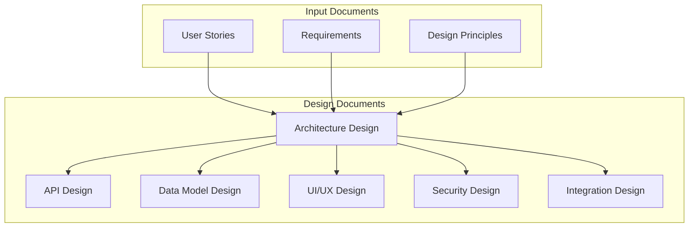
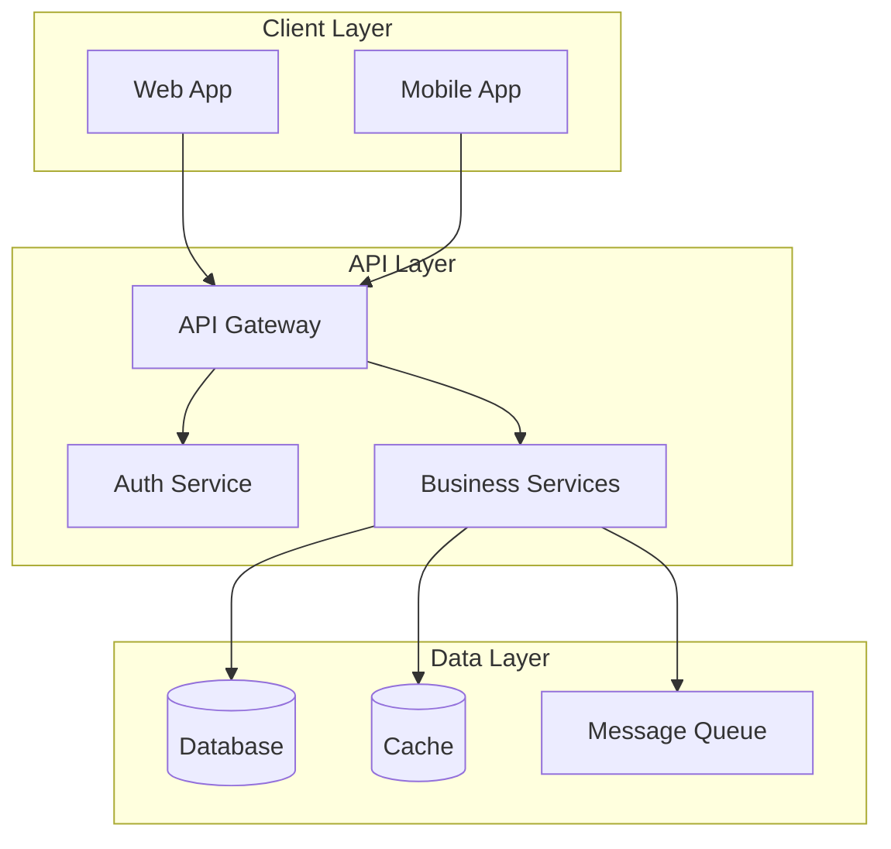
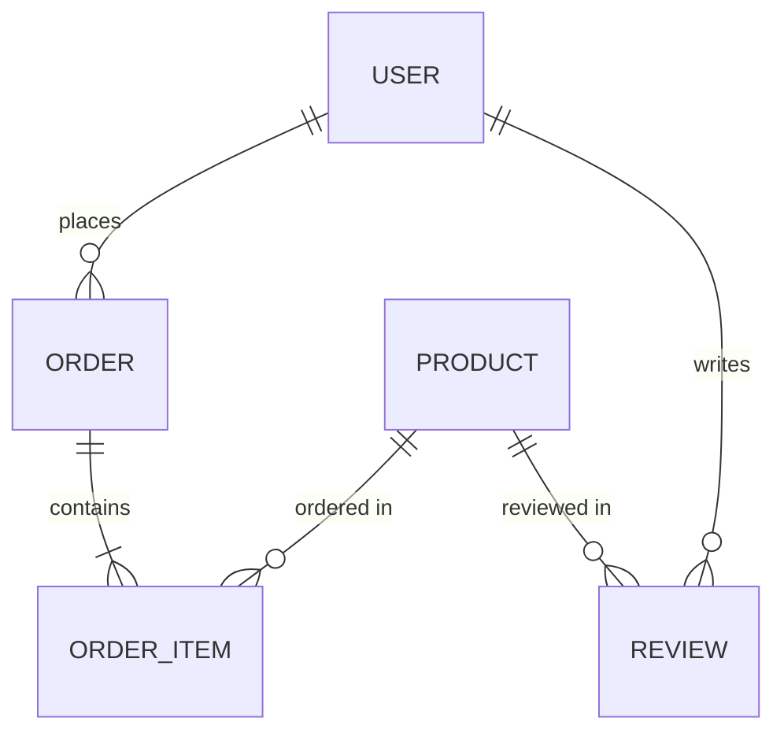
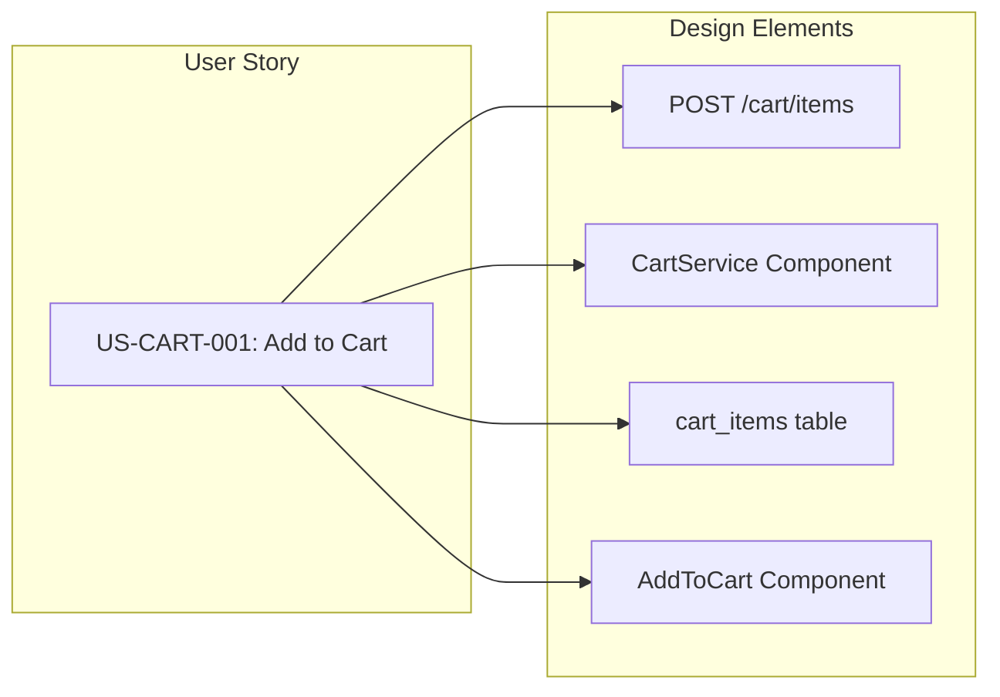
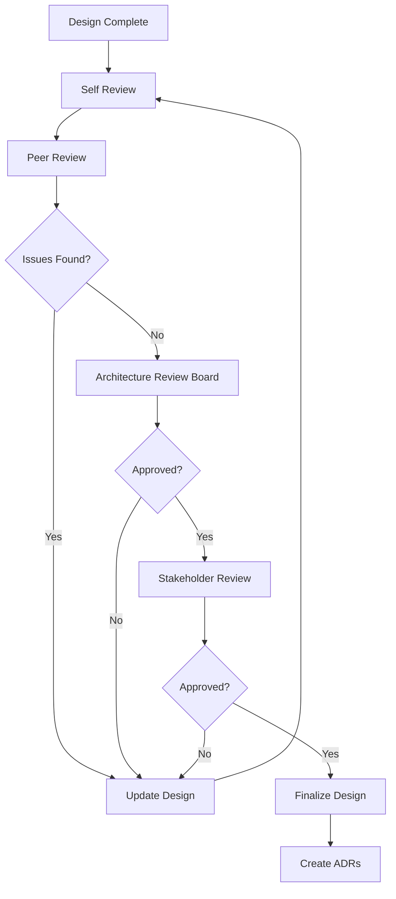
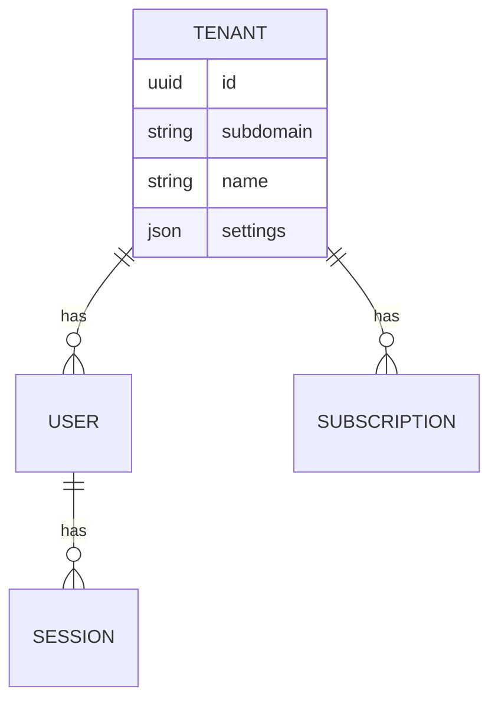
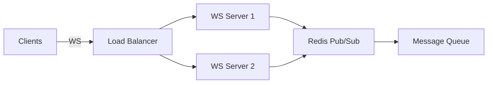
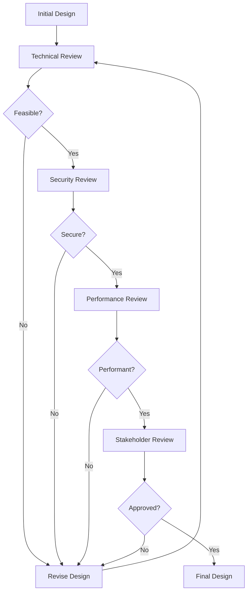

# Requirements to Design Documentation: Complete Transformation Guide

**Version:** 1.0  
**Date:** 2025-07-17  
**Purpose:** This guide provides a systematic approach for transforming Requirements and User Stories into comprehensive Application Design Documentation, including AI prompts, workflows, and best practices for creating complete system designs.

## Table of Contents

1. [Overview](#1-overview)
2. [The Design Documentation Process](#2-the-design-documentation-process)
3. [AI Prompts for Design Generation](#3-ai-prompts-for-design-generation)
4. [Design Document Types and Structure](#4-design-document-types-and-structure)
5. [Mapping Requirements to Design](#5-mapping-requirements-to-design)
6. [Creating Complete Design Documentation](#6-creating-complete-design-documentation)
7. [Design Validation and Review](#7-design-validation-and-review)
8. [Tools and Automation](#8-tools-and-automation)
9. [Common Patterns and Examples](#9-common-patterns-and-examples)
10. [Best Practices and Guidelines](#10-best-practices-and-guidelines)

## 1. Overview

### 1.1 From Requirements to Design

The transformation flow:



### 1.2 Design Document Categories

Based on Application_Design_Principles.md, we create:

1. **System Architecture** - High-level system design
2. **API Specification** - Interface definitions
3. **Data Model Design** - Database and data structures
4. **Component Design** - Detailed component specifications
5. **UI/UX Design** - User interface specifications
6. **Security Architecture** - Security measures and protocols
7. **Integration Design** - External system interfaces
8. **Deployment Architecture** - Infrastructure and deployment

### 1.3 Why Comprehensive Design Matters

- **Clarity**: Everyone understands the system
- **Consistency**: Unified approach across teams
- **Traceability**: Design traces to requirements
- **Quality**: Issues caught before coding
- **Documentation**: Long-term maintenance reference

## 2. The Design Documentation Process

### 2.1 High-Level Workflow

```mermaid
graph LR
    A[Gather Inputs] --> B[Analyze Requirements]
    B --> C[Apply Design Principles]
    C --> D[Create Architecture]
    D --> E[Detail Components]
    E --> F[Define Interfaces]
    F --> G[Specify Data Models]
    G --> H[Design Security]
    H --> I[Validate Design]
    I --> J[Review & Approve]
```



### 2.2 Step-by-Step Process

#### Step 1: Gather and Organize Inputs
```bash
design-inputs/
├── requirements/
│   ├── REQ-FUNC-*.xml     # Functional requirements
│   ├── REQ-NFUNC-*.xml    # Non-functional requirements
│   └── REQ-TECH-*.xml     # Technical requirements
├── user-stories/
│   ├── epics/             # High-level stories
│   └── features/          # Detailed stories
└── principles/
    └── Application_Design_Principles.md
```

#### Step 2: Create Design Structure
```bash
design-documentation/
├── 01_System_Architecture.md
├── 02_API_Specification.md
├── 03_Data_Model.md
├── 04_Component_Design.md
├── 05_UI_UX_Design.md
├── 06_Security_Architecture.md
├── 07_Integration_Design.md
├── 08_Deployment_Architecture.md
├── diagrams/
│   ├── architecture/
│   ├── data-models/
│   └── ui-mockups/
└── decisions/
    └── ADR-*.md           # Architecture Decision Records
```

## 3. AI Prompts for Design Generation

### 3.1 Complete System Design Generation

```markdown
## Prompt: Generate Complete Application Design Documentation

Study all the requirements in [requirements directory], user stories in [user-stories directory], 
and the Application_Design_Principles.md document.

Create comprehensive application design documentation that includes:

1. **System Architecture Document** covering:
   - High-level system overview with architectural diagrams
   - Component breakdown and responsibilities
   - Technology stack decisions with rationale
   - Architectural patterns (microservices, monolithic, etc.)
   - System boundaries and interfaces
   - Scalability and performance considerations

2. **API Specification** including:
   - RESTful API design following OpenAPI 3.0
   - GraphQL schema if applicable
   - Authentication and authorization flows
   - Request/response formats with examples
   - Error handling standards
   - Versioning strategy

3. **Data Model Design** with:
   - Conceptual data model (entities and relationships)
   - Logical data model (normalized structure)
   - Physical data model (database-specific)
   - Data flow diagrams
   - Data retention and archival policies
   - Performance optimization strategies

4. **Component Design** detailing:
   - Each major component's responsibilities
   - Internal structure and patterns
   - Dependencies and interfaces
   - State management approach
   - Error handling and recovery

5. **UI/UX Design** specifications:
   - User flow diagrams for each major feature
   - Wireframes for key screens
   - Component library definition
   - Responsive design approach
   - Accessibility standards (WCAG 2.1)
   - Design system guidelines

6. **Security Architecture**:
   - Threat model and risk assessment
   - Authentication and authorization design
   - Data encryption (at rest and in transit)
   - Security headers and CORS policy
   - Audit logging strategy
   - Compliance requirements (GDPR, PCI, etc.)

7. **Integration Design**:
   - External system interfaces
   - Message formats and protocols
   - Error handling and retry strategies
   - Circuit breaker patterns
   - Monitoring and alerting

8. **Deployment Architecture**:
   - Infrastructure requirements
   - Container orchestration strategy
   - CI/CD pipeline design
   - Monitoring and observability
   - Disaster recovery plan

For each design document:
- Include relevant Mermaid diagrams
- Reference source requirements with IDs
- Follow the structure from Application_Design_Principles.md
- Provide clear rationale for design decisions
- Include alternatives considered
```

### 3.2 Architecture Design from Requirements

```markdown
## Prompt: Generate System Architecture from Requirements

Analyze all functional requirements (REQ-FUNC-*), non-functional requirements (REQ-NFUNC-*), 
and technical requirements (REQ-TECH-*).

Create a System Architecture document that:

1. **Derives architecture from requirements**:
   - Map each requirement to architectural decisions
   - Show how NFRs drive architectural patterns
   - Explain technology choices based on requirements

2. **Defines system structure**:
   - Layer architecture (presentation, business, data)
   - Component decomposition
   - Service boundaries for microservices
   - Shared libraries and utilities

3. **Addresses quality attributes**:
   - Performance: How architecture meets response time requirements
   - Scalability: Horizontal/vertical scaling approach
   - Security: Defense in depth implementation
   - Reliability: Fault tolerance and recovery
   - Maintainability: Modularity and separation of concerns

4. **Creates architectural views**:
   - Logical view (functionality)
   - Process view (runtime behavior)
   - Development view (code organization)
   - Physical view (deployment)
   - Use case view (scenarios)

Include C4 model diagrams:
- Context diagram
- Container diagram
- Component diagrams for critical parts
- Code diagrams where helpful

Reference specific requirements throughout and show traceability.
```

### 3.3 API Design from User Stories

```markdown
## Prompt: Design APIs from User Stories and Requirements

Using all user stories and functional requirements, design a comprehensive API that:

1. **Covers all user interactions**:
   - Extract actions from user stories
   - Map to RESTful resources and endpoints
   - Define request/response payloads
   - Include pagination, filtering, sorting

2. **Follows API design principles**:
   - RESTful conventions (or GraphQL if specified)
   - Consistent naming and structure
   - HATEOAS where appropriate
   - Versioning strategy

3. **Addresses non-functional requirements**:
   - Rate limiting based on performance requirements
   - Caching strategies for response time goals
   - Bulk operations for efficiency
   - Async operations for long-running tasks

4. **Includes comprehensive examples**:
   - Success scenarios from acceptance criteria
   - Error cases and responses
   - Edge cases handling
   - Sample cURL commands

Generate OpenAPI 3.0 specification with:
- Complete endpoint definitions
- Schema definitions for all models
- Authentication/authorization details
- Response codes and error formats

Group endpoints logically by resource/feature area.
```

### 3.4 Data Model Design from Requirements

```markdown
## Prompt: Create Data Model from Requirements

Analyze all requirements and user stories to design a complete data model:

1. **Extract entities from requirements**:
   - Identify all nouns that represent data
   - Determine relationships from business rules
   - Define attributes from functional requirements
   - Add audit fields from compliance requirements

2. **Design for performance requirements**:
   - Indexing strategy based on query patterns
   - Denormalization where needed for speed
   - Partitioning for large datasets
   - Caching layers design

3. **Ensure data integrity**:
   - Primary and foreign keys
   - Unique constraints from business rules
   - Check constraints for validation
   - Triggers for complex rules

4. **Plan for scalability**:
   - Sharding strategy if needed
   - Read replicas for reporting
   - Archive strategy for old data
   - Growth projections

Create:
- ER diagrams showing all entities and relationships
- Table definitions with all columns and types
- Index definitions with rationale
- Data migration plan from any existing system
- Sample data for testing

Map each table/field back to source requirements.
```

### 3.5 UI/UX Design from User Stories

```markdown
## Prompt: Design User Interface from Stories and Requirements

Create comprehensive UI/UX design documentation by:

1. **Analyzing user stories for UI needs**:
   - Extract all user interactions
   - Identify screen/page requirements
   - Map user journeys from stories
   - Define component needs

2. **Applying design principles**:
   - Consistency across the application
   - Responsive design for all devices
   - Accessibility standards (WCAG 2.1)
   - Performance (lazy loading, etc.)

3. **Creating design specifications**:
   - Information architecture
   - Navigation structure
   - Page layouts and grids
   - Component library
   - Interaction patterns
   - Micro-interactions

4. **Addressing requirements**:
   - Form validations from business rules
   - Error states from requirements
   - Loading states for performance
   - Empty states design

Deliver:
- User flow diagrams for major features
- Wireframes for all unique pages
- Component specifications
- Style guide (colors, typography, spacing)
- Responsive breakpoints
- Accessibility checklist

Reference user stories and acceptance criteria throughout.
```

### 3.6 Security Design from Requirements

```markdown
## Prompt: Create Security Architecture

Based on security requirements, compliance needs, and identified risks in user stories:

1. **Design authentication system**:
   - Method based on requirements (JWT, OAuth, etc.)
   - Session management approach
   - Password policies from requirements
   - Multi-factor authentication if required

2. **Design authorization model**:
   - Role-based or attribute-based
   - Permission granularity from stories
   - API authorization strategy
   - UI element visibility rules

3. **Data protection design**:
   - Encryption at rest approach
   - Encryption in transit (TLS/SSL)
   - Key management strategy
   - PII handling procedures

4. **Security controls**:
   - Input validation strategy
   - Output encoding approach
   - CSRF protection
   - XSS prevention
   - SQL injection prevention

5. **Compliance measures**:
   - GDPR data handling if required
   - PCI compliance for payments
   - HIPAA for healthcare data
   - Audit logging design

Create:
- Threat model diagram
- Security architecture diagram
- Authentication flow diagrams
- Authorization matrix
- Encryption key hierarchy
- Incident response plan

Map all security measures to specific requirements and compliance needs.
```

## 4. Design Document Types and Structure

### 4.1 System Architecture Document

```markdown
# System Architecture

## 1. Executive Summary
Brief overview of the system architecture

## 2. Architectural Goals and Constraints
- Business goals driving architecture
- Technical constraints
- Assumptions

## 3. System Overview


## 4. Architectural Patterns
- Chosen patterns and rationale
- Alternative patterns considered

## 5. Technology Stack
- Languages and frameworks
- Databases and storage
- Infrastructure and cloud services

## 6. Component Architecture
Detailed breakdown of each component

## 7. Quality Attributes
How architecture addresses NFRs

## 8. Architecture Decisions
Key decisions and trade-offs
```

### 4.2 API Specification Structure

```yaml
# api-specification.yaml
openapi: 3.0.0
info:
  title: Application API
  version: 1.0.0
  description: |
    API specification derived from requirements:
    - REQ-FUNC-001: User management
    - REQ-FUNC-002: Shopping cart
    
servers:
  - url: https://api.example.com/v1
    description: Production server

components:
  securitySchemes:
    bearerAuth:
      type: http
      scheme: bearer
      bearerFormat: JWT

paths:
  /users:
    get:
      summary: List users
      description: |
        Implements REQ-FUNC-001: User listing
        From US-USER-001: View user list
      parameters:
        - name: page
          in: query
          schema:
            type: integer
      responses:
        200:
          description: User list
          content:
            application/json:
              schema:
                type: array
                items:
                  $ref: '#/components/schemas/User'
```

### 4.3 Data Model Document Structure

```markdown
# Data Model Design

## 1. Conceptual Model
High-level entities and relationships



## 2. Logical Model
Normalized table structure

## 3. Physical Model
Database-specific implementation

## 4. Data Dictionary
| Table | Column | Type | Description | Source Req |
|-------|--------|------|-------------|------------|
| users | id | UUID | Primary key | REQ-DATA-001 |
| users | email | VARCHAR(255) | User email | REQ-FUNC-001 |

## 5. Indexing Strategy
Performance optimization indexes

## 6. Data Integrity Rules
Constraints and validations
```

## 5. Mapping Requirements to Design

### 5.1 Requirement to Design Traceability

| Requirement ID | Design Document | Section | Design Element |
|----------------|-----------------|---------|----------------|
| REQ-FUNC-001 | System Architecture | 6.2 | User Service Component |
| REQ-FUNC-001 | API Specification | /users | User Management API |
| REQ-FUNC-001 | Data Model | 3.1 | Users Table |
| REQ-PERF-001 | System Architecture | 7.1 | Caching Strategy |
| REQ-SEC-001 | Security Architecture | 4.1 | Authentication Design |

### 5.2 User Story to Design Mapping



### 5.3 Design Decision Record

```markdown
# ADR-001: Microservices Architecture

## Status
Accepted

## Context
- REQ-SCALE-001 requires horizontal scaling
- REQ-PERF-001 requires <200ms response time
- Multiple teams will develop different features

## Decision
Adopt microservices architecture with:
- Service per major domain
- API Gateway for routing
- Event-driven communication

## Consequences
- Increased complexity
- Better scalability
- Independent deployments
- Need service mesh for management
```

## 6. Creating Complete Design Documentation

### 6.1 Document Generation Workflow

```python
# generate_design_docs.py
import os
import json
from pathlib import Path

class DesignDocGenerator:
    def __init__(self, req_dir, story_dir, principles_file):
        self.requirements = self.load_requirements(req_dir)
        self.stories = self.load_stories(story_dir)
        self.principles = self.load_principles(principles_file)
        
    def generate_all_documents(self):
        """Generate all design documents"""
        self.generate_architecture()
        self.generate_api_spec()
        self.generate_data_model()
        self.generate_component_design()
        self.generate_ui_design()
        self.generate_security_arch()
        self.generate_integration_design()
        self.generate_deployment_arch()
        
    def generate_architecture(self):
        """Generate system architecture from requirements"""
        arch_doc = {
            'title': 'System Architecture',
            'sections': []
        }
        
        # Extract architectural requirements
        arch_reqs = self.filter_requirements('architectural')
        perf_reqs = self.filter_requirements('performance')
        scale_reqs = self.filter_requirements('scalability')
        
        # Determine architecture style
        if self.needs_microservices(scale_reqs):
            arch_doc['style'] = 'microservices'
        else:
            arch_doc['style'] = 'modular-monolith'
            
        # Generate components from functional requirements
        components = self.extract_components()
        arch_doc['components'] = components
        
        # Apply design principles
        arch_doc = self.apply_principles(arch_doc)
        
        # Generate document
        self.write_architecture_doc(arch_doc)
        
    def extract_components(self):
        """Extract components from requirements"""
        components = []
        
        # Group requirements by domain
        domains = self.group_by_domain(self.requirements)
        
        for domain, reqs in domains.items():
            component = {
                'name': f"{domain}Service",
                'responsibilities': [],
                'requirements': [r['id'] for r in reqs],
                'interfaces': self.extract_interfaces(reqs),
                'dependencies': self.extract_dependencies(reqs)
            }
            components.append(component)
            
        return components
        
    def generate_api_spec(self):
        """Generate OpenAPI spec from requirements and stories"""
        spec = {
            'openapi': '3.0.0',
            'info': {
                'title': 'Application API',
                'version': '1.0.0'
            },
            'paths': {}
        }
        
        # Extract API endpoints from user stories
        for story in self.stories:
            endpoints = self.extract_endpoints(story)
            for endpoint in endpoints:
                path = endpoint['path']
                method = endpoint['method']
                
                if path not in spec['paths']:
                    spec['paths'][path] = {}
                    
                spec['paths'][path][method] = {
                    'summary': endpoint['summary'],
                    'description': f"Implements {story['id']}: {story['title']}",
                    'requestBody': self.generate_request_schema(endpoint),
                    'responses': self.generate_responses(endpoint)
                }
                
        self.write_openapi_spec(spec)
```

### 6.2 Design Validation Script

```bash
#!/bin/bash
# validate_design.sh

echo "Validating Design Documentation..."

# Check requirement coverage
echo "=== Requirement Coverage ==="
for req in requirements/*.xml; do
    req_id=$(grep -o 'REQ-[A-Z]*-[0-9]*' "$req" | head -1)
    
    # Check if requirement is referenced in design docs
    if grep -r "$req_id" design-documentation/ > /dev/null; then
        echo "✅ $req_id - Covered in design"
    else
        echo "❌ $req_id - Not found in design"
    fi
done

# Validate diagrams
echo -e "\n=== Diagram Validation ==="
find design-documentation -name "*.md" -exec grep -l "mermaid" {} \; | while read file; do
    # Extract and validate Mermaid syntax
    awk '/```mermaid/,/```/' "$file" | mermaid-cli -c
    if [ $? -eq 0 ]; then
        echo "✅ $file - Valid diagrams"
    else
        echo "❌ $file - Invalid diagram syntax"
    fi
done

# Check cross-references
echo -e "\n=== Cross-Reference Check ==="
python3 check_design_references.py
```

### 6.3 Design Review Checklist Generator

```python
# generate_review_checklist.py

def generate_design_review_checklist(design_docs_dir):
    """Generate review checklist based on requirements"""
    
    checklist = {
        'Architecture Review': [
            'All functional requirements mapped to components',
            'Non-functional requirements addressed',
            'Scalability approach defined',
            'Security architecture included',
            'Technology choices justified',
            'Alternative designs documented'
        ],
        'API Review': [
            'All user stories have corresponding endpoints',
            'Consistent naming conventions',
            'Proper HTTP methods used',
            'Error responses defined',
            'Versioning strategy clear',
            'Authentication/authorization specified'
        ],
        'Data Model Review': [
            'All entities from requirements included',
            'Relationships properly defined',
            'Indexes for performance requirements',
            'Data integrity constraints',
            'Audit fields included',
            'Growth considerations'
        ],
        'Security Review': [
            'Threat model complete',
            'Authentication design robust',
            'Authorization model scalable',
            'Encryption standards met',
            'Compliance requirements addressed',
            'Security testing approach defined'
        ]
    }
    
    # Generate markdown checklist
    with open('design-review-checklist.md', 'w') as f:
        f.write('# Design Documentation Review Checklist\n\n')
        
        for section, items in checklist.items():
            f.write(f'## {section}\n\n')
            for item in items:
                f.write(f'- [ ] {item}\n')
            f.write('\n')
            
        f.write('## Requirement Traceability\n\n')
        f.write('- [ ] All requirements traced to design elements\n')
        f.write('- [ ] No orphaned requirements\n')
        f.write('- [ ] Design decisions justified\n')
```

## 7. Design Validation and Review

### 7.1 Validation Criteria

```markdown
## Design Validation Checklist

### Completeness
- [ ] All requirements addressed
- [ ] All user stories mapped
- [ ] All acceptance criteria achievable
- [ ] No gaps in functionality

### Consistency
- [ ] Naming conventions followed
- [ ] Patterns used consistently
- [ ] No conflicting designs
- [ ] Principles applied throughout

### Feasibility
- [ ] Technically implementable
- [ ] Performance goals achievable
- [ ] Security requirements met
- [ ] Within resource constraints

### Quality
- [ ] Clear and unambiguous
- [ ] Properly documented
- [ ] Diagrams accurate
- [ ] Examples provided
```

### 7.2 Review Process



## 8. Tools and Automation

### 8.1 Design Document Generator

```javascript
// design-generator.js
const fs = require('fs');
const path = require('path');
const yaml = require('js-yaml');

class DesignGenerator {
    constructor(config) {
        this.config = config;
        this.requirements = this.loadRequirements();
        this.stories = this.loadStories();
        this.principles = this.loadPrinciples();
    }
    
    async generateDesignSuite() {
        console.log('Generating design documentation suite...');
        
        // Generate each document type
        await this.generateArchitecture();
        await this.generateAPISpec();
        await this.generateDataModel();
        await this.generateComponentDesigns();
        await this.generateUIDesign();
        await this.generateSecurityDesign();
        
        // Generate traceability matrix
        await this.generateTraceabilityMatrix();
        
        // Generate review materials
        await this.generateReviewPackage();
        
        console.log('Design documentation complete!');
    }
    
    async generateArchitecture() {
        const template = this.loadTemplate('architecture');
        const data = {
            requirements: this.requirements,
            patterns: this.derivePatterns(),
            components: this.deriveComponents(),
            quality: this.deriveQualityAttributes()
        };
        
        const content = this.renderTemplate(template, data);
        this.writeDocument('01_System_Architecture.md', content);
    }
    
    derivePatterns() {
        // Analyze requirements to determine patterns
        const patterns = [];
        
        // Check for microservices need
        if (this.hasHighScalability() || this.hasTeamAutonomy()) {
            patterns.push({
                name: 'Microservices',
                rationale: 'High scalability and team autonomy requirements'
            });
        }
        
        // Check for event-driven need
        if (this.hasAsyncRequirements()) {
            patterns.push({
                name: 'Event-Driven',
                rationale: 'Asynchronous processing requirements'
            });
        }
        
        return patterns;
    }
    
    async generateAPISpec() {
        const spec = {
            openapi: '3.0.0',
            info: {
                title: 'Application API',
                version: '1.0.0',
                description: 'API derived from requirements and user stories'
            },
            servers: this.deriveServers(),
            security: this.deriveSecurity(),
            paths: this.derivePaths(),
            components: {
                schemas: this.deriveSchemas(),
                securitySchemes: this.deriveSecuritySchemes()
            }
        };
        
        const yamlStr = yaml.dump(spec);
        this.writeDocument('02_API_Specification.yaml', yamlStr);
    }
    
    derivePaths() {
        const paths = {};
        
        // Extract paths from user stories and requirements
        this.stories.forEach(story => {
            const resources = this.extractResources(story);
            resources.forEach(resource => {
                const path = `/${resource.name}`;
                paths[path] = this.generateResourceOperations(resource, story);
            });
        });
        
        return paths;
    }
}

// Usage
const generator = new DesignGenerator({
    requirementsDir: './requirements',
    storiesDir: './user-stories',
    principlesFile: './Application_Design_Principles.md',
    outputDir: './design-documentation'
});

generator.generateDesignSuite();
```

### 8.2 Requirement to Design Mapper

```python
# requirement_design_mapper.py
import xml.etree.ElementTree as ET
import json
from collections import defaultdict

class RequirementDesignMapper:
    def __init__(self):
        self.mappings = defaultdict(list)
        
    def map_requirement_to_design(self, req_file, design_docs):
        """Map requirements to design elements"""
        tree = ET.parse(req_file)
        root = tree.getroot()
        
        req_id = root.find('.//RequirementID').text
        req_type = root.find('.//Type').text
        
        # Map based on requirement type
        if req_type == 'Functional':
            self.map_functional_requirement(req_id, design_docs)
        elif req_type == 'NonFunctional':
            self.map_nonfunctional_requirement(req_id, design_docs)
        elif req_type == 'Technical':
            self.map_technical_requirement(req_id, design_docs)
            
    def map_functional_requirement(self, req_id, design_docs):
        """Map functional requirements to design elements"""
        
        # Should appear in:
        # - Architecture (as component)
        # - API Spec (as endpoint)
        # - Data Model (as entity)
        # - Component Design (detailed)
        
        mappings = [
            ('System Architecture', 'Component'),
            ('API Specification', 'Endpoint'),
            ('Data Model', 'Entity'),
            ('Component Design', 'Detailed Design')
        ]
        
        for doc, element in mappings:
            if self.requirement_in_document(req_id, doc):
                self.mappings[req_id].append({
                    'document': doc,
                    'element': element,
                    'status': 'found'
                })
            else:
                self.mappings[req_id].append({
                    'document': doc,
                    'element': element,
                    'status': 'missing'
                })
                
    def generate_mapping_report(self):
        """Generate traceability report"""
        report = {
            'summary': {
                'total_requirements': len(self.mappings),
                'fully_mapped': 0,
                'partially_mapped': 0,
                'unmapped': 0
            },
            'details': []
        }
        
        for req_id, mappings in self.mappings.items():
            found = sum(1 for m in mappings if m['status'] == 'found')
            total = len(mappings)
            
            if found == total:
                report['summary']['fully_mapped'] += 1
            elif found > 0:
                report['summary']['partially_mapped'] += 1
            else:
                report['summary']['unmapped'] += 1
                
            report['details'].append({
                'requirement': req_id,
                'coverage': f"{found}/{total}",
                'mappings': mappings
            })
            
        return report
```

## 9. Common Patterns and Examples

### 9.1 E-commerce Design Pattern

Requirements → Design mapping for e-commerce:

```yaml
Requirements:
  - REQ-FUNC-001: Shopping cart management
  - REQ-FUNC-002: Product catalog
  - REQ-FUNC-003: Order processing
  - REQ-PERF-001: <2s page load
  - REQ-SCALE-001: 10K concurrent users

Resulting Design:
  Architecture:
    - Microservices: Cart, Catalog, Order services
    - API Gateway for routing
    - Redis for cart session storage
    - PostgreSQL for persistent data
    - Elasticsearch for product search
    
  API Design:
    - /api/v1/cart/* - Cart operations
    - /api/v1/products/* - Catalog browsing
    - /api/v1/orders/* - Order management
    
  Data Model:
    - Products table with full-text search
    - Cart with TTL in Redis
    - Orders with state machine
    
  Performance:
    - CDN for static assets
    - Database read replicas
    - Caching at multiple levels
```

### 9.2 SaaS Platform Pattern

```markdown
## Multi-tenant SaaS Design

### Derived from Requirements:
- REQ-FUNC-010: Multi-tenant isolation
- REQ-SEC-005: Data separation
- REQ-SCALE-002: 1000+ tenants

### Architecture Decisions:
1. **Database Strategy**: Schema-per-tenant
   - Rationale: Strong isolation, easier compliance
   - Trade-off: More complex migrations

2. **API Design**: Tenant in subdomain
   - Example: `https://tenant1.api.example.com`
   - Rationale: Clear separation, easier routing

3. **Authentication**: Centralized SSO
   - Shared authentication service
   - Tenant-specific authorization

### Data Model:

```

### 9.3 Real-time Application Pattern

```markdown
## Real-time Features Design

### From Requirements:
- US-CHAT-001: Real-time messaging
- REQ-PERF-005: <100ms message delivery
- REQ-SCALE-003: 50K concurrent connections

### Design Solutions:

1. **WebSocket Architecture**:


2. **Message Flow Design**:
   - Client → WebSocket Server
   - Server → Redis Pub/Sub
   - Redis → All connected servers
   - Servers → Relevant clients

3. **Scaling Strategy**:
   - Sticky sessions for WebSocket
   - Redis for inter-server communication
   - Horizontal scaling of WS servers
```

## 10. Best Practices and Guidelines

### 10.1 Design Documentation Best Practices

#### Do's ✅

1. **Start with Requirements**
   - Every design decision traces to requirements
   - Use requirement IDs throughout documents
   - Justify all architectural choices

2. **Be Visual**
   - Use diagrams liberally
   - Show, don't just tell
   - Multiple views for complex systems

3. **Document Decisions**
   - Use Architecture Decision Records
   - Include alternatives considered
   - Explain trade-offs made

4. **Think Implementation**
   - Design should guide developers
   - Include enough detail to build
   - Provide clear examples

5. **Consider Operations**
   - Design for monitoring
   - Plan for debugging
   - Include deployment considerations

#### Don'ts ❌

1. **Don't Over-Design**
   - Avoid unnecessary complexity
   - Don't design for imaginary requirements
   - YAGNI principle applies

2. **Don't Skip NFRs**
   - Performance matters from day one
   - Security can't be bolted on
   - Scalability needs upfront design

3. **Don't Work in Isolation**
   - Collaborate with developers
   - Review with stakeholders
   - Validate with architects

4. **Don't Forget Maintenance**
   - Design for changeability
   - Document for future developers
   - Consider upgrade paths

### 10.2 Quality Checklist

```markdown
## Design Quality Checklist

### Clarity
- [ ] Can a new developer understand the design?
- [ ] Are all acronyms defined?
- [ ] Are diagrams self-explanatory?
- [ ] Is the writing concise and clear?

### Completeness
- [ ] All requirements addressed?
- [ ] All user stories achievable?
- [ ] Edge cases considered?
- [ ] Error scenarios designed?

### Consistency
- [ ] Naming conventions consistent?
- [ ] Patterns used uniformly?
- [ ] Style consistent throughout?
- [ ] No contradictions between sections?

### Correctness
- [ ] Technical approach sound?
- [ ] Performance calculations valid?
- [ ] Security measures adequate?
- [ ] Scalability approach realistic?

### Constructability
- [ ] Can be built with current team?
- [ ] Technology choices available?
- [ ] Timeline realistic?
- [ ] Resources sufficient?
```

### 10.3 Review and Iteration



## Conclusion

Creating comprehensive design documentation from requirements and user stories is a systematic process that:

1. **Ensures Completeness**: All requirements translate to design
2. **Maintains Traceability**: Clear links throughout
3. **Enables Implementation**: Developers have clear guidance
4. **Supports Quality**: Issues caught before coding
5. **Facilitates Communication**: Everyone understands the system

By following this guide and using the provided prompts and tools, teams can transform their requirements into design documentation that serves as a solid foundation for successful implementation.

---

**Quick Reference**

```bash
# Generate all design documents
./generate-design-docs.sh

# Validate requirement coverage
python check_design_coverage.py

# Create review package
./prepare-design-review.sh

# Generate traceability matrix
python generate_traceability.py > traceability-matrix.md
```

**Essential AI Prompts**:
1. "Study all requirements and create comprehensive design documentation..."
2. "Generate system architecture from functional and non-functional requirements..."
3. "Design APIs that implement all user stories..."
4. "Create data models that support all requirements..."

**Related Documents**:
- [Application_Design_Principles.md](./Application_Design_Principles.md)
- [Requirements_Template.xml](./Requirement_Template.xml)
- [User_Story_Template.xml](./User_Story_Template.xml)
- [Implementation_Guide_Template.xml](./Implementation_Guide_Template.xml)