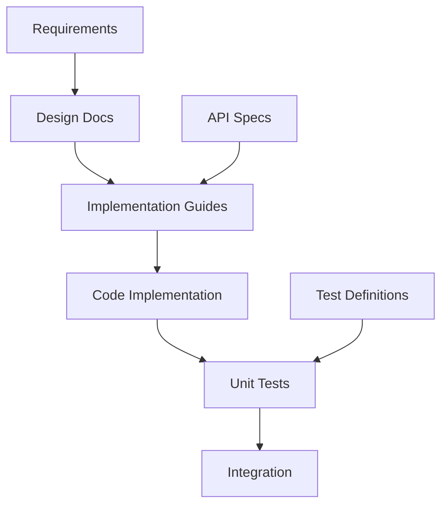
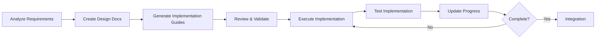

# Implementation Guide Usage

**Version:** 1.0  
**Date:** 2025-07-17  
**Purpose:** This guide provides practical instructions for using Implementation Guide XML templates to systematically transform software designs into working code, including folder structure, workflow, and AI-assisted generation.

## Table of Contents

1. [Overview](#1-overview)
2. [Folder Structure](#2-folder-structure)
3. [Implementation Workflow](#3-implementation-workflow)
4. [Using the XML Template](#4-using-the-xml-template)
5. [AI Prompts for Implementation Generation](#5-ai-prompts-for-implementation-generation)
6. [Phase-Based Development](#6-phase-based-development)
7. [Tracking Progress](#7-tracking-progress)
8. [Integration with Development Tools](#8-integration-with-development-tools)
9. [Common Patterns](#9-common-patterns)
10. [Best Practices](#10-best-practices)

## 1. Overview

### 1.1 Purpose of Implementation Guides

Implementation guides bridge the gap between design and code by providing:
- **Structured approach** to building complex systems
- **Clear dependencies** between components
- **Traceable implementation** linked to requirements
- **Consistent patterns** across the team
- **Progress tracking** for project management

### 1.2 Key Components



### 1.3 When to Create Implementation Guides

- **New features**: Break down complex features into tasks
- **System refactoring**: Plan systematic changes
- **Technical debt**: Organize cleanup efforts
- **Onboarding**: Help new developers understand the system
- **Compliance**: Document implementation for audits

## 2. Folder Structure

### 2.1 Standard Implementation Organization

```
project-root/
├── docs/                           # All documentation
│   ├── requirements/               # Business requirements
│   │   ├── functional/
│   │   └── non-functional/
│   ├── design/                     # Design documents
│   │   ├── architecture/
│   │   ├── api/
│   │   └── database/
│   └── implementation/             # Implementation guides
│       ├── templates/
│       │   └── Implementation_Guide_Template.xml
│       ├── guides/                 # Individual guides
│       │   ├── phase-1-foundation/
│       │   │   ├── 001_Database_Setup.xml
│       │   │   ├── 002_Core_Models.xml
│       │   │   └── 003_Base_API.xml
│       │   ├── phase-2-features/
│       │   │   ├── 101_User_Management.xml
│       │   │   ├── 102_Authentication.xml
│       │   │   └── 103_Authorization.xml
│       │   └── phase-3-integration/
│       │       ├── 201_External_APIs.xml
│       │       └── 202_Messaging.xml
│       └── tracking/               # Progress tracking
│           ├── implementation-log.md
│           └── completion-status.json
├── src/                            # Source code
├── tests/                          # Test files
└── scripts/                        # Build and utility scripts
    └── implementation/
        ├── validate-guides.js
        └── generate-tasks.js
```

### 2.2 Guide Naming Conventions

```
[PHASE]_[SEQUENCE]_[COMPONENT]_[FEATURE].xml
```

Examples:
- `001_Database_Setup.xml` - Foundation phase
- `101_User_CRUD_Operations.xml` - Core features
- `201_Stripe_Payment_Integration.xml` - Integration phase

### 2.3 Organization by Development Methodology

#### Feature-Based Structure
```
implementation/guides/
├── user-management/
│   ├── 001_User_Model.xml
│   ├── 002_User_Service.xml
│   ├── 003_User_API.xml
│   └── 004_User_Tests.xml
├── authentication/
│   ├── 001_Auth_Models.xml
│   ├── 002_JWT_Service.xml
│   └── 003_Auth_Endpoints.xml
└── shopping-cart/
    ├── 001_Cart_Models.xml
    └── 002_Cart_Service.xml
```

#### Layer-Based Structure
```
implementation/guides/
├── data-layer/
│   ├── 001_Database_Schema.xml
│   ├── 002_Repositories.xml
│   └── 003_Migrations.xml
├── business-layer/
│   ├── 001_Domain_Models.xml
│   ├── 002_Services.xml
│   └── 003_Validators.xml
└── api-layer/
    ├── 001_REST_Endpoints.xml
    └── 002_GraphQL_Schema.xml
```

## 3. Implementation Workflow

### 3.1 Complete Workflow



### 3.2 Step-by-Step Process

1. **Gather Documentation**
   ```bash
   # Collect all relevant documents
   docs/requirements/*.md
   docs/design/*.md
   docs/api/*.yaml
   tests/unit/**/*.test.xml
   ```

2. **Analyze Dependencies**
   ```bash
   # Create dependency graph
   npm run analyze-dependencies
   
   # Output: dependency-graph.json
   ```

3. **Generate Implementation Guides**
   ```bash
   # Use AI to generate guides
   npm run generate-implementation-guides \
     --requirements docs/requirements \
     --design docs/design \
     --output docs/implementation/guides
   ```

4. **Validate Guides**
   ```bash
   # Check guide validity
   npm run validate-implementation-guides
   
   # Check dependencies
   npm run check-guide-dependencies
   ```

5. **Track Progress**
   ```bash
   # Update implementation status
   npm run update-implementation-status \
     --guide 001_Database_Setup.xml \
     --status completed
   ```

## 4. Using the XML Template

### 4.1 Basic Guide Structure

Start with the essential sections:

```xml
<?xml version="1.0" encoding="UTF-8"?>
<ImplementationGuide>
    <Metadata>
        <GuideID>AUTH_001_JWT_SERVICE</GuideID>
        <Title>JWT Authentication Service Implementation</Title>
        <Category>Core</Category>
        <Priority>High</Priority>
        <EstimatedTime>4 hours</EstimatedTime>
        <Description>
            Implement JWT-based authentication service with token 
            generation, validation, and refresh capabilities
        </Description>
        <Tags>authentication, security, jwt, backend</Tags>
    </Metadata>
    
    <DocumentationReferences>
        <Reference type="Requirements" href="docs/requirements/auth.md">
            Authentication Requirements
        </Reference>
        <Reference type="API" href="docs/api/auth-endpoints.yaml">
            Auth API Specification
        </Reference>
    </DocumentationReferences>
    
    <Prerequisites>
        <Prerequisite type="Guide" id="CORE_001_PROJECT_SETUP">
            Project structure and dependencies installed
        </Prerequisite>
        <Prerequisite type="Tool">
            Node.js 18+ with JWT library installed
        </Prerequisite>
    </Prerequisites>
</ImplementationGuide>
```

### 4.2 Defining Implementation Steps

Break down the implementation into logical steps:

```xml
<ImplementationSteps>
    <Step number="1" name="Service Structure">
        <Description>Create the authentication service class</Description>
        <Tasks>
            <Task type="file" path="src/services/AuthService.ts">
                <Description>Create service file</Description>
                <Code language="typescript"><![CDATA[
import jwt from 'jsonwebtoken';
import { User } from '../models/User';
import { TokenPayload } from '../types/auth';

export class AuthService {
    private readonly secret: string;
    private readonly expiresIn: string;
    
    constructor() {
        this.secret = process.env.JWT_SECRET || 'default-secret';
        this.expiresIn = process.env.JWT_EXPIRES_IN || '1h';
    }
}
                ]]></Code>
            </Task>
        </Tasks>
    </Step>
    
    <Step number="2" name="Token Generation">
        <Description>Implement token generation method</Description>
        <Tasks>
            <Task type="code" id="generate_token">
                <Description>Add generateToken method</Description>
                <Code language="typescript" file="src/services/AuthService.ts"><![CDATA[
public generateToken(user: User): string {
    const payload: TokenPayload = {
        id: user.id,
        email: user.email,
        roles: user.roles
    };
    
    return jwt.sign(payload, this.secret, {
        expiresIn: this.expiresIn,
        issuer: 'your-app-name'
    });
}
                ]]></Code>
            </Task>
        </Tasks>
    </Step>
</ImplementationSteps>
```

### 4.3 Including Test Requirements

Link implementation to tests:

```xml
<TestingRequirements>
    <TestReference>
        <TestID>AUTH_SERVICE_TOKEN_GENERATION</TestID>
        <TestFile>tests/unit/services/AuthService.test.xml</TestFile>
        <Description>Unit tests for token generation</Description>
    </TestReference>
    
    <TestCoverage>
        <MinimumCoverage>90</MinimumCoverage>
        <RequiredScenarios>
            <Scenario>Valid user token generation</Scenario>
            <Scenario>Token expiration handling</Scenario>
            <Scenario>Invalid secret key error</Scenario>
        </RequiredScenarios>
    </TestCoverage>
</TestingRequirements>
```

## 5. AI Prompts for Implementation Generation

### 5.1 Complete System Implementation

```markdown
## Prompt: Generate Complete Implementation Guide Set

Study the following documentation:
1. Requirements: [path/to/requirements/]
   - Functional requirements
   - Non-functional requirements
   - User stories
2. Design Documents: [path/to/design/]
   - System architecture
   - API specifications
   - Database schema
3. Test Definitions: [path/to/tests/]
   - Unit test specifications
   - Integration test plans

Generate a complete set of implementation guides that:
- Covers all system components
- Organized into logical phases (Foundation → Core → Features → Integration)
- Each guide follows the Implementation_Guide_Template.xml format
- Includes clear dependencies between guides
- Estimates realistic time for each task
- References relevant documentation
- Specifies test requirements

Output Structure:
Phase 1 - Foundation (Database, Core Infrastructure)
Phase 2 - Core Features (Essential Business Logic)
Phase 3 - Extended Features (Additional Functionality)
Phase 4 - Integration (External Systems)
Phase 5 - Optimization (Performance, Security)
```

### 5.2 Feature-Specific Implementation

```markdown
## Prompt: Generate Feature Implementation Guide

Analyze the following for the User Management feature:
1. Requirements:
   - Users can register with email/password
   - Email verification required
   - Password reset functionality
   - User profile management
   - Role-based access control

2. Design Specifications:
   - RESTful API endpoints
   - PostgreSQL database
   - JWT authentication
   - Redis for sessions

3. Existing Code:
   - Database connection setup
   - Base model classes
   - Authentication middleware

4. Test Requirements:
   - All endpoints must have tests
   - 90% code coverage minimum
   - Performance: < 200ms response time

Generate implementation guides for:
1. User database schema and models
2. User service layer with business logic
3. API endpoints for all operations
4. Email service integration
5. Session management
6. Role and permission system

Include:
- Step-by-step implementation
- Code examples
- Security considerations
- Performance optimizations
- Test requirements for each component
```

### 5.3 API Implementation from OpenAPI

```markdown
## Prompt: Generate API Implementation from OpenAPI Spec

Given the OpenAPI specification file: [api-spec.yaml]

Generate implementation guides that:
1. Create all defined endpoints
2. Implement request/response models
3. Add input validation
4. Include error handling
5. Set up authentication/authorization
6. Add rate limiting
7. Implement logging and monitoring

For each endpoint, include:
- Route definition
- Controller implementation
- Service layer logic
- Database operations
- Test scenarios
- Performance requirements

Organize by:
- Resource type (Users, Products, Orders)
- HTTP method (GET, POST, PUT, DELETE)
- Priority (Critical, High, Medium, Low)
```

### 5.4 Database Implementation

```markdown
## Prompt: Generate Database Implementation Guides

Based on the Entity Relationship Diagram and requirements:

Generate implementation guides for:
1. Initial database setup and configuration
2. Schema creation with tables and relationships
3. Indexes for performance optimization
4. Migration scripts
5. Seed data for development/testing
6. Database access layer (repositories/DAOs)
7. Connection pooling and optimization
8. Backup and recovery procedures

Include for each table:
- CREATE TABLE statements
- Foreign key relationships
- Indexes (primary, unique, performance)
- Constraints and validations
- Trigger functions if needed
- Sample data

Consider:
- Normalization requirements
- Performance requirements
- Scalability needs
- Data integrity rules
```

### 5.5 Microservice Implementation

```markdown
## Prompt: Generate Microservice Implementation Guides

For a microservices architecture with these services:
- User Service
- Product Service  
- Order Service
- Payment Service
- Notification Service

Generate implementation guides that include:
1. Service setup and configuration
2. Inter-service communication (REST/gRPC/MessageQueue)
3. Service discovery and registration
4. Circuit breakers and resilience
5. Distributed tracing
6. Health checks and monitoring
7. API gateway integration
8. Shared libraries and utilities

For each service:
- Define bounded context
- API contracts
- Database schema (if applicable)
- Message contracts
- Error handling strategy
- Deployment configuration
```

### 5.6 Refactoring Implementation

```markdown
## Prompt: Generate Refactoring Implementation Guide

Analyze the current codebase in [src/legacy/] and the target architecture in [docs/new-architecture.md]

Generate implementation guides for refactoring:
1. Identify components to refactor
2. Create transition plan maintaining backward compatibility
3. Extract and modularize business logic
4. Update data models incrementally
5. Migrate API endpoints
6. Update tests for new structure
7. Performance optimization
8. Deprecation strategy for old code

Include:
- Risk assessment for each change
- Rollback procedures
- Testing strategy during transition
- Feature flags for gradual rollout
- Performance benchmarks before/after
```

### 5.7 Security Implementation

```markdown
## Prompt: Generate Security Implementation Guides

Based on security requirements and OWASP guidelines:

Generate implementation guides for:
1. Authentication system (OAuth2/JWT)
2. Authorization and RBAC
3. Input validation and sanitization
4. SQL injection prevention
5. XSS protection
6. CSRF protection
7. API rate limiting
8. Encryption at rest and in transit
9. Security headers
10. Audit logging

For each security measure:
- Threat model addressed
- Implementation approach
- Configuration required
- Testing methodology
- Monitoring and alerts
- Incident response procedures
```

## 6. Phase-Based Development

### 6.1 Phase Organization

```xml
<!-- Phase Definition in Guide -->
<Metadata>
    <GuideID>P1_001_DATABASE_SETUP</GuideID>
    <Phase>1</Phase>
    <PhaseName>Foundation</PhaseName>
    <PhaseDescription>Core infrastructure and database setup</PhaseDescription>
</Metadata>
```

### 6.2 Typical Phase Structure

#### Phase 1: Foundation
```
- Environment setup
- Database initialization  
- Core configuration
- Logging setup
- Error handling framework
- Base classes and utilities
```

#### Phase 2: Core Features
```
- User management
- Authentication
- Authorization
- Core business entities
- Basic CRUD operations
```

#### Phase 3: Extended Features
```
- Advanced business logic
- Third-party integrations
- Reporting
- Notifications
- File handling
```

#### Phase 4: Integration
```
- External API integration
- Message queues
- Payment processing
- Email services
- Analytics
```

#### Phase 5: Optimization
```
- Performance tuning
- Caching implementation
- Database optimization
- Security hardening
- Monitoring setup
```

### 6.3 Phase Dependencies

```xml
<PhaseDependencies>
    <Phase number="1" name="Foundation">
        <Dependencies>None</Dependencies>
        <Deliverables>
            <Deliverable>Database ready</Deliverable>
            <Deliverable>Base project structure</Deliverable>
            <Deliverable>Configuration system</Deliverable>
        </Deliverables>
    </Phase>
    
    <Phase number="2" name="Core Features">
        <Dependencies>
            <Dependency>Phase 1 completed</Dependency>
        </Dependencies>
        <Deliverables>
            <Deliverable>User system functional</Deliverable>
            <Deliverable>Basic API endpoints</Deliverable>
        </Deliverables>
    </Phase>
</PhaseDependencies>
```

## 7. Tracking Progress

### 7.1 Progress Tracking File

```json
// implementation-progress.json
{
  "project": "MyApp",
  "startDate": "2024-01-01",
  "phases": [
    {
      "phase": 1,
      "name": "Foundation",
      "status": "completed",
      "completionDate": "2024-01-15",
      "guides": [
        {
          "id": "P1_001_DATABASE_SETUP",
          "status": "completed",
          "implementer": "john.doe",
          "startDate": "2024-01-01",
          "completionDate": "2024-01-03",
          "notes": "Used PostgreSQL 14"
        }
      ]
    },
    {
      "phase": 2,
      "name": "Core Features",
      "status": "in-progress",
      "guides": [
        {
          "id": "P2_001_USER_MODEL",
          "status": "completed",
          "implementer": "jane.smith",
          "completionDate": "2024-01-20"
        },
        {
          "id": "P2_002_USER_SERVICE",
          "status": "in-progress",
          "implementer": "jane.smith",
          "startDate": "2024-01-21",
          "estimatedCompletion": "2024-01-23"
        }
      ]
    }
  ]
}
```

### 7.2 Progress Visualization

```javascript
// scripts/visualize-progress.js
const progress = require('./implementation-progress.json');

function generateProgressReport() {
    const totalGuides = progress.phases.reduce((sum, phase) => 
        sum + phase.guides.length, 0
    );
    
    const completedGuides = progress.phases.reduce((sum, phase) => 
        sum + phase.guides.filter(g => g.status === 'completed').length, 0
    );
    
    console.log(`Progress: ${completedGuides}/${totalGuides} guides completed`);
    console.log(`Completion: ${(completedGuides/totalGuides*100).toFixed(1)}%`);
    
    // Generate Gantt chart or burn-down chart
    generateGanttChart(progress);
}
```

### 7.3 Status Dashboard

```markdown
# Implementation Status Dashboard

## Overall Progress
- **Total Guides**: 45
- **Completed**: 28 (62%)
- **In Progress**: 5 (11%)
- **Not Started**: 12 (27%)

## Phase Status
| Phase | Status | Progress | ETA |
|-------|--------|----------|-----|
| 1. Foundation | ✅ Completed | 100% | - |
| 2. Core Features | 🔄 In Progress | 75% | Jan 30 |
| 3. Extended Features | ⏳ Not Started | 0% | Feb 15 |
| 4. Integration | ⏳ Not Started | 0% | Mar 1 |

## Current Sprint
- **Sprint 5**: Jan 22 - Feb 5
- **Focus**: Completing User Management
- **Blockers**: Waiting for API spec approval

## Recent Completions
- ✅ P2_001_USER_MODEL (Jan 20)
- ✅ P2_003_AUTH_SERVICE (Jan 19)
- ✅ P1_005_LOGGING_SETUP (Jan 18)
```

## 8. Integration with Development Tools

### 8.1 IDE Integration

#### VS Code Extension Configuration
```json
// .vscode/settings.json
{
  "implementationGuides": {
    "guidesPath": "./docs/implementation/guides",
    "validateOnSave": true,
    "showProgressInStatusBar": true,
    "autoGenerateTasks": true
  }
}
```

#### Task Generation
```json
// .vscode/tasks.json
{
  "version": "2.0.0",
  "tasks": [
    {
      "label": "Validate Implementation Guide",
      "type": "shell",
      "command": "npm run validate-guide -- ${file}",
      "problemMatcher": "$tsc"
    },
    {
      "label": "Generate Code from Guide",
      "type": "shell",
      "command": "npm run generate-from-guide -- ${file}",
      "group": {
        "kind": "build",
        "isDefault": true
      }
    }
  ]
}
```

### 8.2 Git Integration

#### Pre-commit Hook
```bash
#!/bin/bash
# .git/hooks/pre-commit

# Validate implementation guides
if git diff --cached --name-only | grep -q "\.xml$"; then
    npm run validate-implementation-guides
    if [ $? -ne 0 ]; then
        echo "Implementation guide validation failed"
        exit 1
    fi
fi

# Update progress tracking
npm run update-progress-tracking
git add docs/implementation/tracking/implementation-progress.json
```

### 8.3 CI/CD Integration

```yaml
# .github/workflows/implementation.yml
name: Implementation Validation

on:
  pull_request:
    paths:
      - 'docs/implementation/**'
      - 'src/**'

jobs:
  validate:
    runs-on: ubuntu-latest
    steps:
      - uses: actions/checkout@v3
      
      - name: Validate Implementation Guides
        run: npm run validate-all-guides
        
      - name: Check Implementation Coverage
        run: npm run check-implementation-coverage
        
      - name: Verify Prerequisites
        run: npm run verify-prerequisites
        
      - name: Generate Progress Report
        run: npm run generate-progress-report
        
      - name: Upload Reports
        uses: actions/upload-artifact@v3
        with:
          name: implementation-reports
          path: reports/
```

## 9. Common Patterns

### 9.1 CRUD Implementation Pattern

```xml
<ImplementationGuide>
    <Metadata>
        <GuideID>PATTERN_CRUD_ENTITY</GuideID>
        <Title>CRUD Operations for [Entity]</Title>
    </Metadata>
    
    <ImplementationSteps>
        <!-- Step 1: Model -->
        <Step number="1" name="Create Model">
            <Tasks>
                <Task type="code" id="entity_model">
                    <Description>Define entity model</Description>
                </Task>
            </Tasks>
        </Step>
        
        <!-- Step 2: Repository -->
        <Step number="2" name="Create Repository">
            <Tasks>
                <Task type="code" id="entity_repository">
                    <Description>Implement CRUD repository</Description>
                </Task>
            </Tasks>
        </Step>
        
        <!-- Step 3: Service -->
        <Step number="3" name="Create Service">
            <Tasks>
                <Task type="code" id="entity_service">
                    <Description>Business logic layer</Description>
                </Task>
            </Tasks>
        </Step>
        
        <!-- Step 4: API -->
        <Step number="4" name="Create API Endpoints">
            <Tasks>
                <Task type="api" id="crud_endpoints">
                    <Description>REST endpoints</Description>
                </Task>
            </Tasks>
        </Step>
    </ImplementationSteps>
</ImplementationGuide>
```

### 9.2 Integration Pattern

```xml
<ImplementationGuide>
    <Metadata>
        <GuideID>PATTERN_EXTERNAL_API</GuideID>
        <Title>External API Integration Pattern</Title>
    </Metadata>
    
    <ImplementationSteps>
        <!-- Step 1: Client Setup -->
        <Step number="1" name="API Client">
            <Tasks>
                <Task type="code" id="api_client">
                    <Description>Create API client wrapper</Description>
                </Task>
            </Tasks>
        </Step>
        
        <!-- Step 2: Error Handling -->
        <Step number="2" name="Error Handling">
            <Tasks>
                <Task type="code" id="error_handler">
                    <Description>Implement retry and circuit breaker</Description>
                </Task>
            </Tasks>
        </Step>
        
        <!-- Step 3: Caching -->
        <Step number="3" name="Response Caching">
            <Tasks>
                <Task type="code" id="cache_layer">
                    <Description>Add caching for API responses</Description>
                </Task>
            </Tasks>
        </Step>
    </ImplementationSteps>
</ImplementationGuide>
```

### 9.3 Security Pattern

```xml
<ImplementationGuide>
    <Metadata>
        <GuideID>PATTERN_SECURE_ENDPOINT</GuideID>
        <Title>Secure API Endpoint Pattern</Title>
    </Metadata>
    
    <SecurityImplementation>
        <SecurityMeasure type="Authentication">
            <Description>JWT token validation</Description>
        </SecurityMeasure>
        <SecurityMeasure type="Authorization">
            <Description>Role-based access control</Description>
        </SecurityMeasure>
        <SecurityMeasure type="Validation">
            <Description>Input validation and sanitization</Description>
        </SecurityMeasure>
        <SecurityMeasure type="RateLimiting">
            <Description>Request rate limiting</Description>
        </SecurityMeasure>
    </SecurityImplementation>
</ImplementationGuide>
```

## 10. Best Practices

### 10.1 Guide Creation Best Practices

1. **Start with Requirements**
   - Always link to source requirements
   - Ensure all requirements are covered
   - Track requirement to implementation mapping

2. **Clear Dependencies**
   - Explicitly state prerequisites
   - Check circular dependencies
   - Validate dependency order

3. **Realistic Time Estimates**
   - Include time for testing
   - Account for code review
   - Add buffer for unknowns

4. **Comprehensive Documentation**
   - Link to all relevant docs
   - Include inline comments
   - Provide context and rationale

### 10.2 Implementation Best Practices

1. **Follow the Guide**
   - Don't skip steps
   - Complete prerequisites first
   - Test after each major step

2. **Update Progress**
   - Mark steps as completed
   - Note any deviations
   - Update time estimates

3. **Continuous Testing**
   - Run tests after each step
   - Don't wait until the end
   - Fix issues immediately

4. **Communication**
   - Report blockers early
   - Share learnings
   - Update guides based on experience

### 10.3 Review Checklist

Before marking a guide as complete:

- [ ] All steps implemented
- [ ] Code follows standards
- [ ] Tests pass with required coverage
- [ ] Documentation updated
- [ ] Security requirements met
- [ ] Performance requirements met
- [ ] Code reviewed and approved
- [ ] Integration tests pass
- [ ] Deployment ready

### 10.4 Maintenance

1. **Keep Guides Updated**
   - Reflect code changes
   - Update time estimates
   - Add new learnings

2. **Archive Completed Guides**
   - Move to completed folder
   - Keep for reference
   - Use for similar features

3. **Continuous Improvement**
   - Regular retrospectives
   - Update templates
   - Share best practices

## Summary

Effective use of implementation guides requires:

1. **Organization**: Structured folder hierarchy and naming
2. **Planning**: Break down complex tasks into phases
3. **Documentation**: Link all relevant resources
4. **Automation**: Use AI to generate comprehensive guides
5. **Tracking**: Monitor progress and dependencies
6. **Integration**: Connect with development workflow
7. **Quality**: Ensure each step is tested and validated

The implementation guide system transforms complex development tasks into manageable, trackable units of work that can be executed systematically by any developer.

---

**Related Resources:**
- [Implementation_Guide_Template.xml](./Implementation_Guide_Template.xml) - XML template
- [Implementation_Principles.md](./Implementation_Principles.md) - Core principles
- [Unit_Test_Template.xml](./Unit_Test_Template.xml) - Test definitions
- [AI_Driven_Development_Workflow.md](./AI_Driven_Development_Workflow.md) - Development workflow