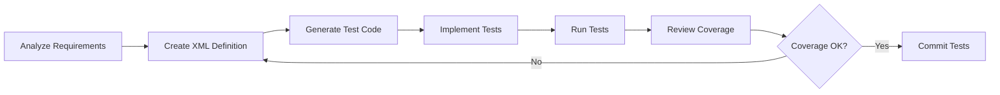

# Unit Test Implementation Guide

**Version:** 1.0  
**Date:** 2025-07-17  
**Purpose:** This guide provides practical instructions for implementing unit tests using the XML template, including folder structure, workflow, and AI-assisted test generation prompts.

## Table of Contents

1. [Quick Start](#1-quick-start)
2. [Folder Structure](#2-folder-structure)
3. [Implementation Workflow](#3-implementation-workflow)
4. [Using the XML Template](#4-using-the-xml-template)
5. [AI Prompts for Test Generation](#5-ai-prompts-for-test-generation)
6. [Converting XML to Code](#6-converting-xml-to-code)
7. [Test Organization Patterns](#7-test-organization-patterns)
8. [Integration with CI/CD](#8-integration-with-cicd)
9. [Common Scenarios](#9-common-scenarios)
10. [Troubleshooting](#10-troubleshooting)

## 1. Quick Start

### 1.1 Basic Steps

1. **Create test structure**: Set up the folder hierarchy
2. **Define tests in XML**: Use the template for each component
3. **Generate test code**: Convert XML to your testing framework
4. **Run tests**: Execute and validate
5. **Review coverage**: Ensure requirements are met

### 1.2 Essential Files

For each component being tested:
```
component-name/
├── component-name.test.xml     # Test definition
├── component-name.test.js      # Generated test code
├── fixtures/                   # Test data
│   ├── valid-inputs.json
│   └── edge-cases.json
└── mocks/                      # Mock definitions
    └── dependencies.js
```

## 2. Folder Structure

### 2.1 Standard Test Organization

```
project-root/
├── src/                        # Source code
│   ├── components/
│   ├── services/
│   ├── models/
│   └── utils/
├── tests/                      # All tests
│   ├── unit/                   # Unit tests
│   │   ├── components/
│   │   │   ├── Button/
│   │   │   │   ├── Button.test.xml
│   │   │   │   ├── Button.test.tsx
│   │   │   │   └── fixtures/
│   │   │   └── Form/
│   │   │       ├── Form.test.xml
│   │   │       ├── Form.test.tsx
│   │   │       └── fixtures/
│   │   ├── services/
│   │   │   ├── UserService/
│   │   │   │   ├── UserService.test.xml
│   │   │   │   ├── UserService.test.ts
│   │   │   │   ├── fixtures/
│   │   │   │   └── mocks/
│   │   │   └── AuthService/
│   │   │       ├── AuthService.test.xml
│   │   │       ├── AuthService.test.ts
│   │   │       └── mocks/
│   │   ├── models/
│   │   └── utils/
│   ├── integration/            # Integration tests
│   │   ├── api/
│   │   └── database/
│   ├── e2e/                    # End-to-end tests
│   ├── performance/            # Performance tests
│   ├── fixtures/               # Shared test data
│   │   ├── users.json
│   │   ├── products.json
│   │   └── test-database.sql
│   ├── helpers/                # Test utilities
│   │   ├── test-utils.ts
│   │   ├── mock-factory.ts
│   │   └── data-generators.ts
│   └── config/                 # Test configuration
│       ├── jest.config.js
│       ├── test-env.js
│       └── coverage.config.js
├── test-definitions/           # XML test definitions
│   ├── templates/
│   │   └── Unit_Test_Template.xml
│   └── suites/
│       ├── authentication-suite.xml
│       └── user-management-suite.xml
└── test-reports/               # Generated reports
    ├── coverage/
    ├── junit/
    └── performance/
```

### 2.2 Naming Conventions

#### File Names
- XML definitions: `ComponentName.test.xml`
- Test implementations: `ComponentName.test.[js|ts|py|java]`
- Fixtures: `component-name-[scenario].json`
- Mocks: `ComponentName.mock.[js|ts]`

#### Test IDs
```
[MODULE]_[COMPONENT]_[FUNCTION]_[SCENARIO]
```

Examples:
- `AUTH_LOGIN_SERVICE_VALID_CREDENTIALS`
- `USER_MODEL_VALIDATE_EMAIL_FORMAT`
- `API_ENDPOINT_CREATE_USER_DUPLICATE`

### 2.3 Language-Specific Structures

#### JavaScript/TypeScript (Jest/Vitest)
```
tests/unit/
├── __tests__/              # Alternative test location
├── __mocks__/              # Manual mocks
├── __fixtures__/           # Test fixtures
└── setup.ts                # Test setup file
```

#### Python (pytest)
```
tests/
├── unit/
│   ├── conftest.py         # Shared fixtures
│   ├── test_models.py
│   └── test_services.py
├── fixtures/
└── mocks/
```

#### Java (JUnit)
```
src/test/
├── java/
│   └── com/company/app/
│       ├── unit/
│       ├── fixtures/
│       └── mocks/
└── resources/
    ├── test-data/
    └── test-config/
```

## 3. Implementation Workflow

### 3.1 Test Development Process



### 3.2 Step-by-Step Process

1. **Analyze Component**
   ```bash
   # Review the component to test
   cat src/services/UserService.js
   
   # Check existing documentation
   cat docs/api/UserService.md
   ```

2. **Create XML Definition**
   ```bash
   # Copy template
   cp test-definitions/templates/Unit_Test_Template.xml \
      tests/unit/services/UserService/UserService.test.xml
   
   # Edit with your test cases
   vim tests/unit/services/UserService/UserService.test.xml
   ```

3. **Generate Initial Test Code**
   ```bash
   # Use generator script (if available)
   npm run generate-tests -- --input UserService.test.xml
   
   # Or manually create based on XML
   touch tests/unit/services/UserService/UserService.test.ts
   ```

4. **Run and Refine**
   ```bash
   # Run specific test
   npm test -- UserService.test.ts
   
   # Check coverage
   npm test -- --coverage UserService
   ```

## 4. Using the XML Template

### 4.1 Basic Test Definition

Start with minimal required sections:

```xml
<?xml version="1.0" encoding="UTF-8"?>
<UnitTest>
    <Metadata>
        <TestID>USER_SERVICE_CREATE</TestID>
        <TestName>User Creation Tests</TestName>
        <Component>UserService</Component>
        <Function>createUser</Function>
    </Metadata>
    
    <TestCases>
        <TestCase id="create_valid_user">
            <Description>Create user with valid data</Description>
            <Execution>
                <Step number="1">
                    <Action>Call createUser with valid data</Action>
                </Step>
            </Execution>
            <Assertions>
                <Assertion type="Existence">
                    <Description>User ID should exist</Description>
                    <Target>result.id</Target>
                </Assertion>
            </Assertions>
        </TestCase>
    </TestCases>
</UnitTest>
```

### 4.2 Adding Test Data

Define reusable test data:

```xml
<TestData>
    <InputData>
        <DataSet id="valid_user">
            <Format>JSON</Format>
            <Location>Inline</Location>
            <Data><![CDATA[
{
    "email": "test@example.com",
    "password": "SecurePass123!",
    "name": "Test User",
    "role": "user"
}
            ]]></Data>
        </DataSet>
        
        <DataSet id="invalid_users">
            <Format>JSON</Format>
            <Location>File</Location>
            <FilePath>fixtures/invalid-users.json</FilePath>
        </DataSet>
    </InputData>
</TestData>
```

### 4.3 Defining Mocks

Set up mock behaviors:

```xml
<TestData>
    <MockData>
        <Mock id="database_mock">
            <Type>UserRepository</Type>
            <Behavior><![CDATA[
{
    "findByEmail": {
        "withArgs": ["existing@example.com"],
        "returns": { "id": "123", "email": "existing@example.com" }
    },
    "save": {
        "returns": { "id": "generated-id" }
    }
}
            ]]></Behavior>
        </Mock>
    </MockData>
</TestData>
```

## 5. AI Prompts for Test Generation

### 5.1 Full Coverage Test Generation

```markdown
## Prompt: Generate Complete Unit Test Suite

Study the following application components and documentation:
1. Requirements document: [path/to/requirements.md]
2. API specification: [path/to/api-spec.md]
3. Component source code: [path/to/component.js]
4. Design documentation: [path/to/design.md]

Create a comprehensive unit test suite that:
- Covers all public methods and functions
- Tests all requirement scenarios
- Includes positive, negative, and edge cases
- Validates error handling
- Tests boundary conditions
- Includes performance tests where applicable
- Achieves minimum 90% code coverage

Use the Unit Test XML template format for each test case.
Include appropriate test data, mocks, and assertions.
```

### 5.2 Component-Specific Test Generation

```markdown
## Prompt: Generate Tests for Specific Component

Analyze the UserService component:
- File: src/services/UserService.ts
- Dependencies: UserRepository, EmailService, CacheService
- Main functions: createUser, updateUser, deleteUser, findUser

Generate unit tests that:
1. Test each method in isolation
2. Mock all dependencies appropriately
3. Cover these scenarios:
   - Valid inputs
   - Invalid inputs (null, undefined, wrong types)
   - Business rule violations
   - Database errors
   - External service failures
   - Concurrent operations
   - Cache hit/miss scenarios

Format: Use the Unit Test XML template
Output: Complete test definitions for all scenarios
```

### 5.3 Requirements-Based Test Generation

```markdown
## Prompt: Generate Tests from Requirements

Given these requirements:
```
REQ-001: Users must provide valid email addresses
REQ-002: Passwords must be at least 8 characters with mixed case and numbers
REQ-003: Email addresses must be unique in the system
REQ-004: Users must verify email within 24 hours
REQ-005: Failed login attempts are limited to 5 per hour
```

Generate unit tests that:
1. Validate each requirement
2. Test boundary conditions
3. Verify error messages
4. Check security implications

Include:
- Test case for each requirement
- Both passing and failing scenarios
- Edge cases (exactly 8 chars, 5th attempt, 24-hour boundary)
- Integration points that need mocking
```

### 5.4 API Endpoint Test Generation

```markdown
## Prompt: Generate API Endpoint Tests

For the REST API endpoint:
```
POST /api/users
Body: { email, password, name, role }
Response: { id, email, name, role, createdAt }
Errors: 400 (validation), 409 (duplicate), 500 (server)
```

Generate comprehensive tests covering:
1. All success scenarios
2. Each validation rule
3. Each error condition
4. Request/response format validation
5. Authentication and authorization
6. Rate limiting
7. Input sanitization
8. Response time requirements

Include test data for each scenario and expected responses.
```

### 5.5 Test Data Generation

```markdown
## Prompt: Generate Test Data Sets

For testing a user management system, generate:

1. Valid user data sets:
   - Minimum required fields
   - All fields populated
   - Various valid formats

2. Invalid data sets:
   - Missing required fields
   - Invalid formats
   - Boundary violations
   - SQL injection attempts
   - XSS attempts

3. Edge case data:
   - Maximum length values
   - Minimum length values
   - Special characters
   - Unicode characters
   - Empty strings vs null

4. Performance test data:
   - 1,000 user records
   - Various creation dates
   - Different roles and permissions

Format as JSON files with clear categorization.
```

### 5.6 Mock Definition Generation

```markdown
## Prompt: Generate Mock Definitions

For the UserService with these dependencies:
- UserRepository (database operations)
- EmailService (sending emails)  
- CacheService (caching user data)
- AuditLogger (logging operations)

Generate mock definitions that:
1. Cover success scenarios
2. Simulate failures (network, database, service)
3. Test retry logic
4. Validate caching behavior
5. Verify logging calls

Include:
- Different response scenarios for each dependency
- Timing behaviors (delays, timeouts)
- State-based responses
- Error simulations
```

## 6. Converting XML to Code

### 6.1 JavaScript/Jest Example

Converting XML test definition to Jest:

```javascript
// Generated from UserService.test.xml
import { UserService } from '../../../src/services/UserService';
import { testData } from './fixtures/user-data';

describe('USER_SERVICE_CREATE', () => {
    let userService;
    let mockRepository;
    let mockEmailService;
    
    beforeEach(() => {
        // Setup from <TestConfiguration><BeforeEach>
        mockRepository = {
            findByEmail: jest.fn(),
            save: jest.fn()
        };
        mockEmailService = {
            sendWelcomeEmail: jest.fn()
        };
        userService = new UserService(mockRepository, mockEmailService);
    });
    
    describe('create_valid_user', () => {
        it('should create user with valid data', async () => {
            // Arrange - from <TestData>
            const validUserData = testData.valid_user;
            mockRepository.findByEmail.mockResolvedValue(null);
            mockRepository.save.mockResolvedValue({ 
                id: 'generated-id',
                ...validUserData 
            });
            
            // Act - from <Execution>
            const result = await userService.createUser(validUserData);
            
            // Assert - from <Assertions>
            expect(result.id).toBeDefined();
            expect(result.email).toBe(validUserData.email);
            expect(mockEmailService.sendWelcomeEmail)
                .toHaveBeenCalledWith(validUserData.email);
        });
    });
});
```

### 6.2 Python/pytest Example

Converting XML to pytest:

```python
# Generated from user_service.test.xml
import pytest
from unittest.mock import Mock, patch
from services.user_service import UserService
from fixtures.user_data import valid_user, invalid_users

class TestUserServiceCreate:
    """USER_SERVICE_CREATE: User Creation Tests"""
    
    @pytest.fixture
    def mock_repository(self):
        """Setup from <MockData>"""
        repo = Mock()
        repo.find_by_email.return_value = None
        repo.save.return_value = {"id": "generated-id"}
        return repo
    
    @pytest.fixture
    def user_service(self, mock_repository, mock_email_service):
        return UserService(mock_repository, mock_email_service)
    
    def test_create_valid_user(self, user_service, mock_repository):
        """create_valid_user: Create user with valid data"""
        # Arrange - from <TestData>
        user_data = valid_user
        
        # Act - from <Execution>
        result = user_service.create_user(user_data)
        
        # Assert - from <Assertions>
        assert result["id"] is not None
        assert result["email"] == user_data["email"]
        mock_repository.save.assert_called_once()
```

### 6.3 Automated Conversion Script

Example conversion script structure:

```javascript
// xml-to-test-converter.js
const fs = require('fs');
const xml2js = require('xml2js');

class TestConverter {
    constructor(xmlPath, outputPath, language) {
        this.xmlPath = xmlPath;
        this.outputPath = outputPath;
        this.language = language;
    }
    
    async convert() {
        const xml = fs.readFileSync(this.xmlPath, 'utf8');
        const parsed = await xml2js.parseStringPromise(xml);
        
        const testCode = this.generateTestCode(parsed.UnitTest);
        fs.writeFileSync(this.outputPath, testCode);
    }
    
    generateTestCode(testDef) {
        switch(this.language) {
            case 'jest':
                return this.generateJestCode(testDef);
            case 'pytest':
                return this.generatePytestCode(testDef);
            default:
                throw new Error(`Unsupported language: ${this.language}`);
        }
    }
    
    generateJestCode(testDef) {
        // Convert XML structure to Jest test code
        const metadata = testDef.Metadata[0];
        const testCases = testDef.TestCases[0].TestCase;
        
        let code = `// Generated from ${metadata.TestID}
describe('${metadata.TestName}', () => {
`;
        
        testCases.forEach(testCase => {
            code += this.generateJestTestCase(testCase);
        });
        
        code += '});\n';
        return code;
    }
}

// Usage
const converter = new TestConverter(
    'UserService.test.xml',
    'UserService.test.js',
    'jest'
);
converter.convert();
```

## 7. Test Organization Patterns

### 7.1 By Feature

Organize tests by application features:

```
tests/unit/features/
├── authentication/
│   ├── login/
│   │   ├── Login.test.xml
│   │   ├── Login.test.ts
│   │   └── fixtures/
│   ├── registration/
│   │   ├── Registration.test.xml
│   │   ├── Registration.test.ts
│   │   └── fixtures/
│   └── password-reset/
├── user-management/
│   ├── create-user/
│   ├── update-user/
│   └── delete-user/
└── shopping-cart/
    ├── add-item/
    ├── remove-item/
    └── checkout/
```

### 7.2 By Layer

Organize by application layers:

```
tests/unit/
├── presentation/           # UI components
│   ├── components/
│   └── pages/
├── application/           # Use cases / services
│   ├── services/
│   └── handlers/
├── domain/               # Business logic
│   ├── models/
│   └── validators/
└── infrastructure/       # External interfaces
    ├── repositories/
    └── adapters/
```

### 7.3 By Test Type

Separate different test types:

```
tests/
├── unit/                 # Isolated component tests
├── integration/          # Component interaction tests
├── contract/            # API contract tests
├── smoke/               # Basic functionality tests
├── regression/          # Bug prevention tests
└── performance/         # Speed and resource tests
```

## 8. Integration with CI/CD

### 8.1 CI Configuration

#### GitHub Actions Example

```yaml
# .github/workflows/test.yml
name: Run Tests

on: [push, pull_request]

jobs:
  test:
    runs-on: ubuntu-latest
    
    steps:
    - uses: actions/checkout@v3
    
    - name: Setup Node.js
      uses: actions/setup-node@v3
      with:
        node-version: '18'
        
    - name: Install dependencies
      run: npm ci
      
    - name: Validate test definitions
      run: npm run validate-test-xml
      
    - name: Generate tests from XML
      run: npm run generate-tests
      
    - name: Run unit tests
      run: npm test -- --coverage
      
    - name: Upload coverage
      uses: codecov/codecov-action@v3
      with:
        files: ./coverage/lcov.info
        
    - name: Store test results
      uses: actions/upload-artifact@v3
      with:
        name: test-results
        path: |
          test-reports/
          coverage/
```

### 8.2 Test Validation Script

Validate XML test definitions:

```javascript
// scripts/validate-test-xml.js
const fs = require('fs');
const path = require('path');
const { XMLValidator } = require('fast-xml-parser');

function validateTestFiles(directory) {
    const errors = [];
    
    function walkDir(dir) {
        const files = fs.readdirSync(dir);
        
        files.forEach(file => {
            const filePath = path.join(dir, file);
            const stat = fs.statSync(filePath);
            
            if (stat.isDirectory()) {
                walkDir(filePath);
            } else if (file.endsWith('.test.xml')) {
                const content = fs.readFileSync(filePath, 'utf8');
                const result = XMLValidator.validate(content);
                
                if (result !== true) {
                    errors.push({
                        file: filePath,
                        error: result.err
                    });
                }
            }
        });
    }
    
    walkDir(directory);
    
    if (errors.length > 0) {
        console.error('Validation errors found:');
        errors.forEach(({ file, error }) => {
            console.error(`${file}: ${error.msg}`);
        });
        process.exit(1);
    } else {
        console.log('All test XML files are valid');
    }
}

validateTestFiles('./tests');
```

### 8.3 Coverage Requirements

Enforce coverage in CI:

```json
// package.json
{
  "jest": {
    "coverageThreshold": {
      "global": {
        "branches": 80,
        "functions": 80,
        "lines": 80,
        "statements": 80
      },
      "src/services/": {
        "branches": 90,
        "functions": 90,
        "lines": 90,
        "statements": 90
      }
    }
  }
}
```

## 9. Common Scenarios

### 9.1 Testing Async Operations

```xml
<TestCase id="test_async_operation">
    <Description>Test async data fetching</Description>
    <Execution>
        <Step number="1">
            <Action>Initiate async operation</Action>
            <Code><![CDATA[
const promise = service.fetchData();
expect(service.isLoading).toBe(true);
            ]]></Code>
        </Step>
        <Step number="2">
            <Action>Wait for completion</Action>
            <Code><![CDATA[
const result = await promise;
expect(service.isLoading).toBe(false);
            ]]></Code>
        </Step>
    </Execution>
</TestCase>
```

### 9.2 Testing Error Scenarios

```xml
<TestCase id="test_error_handling">
    <Description>Test service error handling</Description>
    <TestData>
        <MockData>
            <Mock id="failing_service">
                <Behavior><![CDATA[
{
    "fetchData": jest.fn().mockRejectedValue(
        new Error("Network error")
    )
}
                ]]></Behavior>
            </Mock>
        </MockData>
    </TestData>
    <ExpectedException type="ServiceError">
        <Message>Failed to fetch data: Network error</Message>
    </ExpectedException>
</TestCase>
```

### 9.3 Testing State Changes

```xml
<TestCase id="test_state_transitions">
    <Description>Test component state changes</Description>
    <Execution>
        <Step number="1">
            <Action>Initial state check</Action>
            <Code><![CDATA[
expect(component.state).toBe('idle');
            ]]></Code>
        </Step>
        <Step number="2">
            <Action>Trigger state change</Action>
            <Code><![CDATA[
component.start();
expect(component.state).toBe('running');
            ]]></Code>
        </Step>
        <Step number="3">
            <Action>Complete operation</Action>
            <Code><![CDATA[
await component.complete();
expect(component.state).toBe('completed');
            ]]></Code>
        </Step>
    </Execution>
</TestCase>
```

## 10. Troubleshooting

### 10.1 Common Issues

#### Test Discovery Problems
```bash
# No tests found
Solution: Check file naming (.test.js) and location

# XML not loading
Solution: Validate XML syntax and encoding
```

#### Mock Issues
```javascript
// Mock not working
// Wrong:
const mock = jest.fn();
mock.mockReturnValue(data); // After using

// Correct:
const mock = jest.fn();
mock.mockReturnValue(data); // Before using
```

#### Async Test Failures
```javascript
// Wrong - missing await
it('test async', () => {
    const result = service.asyncMethod();
    expect(result).toBe(expected);
});

// Correct
it('test async', async () => {
    const result = await service.asyncMethod();
    expect(result).toBe(expected);
});
```

### 10.2 Performance Issues

#### Slow Tests
1. Check for unnecessary waits
2. Use fake timers for time-dependent code
3. Minimize file I/O in tests
4. Use test data factories instead of fixtures

#### Memory Leaks
1. Clean up after each test
2. Close connections and clear timers
3. Reset global state
4. Clear module cache if needed

### 10.3 Debugging Tests

```javascript
// Add debug output
describe('Debugging test', () => {
    beforeEach(() => {
        console.log('Test state:', testState);
    });
    
    it('failing test', () => {
        console.log('Input:', input);
        const result = functionUnderTest(input);
        console.log('Output:', result);
        expect(result).toBe(expected);
    });
});

// Use debugger
it('debug test', () => {
    debugger; // Pause here when running in debug mode
    const result = complexFunction();
    expect(result).toBe(expected);
});
```

## Summary

Effective unit test implementation requires:

1. **Organized Structure**: Consistent folder hierarchy
2. **Clear Definitions**: XML templates for test specifications  
3. **Automated Workflow**: Generate tests from definitions
4. **Comprehensive Coverage**: Test all scenarios
5. **CI/CD Integration**: Automated validation and execution
6. **Regular Maintenance**: Keep tests updated with code

Use the provided AI prompts to generate comprehensive test suites that ensure code quality and prevent regressions.

---

**Related Resources:**
- [Unit_Test_Template.xml](./Unit_Test_Template.xml) - XML template for test definitions
- [Unit_Test_Principles.md](./Unit_Test_Principles.md) - Testing best practices
- [Implementation_Guide_Template.xml](./Implementation_Guide_Template.xml) - Implementation guides