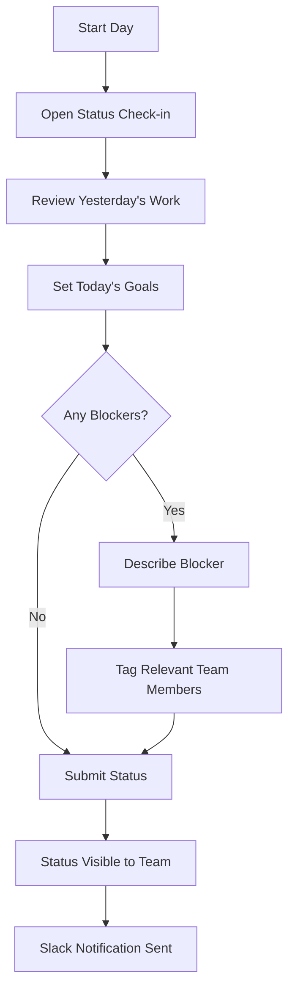
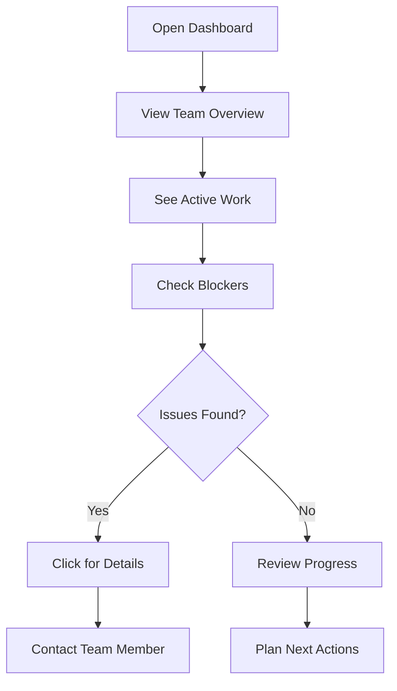
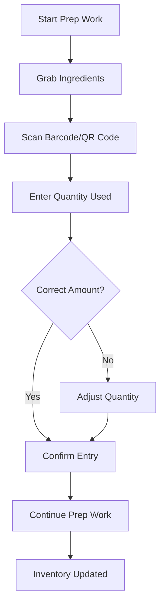
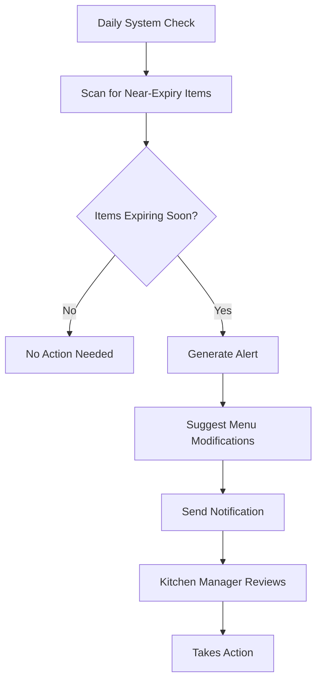

# Idea Exploration Examples: Real-World Demonstrations

**Version:** 1.0  
**Date:** 2025-07-18  
**Purpose:** This document provides complete, real-world examples of how to use AIDevFlow from initial idea through to user stories, demonstrating the interview process, brainstorming techniques, and story generation.

## Table of Contents

1. [Example 1: Task Management App for Remote Teams](#1-example-1-task-management-app-for-remote-teams)
2. [Example 2: Restaurant Inventory Management System](#2-example-2-restaurant-inventory-management-system)
3. [Example 3: Online Learning Platform](#3-example-3-online-learning-platform)
4. [Example 4: Healthcare Patient Portal](#4-example-4-healthcare-patient-portal)
5. [Example 5: E-commerce Analytics Dashboard](#5-example-5-e-commerce-analytics-dashboard)
6. [Comparison Analysis](#6-comparison-analysis)
7. [Common Patterns and Lessons](#7-common-patterns-and-lessons)

## 1. Example 1: Task Management App for Remote Teams

### 1.1 Initial Idea

**Raw Idea:** "I want to build a task management app for remote teams that helps with accountability and transparency."

### 1.2 AI Interview Session

```markdown
## Interview Transcript

AI: Tell me about the specific problem you're trying to solve with this task management app.

User: My team is distributed across different time zones, and we're struggling with knowing who's working on what. Tasks fall through the cracks, and there's no visibility into progress.

AI: Can you give me a specific example of when this happened recently?

User: Last week, we thought John was working on the API integration, but he was actually blocked waiting for the database schema. Meanwhile, Sarah was working on frontend components that depended on that API. We lost 3 days because no one knew about the dependency.

AI: How many people are on your team, and how do you currently track tasks?

User: We have 8 developers across 4 time zones. We use a mix of Slack, email, and a shared Google Doc. It's chaos.

AI: What would an ideal day look like if this problem was solved?

User: I'd wake up, check the dashboard, and immediately see what everyone accomplished yesterday, what they're working on today, and any blockers. No hunting through messages or asking "what's the status?"

AI: You mentioned accountability. What specific accountability issues do you face?

User: People can go dark for days without anyone noticing. There's no gentle pressure to provide updates. And when deadlines slip, we don't know until it's too late.

AI: What tools have you tried before, and why didn't they work?

User: We tried Jira, but it's too heavy and complex. Trello is too simple and lacks the visibility we need. Asana is better but still doesn't solve the transparency issue for remote teams.

AI: What's different about remote teams that existing tools don't address?

User: Time zones! When someone is blocked at 5 PM my time, I won't know until tomorrow. Also, the casual hallway conversations where you'd naturally share updates don't happen remotely.

AI: How would you measure success for this solution?

User: Fewer missed deadlines, faster resolution of blockers, and everyone knowing the project status without asking. Maybe track how often we have "status surprises."

AI: What constraints do you have? Budget, timeline, team size?

User: Bootstrap budget, need something working in 3 months. I'm the only one who can work on this initially.

AI: What would make your team actually adopt and stick with this tool?

User: It has to be dead simple - no training required. Must integrate with our existing Slack workflow. And it should make their work visible without feeling like surveillance.
```

### 1.3 Brainstorming Session

```markdown
## Feature Brainstorming Results

### Core Features (MVP):
1. **Status Dashboard**: Visual overview of who's working on what
2. **Daily Check-ins**: Simple way to update status and flag blockers
3. **Dependency Tracking**: See what tasks are waiting on others
4. **Time Zone Awareness**: Show team member availability
5. **Slack Integration**: Updates flow to/from Slack naturally

### Enhanced Features:
1. **Smart Notifications**: Alert relevant people about blockers
2. **Progress Indicators**: Visual progress bars for tasks
3. **Team Pulse**: Aggregate view of team velocity and health
4. **Auto-Standup**: Generate standup reports from check-ins
5. **Blocker Marketplace**: Help team members unblock each other

### Future Vision:
1. **AI Assistant**: Predict blockers before they happen
2. **Smart Scheduling**: Optimal task assignment based on time zones
3. **Integration Hub**: Connect with GitHub, Figma, etc.
4. **Analytics**: Team performance insights
5. **Client Portal**: External visibility for stakeholders
```

### 1.4 User Personas Developed

```markdown
## Primary Personas

### Alex - Remote Team Lead
- **Role**: Engineering Manager
- **Pain**: Can't track team progress across time zones
- **Goal**: Prevent surprises, ensure deadline delivery
- **Tech Comfort**: High
- **Key Feature**: Dashboard with real-time team status

### Jordan - Senior Developer
- **Role**: Individual Contributor
- **Pain**: Doesn't know who to ask for help when blocked
- **Goal**: Focus on coding, not status meetings
- **Tech Comfort**: High
- **Key Feature**: Easy blocker reporting and resolution

### Sam - Junior Developer
- **Role**: New team member
- **Pain**: Afraid to ask for help, unsure of expectations
- **Goal**: Contribute effectively, learn quickly
- **Tech Comfort**: Medium
- **Key Feature**: Clear task guidance and mentorship connections
```

### 1.5 Generated User Stories

```markdown
# User Story: Daily Status Check-in

**Story ID:** US-STATUS-001  
**Epic:** Team Transparency  
**Priority:** Critical  
**Points:** 5  

## Story Card

**As a** remote team member  
**I want** to quickly share my daily status and any blockers  
**So that** my team knows what I'm working on and can help if needed

## User Flow



## Acceptance Criteria

### AC-1: Quick Status Entry ⭐ Must Have
**Given** I start my workday  
**When** I open the daily check-in  
**Then** I should see my tasks from yesterday  
**And** I can mark them as complete, in-progress, or blocked  
**And** I can set 1-3 goals for today  

### AC-2: Blocker Reporting ⭐ Must Have
**Given** I'm entering my status  
**When** I indicate I'm blocked  
**Then** I can describe the blocker in plain text  
**And** I can tag specific team members who might help  
**And** The system suggests who to contact based on expertise  

### AC-3: Automatic Notifications ⭐ Must Have
**Given** I submit my status  
**When** I mention blockers or tag team members  
**Then** Relevant people get notified in Slack  
**And** The notification includes context and how to help  

## Technical Considerations

- **Performance**: Status submission < 3 seconds
- **Mobile**: Works well on phone for remote workers
- **Integration**: Bi-directional Slack integration
- **Persistence**: Status history for trend analysis

## Business Rules

1. **BR-1**: Daily check-in reminder at 9 AM local time
2. **BR-2**: Overdue check-ins highlighted to team leads
3. **BR-3**: Blocker age tracked and escalated after 24 hours
4. **BR-4**: Anonymous mood tracking for team health
```

```markdown
# User Story: Team Status Dashboard

**Story ID:** US-DASH-001  
**Epic:** Team Transparency  
**Priority:** Critical  
**Points:** 8  

## Story Card

**As a** team lead working across time zones  
**I want** a real-time dashboard of team status and progress  
**So that** I can identify issues quickly and support my team effectively

## User Flow



## Acceptance Criteria

### AC-1: Real-time Team View ⭐ Must Have
**Given** I'm a team lead  
**When** I open the dashboard  
**Then** I see all team members with their current status  
**And** I can see who's online, offline, or in a different time zone  
**And** Status updates appear in real-time without refresh  

### AC-2: Blocker Visibility ⭐ Must Have
**Given** team members have reported blockers  
**When** I view the dashboard  
**Then** blockers are prominently highlighted  
**And** I can see how long each blocker has existed  
**And** I can see who might be able to help  

### AC-3: Progress Tracking ⭐ Must Have
**Given** I want to track project progress  
**When** I view the dashboard  
**Then** I see completion status for current sprint/milestone  
**And** I can identify tasks that are falling behind  
**And** I can see team velocity trends  

## Technical Considerations

- **Real-time**: WebSocket connections for live updates
- **Performance**: Dashboard loads in < 2 seconds
- **Mobile**: Responsive design for mobile management
- **Caching**: Smart caching for frequently accessed data
```

### 1.6 Interview Summary

```markdown
# Task Management App - Interview Summary

## Problem Statement
Remote development teams lack visibility into who's working on what, leading to missed dependencies, delayed blockers resolution, and project delivery surprises.

## Target Users
- Remote software development teams (5-15 people)
- Distributed across multiple time zones
- Currently using ad-hoc tools (Slack, email, docs)

## Core Solution
A lightweight task transparency tool that integrates with existing workflows (Slack) and provides real-time visibility without feeling like surveillance.

## Success Criteria
- Reduce "status surprise" incidents by 80%
- Resolve blockers 50% faster
- Team adoption rate >90% within 30 days

## MVP Features
1. Daily status check-ins
2. Team dashboard with real-time status
3. Blocker tracking and resolution
4. Slack integration
5. Time zone awareness

## Next Steps
1. Create detailed user stories for MVP features
2. Design technical architecture
3. Build prototype with one team for validation
```

## 2. Example 2: Restaurant Inventory Management System

### 2.1 Initial Idea

**Raw Idea:** "Restaurants waste too much food. I want to build an app that helps them track inventory and reduce waste."

### 2.2 AI Interview Session

```markdown
## Interview Transcript

AI: Tell me about your experience with restaurant food waste. Have you worked in restaurants or observed this problem firsthand?

User: I managed a mid-size restaurant for 3 years. We were throwing away $2000+ worth of food every month. The kitchen staff would over-order because they were afraid of running out, but then things would expire.

AI: Walk me through a specific example of how food waste happened in your restaurant.

User: Every Sunday, we'd do inventory by hand with clipboards. The head chef would estimate what we needed for the week based on gut feeling. By Wednesday, we'd realize we ordered way too many tomatoes, but by Friday we'd run out of chicken and have to emergency order at premium prices.

AI: What made inventory management so difficult?

User: Three main issues: We never knew exactly what we had in real-time, we couldn't predict demand accurately, and by the time we realized something was going bad, it was too late to use it up.

AI: How did you currently track inventory?

User: Paper sheets, Excel spreadsheets, and a lot of guessing. The prep cooks would write down what they used, but half the time they'd forget or approximate. The walk-in freezer was like a black hole.

AI: What would your ideal system look like?

User: I'd scan items as they come in and get marked when they're used. The system would warn me when things are close to expiring and suggest menu changes to use up inventory. It would learn our demand patterns and suggest better ordering.

AI: Who would be using this system in the restaurant?

User: Primarily the kitchen manager and head chef for planning, prep cooks for daily logging, and the owner/manager for cost control and reporting.

AI: What would prevent restaurants from adopting a new inventory system?

User: Cost, complexity, and time. Kitchen staff are busy and won't use anything that slows them down. It has to be faster than their current method, which is often nothing.

AI: How would you measure success for this system?

User: Reduce food waste by at least 30%, decrease over-ordering by 25%, and reduce emergency orders by 50%. Plus, staff should actually use it consistently.

AI: What's the biggest constraint for restaurants considering this?

User: Money and time. Most restaurants operate on thin margins. They won't pay much, and they definitely won't train staff for weeks. It needs to work immediately.

AI: What existing solutions have you seen, and why don't they work?

User: There are expensive enterprise systems that big chains use, but they cost $10K+ and require IT support. Small restaurants need something simple and affordable, like under $200/month.
```

### 2.3 Key Insights from Interview

```markdown
## Core Problems Identified

1. **Real-time Inventory Blindness**: No visibility into current stock levels
2. **Demand Prediction Failure**: Ordering based on guesswork
3. **Expiration Management**: Food spoils before being used
4. **Cost Control**: Over-ordering and emergency orders hurt margins
5. **Staff Adoption**: Current solutions too complex for busy kitchen staff

## User Personas

### Maria - Kitchen Manager
- **Background**: 10 years restaurant experience
- **Pain**: Constantly stressed about running out of ingredients
- **Goal**: Perfect ordering that minimizes waste and stockouts
- **Tech Comfort**: Low - needs simple interface

### Carlos - Prep Cook
- **Background**: Entry-level position, high turnover role
- **Pain**: Forgets to log ingredient usage accurately
- **Goal**: Do job efficiently without extra paperwork
- **Tech Comfort**: Medium - comfortable with apps

### Tony - Restaurant Owner
- **Background**: Business owner watching every penny
- **Pain**: Food costs eating into already thin margins
- **Goal**: Reduce waste and increase profitability
- **Tech Comfort**: Medium - wants reports and analytics
```

### 2.4 Generated User Stories

```markdown
# User Story: Quick Ingredient Scanning

**Story ID:** US-SCAN-001  
**Epic:** Inventory Tracking  
**Priority:** Critical  
**Points:** 5  

## Story Card

**As a** prep cook in a busy kitchen  
**I want** to quickly scan ingredients as I use them  
**So that** inventory stays accurate without slowing down my work

## User Flow



## Acceptance Criteria

### AC-1: Fast Scanning ⭐ Must Have
**Given** I'm using ingredients for prep  
**When** I scan the ingredient barcode  
**Then** the system recognizes the item instantly  
**And** I can enter quantity in common units (cups, lbs, pieces)  
**And** The whole process takes under 10 seconds  

### AC-2: Offline Capability ⭐ Must Have
**Given** the kitchen WiFi is unreliable  
**When** I scan ingredients without internet  
**Then** entries are saved locally  
**And** they sync automatically when connection returns  
**And** I get confirmation when sync completes  

### AC-3: Batch Processing ⭐ Should Have
**Given** I'm using multiple ingredients for one dish  
**When** I scan multiple items in sequence  
**Then** I can process them as a batch  
**And** confirm all at once  
**And** associate them with a specific recipe or prep task  
```

```markdown
# User Story: Expiration Alerts

**Story ID:** US-EXPIRE-001  
**Epic:** Waste Reduction  
**Priority:** High  
**Points:** 8  

## Story Card

**As a** kitchen manager  
**I want** to receive alerts when ingredients are approaching expiration  
**So that** I can plan menus to use up inventory before it spoils

## User Flow



## Acceptance Criteria

### AC-1: Proactive Warnings ⭐ Must Have
**Given** ingredients have expiration dates in the system  
**When** an item will expire within 2 days  
**Then** I receive a morning alert with details  
**And** the alert shows quantity and estimated value  
**And** I can dismiss or snooze the alert  

### AC-2: Menu Suggestions ⭐ Should Have
**Given** I have ingredients expiring soon  
**When** I view the expiration alert  
**Then** the system suggests menu items that use those ingredients  
**And** shows how much of the expiring ingredient each menu item uses  
**And** I can quickly promote these items as specials  

### AC-3: Waste Tracking ⭐ Must Have
**Given** items have expired  
**When** I mark them as waste  
**Then** the system tracks waste cost and quantity  
**And** generates weekly waste reports  
**And** identifies patterns in what gets wasted most  
```

### 2.5 Technical Architecture Insights

```markdown
## Technical Considerations from Interview

### Mobile-First Design
- Kitchen staff work on their feet with tablets/phones
- Must work with wet hands and in steamy environment
- Large buttons, voice input consideration

### Offline-First Architecture
- Restaurants often have poor WiFi in kitchen areas
- System must function without internet
- Sync when connection available

### Integration Needs
- POS system integration for sales data
- Supplier integration for automatic ordering
- Accounting system integration for cost tracking

### Simplicity Requirements
- No training should be required
- One-tap common actions
- Visual rather than text-heavy interface
```

## 3. Example 3: Online Learning Platform

### 3.1 Initial Idea

**Raw Idea:** "I want to create an online learning platform that's more engaging than current options, with better completion rates."

### 3.2 AI Interview Session (Condensed)

```markdown
## Key Interview Insights

User: "I'm a corporate trainer and see how people struggle with online courses. They start enthusiastic but drop off after 20% completion."

AI: "What specifically makes people disengage?"

User: "Long videos, no interaction, no accountability, and no sense of progress. People feel lost and give up."

AI: "Tell me about a recent training where this happened."

User: "Last month's cybersecurity training. 200 employees enrolled, only 23 completed. Most watched one video and never came back."

Key Problems Identified:
- Passive learning (just watching videos)
- No social interaction or accountability
- Poor progress visualization
- Content not adapted to learning speed
- No immediate application of knowledge

Solution Vision:
- Bite-sized interactive lessons
- Peer learning and discussion
- Adaptive difficulty based on performance
- Real-world application scenarios
- Gamification for engagement
```

### 3.3 Generated User Stories (Selected Examples)

```markdown
# User Story: Adaptive Learning Path

**Story ID:** US-ADAPT-001  
**Epic:** Personalized Learning  
**Priority:** High  
**Points:** 13  

## Story Card

**As a** busy professional taking online courses  
**I want** the system to adapt content difficulty to my learning pace  
**So that** I stay challenged but not overwhelmed

## Acceptance Criteria

### AC-1: Performance-Based Adaptation ⭐ Must Have
**Given** I'm progressing through a course  
**When** I consistently score above 90% on assessments  
**Then** the system should offer more challenging content  
**And** suggest accelerated paths through familiar material  

### AC-2: Struggle Detection ⭐ Must Have
**Given** I'm having difficulty with concepts  
**When** I score below 70% on multiple attempts  
**Then** the system should provide additional explanations  
**And** offer alternative learning formats (video, text, interactive)  
**And** suggest prerequisite review if needed  
```

```markdown
# User Story: Social Learning Groups

**Story ID:** US-SOCIAL-001  
**Epic:** Community Learning  
**Priority:** High  
**Points:** 8  

## Story Card

**As a** learner who works better with others  
**I want** to join study groups with peers at similar levels  
**So that** I have accountability and can learn from discussions

## Acceptance Criteria

### AC-1: Smart Group Formation ⭐ Must Have
**Given** I enroll in a course  
**When** I opt into social learning  
**Then** the system matches me with 4-6 peers at similar progress levels  
**And** groups include diverse backgrounds for richer discussions  
**And** I can see group member profiles and progress  
```

## 4. Example 4: Healthcare Patient Portal

### 4.1 Initial Idea

**Raw Idea:** "Patients have trouble accessing their health information and communicating with doctors. I want to build a better patient portal."

### 4.2 AI Interview Session (Condensed)

```markdown
## Key Interview Insights

User: "I'm a physician assistant. Patients call constantly asking for test results, prescription refills, and appointment changes. Our current portal is confusing and patients avoid it."

AI: "What makes the current portal confusing?"

User: "Medical jargon everywhere, no context for lab results, buried navigation, and it looks like it was built in 2005. Patients get frustrated and call instead."

Problems:
- Medical information presented without context
- Poor user experience design
- No mobile optimization
- Lack of appointment flexibility
- No communication tools

Solution Vision:
- Consumer-friendly health information
- Mobile-first design
- Integrated communication
- Easy appointment management
- Health tracking and trends
```

### 4.3 Generated User Stories (Selected Examples)

```markdown
# User Story: Understandable Lab Results

**Story ID:** US-LABS-001  
**Epic:** Health Information Access  
**Priority:** Critical  
**Points:** 8  

## Story Card

**As a** patient receiving lab results  
**I want** to understand what my results mean in plain language  
**So that** I don't panic or misunderstand my health status

## Acceptance Criteria

### AC-1: Plain Language Explanations ⭐ Must Have
**Given** I have new lab results  
**When** I view them in the portal  
**Then** each result shows my value, normal range, and plain language explanation  
**And** abnormal results are clearly marked with context  
**And** I can see trends over time with visual charts  

### AC-2: Smart Notifications ⭐ Must Have
**Given** I have new results  
**When** they're posted to my portal  
**Then** I get a notification that indicates urgency level  
**And** critical results trigger immediate phone calls  
**And** routine results have calm, informative messaging  
```

## 5. Example 5: E-commerce Analytics Dashboard

### 5.1 Initial Idea

**Raw Idea:** "Small e-commerce businesses struggle with data analysis. They have tons of data but don't know what it means or what actions to take."

### 5.2 AI Interview Session (Condensed)

```markdown
## Key Interview Insights

User: "I run a Shopify store doing $50K/month. I have Google Analytics, Facebook ads data, email metrics, but I don't know what to focus on. I want one dashboard that tells me what's working and what to fix."

Problems:
- Data scattered across multiple tools
- No clear action items from analytics
- Analysis paralysis from too much information
- No understanding of which metrics matter
- Can't identify optimization opportunities

Solution Vision:
- Unified dashboard pulling from all sources
- AI-powered insights and recommendations
- Focus on actionable metrics
- Automated alerts for important changes
- Competitive benchmarking
```

### 5.3 Generated User Stories (Selected Examples)

```markdown
# User Story: Actionable Insights Dashboard

**Story ID:** US-INSIGHTS-001  
**Epic:** Business Intelligence  
**Priority:** Critical  
**Points:** 13  

## Story Card

**As a** small e-commerce business owner  
**I want** a dashboard that highlights the most important issues affecting my revenue  
**So that** I know exactly what to work on each week

## Acceptance Criteria

### AC-1: Priority Issues Identification ⭐ Must Have
**Given** my business data is connected  
**When** I open the dashboard  
**Then** I see the top 3 issues that could increase revenue if fixed  
**And** each issue shows potential impact and difficulty  
**And** I get specific recommended actions for each issue  

### AC-2: Performance Alerts ⭐ Must Have
**Given** the system monitors my metrics  
**When** something significant changes (good or bad)  
**Then** I get an alert explaining what happened and why  
**And** the alert suggests immediate actions if needed  
**And** I can set custom thresholds for different metrics  
```

## 6. Comparison Analysis

### 6.1 Interview Pattern Analysis

| Project | Primary Pain | Users | Key Insight | Main Challenge |
|---------|-------------|--------|-------------|----------------|
| **Task Management** | Lack of transparency | Remote developers | Time zone coordination | Simple enough for adoption |
| **Restaurant Inventory** | Food waste | Kitchen staff | Real-time visibility | Must be faster than current method |
| **Learning Platform** | Low engagement | Corporate learners | Need interaction & accountability | Personalization at scale |
| **Patient Portal** | Poor communication | Patients & providers | Medical jargon barrier | Regulatory compliance |
| **E-commerce Analytics** | Data overwhelm | Store owners | Need actionable insights | Integration complexity |

### 6.2 Common Success Factors

1. **Solve a Real, Painful Problem**: All successful interviews identified specific, measurable pain points
2. **Understand the User Context**: Work environment, technical skills, time constraints all matter
3. **Focus on Adoption Barriers**: What prevents people from using new tools?
4. **Quantify Success**: Clear metrics for measuring improvement
5. **Start Simple**: MVP focuses on core problem, not feature completeness

### 6.3 Common Anti-Patterns Found

1. **Solution First**: Starting with features instead of problems
2. **Assumption-Based**: "Users obviously want X" without evidence
3. **Feature Overload**: Trying to solve every related problem at once
4. **Ignoring Context**: Not understanding user's actual work environment
5. **Missing Constraints**: Overlooking budget, time, or technical limitations

## 7. Common Patterns and Lessons

### 7.1 Interview Patterns That Work

#### The Specific Example Technique
Instead of: "Do users have problems with X?"
Try: "Tell me about the last time X happened. Walk me through exactly what occurred."

#### The Quantification Follow-up
Instead of: "Is this a big problem?"
Try: "How often does this happen? What does it cost you in time/money?"

#### The Context Probe
Instead of: "What features do you want?"
Try: "Walk me through your typical day. When would you use this?"

### 7.2 Story Generation Patterns

#### From Pain to Story
```
Pain: "We don't know who's working on what"
↓
Story: "As a team lead, I want to see real-time team status so that I can identify blockers quickly"
```

#### From Workflow to Stories
```
Workflow: Order → Receive → Store → Use → Track
↓
Stories: One for each step + error handling + reporting
```

#### From Persona to Stories
```
Persona: Busy kitchen staff
↓
Stories: Focus on speed, simplicity, mobile-friendly interfaces
```

### 7.3 Quality Indicators

**Good Interview Signs:**
- Interviewee gives specific examples
- Pain points are quantified
- Current solutions are evaluated
- Success criteria are clear
- Constraints are acknowledged

**Good Story Signs:**
- Clear value proposition
- Testable acceptance criteria
- Considers user context
- Addresses real interview insights
- Appropriately sized for development

### 7.4 Red Flags to Avoid

**In Interviews:**
- Vague answers without examples
- "Everyone wants this" claims
- No discussion of constraints
- Avoiding competition discussion
- Solution bias (already decided on features)

**In Stories:**
- Technical jargon in user stories
- No clear benefit statement
- Untestable acceptance criteria
- Stories too large or too small
- Missing error scenarios

### 7.5 Success Metrics

Track these to improve your AIDevFlow process:

1. **Interview Quality**:
   - Number of specific examples collected
   - Constraints identified
   - User personas developed
   - Success criteria defined

2. **Story Quality**:
   - Stories traceable to interview insights
   - Acceptance criteria testability
   - Development team understanding
   - Story completion rate

3. **Product Success**:
   - User adoption rate
   - Problem metrics improvement
   - Feature usage analytics
   - User satisfaction scores

## Conclusion

These examples demonstrate that successful software development starts with understanding real problems through structured interviews. The AIDevFlow methodology provides a systematic approach to transform ideas into actionable user stories that drive successful implementation.

Key takeaways:
1. **Invest time in the interview process** - It determines everything that follows
2. **Use specific examples** - They reveal the real requirements
3. **Focus on user context** - How and when will they actually use this?
4. **Quantify success** - How will you know if it works?
5. **Start simple** - Solve the core problem well before adding features

By following these patterns and avoiding common pitfalls, you can use AIDevFlow to build software that truly solves user problems.

---

**Related Documents:**
- [AIDevFlow_Complete_Guide.md](./AIDevFlow_Complete_Guide.md) - Complete methodology overview
- [Interview_to_UserStories_Guide.md](./Interview_to_UserStories_Guide.md) - Detailed process guide
- [AI_Interview_Templates.md](./AI_Interview_Templates.md) - Ready-to-use templates
- [User_Story_Template.md](./User_Story_Template.md) - Story formatting guide