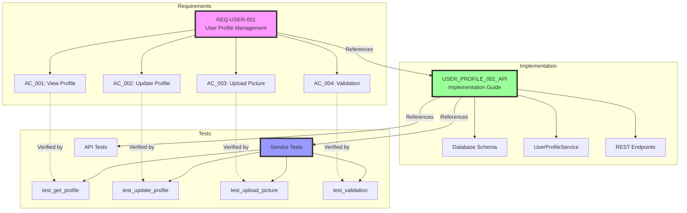
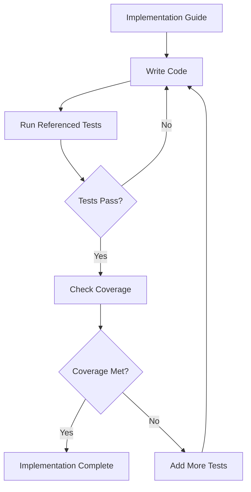

# Complete Integration Example: Requirements → Implementation → Tests

This example demonstrates the complete workflow from requirements definition through implementation to testing, showing how all three XML templates work together to create a traceable, testable system.

## Scenario: User Profile Management Feature

We'll implement a user profile management feature that allows users to view and update their profiles, demonstrating the full development lifecycle.

## 1. Requirement Definition

### File: `requirements/REQ-USER-001.xml`

```xml
<?xml version="1.0" encoding="UTF-8"?>
<Requirement>
    <Metadata>
        <RequirementID>REQ-USER-001</RequirementID>
        <Title>User Profile Management</Title>
        <Version>1.0</Version>
        <Type>Functional</Type>
        <Priority>High</Priority>
        <Status>Approved</Status>
        <Category>UserManagement</Category>
        <Tags>user-profile, api, frontend, backend, database</Tags>
        <CreatedBy>product.owner@company.com</CreatedBy>
        <CreatedDate>2024-01-20</CreatedDate>
        <ApprovedBy>tech.lead@company.com</ApprovedBy>
        <ApprovalDate>2024-01-22</ApprovalDate>
    </Metadata>

    <Description>
        <Summary>Users must be able to view and update their profile information</Summary>
        <Details>
            The system needs to provide functionality for authenticated users to manage 
            their profile information including personal details, preferences, and 
            profile picture. This is essential for personalization and user engagement.
        </Details>
        <BusinessValue>
            Improves user engagement by allowing personalization, reduces support 
            requests for profile changes, and provides foundation for user-specific 
            features and recommendations.
        </BusinessValue>
        <Scope>
            Includes: View profile, update basic info, upload profile picture
            Excludes: Social media integration, public profiles (future phase)
        </Scope>
    </Description>

    <Stakeholders>
        <Stakeholder type="Owner">
            <Name>Product Team</Name>
            <Role>Define requirements and priorities</Role>
            <Responsibilities>Approval of features and UX</Responsibilities>
        </Stakeholder>
        <Stakeholder type="User">
            <Name>Registered Users</Name>
            <Role>End users of the feature</Role>
            <Responsibilities>Provide feedback on usability</Responsibilities>
        </Stakeholder>
    </Stakeholders>

    <UserStory>
        <AsA>registered user</AsA>
        <IWant>to manage my profile information</IWant>
        <SoThat>I can keep my information up to date and personalize my experience</SoThat>
    </UserStory>

    <AcceptanceCriteria>
        <Criterion id="AC_001" testable="true">
            <Given>I am logged in as a user</Given>
            <When>I navigate to my profile page</When>
            <Then>I should see all my current profile information</Then>
        </Criterion>
        <Criterion id="AC_002" testable="true">
            <Given>I am on my profile page</Given>
            <When>I update my name and click save</When>
            <Then>My profile should be updated and I should see a success message</Then>
        </Criterion>
        <Criterion id="AC_003" testable="true">
            <Given>I am on my profile page</Given>
            <When>I upload a valid image file as my profile picture</When>
            <Then>The image should be saved and displayed as my profile picture</Then>
        </Criterion>
        <Criterion id="AC_004" testable="true">
            <Given>I am updating my profile</Given>
            <When>I enter invalid data (e.g., invalid email format)</When>
            <Then>I should see appropriate validation errors</Then>
        </Criterion>
    </AcceptanceCriteria>

    <FunctionalRequirements>
        <FunctionalReq id="FR_001" priority="High">
            <Description>View user profile</Description>
            <InputData>
                <DataItem name="userId" type="string" required="true">
                    <Description>ID of the user requesting their profile</Description>
                    <Validation>Must be authenticated user's ID</Validation>
                </DataItem>
            </InputData>
            <OutputData>
                <DataItem name="profile" type="object">
                    <Description>User profile object</Description>
                    <Format>JSON with user details</Format>
                </DataItem>
            </OutputData>
        </FunctionalReq>
        
        <FunctionalReq id="FR_002" priority="High">
            <Description>Update user profile</Description>
            <InputData>
                <DataItem name="name" type="string" required="false">
                    <Description>User's display name</Description>
                    <Validation>2-100 characters, alphanumeric and spaces</Validation>
                </DataItem>
                <DataItem name="email" type="string" required="false">
                    <Description>User's email address</Description>
                    <Validation>Valid email format, unique in system</Validation>
                </DataItem>
                <DataItem name="bio" type="string" required="false">
                    <Description>User biography</Description>
                    <Validation>Maximum 500 characters</Validation>
                </DataItem>
                <DataItem name="preferences" type="object" required="false">
                    <Description>User preferences object</Description>
                </DataItem>
            </InputData>
            <BusinessRules>
                <Rule id="BR_001">Email changes require re-verification</Rule>
                <Rule id="BR_002">Profile updates must be logged for audit</Rule>
                <Rule id="BR_003">Users can only update their own profile</Rule>
            </BusinessRules>
        </FunctionalReq>
    </FunctionalRequirements>

    <NonFunctionalRequirements>
        <Performance>
            <ResponseTime>
                <Target>100ms</Target>
                <Percentile>95th percentile</Percentile>
                <Conditions>Profile retrieval</Conditions>
            </ResponseTime>
            <ResponseTime>
                <Target>500ms</Target>
                <Percentile>95th percentile</Percentile>
                <Conditions>Profile update with image upload</Conditions>
            </ResponseTime>
        </Performance>
        
        <Security>
            <Authentication>JWT token required for all operations</Authentication>
            <Authorization>Users can only access/modify their own profile</Authorization>
            <DataProtection>Sensitive fields encrypted at rest</DataProtection>
        </Security>
        
        <Usability>
            <UserInterface>Responsive design for mobile and desktop</UserInterface>
            <Accessibility>WCAG 2.1 AA compliant</Accessibility>
        </Usability>
    </NonFunctionalRequirements>

    <DataRequirements>
        <DataModel>
            <Entity name="UserProfile">
                <Description>Extended user profile information</Description>
                <Attributes>
                    <Attribute name="userId" type="UUID" required="true">
                        <Description>Reference to user account</Description>
                        <Constraints>Foreign key to users table</Constraints>
                    </Attribute>
                    <Attribute name="displayName" type="string" required="true">
                        <Description>User's display name</Description>
                        <Constraints>2-100 characters</Constraints>
                    </Attribute>
                    <Attribute name="bio" type="text" required="false">
                        <Description>User biography</Description>
                        <Constraints>Max 500 characters</Constraints>
                    </Attribute>
                    <Attribute name="profilePictureUrl" type="string" required="false">
                        <Description>URL to profile picture</Description>
                    </Attribute>
                    <Attribute name="preferences" type="jsonb" required="false">
                        <Description>User preferences as JSON</Description>
                        <DefaultValue>{}</DefaultValue>
                    </Attribute>
                    <Attribute name="updatedAt" type="timestamp" required="true">
                        <Description>Last update timestamp</Description>
                    </Attribute>
                </Attributes>
            </Entity>
        </DataModel>
    </DataRequirements>

    <ImplementationReferences>
        <ImplementationGuide id="USER_PROFILE_001_API" 
                            path="implementation/guides/USER_PROFILE_001_API.xml">
            <Description>User Profile API implementation</Description>
            <Coverage>100%</Coverage>
        </ImplementationGuide>
    </ImplementationReferences>

    <TestReferences>
        <TestSuite id="USER_PROFILE_SUITE_001" 
                   path="tests/unit/profile/UserProfile.test.xml">
            <Description>User profile management test suite</Description>
            <TestCases>
                <TestCase id="test_get_profile" verifiesAC="AC_001">
                    Retrieve user profile test
                </TestCase>
                <TestCase id="test_update_profile" verifiesAC="AC_002">
                    Update profile information test
                </TestCase>
                <TestCase id="test_upload_picture" verifiesAC="AC_003">
                    Profile picture upload test
                </TestCase>
                <TestCase id="test_validation" verifiesAC="AC_004">
                    Input validation test
                </TestCase>
            </TestCases>
        </TestSuite>
    </TestReferences>
</Requirement>
```

## 2. Implementation Guide

### File: `implementation/guides/USER_PROFILE_001_API.xml`

```xml
<?xml version="1.0" encoding="UTF-8"?>
<ImplementationGuide>
    <Metadata>
        <GuideID>USER_PROFILE_001_API</GuideID>
        <Title>User Profile API Implementation</Title>
        <Version>1.0</Version>
        <Category>Feature</Category>
        <Priority>High</Priority>
        <EstimatedTime>2 days</EstimatedTime>
        <Description>
            Implement user profile management API endpoints with service layer,
            data access, and image upload capabilities
        </Description>
        <Tags>user-profile, api, backend, database</Tags>
    </Metadata>

    <DocumentationReferences>
        <Reference type="Requirements" href="requirements/REQ-USER-001.xml">
            User Profile Management Requirements
        </Reference>
        <Reference type="API" href="docs/api/user-profile-api.yaml">
            User Profile API Specification
        </Reference>
    </DocumentationReferences>

    <TestReferences>
        <UnitTest id="USER_PROFILE_SERVICE" path="tests/unit/services/UserProfileService.test.xml">
            <Description>User profile service unit tests</Description>
            <Coverage>Service layer business logic</Coverage>
        </UnitTest>
        <UnitTest id="USER_PROFILE_API" path="tests/unit/api/userProfile.test.xml">
            <Description>User profile API endpoint tests</Description>
            <Coverage>HTTP endpoints, request/response validation</Coverage>
        </UnitTest>
    </TestReferences>

    <Prerequisites>
        <Prerequisite type="Guide" id="CORE_001_PROJECT_SETUP">
            Base project structure with authentication
        </Prerequisite>
        <Prerequisite type="Tool">
            Node.js 18+, Express, Multer for file uploads
        </Prerequisite>
    </Prerequisites>

    <ImplementationSteps>
        <Step number="1" name="Database Schema">
            <Description>Create user profile table and relationships</Description>
            <Tasks>
                <Task type="database" id="create_profile_table">
                    <Description>Create user_profiles table</Description>
                    <Code language="sql" file="migrations/001_create_user_profiles.sql"><![CDATA[
CREATE TABLE user_profiles (
    id UUID PRIMARY KEY DEFAULT gen_random_uuid(),
    user_id UUID NOT NULL UNIQUE REFERENCES users(id) ON DELETE CASCADE,
    display_name VARCHAR(100) NOT NULL,
    bio TEXT,
    profile_picture_url VARCHAR(500),
    preferences JSONB DEFAULT '{}',
    created_at TIMESTAMP WITH TIME ZONE DEFAULT NOW(),
    updated_at TIMESTAMP WITH TIME ZONE DEFAULT NOW()
);

CREATE INDEX idx_user_profiles_user_id ON user_profiles(user_id);

-- Trigger to update updated_at
CREATE TRIGGER update_user_profiles_updated_at
    BEFORE UPDATE ON user_profiles
    FOR EACH ROW
    EXECUTE FUNCTION update_updated_at_column();
                    ]]></Code>
                    <TestValidation>
                        <TestFile>tests/unit/database/userProfile.test.xml</TestFile>
                        <TestCases>
                            <TestCase id="test_profile_table_creation">Verify table structure</TestCase>
                            <TestCase id="test_profile_constraints">Test constraints and indexes</TestCase>
                        </TestCases>
                    </TestValidation>
                </Task>
            </Tasks>
        </Step>

        <Step number="2" name="Service Layer">
            <Description>Implement user profile service with business logic</Description>
            <Tasks>
                <Task type="code" id="profile_service">
                    <Description>Create UserProfileService class</Description>
                    <Code language="typescript" file="src/services/UserProfileService.ts"><![CDATA[
import { UserProfile, UpdateProfileDto } from '../types/userProfile';
import { UserProfileRepository } from '../repositories/UserProfileRepository';
import { FileService } from './FileService';
import { ValidationError, NotFoundError } from '../errors';

export class UserProfileService {
    constructor(
        private repository: UserProfileRepository,
        private fileService: FileService
    ) {}

    async getProfile(userId: string): Promise<UserProfile> {
        const profile = await this.repository.findByUserId(userId);
        if (!profile) {
            throw new NotFoundError('User profile not found');
        }
        return profile;
    }

    async updateProfile(
        userId: string, 
        updates: UpdateProfileDto
    ): Promise<UserProfile> {
        // Validate updates
        this.validateProfileUpdate(updates);
        
        // Check if profile exists
        const existing = await this.repository.findByUserId(userId);
        if (!existing) {
            throw new NotFoundError('User profile not found');
        }

        // Update profile
        const updated = await this.repository.update(userId, {
            ...updates,
            updatedAt: new Date()
        });

        // Log the update for audit
        await this.logProfileUpdate(userId, updates);
        
        return updated;
    }

    async uploadProfilePicture(
        userId: string, 
        file: Express.Multer.File
    ): Promise<string> {
        // Validate file
        this.validateImageFile(file);
        
        // Upload to storage
        const url = await this.fileService.uploadImage(file, `profiles/${userId}`);
        
        // Update profile with new URL
        await this.repository.update(userId, {
            profilePictureUrl: url,
            updatedAt: new Date()
        });
        
        return url;
    }

    private validateProfileUpdate(updates: UpdateProfileDto): void {
        if (updates.displayName && (
            updates.displayName.length < 2 || 
            updates.displayName.length > 100
        )) {
            throw new ValidationError('Display name must be 2-100 characters');
        }
        
        if (updates.bio && updates.bio.length > 500) {
            throw new ValidationError('Bio must not exceed 500 characters');
        }
        
        if (updates.email && !this.isValidEmail(updates.email)) {
            throw new ValidationError('Invalid email format');
        }
    }

    private validateImageFile(file: Express.Multer.File): void {
        const allowedTypes = ['image/jpeg', 'image/png', 'image/gif'];
        if (!allowedTypes.includes(file.mimetype)) {
            throw new ValidationError('Invalid file type. Only JPEG, PNG, and GIF allowed');
        }
        
        const maxSize = 5 * 1024 * 1024; // 5MB
        if (file.size > maxSize) {
            throw new ValidationError('File size must not exceed 5MB');
        }
    }

    private isValidEmail(email: string): boolean {
        const emailRegex = /^[^\s@]+@[^\s@]+\.[^\s@]+$/;
        return emailRegex.test(email);
    }

    private async logProfileUpdate(userId: string, updates: any): Promise<void> {
        // Implementation for audit logging
        console.log(`Profile updated for user ${userId}:`, updates);
    }
}
                    ]]></Code>
                    <TestValidation>
                        <TestFile>tests/unit/services/UserProfileService.test.xml</TestFile>
                        <TestCases>
                            <TestCase id="test_get_profile_success">Get existing profile</TestCase>
                            <TestCase id="test_get_profile_not_found">Profile not found error</TestCase>
                            <TestCase id="test_update_profile_valid">Update with valid data</TestCase>
                            <TestCase id="test_update_profile_validation">Validation errors</TestCase>
                            <TestCase id="test_upload_picture">Picture upload success</TestCase>
                        </TestCases>
                    </TestValidation>
                </Task>
            </Tasks>
        </Step>

        <Step number="3" name="API Endpoints">
            <Description>Implement REST API endpoints for profile management</Description>
            <Tasks>
                <Task type="api" id="profile_endpoints">
                    <Description>Create Express routes for profile endpoints</Description>
                    <Code language="typescript" file="src/routes/userProfile.ts"><![CDATA[
import { Router } from 'express';
import multer from 'multer';
import { authenticate } from '../middleware/auth';
import { UserProfileService } from '../services/UserProfileService';
import { validateProfileUpdate } from '../validators/userProfile';

const router = Router();
const upload = multer({ 
    storage: multer.memoryStorage(),
    limits: { fileSize: 5 * 1024 * 1024 }
});

// All routes require authentication
router.use(authenticate);

// GET /api/profile
router.get('/profile', async (req, res, next) => {
    try {
        const userId = req.user.id;
        const profile = await userProfileService.getProfile(userId);
        res.json({
            success: true,
            data: profile
        });
    } catch (error) {
        next(error);
    }
});

// PUT /api/profile
router.put('/profile', validateProfileUpdate, async (req, res, next) => {
    try {
        const userId = req.user.id;
        const updates = req.body;
        
        const updated = await userProfileService.updateProfile(userId, updates);
        
        res.json({
            success: true,
            message: 'Profile updated successfully',
            data: updated
        });
    } catch (error) {
        next(error);
    }
});

// POST /api/profile/picture
router.post('/profile/picture', 
    upload.single('picture'), 
    async (req, res, next) => {
        try {
            if (!req.file) {
                return res.status(400).json({
                    success: false,
                    error: 'No file uploaded'
                });
            }

            const userId = req.user.id;
            const url = await userProfileService.uploadProfilePicture(
                userId, 
                req.file
            );
            
            res.json({
                success: true,
                message: 'Profile picture uploaded successfully',
                data: { profilePictureUrl: url }
            });
        } catch (error) {
            next(error);
        }
    }
);

export default router;
                    ]]></Code>
                    <TestValidation>
                        <TestFile>tests/unit/api/userProfile.test.xml</TestFile>
                        <TestCases>
                            <TestCase id="test_get_profile_endpoint">GET /api/profile</TestCase>
                            <TestCase id="test_update_profile_endpoint">PUT /api/profile</TestCase>
                            <TestCase id="test_upload_picture_endpoint">POST /api/profile/picture</TestCase>
                            <TestCase id="test_authentication_required">Auth middleware test</TestCase>
                        </TestCases>
                    </TestValidation>
                </Task>
            </Tasks>
        </Step>
    </ImplementationSteps>

    <QualityAssurance>
        <Testing>
            <RequiredTests>
                <TestReference id="USER_PROFILE_SERVICE" path="tests/unit/services/UserProfileService.test.xml">
                    <MinimumCoverage>90</MinimumCoverage>
                </TestReference>
                <TestReference id="USER_PROFILE_API" path="tests/unit/api/userProfile.test.xml">
                    <MinimumCoverage>85</MinimumCoverage>
                </TestReference>
            </RequiredTests>
        </Testing>
    </QualityAssurance>

    <ValidationAndVerification>
        <TestValidation>
            <RequiredTestSuites>
                <TestSuite path="tests/unit/services/">Service layer tests</TestSuite>
                <TestSuite path="tests/unit/api/">API endpoint tests</TestSuite>
                <TestSuite path="tests/integration/profile/">Integration tests</TestSuite>
            </RequiredTestSuites>
            <CoverageRequirements>
                <LineCoverage minimum="85">Overall line coverage</LineCoverage>
                <BranchCoverage minimum="80">Branch coverage for validation logic</BranchCoverage>
            </CoverageRequirements>
        </TestValidation>
        
        <AcceptanceCriteria>
            <Criterion testRef="USER_PROFILE_SUITE_001">All acceptance criteria from requirement must pass</Criterion>
        </AcceptanceCriteria>
    </ValidationAndVerification>
</ImplementationGuide>
```

## 3. Unit Tests

### File: `tests/unit/services/UserProfileService.test.xml`

```xml
<?xml version="1.0" encoding="UTF-8"?>
<UnitTest>
    <Metadata>
        <TestID>USER_PROFILE_SERVICE</TestID>
        <TestName>User Profile Service Unit Tests</TestName>
        <Version>1.0</Version>
        <Category>Unit</Category>
        <Component>UserProfileService</Component>
        <Description>Comprehensive tests for user profile service business logic</Description>
        <Tags>user-profile, service, unit-test</Tags>
    </Metadata>

    <Documentation>
        <Reference type="Requirement" id="REQ-USER-001">
            User Profile Management Requirement
        </Reference>
        <Reference type="Implementation" id="USER_PROFILE_001_API">
            User Profile API Implementation Guide
        </Reference>
        <Reference type="CodeUnderTest" path="src/services/UserProfileService.ts">
            UserProfileService class
        </Reference>
    </Documentation>

    <TestData>
        <InputData>
            <DataSet id="valid_profile">
                <Format>JSON</Format>
                <Data><![CDATA[
{
    "id": "550e8400-e29b-41d4-a716-446655440000",
    "userId": "123e4567-e89b-12d3-a456-426614174000",
    "displayName": "John Doe",
    "bio": "Software developer passionate about clean code",
    "profilePictureUrl": "https://storage.example.com/profiles/123.jpg",
    "preferences": {
        "theme": "dark",
        "notifications": true
    },
    "updatedAt": "2024-01-20T10:00:00Z"
}
                ]]></Data>
            </DataSet>
            
            <DataSet id="update_data">
                <Format>JSON</Format>
                <Data><![CDATA[
{
    "displayName": "John Smith",
    "bio": "Updated bio text"
}
                ]]></Data>
            </DataSet>
            
            <DataSet id="invalid_update_data">
                <Format>JSON</Format>
                <Data><![CDATA[
{
    "displayName": "J",
    "bio": "This bio is way too long and exceeds the maximum character limit of 500 characters. Lorem ipsum dolor sit amet, consectetur adipiscing elit. Sed do eiusmod tempor incididunt ut labore et dolore magna aliqua. Ut enim ad minim veniam, quis nostrud exercitation ullamco laboris nisi ut aliquip ex ea commodo consequat. Duis aute irure dolor in reprehenderit in voluptate velit esse cillum dolore eu fugiat nulla pariatur. Excepteur sint occaecat cupidatat non proident, sunt in culpa qui officia deserunt mollit anim id est laborum. Additional text to exceed limit."
}
                ]]></Data>
            </DataSet>
        </InputData>
        
        <MockData>
            <Mock id="repository_mock">
                <Type>UserProfileRepository</Type>
                <Behavior><![CDATA[
{
    "findByUserId": {
        "withArgs": ["123e4567-e89b-12d3-a456-426614174000"],
        "returns": validProfile
    },
    "findByUserId": {
        "withArgs": ["nonexistent-user-id"],
        "returns": null
    },
    "update": {
        "returns": { ...validProfile, ...updateData }
    }
}
                ]]></Behavior>
            </Mock>
            
            <Mock id="file_service_mock">
                <Type>FileService</Type>
                <Behavior><![CDATA[
{
    "uploadImage": {
        "returns": "https://storage.example.com/profiles/new-image.jpg"
    }
}
                ]]></Behavior>
            </Mock>
        </MockData>
    </TestData>

    <TestCases>
        <TestCase id="test_get_profile_success">
            <Description>Test retrieving an existing user profile</Description>
            <TestType>Positive</TestType>
            <Setup>
                <Step>Create service with mocked repository</Step>
                <Step>Set up repository to return valid profile</Step>
            </Setup>
            <Execution>
                <Step number="1">
                    <Action>Call getProfile with valid user ID</Action>
                    <Code><![CDATA[
const service = new UserProfileService(mockRepository, mockFileService);
const result = await service.getProfile('123e4567-e89b-12d3-a456-426614174000');
                    ]]></Code>
                </Step>
            </Execution>
            <Assertions>
                <Assertion type="Existence">
                    <Description>Profile should be returned</Description>
                    <Target>result</Target>
                </Assertion>
                <Assertion type="Equality">
                    <Description>Profile data should match</Description>
                    <Code><![CDATA[
expect(result.displayName).toBe('John Doe');
expect(result.bio).toBe('Software developer passionate about clean code');
expect(result.userId).toBe('123e4567-e89b-12d3-a456-426614174000');
                    ]]></Code>
                </Assertion>
            </Assertions>
        </TestCase>

        <TestCase id="test_get_profile_not_found">
            <Description>Test retrieving non-existent profile</Description>
            <TestType>Negative</TestType>
            <ExpectedException type="NotFoundError">
                <Message>User profile not found</Message>
            </ExpectedException>
            <Execution>
                <Step number="1">
                    <Action>Call getProfile with non-existent user ID</Action>
                    <Code><![CDATA[
const service = new UserProfileService(mockRepository, mockFileService);
await service.getProfile('nonexistent-user-id');
                    ]]></Code>
                </Step>
            </Execution>
        </TestCase>

        <TestCase id="test_update_profile_valid">
            <Description>Test updating profile with valid data</Description>
            <TestType>Positive</TestType>
            <Setup>
                <Step>Mock repository to return existing profile</Step>
                <Step>Mock repository update to succeed</Step>
            </Setup>
            <Execution>
                <Step number="1">
                    <Action>Call updateProfile with valid updates</Action>
                    <Input dataSetId="update_data"/>
                    <Code><![CDATA[
const result = await service.updateProfile(
    '123e4567-e89b-12d3-a456-426614174000',
    updateData
);
                    ]]></Code>
                </Step>
            </Execution>
            <Assertions>
                <Assertion type="Custom">
                    <Description>Updated fields should reflect changes</Description>
                    <Code><![CDATA[
expect(result.displayName).toBe('John Smith');
expect(result.bio).toBe('Updated bio text');
expect(mockRepository.update).toHaveBeenCalledWith(
    '123e4567-e89b-12d3-a456-426614174000',
    expect.objectContaining({
        displayName: 'John Smith',
        bio: 'Updated bio text',
        updatedAt: expect.any(Date)
    })
);
                    ]]></Code>
                </Assertion>
            </Assertions>
        </TestCase>

        <TestCase id="test_update_profile_validation">
            <Description>Test profile update validation</Description>
            <TestType>Negative</TestType>
            <ExpectedException type="ValidationError">
                <Message>Display name must be 2-100 characters</Message>
            </ExpectedException>
            <Execution>
                <Step number="1">
                    <Action>Call updateProfile with invalid data</Action>
                    <Input dataSetId="invalid_update_data"/>
                    <Code><![CDATA[
await service.updateProfile(
    '123e4567-e89b-12d3-a456-426614174000',
    { displayName: 'J' }
);
                    ]]></Code>
                </Step>
            </Execution>
        </TestCase>

        <TestCase id="test_upload_picture">
            <Description>Test profile picture upload</Description>
            <TestType>Positive</TestType>
            <TestData>
                <InputData>
                    <DataSet id="valid_image_file">
                        <Data><![CDATA[
{
    "fieldname": "picture",
    "originalname": "profile.jpg",
    "mimetype": "image/jpeg",
    "size": 1024000,
    "buffer": "Buffer content"
}
                        ]]></Data>
                    </DataSet>
                </InputData>
            </TestData>
            <Execution>
                <Step number="1">
                    <Action>Upload profile picture</Action>
                    <Code><![CDATA[
const url = await service.uploadProfilePicture(
    '123e4567-e89b-12d3-a456-426614174000',
    validImageFile
);
                    ]]></Code>
                </Step>
            </Execution>
            <Assertions>
                <Assertion type="Equality">
                    <Description>Should return new image URL</Description>
                    <Expected>https://storage.example.com/profiles/new-image.jpg</Expected>
                    <Code><![CDATA[
expect(url).toBe('https://storage.example.com/profiles/new-image.jpg');
                    ]]></Code>
                </Assertion>
                <Assertion type="Custom">
                    <Description>Should update profile with new URL</Description>
                    <Code><![CDATA[
expect(mockRepository.update).toHaveBeenCalledWith(
    '123e4567-e89b-12d3-a456-426614174000',
    expect.objectContaining({
        profilePictureUrl: url
    })
);
                    ]]></Code>
                </Assertion>
            </Assertions>
        </TestCase>
    </TestCases>

    <Coverage>
        <Requirements>
            <LineCoverage minimum="90">Service code line coverage</LineCoverage>
            <BranchCoverage minimum="85">All validation branches covered</BranchCoverage>
            <FunctionCoverage minimum="100">All public methods tested</FunctionCoverage>
        </Requirements>
    </Coverage>
</UnitTest>
```

## 4. Integration Flow Diagram



## 5. Traceability Matrix

| Requirement | Acceptance Criteria | Implementation Guide | Test Case | Status |
|-------------|-------------------|---------------------|-----------|---------|
| REQ-USER-001 | AC_001 | USER_PROFILE_001_API | test_get_profile | ✅ |
| REQ-USER-001 | AC_002 | USER_PROFILE_001_API | test_update_profile | ✅ |
| REQ-USER-001 | AC_003 | USER_PROFILE_001_API | test_upload_picture | ✅ |
| REQ-USER-001 | AC_004 | USER_PROFILE_001_API | test_validation | ✅ |

## 6. Key Benefits of This Integration

### 6.1 Complete Traceability
- Every requirement has acceptance criteria
- Each acceptance criterion maps to test cases
- Implementation guides reference both requirements and tests
- Full visibility from business need to working code

### 6.2 Quality Assurance
- Requirements define what needs to be built
- Implementation guides define how to build it
- Tests verify that it works correctly
- Coverage requirements ensure thoroughness

### 6.3 Development Efficiency
- Clear specifications reduce ambiguity
- Structured approach prevents missed requirements
- Tests can be written before implementation (TDD)
- Progress is measurable and trackable

### 6.4 Maintenance
- Changes to requirements cascade through the system
- Impact analysis is straightforward
- Documentation stays synchronized
- Regression testing is comprehensive

## 7. Automation Opportunities

### 7.1 Validation Script
```javascript
// validate-integration.js
async function validateRequirementCoverage(reqPath) {
    const requirement = parseXml(reqPath);
    const implementationRefs = requirement.ImplementationReferences;
    const testRefs = requirement.TestReferences;
    
    // Check all acceptance criteria have tests
    for (const criterion of requirement.AcceptanceCriteria) {
        const hasTest = testRefs.some(test => 
            test.verifiesAC === criterion.id
        );
        if (!hasTest) {
            console.warn(`No test for criterion: ${criterion.id}`);
        }
    }
    
    // Check implementation guides exist
    for (const guide of implementationRefs) {
        if (!fileExists(guide.path)) {
            console.error(`Missing implementation guide: ${guide.path}`);
        }
    }
}
```

### 7.2 Coverage Report Generator
```javascript
// generate-coverage-report.js
function generateCoverageReport(requirements, implementations, tests) {
    const report = {
        totalRequirements: requirements.length,
        implemented: 0,
        tested: 0,
        details: []
    };
    
    for (const req of requirements) {
        const hasImplementation = implementations.some(
            impl => impl.references.includes(req.id)
        );
        const hasTests = tests.some(
            test => test.references.includes(req.id)
        );
        
        if (hasImplementation) report.implemented++;
        if (hasTests) report.tested++;
        
        report.details.push({
            requirement: req.id,
            status: hasImplementation && hasTests ? 'Complete' : 'Incomplete',
            implementation: hasImplementation,
            tested: hasTests
        });
    }
    
    return report;
}
```

## Summary

This complete example demonstrates how the three XML templates work together to create a fully traceable, testable software development process:

1. **Requirements** define what needs to be built with clear acceptance criteria
2. **Implementation Guides** provide step-by-step instructions referencing requirements
3. **Unit Tests** verify that the implementation meets the requirements

The integration ensures that:
- Nothing is built without a requirement
- Every requirement has tests
- Implementation is guided and consistent
- Quality is built in from the start
- Progress is measurable and visible

This approach significantly reduces bugs, improves maintainability, and ensures that the delivered software meets business needs.# Example: Implementation Guide with Unit Tests Integration

This example demonstrates how Implementation Guide XML files reference and integrate with Unit Test XML files to create a complete development workflow.

## Scenario: User Authentication Service

We'll implement a simple authentication service showing the relationship between implementation guides and unit tests.

### 1. Implementation Guide: AUTH_001_JWT_Service.xml

```xml
<?xml version="1.0" encoding="UTF-8"?>
<ImplementationGuide>
    <Metadata>
        <GuideID>AUTH_001_JWT_SERVICE</GuideID>
        <Title>JWT Authentication Service Implementation</Title>
        <Version>1.0</Version>
        <Category>Core</Category>
        <Priority>High</Priority>
        <EstimatedTime>4 hours</EstimatedTime>
        <Description>Implement JWT-based authentication with login and token validation</Description>
        <Tags>authentication, security, jwt, backend</Tags>
    </Metadata>

    <DocumentationReferences>
        <Reference type="Requirements" href="docs/requirements/auth-requirements.md">
            Authentication Requirements
        </Reference>
        <Reference type="API" href="docs/api/auth-endpoints.yaml">
            Auth API Specification
        </Reference>
    </DocumentationReferences>

    <TestReferences>
        <!-- Link to unit test files that validate this implementation -->
        <UnitTest id="AUTH_SERVICE_CORE" path="tests/unit/services/AuthService.test.xml">
            <Description>Core authentication service tests</Description>
            <Coverage>Token generation, validation, user authentication</Coverage>
        </UnitTest>
        <UnitTest id="AUTH_API_ENDPOINTS" path="tests/unit/api/auth.test.xml">
            <Description>Authentication API endpoint tests</Description>
            <Coverage>Login endpoint, token refresh, error responses</Coverage>
        </UnitTest>
    </TestReferences>

    <Prerequisites>
        <Prerequisite type="Guide" id="CORE_001_PROJECT_SETUP">
            Basic project structure created
        </Prerequisite>
        <Prerequisite type="Tool">
            Node.js 18+ with jsonwebtoken package installed
        </Prerequisite>
    </Prerequisites>

    <ImplementationSteps>
        <Step number="1" name="Create Auth Service">
            <Description>Implement the authentication service class</Description>
            <Tasks>
                <Task type="code" id="auth_service_class">
                    <Description>Create AuthService class with JWT methods</Description>
                    <Code language="typescript" file="src/services/AuthService.ts"><![CDATA[
import jwt from 'jsonwebtoken';
import bcrypt from 'bcrypt';
import { User } from '../models/User';
import { AuthError } from '../errors/AuthError';

export class AuthService {
    private readonly secret: string;
    private readonly expiresIn: string;
    
    constructor() {
        this.secret = process.env.JWT_SECRET || 'dev-secret';
        this.expiresIn = process.env.JWT_EXPIRES || '1h';
    }
    
    async authenticateUser(email: string, password: string): Promise<User | null> {
        const user = await User.findByEmail(email);
        if (!user) return null;
        
        const isValid = await bcrypt.compare(password, user.passwordHash);
        return isValid ? user : null;
    }
    
    generateToken(user: User): string {
        const payload = {
            id: user.id,
            email: user.email,
            roles: user.roles
        };
        
        return jwt.sign(payload, this.secret, {
            expiresIn: this.expiresIn,
            issuer: 'auth-service'
        });
    }
    
    validateToken(token: string): any {
        try {
            return jwt.verify(token, this.secret);
        } catch (error) {
            throw new AuthError('Invalid token');
        }
    }
}
                    ]]></Code>
                    <TestValidation>
                        <TestFile>tests/unit/services/AuthService.test.xml</TestFile>
                        <TestCases>
                            <TestCase id="test_authenticate_valid_user">Valid user authentication</TestCase>
                            <TestCase id="test_authenticate_invalid_password">Invalid password rejection</TestCase>
                            <TestCase id="test_generate_token">Token generation</TestCase>
                            <TestCase id="test_validate_token">Token validation</TestCase>
                        </TestCases>
                    </TestValidation>
                </Task>
            </Tasks>
        </Step>
        
        <Step number="2" name="Create Login Endpoint">
            <Description>Implement the login REST endpoint</Description>
            <Tasks>
                <Task type="api" id="login_endpoint">
                    <Description>POST /auth/login endpoint</Description>
                    <Code language="typescript" file="src/routes/auth.ts"><![CDATA[
import { Router } from 'express';
import { AuthService } from '../services/AuthService';
import { validateLoginInput } from '../validators/auth';

const router = Router();
const authService = new AuthService();

router.post('/auth/login', validateLoginInput, async (req, res) => {
    try {
        const { email, password } = req.body;
        
        const user = await authService.authenticateUser(email, password);
        if (!user) {
            return res.status(401).json({ 
                error: 'Invalid credentials' 
            });
        }
        
        const token = authService.generateToken(user);
        
        res.json({
            token,
            user: {
                id: user.id,
                email: user.email,
                name: user.name
            }
        });
    } catch (error) {
        res.status(500).json({ 
            error: 'Internal server error' 
        });
    }
});

export default router;
                    ]]></Code>
                    <TestValidation>
                        <TestFile>tests/unit/api/auth.test.xml</TestFile>
                        <TestCases>
                            <TestCase id="test_login_success">Successful login</TestCase>
                            <TestCase id="test_login_invalid_credentials">Invalid credentials response</TestCase>
                            <TestCase id="test_login_validation_error">Input validation</TestCase>
                        </TestCases>
                    </TestValidation>
                </Task>
            </Tasks>
        </Step>
    </ImplementationSteps>

    <QualityAssurance>
        <Testing>
            <RequiredTests>
                <TestReference id="AUTH_SERVICE_CORE" path="tests/unit/services/AuthService.test.xml">
                    <MinimumCoverage>90</MinimumCoverage>
                </TestReference>
                <TestReference id="AUTH_API_ENDPOINTS" path="tests/unit/api/auth.test.xml">
                    <MinimumCoverage>85</MinimumCoverage>
                </TestReference>
            </RequiredTests>
        </Testing>
    </QualityAssurance>

    <ValidationAndVerification>
        <TestValidation>
            <RequiredTestSuites>
                <TestSuite path="tests/unit/services/">All service tests must pass</TestSuite>
                <TestSuite path="tests/unit/api/">All API tests must pass</TestSuite>
            </RequiredTestSuites>
            <CoverageRequirements>
                <LineCoverage minimum="85">Line coverage for auth code</LineCoverage>
                <BranchCoverage minimum="80">Branch coverage for auth code</BranchCoverage>
            </CoverageRequirements>
        </TestValidation>
        
        <AcceptanceCriteria>
            <Criterion testRef="AUTH_SERVICE_CORE">Users can authenticate with valid credentials</Criterion>
            <Criterion testRef="AUTH_API_ENDPOINTS">API returns proper tokens and error codes</Criterion>
        </AcceptanceCriteria>
    </ValidationAndVerification>
</ImplementationGuide>
```

### 2. Unit Test: AuthService.test.xml

```xml
<?xml version="1.0" encoding="UTF-8"?>
<UnitTest>
    <Metadata>
        <TestID>AUTH_SERVICE_CORE</TestID>
        <TestName>Authentication Service Unit Tests</TestName>
        <Version>1.0</Version>
        <Category>Unit</Category>
        <Component>AuthService</Component>
        <Description>Comprehensive tests for JWT authentication service</Description>
        <Tags>auth, jwt, security, unit-test</Tags>
    </Metadata>

    <Documentation>
        <Reference type="Implementation" id="AUTH_001_JWT_SERVICE">
            Implementation guide for auth service
        </Reference>
        <Reference type="CodeUnderTest" path="src/services/AuthService.ts">
            AuthService class implementation
        </Reference>
    </Documentation>

    <TestData>
        <InputData>
            <DataSet id="valid_user">
                <Format>JSON</Format>
                <Data><![CDATA[
{
    "id": "user-123",
    "email": "user@example.com",
    "passwordHash": "$2b$10$YourHashedPasswordHere",
    "name": "Test User",
    "roles": ["user"]
}
                ]]></Data>
            </DataSet>
        </InputData>
        
        <MockData>
            <Mock id="user_model_mock">
                <Type>User.findByEmail</Type>
                <Behavior><![CDATA[
{
    "findByEmail": {
        "withArgs": ["user@example.com"],
        "returns": validUser
    },
    "findByEmail": {
        "withArgs": ["nonexistent@example.com"],
        "returns": null
    }
}
                ]]></Behavior>
            </Mock>
        </MockData>
    </TestData>

    <TestCases>
        <TestCase id="test_authenticate_valid_user">
            <Description>Test authentication with valid credentials</Description>
            <TestType>Positive</TestType>
            <Setup>
                <Step>Mock User.findByEmail to return valid user</Step>
                <Step>Create AuthService instance</Step>
            </Setup>
            <Execution>
                <Step number="1">
                    <Action>Call authenticateUser with valid credentials</Action>
                    <Code><![CDATA[
const result = await authService.authenticateUser(
    'user@example.com',
    'correct-password'
);
                    ]]></Code>
                </Step>
            </Execution>
            <Assertions>
                <Assertion type="Existence">
                    <Description>User should be returned</Description>
                    <Target>result</Target>
                </Assertion>
                <Assertion type="Equality">
                    <Description>Email should match</Description>
                    <Expected>user@example.com</Expected>
                    <Code><![CDATA[
expect(result.email).toBe('user@example.com');
                    ]]></Code>
                </Assertion>
            </Assertions>
        </TestCase>

        <TestCase id="test_generate_token">
            <Description>Test JWT token generation</Description>
            <TestType>Positive</TestType>
            <Execution>
                <Step number="1">
                    <Action>Generate token for user</Action>
                    <Input dataSetId="valid_user"/>
                    <Code><![CDATA[
const token = authService.generateToken(validUser);
                    ]]></Code>
                </Step>
            </Execution>
            <Assertions>
                <Assertion type="Type">
                    <Description>Token should be string</Description>
                    <Target>token</Target>
                    <ExpectedType>string</ExpectedType>
                </Assertion>
                <Assertion type="Pattern">
                    <Description>Token should be valid JWT format</Description>
                    <Target>token</Target>
                    <Pattern>^[A-Za-z0-9-_]+\.[A-Za-z0-9-_]+\.[A-Za-z0-9-_]+$</Pattern>
                </Assertion>
                <Assertion type="Custom">
                    <Description>Token should contain user data</Description>
                    <Code><![CDATA[
const decoded = jwt.decode(token);
expect(decoded.id).toBe('user-123');
expect(decoded.email).toBe('user@example.com');
expect(decoded.roles).toEqual(['user']);
                    ]]></Code>
                </Assertion>
            </Assertions>
        </TestCase>

        <TestCase id="test_validate_token">
            <Description>Test token validation</Description>
            <TestType>Positive</TestType>
            <Setup>
                <Step>Generate a valid token</Step>
            </Setup>
            <Execution>
                <Step number="1">
                    <Action>Validate the token</Action>
                    <Code><![CDATA[
const token = authService.generateToken(validUser);
const decoded = authService.validateToken(token);
                    ]]></Code>
                </Step>
            </Execution>
            <Assertions>
                <Assertion type="Equality">
                    <Description>Decoded data should match original</Description>
                    <Code><![CDATA[
expect(decoded.id).toBe('user-123');
expect(decoded.email).toBe('user@example.com');
                    ]]></Code>
                </Assertion>
            </Assertions>
        </TestCase>
    </TestCases>

    <Coverage>
        <Requirements>
            <LineCoverage minimum="90">Auth service line coverage</LineCoverage>
            <BranchCoverage minimum="85">Auth service branch coverage</BranchCoverage>
            <FunctionCoverage minimum="100">All methods tested</FunctionCoverage>
        </Requirements>
    </Coverage>
</UnitTest>
```

### 3. Unit Test: auth.test.xml (API Endpoints)

```xml
<?xml version="1.0" encoding="UTF-8"?>
<UnitTest>
    <Metadata>
        <TestID>AUTH_API_ENDPOINTS</TestID>
        <TestName>Authentication API Endpoint Tests</TestName>
        <Version>1.0</Version>
        <Category>Unit</Category>
        <Component>AuthAPI</Component>
        <Description>Tests for authentication REST endpoints</Description>
    </Metadata>

    <TestCases>
        <TestCase id="test_login_success">
            <Description>Test successful login endpoint</Description>
            <TestType>Positive</TestType>
            <TestData>
                <InputData>
                    <DataSet id="login_request">
                        <Data><![CDATA[
{
    "email": "user@example.com",
    "password": "correct-password"
}
                        ]]></Data>
                    </DataSet>
                </InputData>
            </TestData>
            <Execution>
                <Step number="1">
                    <Action>POST to /auth/login</Action>
                    <Code><![CDATA[
const response = await request(app)
    .post('/auth/login')
    .send(loginRequest);
                    ]]></Code>
                </Step>
            </Execution>
            <Assertions>
                <Assertion type="Equality">
                    <Description>Status should be 200</Description>
                    <Expected>200</Expected>
                    <Code><![CDATA[
expect(response.status).toBe(200);
                    ]]></Code>
                </Assertion>
                <Assertion type="Existence">
                    <Description>Response should contain token</Description>
                    <Code><![CDATA[
expect(response.body.token).toBeDefined();
expect(response.body.user).toBeDefined();
                    ]]></Code>
                </Assertion>
            </Assertions>
        </TestCase>

        <TestCase id="test_login_invalid_credentials">
            <Description>Test login with invalid credentials</Description>
            <TestType>Negative</TestType>
            <ExpectedException type="HTTPError">
                <StatusCode>401</StatusCode>
                <Message>Invalid credentials</Message>
            </ExpectedException>
        </TestCase>
    </TestCases>
</UnitTest>
```

## How They Work Together

### 1. Traceability

The Implementation Guide references specific test files:
- `<TestReferences>` section lists all unit test XML files
- Each `<Task>` includes `<TestValidation>` pointing to specific test cases
- `<AcceptanceCriteria>` links to test IDs

### 2. Validation Flow



### 3. Benefits

1. **Clear Requirements**: Implementation knows exactly which tests must pass
2. **Test-Driven Development**: Tests can be written first from the XML
3. **Progress Tracking**: Know when implementation is truly complete
4. **Quality Assurance**: Coverage requirements are explicit
5. **Documentation**: Tests serve as living documentation

### 4. Automation Opportunities

```javascript
// Script to validate implementation against tests
async function validateImplementation(guideXmlPath) {
    const guide = parseXml(guideXmlPath);
    const testRefs = guide.TestReferences.UnitTest;
    
    for (const testRef of testRefs) {
        const testResults = await runTests(testRef.path);
        
        if (!testResults.passed) {
            console.error(`Tests failed: ${testRef.id}`);
            return false;
        }
        
        if (testResults.coverage < testRef.MinimumCoverage) {
            console.error(`Coverage too low: ${testResults.coverage}%`);
            return false;
        }
    }
    
    return true;
}
```

## Best Practices

1. **Create Tests First**: Write unit test XML files based on requirements
2. **Reference Specific Tests**: Don't just reference files, reference test case IDs
3. **Set Coverage Goals**: Each implementation should have coverage targets
4. **Validate Continuously**: Run tests after each implementation step
5. **Keep in Sync**: Update test references when tests change

This integration ensures that implementation and testing are tightly coupled, improving quality and reducing bugs.