# AIDevFlow: The Complete AI-Driven Development Flow Guide

**Version:** 1.0  
**Date:** 2025-07-18  
**Purpose:** This guide explains what AIDevFlow is and provides a comprehensive walkthrough from initial idea exploration through to implementation, using AI/LLM assistance at every stage.

## Table of Contents

1. [What is AIDevFlow?](#1-what-is-aidevflow)
2. [The Complete Flow Overview](#2-the-complete-flow-overview)
3. [Phase 1: Idea Exploration & Interview](#3-phase-1-idea-exploration--interview)
4. [Phase 2: From Interview to User Stories](#4-phase-2-from-interview-to-user-stories)
5. [Phase 3: User Stories to Requirements](#5-phase-3-user-stories-to-requirements)
6. [Phase 4: Requirements to Design](#6-phase-4-requirements-to-design)
7. [Phase 5: Design to Implementation](#7-phase-5-design-to-implementation)
8. [Phase 6: Implementation to Testing](#8-phase-6-implementation-to-testing)
9. [Quick Start Guide](#9-quick-start-guide)
10. [Best Practices](#10-best-practices)

## 1. What is AIDevFlow?

### 1.1 Definition

AIDevFlow is a comprehensive methodology that leverages AI/LLM capabilities to streamline and enhance every phase of software development. It provides:

- **Structured Templates**: XML and Markdown formats for every development artifact
- **AI Prompts**: Carefully crafted prompts for each transformation stage
- **Bidirectional Traceability**: Links between all artifacts from idea to tests
- **Quality Assurance**: Built-in validation and review processes
- **Automation Support**: Scripts and tools for workflow automation

### 1.2 Core Philosophy


### 1.3 Why AIDevFlow?

Traditional development often suffers from:
- **Communication Gaps**: Ideas lost in translation
- **Incomplete Requirements**: Missing edge cases
- **Inconsistent Documentation**: Varying formats and quality
- **Manual Overhead**: Repetitive documentation tasks
- **Lack of Traceability**: Difficulty tracking changes

AIDevFlow solves these by:
- **AI-Powered Exploration**: Thorough idea investigation
- **Consistent Structure**: Standardized templates
- **Automated Generation**: AI creates documentation
- **Complete Coverage**: AI identifies gaps
- **Full Traceability**: Every artifact linked

## 2. The Complete Flow Overview

### 2.1 High-Level Process


### 2.2 Document Flow

Each phase produces specific artifacts:

| Phase | Input | Output | AI Role |
|-------|-------|---------|---------|
| Interview | Raw Idea | Interview Transcript | Asks probing questions |
| Brainstorming | Interview | Feature List | Expands possibilities |
| Story Creation | Features | User Stories | Generates stories |
| Requirements | Stories | Formal Requirements | Consolidates & formalizes |
| Design | Requirements | Design Documents | Creates architecture |
| Implementation | Design | Code + Guides | Assists coding |
| Testing | Implementation | Test Suites | Generates tests |

### 2.3 The AI Assistant's Role

At each stage, the AI:
1. **Guides**: Provides structure and asks right questions
2. **Generates**: Creates initial drafts of documents
3. **Validates**: Checks completeness and consistency
4. **Suggests**: Offers improvements and alternatives
5. **Links**: Maintains traceability between artifacts

## 3. Phase 1: Idea Exploration & Interview

### 3.1 Starting the Conversation

The journey begins with a simple prompt to your AI assistant:

```markdown
## Initial Prompt: Start Idea Exploration

I have an idea for [brief description]. I'd like you to act as a business analyst 
and technical architect to help me explore this idea thoroughly. Please interview 
me to understand:

1. The problem we're solving
2. Who will use this
3. What value it provides
4. Technical constraints
5. Success criteria

Start by asking me clarifying questions about the problem space.
```

### 3.2 The AI Interview Process

The AI should conduct a structured interview covering:

#### 3.2.1 Problem Discovery
```markdown
## AI Interview Questions: Problem Space

1. **Problem Definition**
   - What specific problem are you trying to solve?
   - Who currently experiences this problem?
   - How are they solving it today?
   - What's wrong with current solutions?

2. **Impact Assessment**
   - How often does this problem occur?
   - What's the cost of not solving it?
   - How many people/organizations are affected?
   - What would change if this was solved?

3. **Root Cause Analysis**
   - Why does this problem exist?
   - What prevents existing solutions from working?
   - Are there related problems we should consider?
```

#### 3.2.2 Solution Exploration
```markdown
## AI Interview Questions: Solution Space

1. **Vision Questions**
   - Describe your ideal solution in one sentence
   - What would a day in the life of a user look like?
   - What's the single most important feature?
   - What definitely should NOT be included?

2. **User Understanding**
   - Who is the primary user?
   - What's their technical skill level?
   - What devices will they use?
   - When/where will they use this?

3. **Success Metrics**
   - How will we measure success?
   - What KPIs matter most?
   - What would make users love this?
   - What would make them abandon it?
```

#### 3.2.3 Technical Exploration
```markdown
## AI Interview Questions: Technical Constraints

1. **Technical Requirements**
   - Any specific technologies required?
   - Integration needs with existing systems?
   - Performance requirements?
   - Security/compliance needs?

2. **Constraints**
   - Budget limitations?
   - Timeline requirements?
   - Team size and skills?
   - Infrastructure constraints?

3. **Scale Considerations**
   - Expected number of users?
   - Data volume projections?
   - Geographic distribution?
   - Growth expectations?
```

### 3.3 Brainstorming Expansion

After the initial interview, use this prompt:

```markdown
## Prompt: Expand and Brainstorm

Based on our interview about [idea], help me brainstorm:

1. **Feature Ideas**: Generate 20+ potential features, including:
   - Must-have core features
   - Nice-to-have enhancements
   - Innovative differentiators
   - Future expansion possibilities

2. **User Scenarios**: Create 10+ specific scenarios showing:
   - Different user types
   - Various use cases
   - Edge cases
   - Failure scenarios

3. **Technical Approaches**: Suggest 3-5 different ways to build this:
   - Architecture options
   - Technology stacks
   - Build vs buy decisions
   - MVP vs full product

4. **Risk Analysis**: Identify potential risks:
   - Technical risks
   - Business risks
   - User adoption risks
   - Competitive risks

Organize these by priority and feasibility.
```

### 3.4 Consolidating the Interview

```markdown
## Prompt: Summarize Interview Results

Please create a comprehensive summary of our idea exploration session:

# [Project Name] - Idea Exploration Summary

## 1. Problem Statement
[Clear, concise problem definition]

## 2. Proposed Solution
[High-level solution description]

## 3. Target Users
- Primary: [Description]
- Secondary: [Description]

## 4. Core Features (MVP)
1. [Feature 1 with brief description]
2. [Feature 2 with brief description]
...

## 5. Success Criteria
- [Measurable criterion 1]
- [Measurable criterion 2]
...

## 6. Technical Approach
- Architecture: [High-level choice]
- Key Technologies: [List]
- Integration Points: [List]

## 7. Risks and Mitigations
| Risk | Impact | Mitigation |
|------|--------|------------|
| [Risk 1] | High/Med/Low | [Approach] |

## 8. Next Steps
1. Create user stories for core features
2. Define technical requirements
3. Design system architecture
```

## 4. Phase 2: From Interview to User Stories

### 4.1 Transforming Ideas to Stories

Use this comprehensive prompt:

```markdown
## Prompt: Generate User Stories from Interview

Based on our idea exploration for [project name], create comprehensive user stories 
using both the XML and Markdown templates provided in the AIDevFlow documentation.

For each core feature identified, create:

1. **Epic-level story** for the overall feature
2. **Feature stories** breaking down the epic
3. **Technical stories** for infrastructure needs
4. **Edge case stories** for error handling

Use this structure for each story:
- Follow User_Story_Template.md for Markdown stories
- Include Mermaid diagrams for flows
- Add acceptance criteria using Given-When-Then
- Include technical considerations
- Define business rules
- Specify UI/UX requirements

Start with the highest priority feature: [Feature Name]

Format: Create both simple overview and detailed story.
```

### 4.2 Story Generation Example

The AI will generate stories like:

```markdown
# User Story: User Registration and Authentication

**Story ID:** US-AUTH-001  
**Epic:** User Management  
**Priority:** Critical  
**Points:** 8  

## Story Card

**As a** new visitor to the platform  
**I want** to create an account and log in securely  
**So that** I can access personalized features and save my data

## Acceptance Criteria

### AC-1: Registration Flow ⭐ Must Have
**Given** I am on the registration page  
**When** I fill in valid email, password, and required details  
**Then** My account should be created  
**And** I should receive a verification email  
**And** I should be logged in automatically  

### AC-2: Email Verification ⭐ Must Have
**Given** I have registered but not verified my email  
**When** I click the verification link in the email  
**Then** My email should be marked as verified  
**And** I should see a success message  

## User Flow


## Technical Considerations

- Password hashing with bcrypt
- JWT tokens for session management
- Email service integration (SendGrid/AWS SES)
- Rate limiting on registration endpoint
- CAPTCHA for bot prevention
```

### 4.3 Story Refinement Process

```markdown
## Prompt: Refine and Expand Stories

Review the generated user stories and:

1. **Identify Gaps**:
   - Missing acceptance criteria?
   - Unclear requirements?
   - Technical details needed?
   - Edge cases not covered?

2. **Add Details**:
   - Specific validation rules
   - Error messages
   - Performance requirements
   - Security considerations

3. **Create Related Stories**:
   - Password reset flow
   - Social login options
   - Two-factor authentication
   - Account deletion

4. **Link Dependencies**:
   - Which stories block others?
   - What can be built in parallel?
   - What needs design first?

Generate a complete set of stories for the authentication feature.
```

## 5. Phase 3: User Stories to Requirements

### 5.1 Requirements Generation

```markdown
## Prompt: Transform Stories to Requirements

Using the User_Stories_to_Requirements_Guide.md and all user stories created 
for [project name], generate formal requirements following the 
Requirements_Template.xml structure.

Create:

1. **Functional Requirements**:
   - Consolidate acceptance criteria from related stories
   - Define precise system behaviors
   - Specify all inputs, outputs, and validations
   - Include error handling requirements

2. **Non-Functional Requirements**:
   - Extract performance needs from stories
   - Identify security requirements
   - Define usability standards
   - Specify reliability metrics

3. **Technical Requirements**:
   - Technology stack specifications
   - Integration requirements
   - Data storage needs
   - Infrastructure requirements

For each requirement:
- Link to source stories using IDs
- Provide measurable acceptance criteria
- Include test scenarios
- Define business rules

Start with requirements for: [Feature Name]
```

### 5.2 Requirements Consolidation

The AI generates comprehensive requirements:

```xml
<?xml version="1.0" encoding="UTF-8"?>
<Requirement>
    <Metadata>
        <RequirementID>REQ-AUTH-001</RequirementID>
        <Title>User Authentication System</Title>
        <Type>Functional</Type>
        <Priority>Critical</Priority>
        <Category>Security</Category>
        <Version>1.0</Version>
    </Metadata>
    
    <Description>
        <Summary>
            The system shall provide secure user authentication including 
            registration, login, email verification, and session management.
        </Summary>
    </Description>
    
    <UserStoryReferences>
        <StoryRef id="US-AUTH-001">User Registration</StoryRef>
        <StoryRef id="US-AUTH-002">User Login</StoryRef>
        <StoryRef id="US-AUTH-003">Password Reset</StoryRef>
    </UserStoryReferences>
    
    <FunctionalRequirements>
        <FunctionalReq id="FR_001" priority="High">
            <Description>User Registration with Email Verification</Description>
            <InputData>
                <DataItem name="email" type="email" required="true">
                    <Validation>RFC 5322 compliant email format</Validation>
                    <Validation>Unique in system</Validation>
                </DataItem>
                <DataItem name="password" type="string" required="true">
                    <Validation>Minimum 8 characters</Validation>
                    <Validation>At least 1 uppercase, 1 lowercase, 1 number</Validation>
                </DataItem>
            </InputData>
            <BusinessRules>
                <Rule id="BR_001">Email verification required within 24 hours</Rule>
                <Rule id="BR_002">Unverified accounts deleted after 7 days</Rule>
            </BusinessRules>
        </FunctionalReq>
    </FunctionalRequirements>
    
    <NonFunctionalRequirements>
        <Performance>
            <Metric name="RegistrationTime" target="< 3 seconds">
                Complete registration process including email send
            </Metric>
            <Metric name="LoginTime" target="< 1 second">
                Authentication and token generation
            </Metric>
        </Performance>
        <Security>
            <Requirement>Passwords hashed using bcrypt with cost factor 12</Requirement>
            <Requirement>Sessions expire after 24 hours of inactivity</Requirement>
            <Requirement>Rate limiting: 5 login attempts per 15 minutes</Requirement>
        </Security>
    </NonFunctionalRequirements>
</Requirement>
```

## 6. Phase 4: Requirements to Design

### 6.1 Design Generation

```markdown
## Prompt: Generate Design Documentation

Using the Requirements_to_Design_Documentation_Guide.md and all requirements 
for [project name], create comprehensive design documentation including:

1. **System Architecture Document**:
   - High-level architecture diagrams (C4 model)
   - Component breakdown
   - Technology stack justification
   - Scalability approach

2. **API Specification**:
   - RESTful API design
   - OpenAPI 3.0 specification
   - Authentication flows
   - Error handling standards

3. **Data Model Design**:
   - Entity relationship diagrams
   - Database schema
   - Indexing strategy
   - Data migration approach

4. **Security Architecture**:
   - Authentication/authorization design
   - Encryption strategies
   - Threat model
   - Compliance considerations

5. **UI/UX Design Specifications**:
   - User flow diagrams
   - Wireframe descriptions
   - Component library needs
   - Responsive design approach

Include Mermaid diagrams and reference all source requirements.
```

## 7. Phase 5: Design to Implementation

### 7.1 Implementation Guide Generation

```markdown
## Prompt: Create Implementation Guides

Based on the design documents for [project name], generate Implementation Guides 
using the Implementation_Guide_Template.xml for each major component.

For each component create:

1. **Implementation Guide** with:
   - Clear prerequisites
   - Step-by-step tasks
   - Code structure
   - API implementations
   - Database setup
   - Docker configuration

2. **Unit Test Specifications** using Unit_Test_Template.xml:
   - Test scenarios from requirements
   - Mock data needs
   - Coverage targets
   - Integration test needs

3. **Development Checklist**:
   - Setup instructions
   - Coding standards
   - Review criteria
   - Deployment steps

Start with: [Component Name]
```

## 8. Phase 6: Implementation to Testing

### 8.1 Test Generation

```markdown
## Prompt: Generate Comprehensive Tests

Using the implementation guides and unit test templates for [component name], 
generate:

1. **Unit Tests** covering:
   - All business logic
   - Error scenarios
   - Edge cases
   - Performance boundaries

2. **Integration Tests** for:
   - API endpoints
   - Database operations
   - External service calls
   - End-to-end workflows

3. **Test Data**:
   - Realistic test datasets
   - Edge case data
   - Performance test data
   - Security test cases

Format tests according to the project's testing framework.
```

## 9. Quick Start Guide

### 9.1 Your First AIDevFlow Project

1. **Start with the Idea**:
```markdown
"I have an idea for a task management app for remote teams. 
Can you help me explore this using the AIDevFlow methodology?"
```

2. **Complete the Interview**:
- Answer the AI's questions thoroughly
- Don't skip the "why" behind features
- Be specific about constraints

3. **Generate User Stories**:
```markdown
"Based on our interview, create user stories for the top 3 features 
using the AIDevFlow templates"
```

4. **Create Requirements**:
```markdown
"Transform these user stories into formal requirements using the 
Requirements_Template.xml structure"
```

5. **Design the System**:
```markdown
"Generate system architecture and API design from these requirements"
```

6. **Implement with Guides**:
```markdown
"Create implementation guides for the authentication component"
```

### 9.2 Prompt Cheat Sheet

| Stage | Key Prompt |
|-------|------------|
| Idea | "Interview me about my idea for..." |
| Brainstorm | "Expand on these features..." |
| Stories | "Create user stories using AIDevFlow templates..." |
| Requirements | "Transform stories to requirements..." |
| Design | "Generate design docs from requirements..." |
| Implementation | "Create implementation guides..." |
| Testing | "Generate tests for..." |

## 10. Best Practices

### 10.1 Working with AI

1. **Be Specific**: The more detail you provide, the better the output
2. **Iterate**: Don't accept the first draft - refine and improve
3. **Validate**: Always review AI output for accuracy and completeness
4. **Link Everything**: Maintain traceability between all artifacts
5. **Version Control**: Track all documents in Git

### 10.2 Common Pitfalls to Avoid

1. **Skipping the Interview**: Rushing to implementation without understanding
2. **Vague Requirements**: "System should be fast" vs "Response time < 200ms"
3. **Missing Edge Cases**: Not considering error scenarios
4. **Incomplete Stories**: Missing acceptance criteria or technical details
5. **Broken Links**: Not maintaining traceability between documents

### 10.3 Success Tips

1. **Start Small**: Begin with one feature and complete the full flow
2. **Use Templates**: Don't recreate - use provided templates
3. **Regular Reviews**: Validate each phase before proceeding
4. **Team Collaboration**: Share and review with stakeholders
5. **Continuous Improvement**: Refine prompts based on results

## Conclusion

AIDevFlow transforms software development by leveraging AI at every stage. From the initial spark of an idea to deployed, tested code, AI assists in creating comprehensive, traceable, and high-quality documentation and implementation.

The key is to treat AI as a knowledgeable colleague who:
- Asks the right questions
- Suggests improvements
- Maintains consistency
- Never forgets details
- Links everything together

Start with your idea, follow the flow, and let AI help you build better software faster.

---

**Next Steps:**
1. Read the [Interview_to_UserStories_Guide.md](./Interview_to_UserStories_Guide.md) for detailed interview techniques
2. Explore [AI_Interview_Templates.md](./AI_Interview_Templates.md) for ready-to-use prompts
3. See [Idea_Exploration_Examples.md](./Idea_Exploration_Examples.md) for real-world examples

**Related Documents:**
- [User_Story_Template.md](./User_Story_Template.md)
- [Requirements_Template.xml](./Requirement_Template.xml)
- [Implementation_Guide_Template.xml](./Implementation_Guide_Template.xml)
- [User_Stories_to_Requirements_Guide.md](./User_Stories_to_Requirements_Guide.md)
- [Requirements_to_Design_Documentation_Guide.md](./Requirements_to_Design_Documentation_Guide.md)# The Developer's Guide to Building Apps with AI

**A Practical Handbook for AI-Driven Development**

**Version:** 1.0  
**Date:** 2025-07-16  
**Author:** AISoftTeam Documentation Team

---

*Transform your ideas into well-documented, implementation-ready applications through collaborative conversations with AI.*

## Welcome! 👋

You're about to discover a game-changing approach to software development. This guide will teach you how to partner with Large Language Models (LLMs) to transform raw ideas into comprehensive system documentation—all through natural conversation.

### Who This Guide Is For

- **Developers** who want to accelerate their design process
- **Product Managers** looking to create detailed specifications
- **Entrepreneurs** turning ideas into technical blueprints
- **Students** learning software design and architecture
- **Anyone** with an app idea who wants professional documentation

### What You'll Learn

By the end of this guide, you'll know how to:
- 🎯 Present your ideas effectively to an AI
- 📋 Create comprehensive project outlines
- 📝 Gather detailed requirements through conversation
- 📚 Generate professional system documentation
- 🚀 Prepare your project for successful implementation

### How to Use This Guide

1. **Read it through once** to understand the complete process
2. **Keep it open** during your AI conversations as a reference
3. **Use the templates** provided for each phase
4. **Learn from the examples** of real conversations
5. **Avoid common pitfalls** with our troubleshooting tips

## Table of Contents

1. [Getting Started: Your First AI Development Session](#1-getting-started)
2. [Phase 1: Sharing Your Vision](#2-phase-1-sharing-your-vision)
3. [Phase 2: Building the Blueprint](#3-phase-2-building-the-blueprint)
4. [Phase 3: Defining What to Build](#4-phase-3-defining-what-to-build)
5. [Phase 4: Creating Professional Documentation](#5-phase-4-creating-professional-documentation)
6. [Pro Tips and Best Practices](#6-pro-tips-and-best-practices)
7. [Real-World Examples](#7-real-world-examples)
8. [Troubleshooting Guide](#8-troubleshooting-guide)
9. [Quick Reference Cards](#9-quick-reference-cards)

## 1. Getting Started: Your First AI Development Session

### Setting the Stage for Success

Before you dive in, let's make sure you're set up for a productive session. Think of this as preparing for an important meeting with a brilliant colleague who's ready to help you build something amazing.

#### What You'll Need

- [ ] **Your idea** (even if it's rough!)
- [ ] **30-60 minutes** of uninterrupted time
- [ ] **Any reference materials** (optional but helpful):
  - Research papers or articles
  - Screenshots or mockups
  - URLs to similar products
  - Sketches or diagrams
- [ ] **An open mind** ready to explore possibilities

#### Your First Message

Starting the conversation is easy! Here's a simple template:

```
Hi! I'd like to develop [type of application]. The main problem I want to solve is [problem description]. My target users are [audience]. 

Here's what I'm envisioning: [brief description of your solution].

Can you help me turn this into a comprehensive system design?
```

**Real Example:**
```
Hi! I'd like to develop a mobile app for pet owners. The main problem I want to solve is forgotten vet appointments and medication schedules. My target users are busy pet parents who want to take better care of their pets.

Here's what I'm envisioning: An app that tracks pet health records, sends medication reminders, and integrates with vet calendars.

Can you help me turn this into a comprehensive system design?
```

### The Four-Phase Journey

Here's the path we'll take together:

```mermaid
graph LR
    A[💡 Your Idea] --> B[🗣️ Phase 1: Share Vision]
    B --> C[📋 Phase 2: Create Outline]
    C --> D[📝 Phase 3: Gather Requirements]
    D --> E[📚 Phase 4: Document System]
    E --> F[🚀 Ready to Build!]
    
    style A fill:#fff3e0
    style F fill:#e8f5e9
```



## 2. Phase 1: Sharing Your Vision

*Time: 15-20 minutes*

This is where the magic begins! You'll share your idea and all supporting materials with the AI, creating a shared understanding of what you want to build.

### Step 1: Present Your Core Idea

Start with the basics. Don't worry about being perfect—just communicate naturally:

**You say:**
```
I want to build [what], because [why]. It will help [who] to [do what].
```

**Example:**
```
I want to build a recipe sharing platform, because existing apps don't focus on dietary restrictions. It will help people with allergies to find safe, delicious recipes from a trusted community.
```

### Step 2: Share Your Resources

Now's the time to share any materials you've gathered. The AI can process:

- 📄 **Research papers**: "Here's a study about food allergies: [paste link or key findings]"
- 🖼️ **Images**: "Here's a mockup I sketched: [describe or attach image]"
- 🔗 **URLs**: "Check out this similar app: [URL] - but I want to do X differently"
- 📝 **Documents**: "I have some initial notes: [paste relevant sections]"

**Pro Tip:** 💡 Don't have any resources? No problem! Just describe what's in your head. The AI can help you research and find relevant materials.

### Step 3: Establish Context

Help the AI understand your constraints and preferences:

```
Some additional context:
- Budget: [your budget range]
- Timeline: [when you need it]
- Tech preferences: [any specific technologies]
- Team size: [solo or team info]
- Experience level: [your technical background]
```

### Step 4: Confirm Understanding

Before moving forward, make sure you're aligned:

**AI will respond with something like:**
```
Let me confirm I understand correctly:
- You want to build [summary]
- The main features are [feature list]
- Your target users are [audience]
- Key differentiators are [unique aspects]

Is this accurate? What would you like to add or change?
```

### 🎯 Success Checkpoint

Before moving to Phase 2, ensure:
- ✅ The AI understands your core concept
- ✅ All your resources have been discussed
- ✅ Key terms are defined
- ✅ You feel heard and understood

**Common Mistakes to Avoid:**
- ❌ Being too vague ("make it cool")
- ❌ Skipping important context
- ❌ Not correcting misunderstandings

## 3. Phase 2: Building the Blueprint

*Time: 15-20 minutes*

Now we'll create a structured outline—think of it as the skeleton of your future documentation.

### Step 1: Request the Outline

**You say:**
```
Now that you understand my vision, can you create a comprehensive outline for this system? Include all major components and features we'll need to document.
```

### Step 2: Review and Refine

The AI will provide an outline like this:

```markdown
# [Your App Name] - System Outline

## 1. Executive Summary
- Purpose and goals
- Key features
- Target users

## 2. Core Features
- Feature 1: [description]
- Feature 2: [description]
- Feature 3: [description]

## 3. System Components
- Frontend application
- Backend API
- Database
- Third-party integrations

[... more sections ...]
```

### Step 3: Fill the Gaps

Ask yourself (and the AI):
- 🤔 "What's missing from this outline?"
- 🎯 "Which features are must-haves vs nice-to-haves?"
- 🔧 "Do we need sections for security, performance, or compliance?"

**You might say:**
```
This looks good, but let's add:
- A section on data privacy (GDPR compliance)
- Mobile app considerations
- Offline functionality
```

### Step 4: Prioritize

**You say:**
```
Can you mark each feature as:
- MVP (Minimum Viable Product)
- Phase 2
- Future Enhancement

This will help us focus on what to build first.
```

## 4. Phase 3: Defining What to Build

*Time: 20-30 minutes*

This is where we get specific. We'll transform your outline into detailed requirements that developers can actually implement.

### Understanding Requirements Types

Think of requirements as promises to your future users. There are three types:

1. **Functional Requirements** (What it does)
   - "Users can create an account"
   - "The app sends push notifications"

2. **Non-Functional Requirements** (How well it does it)
   - "Pages load in under 2 seconds"
   - "Supports 10,000 concurrent users"

3. **Constraints** (Boundaries and limits)
   - "Must run on iOS 14+"
   - "Budget cannot exceed $50k"

### Step 1: Dive Into Each Feature

For each major feature in your outline:

**You say:**
```
Let's detail the requirements for [Feature Name]. What specific functionality should it include?
```

**AI will help you create:**
```markdown
### Feature: User Authentication
**ID:** FR-001
**Priority:** High (MVP)
**Description:** Users can securely create accounts and log in

**Acceptance Criteria:**
- [ ] Users can register with email and password
- [ ] Password must be at least 8 characters
- [ ] Email verification is required
- [ ] Users can reset forgotten passwords
- [ ] Session timeout after 30 minutes of inactivity

**Technical Notes:**
- Use JWT tokens
- Store passwords with bcrypt
- Implement rate limiting on login attempts
```

### Step 2: Define Quality Standards

**You say:**
```
What non-functional requirements should we include for performance, security, and usability?
```

**Example NFRs:**
```markdown
### Performance Requirements
- **Page Load**: 95% of pages load in <2 seconds
- **API Response**: Average response time <200ms
- **Availability**: 99.9% uptime

### Security Requirements
- **Encryption**: All data encrypted in transit (TLS 1.3)
- **Authentication**: Multi-factor authentication available
- **Compliance**: GDPR and CCPA compliant
```

### Step 3: Reality Check

**You say:**
```
Given these constraints:
- Budget: $[amount]
- Timeline: [duration]
- Team: [size and skills]

Are these requirements realistic? What should we adjust?
```

### 🎯 Requirements Checklist

For each requirement, verify it's:
- ✅ **Specific**: Clear and unambiguous
- ✅ **Measurable**: Has success criteria
- ✅ **Achievable**: Realistic given constraints
- ✅ **Relevant**: Supports your goals
- ✅ **Time-bound**: Has a target phase/deadline

## 5. Phase 4: Creating Professional Documentation

*Time: 30-45 minutes*

This is where everything comes together. We'll create the technical documentation that developers need to build your system.

### The Documentation Suite

You'll create several key documents:

1. **Executive Summary** - For stakeholders
2. **System Architecture** - The big picture
3. **Data Model** - Database design
4. **API Specification** - How components communicate
5. **UI/UX Design** - User interface details

### Step 1: System Architecture

**You say:**
```
Based on our requirements, create a system architecture document showing all components and how they interact.
```

**You'll get:**
- Component diagrams
- Technology stack details
- Integration points
- Deployment architecture

### Step 2: Data Model

**You say:**
```
Now let's design the data model. What tables/collections do we need? Show the relationships between entities.
```

**You'll receive:**
- Entity-relationship diagrams
- Table specifications
- Field definitions
- Indexes and constraints

### Step 3: API Design

**You say:**
```
Create API specifications for all the endpoints needed to support our features.
```

**Example output:**
```markdown
### POST /api/auth/register
**Description:** Register a new user account
**Request Body:**
{
  "email": "string",
  "password": "string",
  "name": "string"
}
**Response (201):**
{
  "id": "uuid",
  "email": "string",
  "name": "string",
  "created_at": "timestamp"
}
```

### Step 4: Validation

**You say:**
```
Let's create a traceability matrix to ensure every requirement is covered in our documentation.
```

## 6. Pro Tips and Best Practices

### 🌟 Communication Gold Rules

1. **Be Specific, Not Vague**
   - ❌ "Make the login secure"
   - ✅ "Implement OAuth 2.0 with Google and GitHub providers"

2. **Provide Examples**
   - ❌ "It should handle errors"
   - ✅ "Show a toast notification for network errors, like 'No internet connection. Please try again.'"

3. **Think in User Stories**
   - ❌ "Add a search feature"
   - ✅ "As a user, I want to search recipes by ingredient so I can use what's in my fridge"

### 🎭 The Expert Role-Playing Technique

One of the most powerful techniques is asking the AI to take on specific expertise. This helps you get specialized, professional-grade advice for each aspect of your application.

#### How It Works

Instead of generic questions, frame your requests by giving the AI a specific expert role:

**Basic question:**
```
"How should I design the database?"
```

**Expert role-playing question:**
```
"Given your years of experience as a database architect working with high-traffic applications, how would you design the database schema for this e-commerce platform?"
```

#### Expert Roles for Different Phases

**UI/UX Design:**
```
"As a senior UX designer with expertise in mobile apps, how would you layout the user flow for onboarding new users? Consider best practices for reducing friction and increasing engagement."
```

**Database Architecture:**
```
"With your experience as a database architect who has worked on scalable systems, what would be the optimal database design for handling millions of user profiles with real-time updates?"
```

**Security:**
```
"As a cybersecurity expert who specializes in fintech applications, what security measures would you implement for handling sensitive payment information?"
```

**Performance Optimization:**
```
"Given your background as a performance engineer at major tech companies, how would you architect this system to handle 100,000 concurrent users?"
```

**API Design:**
```
"As a senior backend engineer who has designed RESTful APIs for Fortune 500 companies, how would you structure the API endpoints for this social media platform?"
```

#### Examples in Action

**Example 1 - UI Flow Discussion:**
```
You: "Given your years of experience working on UI flow for successful mobile apps, how would you layout the home screen for my fitness tracking app? The main actions are logging workouts, viewing progress, and social features."

AI: "As a UI expert, I'd recommend a bottom navigation pattern with these considerations:
1. **Primary Action Float**: A prominent '+' FAB for quick workout logging
2. **Dashboard First**: Home screen shows today's progress at a glance
3. **Gesture Navigation**: Swipe between daily, weekly, monthly views
4. **Social Integration**: Stories-style circles at top for friend updates
[detailed mockup description follows...]"
```

**Example 2 - Database Design:**
```
You: "With your expertise as a database architect who has worked on e-commerce platforms handling Black Friday traffic, how should I structure the database for my inventory management system?"

AI: "Based on my experience with high-traffic e-commerce systems, here's the approach:
1. **Separate Read/Write Databases**: Use primary-replica setup
2. **Inventory Table Partitioning**: Partition by category for faster queries
3. **Caching Layer**: Redis for hot inventory items
4. **Event Sourcing**: Track all inventory changes for audit trail
[detailed schema design follows...]"
```

#### When to Use Expert Roles

- **Architecture Decisions**: "As a solutions architect..."
- **UI/UX Design**: "As a senior UX designer..."
- **Database Design**: "As a database architect..."
- **Security Planning**: "As a security expert..."
- **Performance Tuning**: "As a performance engineer..."
- **DevOps Setup**: "As a DevOps specialist..."
- **Mobile Development**: "As a mobile app developer..."
- **API Design**: "As an API architect..."

#### Pro Tips for Expert Role-Playing

1. **Be Specific About Experience**
   - "With 10 years in fintech..."
   - "Having worked at scale with millions of users..."
   - "Specializing in React Native apps..."

2. **Reference Industry Context**
   - "Following HIPAA compliance standards..."
   - "Using enterprise-grade patterns..."
   - "Considering startup budget constraints..."

3. **Ask for Reasoning**
   - "Why would you choose this approach?"
   - "What trade-offs are we making?"
   - "What alternatives did you consider?"

4. **Layer Multiple Experts**
   ```
   "First, as a UX designer, give me the ideal user flow. 
   Then, as a security expert, identify potential vulnerabilities in that flow."
   ```

This technique transforms generic advice into specialized, professional guidance tailored to your specific needs.

### 📁 Organizing Your Materials

Create a simple folder structure:
```
my-app-idea/
├── conversations/
│   ├── 01-initial-idea.md
│   ├── 02-outline.md
│   └── 03-requirements.md
├── resources/
│   ├── competitor-screenshot.png
│   ├── research-paper.pdf
│   └── mockup-sketch.jpg
└── documentation/
    ├── executive-summary.md
    ├── architecture.md
    └── data-model.md
```

### 💾 Saving Your Progress

**After each session:**
1. Copy important decisions to a document
2. Save AI-generated outlines and requirements
3. Note any questions for next time
4. Export/screenshot key diagrams

### 🔄 Iterative Improvement

Remember: This process is iterative! You can always:
- Revisit and refine requirements
- Add new features to the outline
- Adjust based on new insights
- Pivot if needed

## 7. Real-World Examples

### Example 1: Task Management App

**Initial Conversation:**
```
You: I want to build a task management app for creative teams. Here's a screenshot of Trello [image], but I want to focus more on creative workflows like mood boards and inspiration gathering.

AI: I understand you want to create a task management system specifically designed for creative teams, combining traditional task tracking with creative-specific features like mood boards. Let me confirm...
```

**Resulting Outline Excerpt:**
```markdown
## CreativeFlow - System Outline

### 1. Core Features (MVP)
- Visual task boards (Kanban-style)
- Mood board creation and sharing
- Asset library (images, colors, fonts)
- Team collaboration tools

### 2. Creative-Specific Features
- Inspiration feeds from Pinterest/Behance
- Color palette generator
- Font pairing suggestions
- Version control for creative assets
```

### Example 2: Fitness Tracking App

**Requirements Discussion:**
```
You: For the workout tracking feature, users need to log exercises. They should be able to create custom workouts or use templates.

AI: Let me detail this requirement:

**FR-005: Workout Tracking**
- Users can select from 100+ pre-loaded exercises
- Users can create custom exercises with:
  - Name, muscle groups, equipment needed
  - Instructions and form videos
- Users can build workouts by combining exercises
- Templates available for common goals (strength, cardio, flexibility)
- Progress tracking with graphs and statistics

Is this what you had in mind?
```

## 8. Troubleshooting Guide

### Problem: "The AI doesn't understand my idea"

**Solutions:**
1. Break it down into smaller pieces
2. Use analogies: "It's like Uber, but for dog walking"
3. Provide more context about the problem you're solving
4. Share examples of similar products

### Problem: "Requirements keep growing out of control"

**Solutions:**
1. Focus on MVP features only
2. Create a "Phase 2" list for later
3. Set strict priority levels
4. Remember: you can always add more later

### Problem: "The technical details are overwhelming"

**Solutions:**
1. Ask for simpler explanations
2. Request examples for complex concepts
3. Focus on what the feature does, not how
4. Say "I'm not technical, please explain simply"

### Problem: "I lost track of decisions we made"

**Solutions:**
1. Start each session with a recap
2. Keep a decision log document
3. Ask the AI to summarize periodically
4. Save conversations after each phase

## 9. Quick Reference Cards

### 🎯 Phase 1 Checklist
```
□ Described core idea
□ Shared all resources
□ Provided context (budget, timeline, etc.)
□ Confirmed AI understanding
□ Defined success criteria
```

### 📋 Phase 2 Checklist
```
□ Received comprehensive outline
□ Identified all major components
□ Prioritized features (MVP/Later)
□ Added missing sections
□ Validated completeness
```

### 📝 Phase 3 Checklist
```
□ Detailed functional requirements
□ Defined non-functional requirements
□ Listed constraints and assumptions
□ Set acceptance criteria
□ Validated feasibility
```

### 📚 Phase 4 Checklist
```
□ Created architecture document
□ Designed data model
□ Specified all APIs
□ Documented UI/UX
□ Cross-referenced with requirements
```

### 💬 Conversation Starters

**Phase 1:**
- "I want to build..."
- "Here's my idea..."
- "The problem I'm solving is..."

**Phase 2:**
- "Create an outline for..."
- "What components do we need?"
- "What am I missing?"

**Phase 3:**
- "Let's detail the requirements for..."
- "What are the acceptance criteria?"
- "How do we measure success?"

**Phase 4:**
- "Create the architecture for..."
- "Design the data model..."
- "Document the API for..."

## Ready to Start?

You now have everything you need to transform your idea into a fully documented system design. Remember:

1. **Start simple** - Your first conversation doesn't need to be perfect
2. **Iterate often** - You can always refine and improve
3. **Trust the process** - Each phase builds on the previous one
4. **Have fun** - Enjoy watching your idea take shape!

### Your Next Steps

1. **Gather any materials** you have about your idea
2. **Open a conversation** with your favorite AI assistant
3. **Use this guide** as your companion
4. **Start with Phase 1** and share your vision
5. **Celebrate** as your documentation comes together!

---

*Remember: The best app is one that gets built. This process ensures you have everything documented and ready for development. Now go turn that idea into reality!* 🚀

## Appendix: Templates

### A. Initial Idea Template

```markdown
## My App Idea: [Name]

**Problem I'm Solving:**
[What frustrates you or others?]

**My Solution:**
[How will your app fix this?]

**Target Users:**
[Who needs this most?]

**Key Features:**
1. [Feature 1]
2. [Feature 2]
3. [Feature 3]

**Success Looks Like:**
[How will you know it's working?]

**Resources I Have:**
- [Any papers, links, or images]

**My Constraints:**
- Time: [How long do I have?]
- Budget: [What can I spend?]
- Skills: [What can I do myself?]
```

### B. Decision Log Template

```markdown
## Decision Log for [Project Name]

### [Date]: [Decision Topic]
**Options Considered:**
1. Option A: [description]
2. Option B: [description]

**Decision:** Chose Option A

**Rationale:** [Why this choice?]

**Impact:** [What does this mean for the project?]
```

### C. Session Summary Template

```markdown
## AI Development Session - [Date]

**Phase Completed:** [1/2/3/4]

**Key Accomplishments:**
- [What we achieved]
- [Important decisions made]
- [Documents created]

**Next Steps:**
- [What to do next session]
- [Questions to research]
- [Materials to gather]

**Notes:**
[Any important observations or ideas]
```

---

*Happy building! May your ideas become reality through the power of collaborative AI development.* 💫