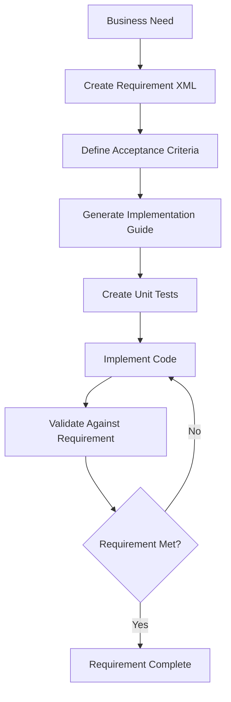

# Requirements Template Guide

**Version:** 1.0  
**Date:** 2025-07-17  
**Purpose:** This guide explains how to use the Requirements Template XML to create comprehensive, traceable requirements that integrate with implementation guides and unit tests.

## Table of Contents

1. [Overview](#1-overview)
2. [Template Structure](#2-template-structure)
3. [Creating Requirements](#3-creating-requirements)
4. [Linking to Implementation and Tests](#4-linking-to-implementation-and-tests)
5. [Requirements Types](#5-requirements-types)
6. [Writing Effective Requirements](#6-writing-effective-requirements)
7. [Traceability](#7-traceability)
8. [AI Prompts for Requirements](#8-ai-prompts-for-requirements)
9. [Examples](#9-examples)
10. [Best Practices](#10-best-practices)

## 1. Overview

The Requirements Template provides a structured format for capturing all types of requirements in a software project. It ensures:

- **Completeness**: All aspects of a requirement are documented
- **Traceability**: Clear links between requirements, implementation, and tests
- **Testability**: Each requirement has measurable acceptance criteria
- **Clarity**: Structured format prevents ambiguity
- **Integration**: Direct links to implementation guides and test suites

### Requirements Workflow



## 2. Template Structure

### 2.1 Core Sections

```xml
<Requirement>
    <Metadata>           <!-- Identification and classification -->
    <Description>        <!-- What and why -->
    <Stakeholders>       <!-- Who is involved -->
    <UserStory>         <!-- User perspective -->
    <AcceptanceCriteria> <!-- How to verify -->
    <FunctionalRequirements>    <!-- What it must do -->
    <NonFunctionalRequirements> <!-- How well it must perform -->
    <TechnicalRequirements>     <!-- Technology constraints -->
    <Constraints>        <!-- Limitations -->
    <Dependencies>       <!-- What it depends on -->
    <UseCases>          <!-- Detailed scenarios -->
    <DataRequirements>   <!-- Data models and volume -->
    <ValidationRules>    <!-- Business rules -->
    <UserInterface>      <!-- UI/UX requirements -->
    <ImplementationReferences>  <!-- Links to implementation guides -->
    <TestReferences>     <!-- Links to test suites -->
    <Traceability>       <!-- Relationships to other requirements -->
    <RiskAssessment>     <!-- Potential risks -->
    <ReviewHistory>      <!-- Change tracking -->
</Requirement>
```

### 2.2 Key Components

#### Metadata
```xml
<Metadata>
    <RequirementID>REQ-AUTH-001</RequirementID>
    <Title>Secure User Authentication</Title>
    <Type>Functional</Type>
    <Priority>Critical</Priority>
    <Status>Draft</Status>
    <Category>Authentication</Category>
</Metadata>
```

#### User Story
```xml
<UserStory>
    <AsA>registered user</AsA>
    <IWant>to log in securely</IWant>
    <SoThat>I can access my personalized content</SoThat>
</UserStory>
```

#### Acceptance Criteria
```xml
<AcceptanceCriteria>
    <Criterion id="AC_001" testable="true">
        <Given>I am on the login page</Given>
        <When>I enter valid credentials and click login</When>
        <Then>I should be redirected to the dashboard</Then>
    </Criterion>
</AcceptanceCriteria>
```

## 3. Creating Requirements

### 3.1 Step-by-Step Process

1. **Identify the Need**
   - Business requirement
   - User request
   - Technical necessity
   - Compliance requirement

2. **Classify the Requirement**
   - Type: Functional, Non-functional, Technical
   - Priority: Critical, High, Medium, Low
   - Category: Feature area

3. **Write Clear Description**
   - Summary: One sentence
   - Details: Full context
   - Business Value: Why it matters
   - Scope: What's included/excluded

4. **Define Acceptance Criteria**
   - Use Given-When-Then format
   - Make them testable
   - Cover all scenarios

5. **Specify Technical Details**
   - Input/output data
   - Performance targets
   - Security requirements
   - Integration points

6. **Link to Implementation**
   - Reference implementation guides
   - Reference test suites
   - Maintain traceability

### 3.2 Requirement ID Convention

```
[TYPE]-[CATEGORY]-[NUMBER]
```

Examples:
- `REQ-AUTH-001` - Authentication requirement
- `REQ-PERF-001` - Performance requirement
- `REQ-SEC-001` - Security requirement
- `REQ-DATA-001` - Data requirement

## 4. Linking to Implementation and Tests

### 4.1 Implementation References

Link requirements to implementation guides:

```xml
<ImplementationReferences>
    <ImplementationGuide id="AUTH_001_JWT_SERVICE" 
                        path="implementation/guides/auth/jwt_service.xml">
        <Description>JWT authentication service implementation</Description>
        <Coverage>80% - Covers login and token validation</Coverage>
    </ImplementationGuide>
    <ImplementationGuide id="AUTH_002_PASSWORD_RESET" 
                        path="implementation/guides/auth/password_reset.xml">
        <Description>Password reset functionality</Description>
        <Coverage>20% - Covers password reset flow</Coverage>
    </ImplementationGuide>
</ImplementationReferences>
```

### 4.2 Test References

Link requirements to test suites:

```xml
<TestReferences>
    <TestSuite id="AUTH_SUITE_001" 
               path="tests/requirements/REQ-AUTH-001/auth_suite.xml">
        <Description>Complete authentication test suite</Description>
        <TestCases>
            <TestCase id="TC_AUTH_001" verifiesAC="AC_001">
                Valid login test
            </TestCase>
            <TestCase id="TC_AUTH_002" verifiesAC="AC_002">
                Invalid credentials test
            </TestCase>
            <TestCase id="TC_AUTH_003" verifiesAC="AC_003">
                Account lockout test
            </TestCase>
        </TestCases>
    </TestSuite>
</TestReferences>
```

### 4.3 Traceability Example

```xml
<Traceability>
    <TracesTo type="Parent" id="REQ-SYSTEM-001">
        Overall system security requirement
    </TracesTo>
    <TracesFrom type="Child" id="REQ-AUTH-002">
        Two-factor authentication requirement
    </TracesFrom>
    <TracesFrom type="Child" id="REQ-AUTH-003">
        Password policy requirement
    </TracesFrom>
</Traceability>
```

## 5. Requirements Types

### 5.1 Functional Requirements

What the system must do:

```xml
<FunctionalRequirements>
    <FunctionalReq id="FR_001" priority="High">
        <Description>System must authenticate users via email/password</Description>
        <InputData>
            <DataItem name="email" type="string" required="true">
                <Description>User's email address</Description>
                <Validation>Valid email format</Validation>
                <Example>user@example.com</Example>
            </DataItem>
            <DataItem name="password" type="string" required="true">
                <Description>User's password</Description>
                <Validation>Minimum 8 characters</Validation>
            </DataItem>
        </InputData>
        <OutputData>
            <DataItem name="token" type="string">
                <Description>JWT authentication token</Description>
                <Format>JWT format with claims</Format>
            </DataItem>
            <DataItem name="user" type="object">
                <Description>User profile information</Description>
            </DataItem>
        </OutputData>
    </FunctionalReq>
</FunctionalRequirements>
```

### 5.2 Non-Functional Requirements

How well the system must perform:

```xml
<NonFunctionalRequirements>
    <Performance>
        <ResponseTime>
            <Target>200ms</Target>
            <Percentile>95th percentile</Percentile>
            <Conditions>Normal load (1000 concurrent users)</Conditions>
        </ResponseTime>
        <Throughput>
            <Target>5000 requests/second</Target>
            <ConcurrentUsers>10000</ConcurrentUsers>
        </Throughput>
    </Performance>
    
    <Security>
        <Authentication>OAuth2/JWT with refresh tokens</Authentication>
        <Authorization>Role-based access control (RBAC)</Authorization>
        <DataProtection>Passwords hashed with bcrypt</DataProtection>
        <Compliance>OWASP Top 10 compliance</Compliance>
    </Security>
    
    <Reliability>
        <Availability>99.9% uptime</Availability>
        <RecoveryTime>< 5 minutes</RecoveryTime>
    </Reliability>
</NonFunctionalRequirements>
```

### 5.3 Technical Requirements

Technology constraints and specifications:

```xml
<TechnicalRequirements>
    <Platform>Web</Platform>
    <Technology>
        <Frontend>React 18+</Frontend>
        <Backend>Node.js 18+</Backend>
        <Database>PostgreSQL 14+</Database>
        <Infrastructure>AWS</Infrastructure>
    </Technology>
    <Integration>
        <System name="Email Service">
            <Type>REST API</Type>
            <Description>SendGrid for email delivery</Description>
            <DataFlow>Async via message queue</DataFlow>
        </System>
    </Integration>
</TechnicalRequirements>
```

## 6. Writing Effective Requirements

### 6.1 Characteristics of Good Requirements

1. **Clear**: Unambiguous and easy to understand
2. **Complete**: All necessary information included
3. **Consistent**: No contradictions
4. **Testable**: Can be verified
5. **Feasible**: Can be implemented
6. **Traceable**: Linked to source and implementation
7. **Prioritized**: Importance is clear

### 6.2 Common Patterns

#### Authentication Requirement Pattern
```xml
<Requirement>
    <UserStory>
        <AsA>user</AsA>
        <IWant>to authenticate securely</IWant>
        <SoThat>I can access protected resources</SoThat>
    </UserStory>
    <AcceptanceCriteria>
        <!-- Login scenarios -->
        <!-- Logout scenarios -->
        <!-- Session management -->
        <!-- Error handling -->
    </AcceptanceCriteria>
</Requirement>
```

#### Data Processing Pattern
```xml
<Requirement>
    <UserStory>
        <AsA>data analyst</AsA>
        <IWant>to process large datasets</IWant>
        <SoThat>I can generate insights</SoThat>
    </UserStory>
    <DataRequirements>
        <!-- Input formats -->
        <!-- Processing rules -->
        <!-- Output formats -->
        <!-- Performance targets -->
    </DataRequirements>
</Requirement>
```

#### API Integration Pattern
```xml
<Requirement>
    <TechnicalRequirements>
        <Integration>
            <!-- External system details -->
            <!-- Authentication method -->
            <!-- Data exchange format -->
            <!-- Error handling -->
            <!-- Rate limiting -->
        </Integration>
    </TechnicalRequirements>
</Requirement>
```

## 7. Traceability

### 7.1 Traceability Matrix

Track requirement coverage across the system:

```
Requirement ID | Implementation Guides | Test Suites | Status
--------------|---------------------|-------------|--------
REQ-AUTH-001  | AUTH_001, AUTH_002  | TS_AUTH_001 | 80%
REQ-PERF-001  | PERF_001           | TS_PERF_001 | 100%
REQ-SEC-001   | SEC_001, SEC_002    | TS_SEC_001  | 60%
```

### 7.2 Dependency Tracking

```xml
<Dependencies>
    <Dependency type="Requirement" id="REQ-DATA-001">
        <Description>Requires user data model to be defined</Description>
        <Status>Completed</Status>
        <Impact>Cannot implement without user schema</Impact>
    </Dependency>
    <Dependency type="System" id="EMAIL_SERVICE">
        <Description>Requires email service for notifications</Description>
        <Status>Available</Status>
        <Impact>No email notifications without this service</Impact>
    </Dependency>
</Dependencies>
```

## 8. AI Prompts for Requirements

### 8.1 Generate Requirements from User Stories

```
Given these user stories:
1. As a user, I want to reset my password if I forget it
2. As an admin, I want to manage user accounts
3. As a user, I want to see my login history

Generate comprehensive requirements using the Requirements_Template.xml format that include:
- Functional requirements with input/output specifications
- Non-functional requirements (security, performance)
- Acceptance criteria in Given-When-Then format
- Technical requirements and constraints
- Links to related requirements
```

### 8.2 Generate Requirements from Business Description

```
Our e-commerce platform needs a shopping cart feature that:
- Allows users to add/remove items
- Persists cart across sessions
- Calculates taxes and shipping
- Integrates with payment gateway
- Handles inventory validation

Create detailed requirements in XML format covering:
- All functional aspects
- Performance requirements (response time, concurrent users)
- Security requirements (PCI compliance)
- Data requirements (cart schema, persistence)
- Integration requirements
- Complete acceptance criteria for each feature
```

### 8.3 Generate Non-Functional Requirements

```
For a healthcare application handling patient data:

Generate comprehensive non-functional requirements covering:
- Security (HIPAA compliance, encryption, access control)
- Performance (response times, throughput, scalability)
- Reliability (uptime, recovery, data integrity)
- Usability (accessibility, user experience)
- Compliance (regulatory requirements)

Use the Requirements_Template.xml format with specific metrics and targets.
```

### 8.4 Generate Test Cases from Requirements

```
Given this requirement:
[Paste requirement XML]

Generate:
1. Complete test suite structure
2. Test cases for each acceptance criterion
3. Edge cases and negative scenarios
4. Performance test scenarios
5. Security test scenarios

Format as Unit_Test_Template.xml files that verify the requirement.
```

## 9. Examples

### 9.1 Complete Authentication Requirement

```xml
<?xml version="1.0" encoding="UTF-8"?>
<Requirement>
    <Metadata>
        <RequirementID>REQ-AUTH-001</RequirementID>
        <Title>User Authentication System</Title>
        <Version>1.0</Version>
        <Type>Functional</Type>
        <Priority>Critical</Priority>
        <Status>Approved</Status>
        <Category>Authentication</Category>
        <Tags>security, authentication, login, api</Tags>
        <CreatedBy>john.doe@company.com</CreatedBy>
        <CreatedDate>2024-01-15</CreatedDate>
    </Metadata>

    <Description>
        <Summary>Users must be able to authenticate securely to access the system</Summary>
        <Details>
            The system requires a secure authentication mechanism that supports 
            email/password login with JWT tokens for session management. This is 
            critical for protecting user data and ensuring only authorized access.
        </Details>
        <BusinessValue>
            Enables secure user access, protects sensitive data, and provides 
            foundation for all user-specific features.
        </BusinessValue>
        <Scope>
            Includes: Basic login/logout, password reset, session management
            Excludes: Social login, two-factor authentication (future phase)
        </Scope>
    </Description>

    <UserStory>
        <AsA>registered user</AsA>
        <IWant>to log in with my email and password</IWant>
        <SoThat>I can access my personal dashboard and data</SoThat>
    </UserStory>

    <AcceptanceCriteria>
        <Criterion id="AC_001" testable="true">
            <Given>I am on the login page</Given>
            <When>I enter valid email and password and click login</When>
            <Then>I should be redirected to my dashboard</Then>
        </Criterion>
        <Criterion id="AC_002" testable="true">
            <Given>I am on the login page</Given>
            <When>I enter invalid credentials</When>
            <Then>I should see an error message "Invalid email or password"</Then>
        </Criterion>
        <Criterion id="AC_003" testable="true">
            <Given>I have failed to login 5 times</Given>
            <When>I try to login again</When>
            <Then>My account should be locked for 15 minutes</Then>
        </Criterion>
    </AcceptanceCriteria>

    <FunctionalRequirements>
        <FunctionalReq id="FR_001" priority="High">
            <Description>Login with email and password</Description>
            <InputData>
                <DataItem name="email" type="string" required="true">
                    <Description>User's email address</Description>
                    <Validation>Valid email format (RFC 5322)</Validation>
                    <Example>user@example.com</Example>
                </DataItem>
                <DataItem name="password" type="string" required="true">
                    <Description>User's password</Description>
                    <Validation>8-128 characters</Validation>
                </DataItem>
            </InputData>
            <OutputData>
                <DataItem name="token" type="string">
                    <Description>JWT authentication token</Description>
                    <Format>JWT with user claims</Format>
                </DataItem>
                <DataItem name="refreshToken" type="string">
                    <Description>Refresh token for token renewal</Description>
                </DataItem>
                <DataItem name="user" type="object">
                    <Description>Basic user profile</Description>
                </DataItem>
            </OutputData>
            <BusinessRules>
                <Rule id="BR_001">Passwords must be hashed before storage</Rule>
                <Rule id="BR_002">Failed login attempts must be tracked</Rule>
                <Rule id="BR_003">Account lockout after 5 failed attempts</Rule>
            </BusinessRules>
        </FunctionalReq>
    </FunctionalRequirements>

    <NonFunctionalRequirements>
        <Performance>
            <ResponseTime>
                <Target>200ms</Target>
                <Percentile>95th percentile</Percentile>
                <Conditions>Normal load (1000 concurrent users)</Conditions>
            </ResponseTime>
        </Performance>
        <Security>
            <Authentication>JWT with RS256 algorithm</Authentication>
            <DataProtection>Passwords hashed with bcrypt (10 rounds)</DataProtection>
            <Compliance>OWASP Authentication Guidelines</Compliance>
        </Security>
    </NonFunctionalRequirements>

    <ImplementationReferences>
        <ImplementationGuide id="AUTH_001_JWT_SERVICE" 
                            path="implementation/guides/AUTH_001_JWT_Service.xml">
            <Description>JWT authentication service implementation</Description>
            <Coverage>90%</Coverage>
        </ImplementationGuide>
    </ImplementationReferences>

    <TestReferences>
        <TestSuite id="AUTH_SUITE_001" 
                   path="tests/unit/auth/AuthService.test.xml">
            <Description>Authentication service test suite</Description>
            <TestCases>
                <TestCase id="test_login_valid" verifiesAC="AC_001">
                    Valid login credentials test
                </TestCase>
                <TestCase id="test_login_invalid" verifiesAC="AC_002">
                    Invalid credentials test
                </TestCase>
                <TestCase id="test_account_lockout" verifiesAC="AC_003">
                    Account lockout test
                </TestCase>
            </TestCases>
        </TestSuite>
    </TestReferences>
</Requirement>
```

### 9.2 Performance Requirement Example

```xml
<Requirement>
    <Metadata>
        <RequirementID>REQ-PERF-001</RequirementID>
        <Title>API Response Time Performance</Title>
        <Type>NonFunctional</Type>
        <Priority>High</Priority>
        <Category>Performance</Category>
    </Metadata>

    <Description>
        <Summary>All API endpoints must respond within acceptable time limits</Summary>
        <Details>
            To ensure good user experience, API endpoints must respond quickly 
            even under load. This requirement defines specific performance targets.
        </Details>
    </Description>

    <NonFunctionalRequirements>
        <Performance>
            <ResponseTime>
                <Target>100ms</Target>
                <Percentile>50th percentile</Percentile>
                <Conditions>Normal load</Conditions>
            </ResponseTime>
            <ResponseTime>
                <Target>200ms</Target>
                <Percentile>95th percentile</Percentile>
                <Conditions>Normal load</Conditions>
            </ResponseTime>
            <ResponseTime>
                <Target>1000ms</Target>
                <Percentile>99th percentile</Percentile>
                <Conditions>Peak load</Conditions>
            </ResponseTime>
            <Throughput>
                <Target>10000 requests/second</Target>
                <ConcurrentUsers>5000</ConcurrentUsers>
            </Throughput>
        </Performance>
    </NonFunctionalRequirements>

    <TestReferences>
        <TestSuite id="PERF_SUITE_001" 
                   path="tests/performance/api_performance.xml">
            <Description>API performance test suite</Description>
        </TestSuite>
    </TestReferences>
</Requirement>
```

## 10. Best Practices

### 10.1 Writing Requirements

1. **Use Active Voice**: "The system shall..." not "It should be possible..."
2. **Be Specific**: Avoid vague terms like "fast", "user-friendly"
3. **One Requirement Per Item**: Don't combine multiple requirements
4. **Include Examples**: Provide concrete examples for clarity
5. **Define Success Criteria**: Clear, measurable acceptance criteria

### 10.2 Organization

1. **Consistent IDs**: Follow naming conventions
2. **Group Related Requirements**: Use categories effectively
3. **Maintain Versions**: Track changes over time
4. **Regular Reviews**: Keep requirements up to date

### 10.3 Integration

1. **Link Everything**: Connect requirements to implementation and tests
2. **Maintain Traceability**: Track coverage and dependencies
3. **Automate Validation**: Use scripts to check completeness
4. **Generate Reports**: Regular status updates on requirement coverage

### 10.4 Common Mistakes to Avoid

1. **Ambiguous Language**: "The system should be fast" ❌
   - Better: "Response time < 200ms for 95% of requests" ✅

2. **Technical Implementation in Requirements**: "Use PostgreSQL database" ❌
   - Better: "Persist user data with ACID compliance" ✅

3. **Untestable Criteria**: "The UI should be intuitive" ❌
   - Better: "Users complete registration in < 2 minutes" ✅

4. **Missing Edge Cases**: Only happy path scenarios ❌
   - Include error cases, boundaries, exceptions ✅

## Summary

The Requirements Template provides a comprehensive framework for capturing all aspects of software requirements. By following this guide and using the template consistently, teams can:

- Create clear, testable requirements
- Maintain traceability throughout development
- Ensure complete test coverage
- Reduce ambiguity and misunderstandings
- Accelerate development with clear specifications

Remember: Good requirements are the foundation of successful software projects. Time invested in creating comprehensive requirements pays dividends throughout the development lifecycle.

---

**Related Resources:**
- [Requirements_Template.xml](./Requirement_Template.xml) - The XML template
- [Implementation_Guide_Template.xml](./Implementation_Guide_Template.xml) - Implementation guides
- [Unit_Test_Template.xml](./Unit_Test_Template.xml) - Test templates
- [Requirements_Principles.md](./Requirements_Principles.md) - Requirements engineering principles