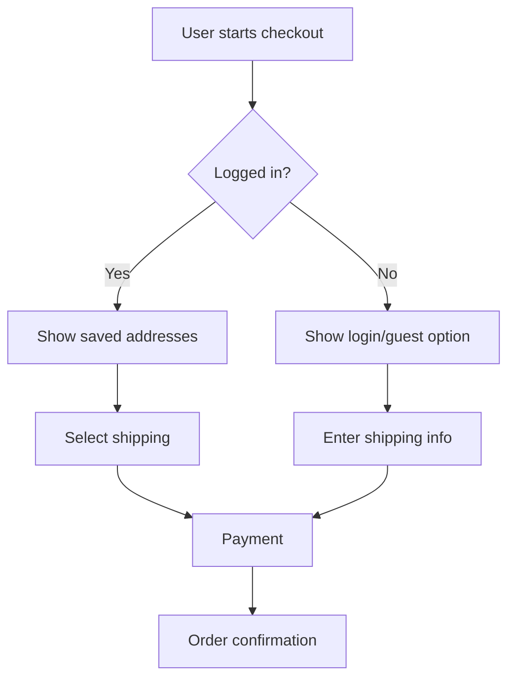
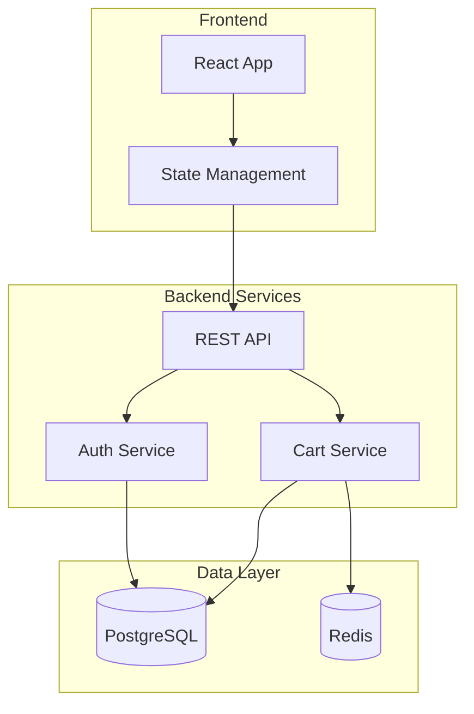
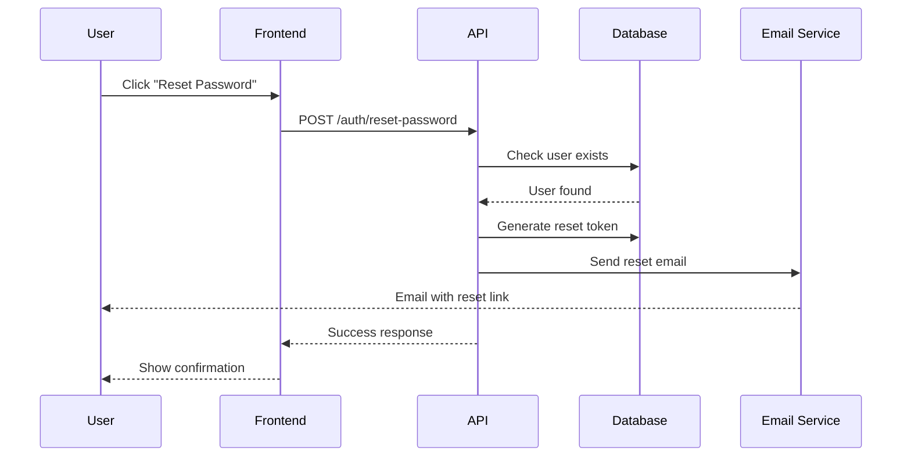
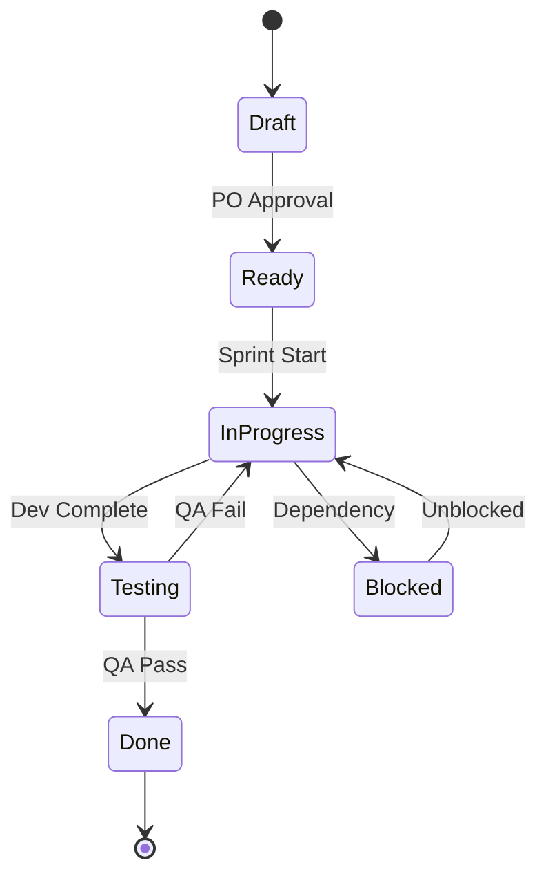
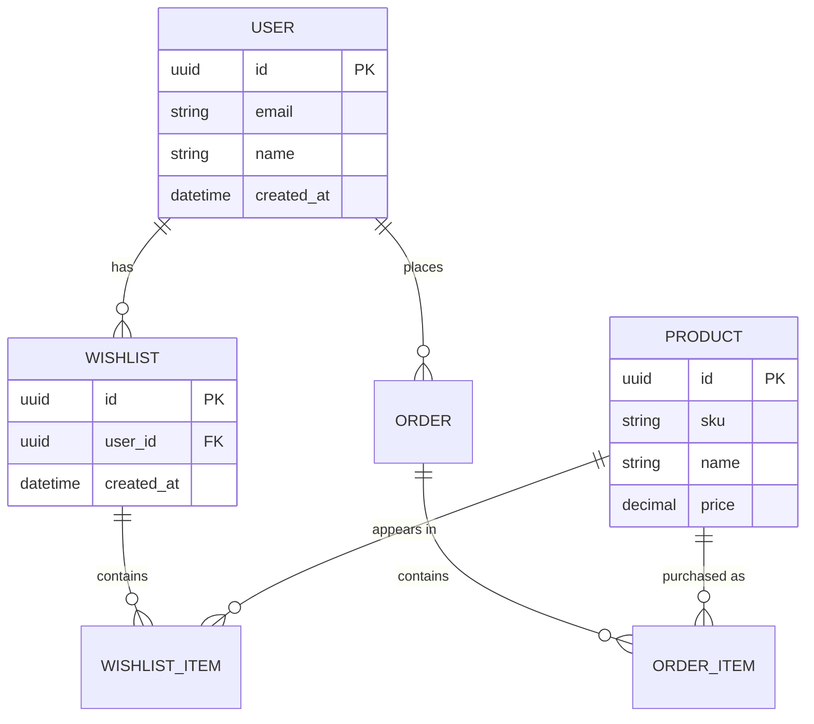

# User Story Markdown Template Guide

**Version:** 1.0  
**Date:** 2025-07-17  
**Purpose:** This guide explains how to use the Markdown-based User Story template, including best practices for incorporating diagrams, maintaining version control, and integrating with development workflows.

## Table of Contents

1. [Why Markdown for User Stories](#1-why-markdown-for-user-stories)
2. [Template Structure Overview](#2-template-structure-overview)
3. [Using Mermaid Diagrams](#3-using-mermaid-diagrams)
4. [Writing Effective Sections](#4-writing-effective-sections)
5. [Integration with Development Tools](#5-integration-with-development-tools)
6. [Best Practices](#6-best-practices)
7. [Examples and Patterns](#7-examples-and-patterns)
8. [Tooling and Automation](#8-tooling-and-automation)

## 1. Why Markdown for User Stories

### Advantages of Markdown

1. **Version Control Friendly**
   - Plain text format works perfectly with Git
   - Easy to track changes and review in pull requests
   - Merge conflicts are readable and resolvable

2. **Developer Friendly**
   - Familiar format for most developers
   - Can be edited in any text editor
   - Renders beautifully in GitHub, GitLab, IDEs

3. **Rich Formatting**
   - Tables for structured data
   - Code blocks with syntax highlighting
   - Mermaid diagrams for visual communication
   - Links to related documents

4. **Tooling Support**
   - Preview in VS Code, IntelliJ, etc.
   - Convert to PDF, HTML, or other formats
   - Integrate with documentation systems
   - Searchable in codebase

### Comparison with XML

| Aspect | Markdown | XML |
|--------|----------|-----|
| Readability | High - human-friendly | Low - verbose tags |
| Editing | Any text editor | Specialized tools preferred |
| Validation | Linting available | Schema validation |
| Diagrams | Native Mermaid support | External tools needed |
| Version Control | Excellent | Good but verbose diffs |

## 2. Template Structure Overview

### Core Sections

```markdown
# User Story: [Title]           <!-- Clear, searchable title -->
[Metadata Block]                <!-- Key information at a glance -->
## Story Card                   <!-- The classic As a/I want/So that -->
## Story Details               <!-- Classification and sizing -->
## Context & Background        <!-- Why this story exists -->
## Acceptance Criteria         <!-- Testable requirements -->
## User Flows                  <!-- Visual flow diagrams -->
## Technical Considerations    <!-- Architecture and implementation -->
## Dependencies               <!-- What must be done first -->
## UI/UX Mockups             <!-- Visual designs -->
## Business Rules            <!-- Constraints and logic -->
## Test Strategy             <!-- How we'll verify -->
## Definition of Done        <!-- Completion checklist -->
## Success Metrics           <!-- How we'll measure value -->
```

### Metadata Best Practices

Keep metadata concise and scannable:

```markdown
**Story ID:** US-FEAT-001  
**Epic:** User Management  
**Sprint:** Sprint 23  
**Priority:** High  
**Status:** In Progress  
**Story Points:** 5  
```

## 3. Using Mermaid Diagrams

### 3.1 User Flow Diagrams

Simple flow with decision points:

```markdown

```

Renders as:


### 3.2 System Architecture Diagrams

Show component interactions:

```markdown

```

### 3.3 Sequence Diagrams

For complex interactions:

```markdown

```

### 3.4 State Diagrams

For complex state management:

```markdown

```

### 3.5 Entity Relationship Diagrams

For data models:

```markdown

```

## 4. Writing Effective Sections

### 4.1 Story Card Section

Keep it conversational and focused:

```markdown
## Story Card

**As a** busy parent shopping on mobile  
**I want** to quickly reorder my previous groceries  
**So that** I can complete my weekly shopping in under 5 minutes

### Example
> As a returning customer  
> I want to see "Buy Again" for my frequent purchases  
> So that I don't have to search for items I buy regularly
```

### 4.2 Acceptance Criteria

Use structured format with clear priority:

```markdown
## Acceptance Criteria

### AC-1: View Previous Orders ⭐ Must Have
**Given** I am logged in to my account  
**When** I navigate to "Order History"  
**Then** I should see my last 10 orders  
**And** each order shows total, date, and item count  

### AC-2: Quick Reorder ⭐ Must Have
**Given** I am viewing a previous order  
**When** I click "Reorder All"  
**Then** all available items are added to my cart  
**And** unavailable items show a notification  
**And** I see the total items added count
```

### 4.3 Technical Considerations

Be specific but not prescriptive:

```markdown
## Technical Considerations

### Performance Requirements
- Page load: < 2s on 4G connection
- Reorder action: < 500ms response time
- Support 50 items per order without degradation

### API Design
| Endpoint | Method | Purpose | Cache |
|----------|---------|---------|-------|
| `/api/orders/history` | GET | List user's orders | 5 min |
| `/api/orders/{id}/reorder` | POST | Reorder all items | No |
| `/api/orders/{id}/items` | GET | Get order details | 1 hour |

### Data Considerations
- Index on `user_id` and `created_at` for fast history queries
- Soft delete for orders (never hard delete)
- Track price changes between original and reorder
```

### 4.4 Business Rules

Clear, numbered, and testable:

```markdown
## Business Rules

1. **Order History Limit**: Show maximum 6 months of orders
2. **Availability Check**: Items must be in stock to reorder
3. **Price Updates**: Use current prices, not historical
4. **Substitutions**: If exact item unavailable, suggest similar
5. **Minimum Order**: Reorder respects current minimum ($35)

### Rule Examples
- ❌ Original order: $30 → Below current minimum
- ✅ Add items or meet minimum to proceed
- ⚠️ Price increased: Show notification with new total
```

## 5. Integration with Development Tools

### 5.1 VS Code Extensions

Recommended extensions for user stories:
- **Markdown All in One**: TOC, formatting, preview
- **Mermaid Preview**: Live diagram rendering
- **Markdown Lint**: Consistency checking
- **Git Lens**: See story evolution

### 5.2 Git Workflow

```bash
# Create feature branch for story
git checkout -b story/US-FEAT-001-quick-reorder

# Commit story updates
git add user-stories/US-FEAT-001.md
git commit -m "story: Add technical details for quick reorder"

# Link commits to story
git commit -m "feat(US-FEAT-001): Implement reorder API endpoint"
```

### 5.3 CI/CD Integration

```yaml
# .github/workflows/story-validation.yml
name: Validate User Stories

on:
  pull_request:
    paths:
      - 'user-stories/**/*.md'

jobs:
  validate:
    runs-on: ubuntu-latest
    steps:
      - uses: actions/checkout@v3
      
      - name: Lint Markdown
        uses: DavidAnson/markdownlint-cli2-action@v9
        
      - name: Check Story IDs
        run: |
          # Ensure unique story IDs
          find user-stories -name "*.md" -exec grep -H "Story ID:" {} \; | 
          sort | uniq -d | 
          if read; then echo "Duplicate IDs found" && exit 1; fi
          
      - name: Validate Mermaid Diagrams
        uses: neenjaw/mermaid-compile-action@v1
```

### 5.4 Documentation Generation

Convert stories to other formats:

```javascript
// generate-story-docs.js
const fs = require('fs');
const markdown = require('markdown-pdf');

// Convert to PDF for stakeholders
markdown().from('user-stories/US-FEAT-001.md')
  .to('docs/stories/US-FEAT-001.pdf', () => {
    console.log('PDF generated');
  });

// Generate HTML for web viewing
const marked = require('marked');
const html = marked.parse(storyContent);
```

## 6. Best Practices

### 6.1 File Organization

```
user-stories/
├── README.md                 # Index of all stories
├── in-progress/             # Active development
│   ├── US-FEAT-001.md
│   └── US-FEAT-002.md
├── completed/               # Done stories
│   └── sprint-01/
│       ├── US-AUTH-001.md
│       └── US-AUTH-002.md
├── backlog/                 # Future stories
│   ├── epic-shopping-cart/
│   └── epic-analytics/
└── templates/
    └── user-story-template.md
```

### 6.2 Naming Conventions

```
[TYPE]-[AREA]-[NUMBER].md

Types:
- US (User Story)
- BUG (Bug Fix)
- TECH (Technical)
- SPIKE (Research)

Examples:
- US-CART-001.md      # Cart feature story
- BUG-CHECKOUT-015.md # Checkout bug fix
- TECH-PERF-003.md    # Performance improvement
- SPIKE-PAYMENT-001.md # Payment gateway research
```

### 6.3 Linking Stories

Use relative links for traceability:

```markdown
## Dependencies

### Story Dependencies
- [US-AUTH-001](../completed/sprint-01/US-AUTH-001.md) - User authentication ✅
- [US-CART-002](./US-CART-002.md) - Shopping cart base ⏳

### Related Documentation
- [API Specification](../../docs/api/cart-api.md)
- [Database Schema](../../docs/database/schema.md#cart)
- [UI Mockups](../../design/mockups/cart-ui.fig)
```

### 6.4 Story Reviews

Use PR templates for story reviews:

```markdown
<!-- .github/pull_request_template/story_review.md -->
## Story Review Checklist

### Story Quality
- [ ] Clear value proposition in story card
- [ ] All acceptance criteria are testable
- [ ] Technical considerations are complete
- [ ] Dependencies are identified
- [ ] Definition of Done is appropriate

### Technical Review
- [ ] API endpoints are RESTful
- [ ] Performance requirements are realistic
- [ ] Security considerations addressed
- [ ] Database impacts considered

### Diagrams
- [ ] User flows are clear
- [ ] Technical diagrams are accurate
- [ ] All Mermaid syntax is valid
```

## 7. Examples and Patterns

### 7.1 Story Template Variations

#### Minimal Story (Spike/Research)
```markdown
# Spike: Research Payment Gateways

**Story ID:** SPIKE-PAY-001  
**Timebox:** 3 days  
**Status:** In Progress

## Goal
Research and recommend payment gateway for our e-commerce platform.

## Questions to Answer
1. Which gateways support our requirements?
2. What are the costs and fee structures?
3. How complex is the integration?
4. What about international payments?

## Success Criteria
- [ ] Comparison matrix of top 3 options
- [ ] POC integration with recommended option
- [ ] Cost analysis for 1-year projection
- [ ] Team presentation with recommendation

## Findings
[Document findings here as research progresses]
```

#### Bug Story Template
```markdown
# Bug: Cart Total Calculation Error

**Bug ID:** BUG-CART-042  
**Severity:** High  
**Found in:** v2.3.1  
**Status:** Testing

## Problem Description
Cart total shows incorrect amount when coupon and sale price combine.

## Steps to Reproduce
1. Add item with sale price $50 (original $100)
2. Apply 20% off coupon
3. **Expected:** $40 total (20% off $50)
4. **Actual:** $30 total (calculating from original price)

## Root Cause
[Identified after investigation]

## Fix Approach
[Technical solution]

## Test Cases
- [ ] Sale price only
- [ ] Coupon only  
- [ ] Sale + coupon
- [ ] Multiple items with mixed discounts
```

### 7.2 Complex Story with Sub-tasks

```markdown
# Epic Story: Multi-Currency Support

**Story ID:** US-EPIC-001  
**Points:** 40 (Epic total)  
**Duration:** 3 sprints

## Overview
Enable customers to shop in their local currency.

## Sub-Stories

### Phase 1: Backend Support (13 points)
- [ ] [US-CURR-001](./US-CURR-001.md) - Currency conversion service (5)
- [ ] [US-CURR-002](./US-CURR-002.md) - Multi-currency pricing model (8)

### Phase 2: Frontend Display (13 points)
- [ ] [US-CURR-003](./US-CURR-003.md) - Currency selector UI (5)
- [ ] [US-CURR-004](./US-CURR-004.md) - Price display formatting (3)
- [ ] [US-CURR-005](./US-CURR-005.md) - Cart currency handling (5)

### Phase 3: Checkout & Payment (14 points)
- [ ] [US-CURR-006](./US-CURR-006.md) - Payment gateway integration (8)
- [ ] [US-CURR-007](./US-CURR-007.md) - Order history in multiple currencies (6)

## Success Metrics
- Support 10 major currencies
- < 100ms overhead for conversion
- 99.9% accuracy in exchange rates
```

## 8. Tooling and Automation

### 8.1 Story Generation Script

```python
#!/usr/bin/env python3
# generate-story.py

import os
import datetime
from string import Template

def generate_story(story_type, area, title):
    # Get next ID
    existing = [f for f in os.listdir('user-stories/backlog') 
                if f.startswith(f'{story_type}-{area}')]
    next_id = len(existing) + 1
    
    story_id = f"{story_type}-{area}-{next_id:03d}"
    
    # Load template
    with open('templates/user-story-template.md', 'r') as f:
        template = Template(f.read())
    
    # Generate story
    content = template.substitute(
        story_id=story_id,
        title=title,
        date=datetime.date.today(),
        type=story_type
    )
    
    # Save story
    filename = f"user-stories/backlog/{story_id}.md"
    with open(filename, 'w') as f:
        f.write(content)
    
    print(f"Created: {filename}")

# Usage
generate_story("US", "CART", "Add bulk discount support")
```

### 8.2 Story Status Dashboard

```javascript
// story-dashboard.js
const fs = require('fs');
const glob = require('glob');

function getStoryStatus() {
  const stories = glob.sync('user-stories/**/*.md');
  const status = {
    draft: [],
    ready: [],
    inProgress: [],
    testing: [],
    done: [],
    total: stories.length
  };
  
  stories.forEach(file => {
    const content = fs.readFileSync(file, 'utf8');
    const statusMatch = content.match(/\*\*Status:\*\* (\w+)/);
    if (statusMatch) {
      const storyStatus = statusMatch[1].toLowerCase();
      status[storyStatus]?.push(file);
    }
  });
  
  return status;
}

// Generate report
const report = getStoryStatus();
console.log('Story Status Report:');
console.log(`Total Stories: ${report.total}`);
console.log(`In Progress: ${report.inProgress.length}`);
console.log(`Ready: ${report.ready.length}`);
```

### 8.3 Mermaid Diagram Extractor

```bash
#!/bin/bash
# extract-diagrams.sh

# Extract all Mermaid diagrams from stories
mkdir -p diagrams/extracted

for file in user-stories/**/*.md; do
  story_id=$(grep -m1 "Story ID:" "$file" | sed 's/.*: //')
  
  # Extract Mermaid blocks
  awk '/```mermaid/,/```/' "$file" | 
  sed '1d;$d' > "diagrams/extracted/${story_id}-diagram.mmd"
done

# Generate PNG files
for mmd in diagrams/extracted/*.mmd; do
  mmdc -i "$mmd" -o "${mmd%.mmd}.png"
done
```

## Best Practices Summary

### Do's ✅
1. **Keep stories focused** - One clear goal per story
2. **Use diagrams liberally** - Visual > textual for flows
3. **Link everything** - Stories, docs, code, tests
4. **Version control** - Track all changes in Git
5. **Regular updates** - Keep status current
6. **Collaborate** - Use PR reviews for stories
7. **Automate** - Scripts for repetitive tasks

### Don'ts ❌
1. **Don't over-document** - Keep it concise
2. **Don't skip diagrams** - They clarify complex flows
3. **Don't hardcode** - Use references and variables
4. **Don't duplicate** - Link instead of copy
5. **Don't neglect updates** - Stale stories mislead
6. **Don't work in isolation** - Share early and often

## Conclusion

Markdown-based user stories offer a perfect balance of structure and flexibility. By combining the readability of Markdown with the visual power of Mermaid diagrams, teams can create living documentation that evolves with the code and provides clear communication throughout the development process.

The key is to find the right level of detail for your team and project, then consistently apply the format across all stories. With proper tooling and automation, Markdown stories become a powerful part of your development workflow.

---

**Related Resources:**
- [User_Story_Template.md](./User_Story_Template.md) - The Markdown template
- [User_Story_Template.xml](./User_Story_Template.xml) - XML version
- [User_Story_Principles.md](./User_Story_Principles.md) - Core principles
- [Mermaid Documentation](https://mermaid-js.github.io/) - Diagram syntax