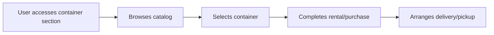

# User Story: Cat Travel Container Management

**Story ID:** US-CAT-003
**Epic:** Cat Travel Logistics
**Sprint:** 2
**Created:** 2025-07-20
**Last Updated:** 2025-07-20
**Author:** AI Interviewer

## Story Card

**As a** cat owner
**I want** to rent or purchase cat-approved travel containers
**So that** I can ensure my cat travels safely and comfortably in a compliant carrier

### Example
> As a cat owner
> I want to rent an airline-approved cat carrier
> So that I don't have to buy one for a single trip

## Story Details

**Type:** Feature
**Priority:** Medium
**Story Points:** 3
**Business Value:** Medium
**Risk:** Medium
**Status:** Draft

**Tags:** `frontend` `backend` `api` `inventory`

## Context & Background

### User Persona
**Name:** Olivia the Occasional Traveler
**Description:** A cat owner who travels infrequently with her cat and doesn't want to invest in purchasing a high-quality, airline-compliant carrier for rare use, or is unsure which carrier meets regulations.
**Goals:**
- To easily access suitable travel containers without significant upfront cost.
- To be confident that the container meets all necessary travel regulations.

**Pain Points:**
- Cost of purchasing specialized carriers.
- Confusion about carrier size and compliance requirements for different airlines/modes of transport.

### Business Context
This story provides a practical solution for a common logistical challenge, offering convenience and potentially generating revenue through rentals or sales. It enhances the app's utility beyond just information.

### Current State vs Desired State
| Current State | Desired State |
|--------------|---------------|
| Researching and purchasing carriers, often with uncertainty about compliance | Easy rental/purchase of verified, compliant carriers through the app |

## Acceptance Criteria

### AC-1: Browse Available Containers
**Priority:** Must Have

**Given** I am in the app's travel container section
**When** I browse available containers for rent or purchase
**Then** I should see a catalog of cat-approved carriers with details on size, features, and compliance (e.g., airline-approved)

### AC-2: Rent/Purchase Process
**Priority:** Must Have

**Given** I have selected a travel container
**When** I proceed to rent or purchase it
**Then** I should be guided through a clear process for selection, payment, and delivery/pickup arrangements

### AC-3: Container Compliance Information
**Priority:** Must Have

**Given** I am viewing a specific travel container
**When** I review its details
**Then** I should see explicit information about its compliance with major airline standards (e.g., IATA compliant, specific airline approvals)

## User Flows

### Happy Path Flow

## Technical Considerations

### Performance Requirements
- Catalog loading should be quick, within 2-3 seconds.

### Security Requirements
- Payment information must be handled with the highest security standards.

### Scalability Requirements
- The inventory management system should support a growing number of containers and rental transactions.

### Usability Requirements
- The rental/purchase workflow must be straightforward and easy to complete.

## Definition of Done

- [ ] Code complete and follows coding standards
- [ ] Unit tests written and passing
- [ ] Integration tests passing (inventory, payment integration)
- [ ] Code reviewed and approved
- [ ] API documentation updated for container management
- [ ] Performance requirements met for catalog loading
- [ ] Security review completed for payment processing
- [ ] Accessibility standards met for container selection
- [ ] Deployed to staging environment
- [ ] QA testing passed
- [ ] Product Owner acceptance
