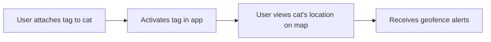

# User Story: Cat Tracking Tag Integration

**Story ID:** US-CAT-004
**Epic:** Cat Safety & Monitoring
**Sprint:** 2
**Created:** 2025-07-20
**Last Updated:** 2025-07-20
**Author:** AI Interviewer

## Story Card

**As a** cat owner
**I want** to track my cat's location using an integrated tag
**So that** I can quickly locate them if they get lost, especially during travel

### Example
> As a cat owner
> I want to see my cat's real-time location on a map
> So that I can have peace of mind knowing where they are

## Story Details

**Type:** Feature
**Priority:** High
**Story Points:** 8
**Business Value:** High
**Risk:** High
**Status:** Draft

**Tags:** `frontend` `backend` `api` `gps` `hardware`

## Context & Background

### User Persona
**Name:** Mark the Worried Traveler
**Description:** A cat owner who is anxious about his cat getting lost or escaping in unfamiliar environments while traveling, and desires a reliable way to locate them quickly.
**Goals:**
- To minimize the risk of losing his cat during travel.
- To have immediate access to his cat's location if an escape occurs.

**Pain Points:**
- Fear of losing a pet in an unfamiliar place.
- Lack of reliable, integrated tracking solutions for cats.

### Business Context
This story addresses a critical safety concern for cat owners, providing a unique and highly valuable feature that differentiates the app. It builds trust and offers significant peace of mind.

### Current State vs Desired State
| Current State | Desired State |
|--------------|---------------|
| Relying on luck or manual search if a cat escapes | Real-time, accurate location tracking and alerts via the app |

## Acceptance Criteria

### AC-1: Real-time Location Display
**Priority:** Must Have

**Given** my cat is wearing the tracking tag and it is active
**When** I open the app's tracking feature
**Then** I should see my cat's current location displayed on a map with an accuracy of within 3 meters

### AC-2: Location History
**Priority:** Should Have

**Given** my cat's tracking tag has been active for a period
**When** I view the tracking feature
**Then** I should be able to see a history of my cat's movements on the map

### AC-3: Geofencing and Alerts
**Priority:** Should Have

**Given** I have set up a geofence (e.g., around my hotel room or a safe outdoor area)
**When** my cat's tag leaves or enters the defined geofence
**Then** I should receive an immediate notification on my device

### AC-4: Battery Status and Connectivity
**Priority:** Must Have

**Given** my cat's tracking tag is connected
**When** I view the tracking feature
**Then** I should see the tag's current battery level and connectivity status

## User Flows

### Happy Path Flow

## Technical Considerations

### Performance Requirements
- Location updates should be near real-time, with minimal latency.

### Security Requirements
- Location data must be highly secure and private, accessible only by the owner.

### Scalability Requirements
- The tracking infrastructure must support 100,000 concurrent users with active tags.

### Usability Requirements
- The tracking interface must be clear and easy to interpret, even in stressful situations.

### Reliability Requirements
- The tracking system must maintain an accuracy of within 3 meters.

## Definition of Done

- [ ] Code complete and follows coding standards
- [ ] Unit tests written and passing
- [ ] Integration tests passing (GPS data, alerts)
- [ ] Code reviewed and approved
- [ ] API documentation updated for tracking features
- [ ] Performance requirements met for location updates
- [ ] Security review completed for location data
- [ ] Accessibility standards met for tracking interface
- [ ] Deployed to staging environment
- [ ] QA testing passed
- [ ] Product Owner acceptance
