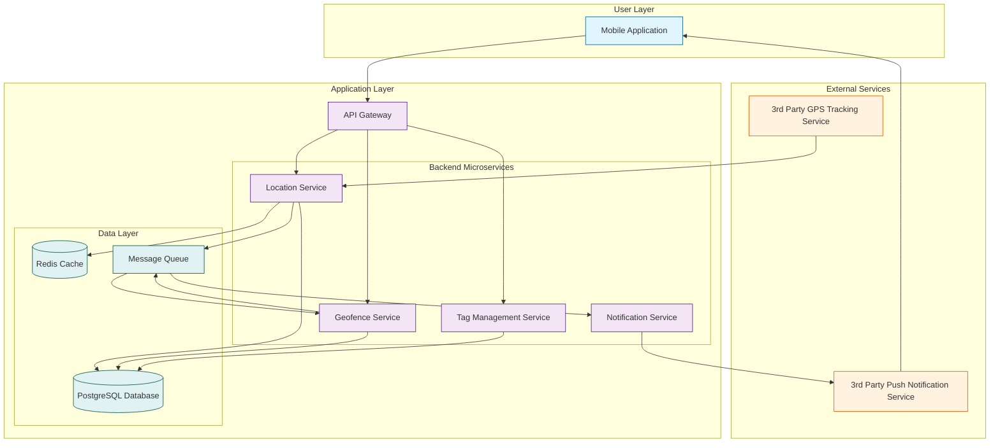

# CatSafetyMonitoring: System Architecture

**Version:** 1.0  
**Date:** 2025-07-21  
**Status:** Draft  
**Author(s):** Gemini

## 1. Introduction

This document outlines the system architecture for the Cat Safety & Monitoring component. It details the architectural goals, principles, components, and technology stack chosen to meet the functional and non-functional requirements for real-time cat tracking, geofencing, and alerts.

## 2. Architectural Goals

- **Reliability**: The system must provide highly reliable and available location data.
- **Scalability**: The architecture must scale to handle a large number of tracking tags and concurrent users.
- **Performance**: Location updates and alerts must be delivered in near real-time.
- **Security**: All data, especially sensitive location data, must be handled securely.
- **Maintainability**: The system should be designed in a modular way to allow for easy maintenance and future enhancements.

## 3. Architectural Principles

- **Microservices Architecture**: The backend will be composed of small, independent services to promote modularity, scalability, and maintainability.
- **Asynchronous Communication**: Event-driven communication will be used between services to enhance decoupling and resilience.
- **Cloud-Native**: The system will be designed to run on a cloud platform to leverage managed services, scalability, and reliability.
- **Security by Design**: Security will be integrated into every layer of the architecture, from data transmission to storage.

## 4. System Components

### 4.1 Mobile Application (Client)
- **Description**: The user-facing component on iOS and Android devices. It provides the UI for viewing the cat's location, managing geofences, and receiving alerts.
- **Responsibilities**: Renders maps, displays location data, sends requests to the API Gateway, and handles push notifications.

### 4.2 API Gateway
- **Description**: The single entry point for all client requests. It routes requests to the appropriate backend services.
- **Responsibilities**: Handles authentication, rate limiting, and request routing. It provides a unified API to the mobile client.

### 4.3 Location Service
- **Description**: The core service responsible for processing and managing location data from the tracking tags.
- **Responsibilities**: Ingests raw location data from the third-party GPS service, processes it, and stores it in the database. It also provides an API for querying location history.

### 4.4 Geofence Service
- **Description**: Manages geofence creation, updates, and evaluation.
- **Responsibilities**: Stores geofence definitions. It continuously evaluates the cat's current location against defined geofences and triggers events when a boundary is crossed.

### 4.5 Notification Service
- **Description**: Responsible for sending alerts to users.
- **Responsibilities**: Listens for events (e.g., geofence breach, low battery) and sends push notifications to the user's mobile device via a third-party notification service.

### 4.6 Tag Management Service
- **Description**: Manages the lifecycle and status of the tracking tags.
- **Responsibilities**: Handles tag registration, and monitors battery level and connectivity status.

## 5. Architecture Diagram

## 6. Technology Stack

| Layer                | Technology        | Purpose                                      |
| -------------------- | ----------------- | -------------------------------------------- |
| Mobile Application   | Swift (iOS), Kotlin (Android) | Native mobile application development        |
| API Gateway          | Kong / Traefik    | Request routing, authentication, rate limiting |
| Backend Microservices| Python (FastAPI)  | Building efficient and scalable APIs         |
| Database             | PostgreSQL        | Primary data storage for location and user data |
| Cache                | Redis             | Caching frequently accessed data             |
| Message Queue        | RabbitMQ / Kafka  | Asynchronous communication between services  |
| Deployment           | Docker, Kubernetes| Containerization and orchestration           |

## 7. Data Flow

1.  The 3rd Party GPS Tracking Service sends raw location data for a tag to the **Location Service**.
2.  The **Location Service** processes the data, stores it in the **PostgreSQL Database**, and publishes a `location_updated` event to the **Message Queue**.
3.  The **Geofence Service** consumes the `location_updated` event. It checks if the new location breaches any defined geofences. If a breach occurs, it publishes a `geofence_breached` event.
4.  The **Notification Service** consumes `geofence_breached` and `low_battery` events and sends a push notification to the user via the **3rd Party Push Notification Service**.
5.  The **Mobile App** communicates with the backend services via the **API Gateway** to fetch location history, manage geofences, and view tag status.

## 8. Security Architecture

- **Authentication**: All API requests will be authenticated using JWT tokens.
- **Authorization**: Role-based access control (RBAC) will be implemented to ensure users can only access their own data.
- **Data Encryption**: All data will be encrypted in transit using TLS 1.3 and at rest using AES-256 encryption.
- **Secure Communication**: Communication between services within the cluster will be secured using mTLS.

## 9. Deployment Architecture

The application will be deployed on a Kubernetes cluster in a cloud environment (e.g., AWS, GCP, Azure). Each microservice will be deployed as a separate Docker container, allowing for independent scaling and updates. A CI/CD pipeline will be used to automate the build, testing, and deployment process.

## 10. Non-Functional Requirements

- **Performance**: The system will be designed to handle location updates with a latency of less than 500ms.
- **Scalability**: The microservices architecture will allow for horizontal scaling of individual components to handle increased load.
- **Reliability**: The system will have a target availability of 99.9%, with automated failover and recovery mechanisms.
