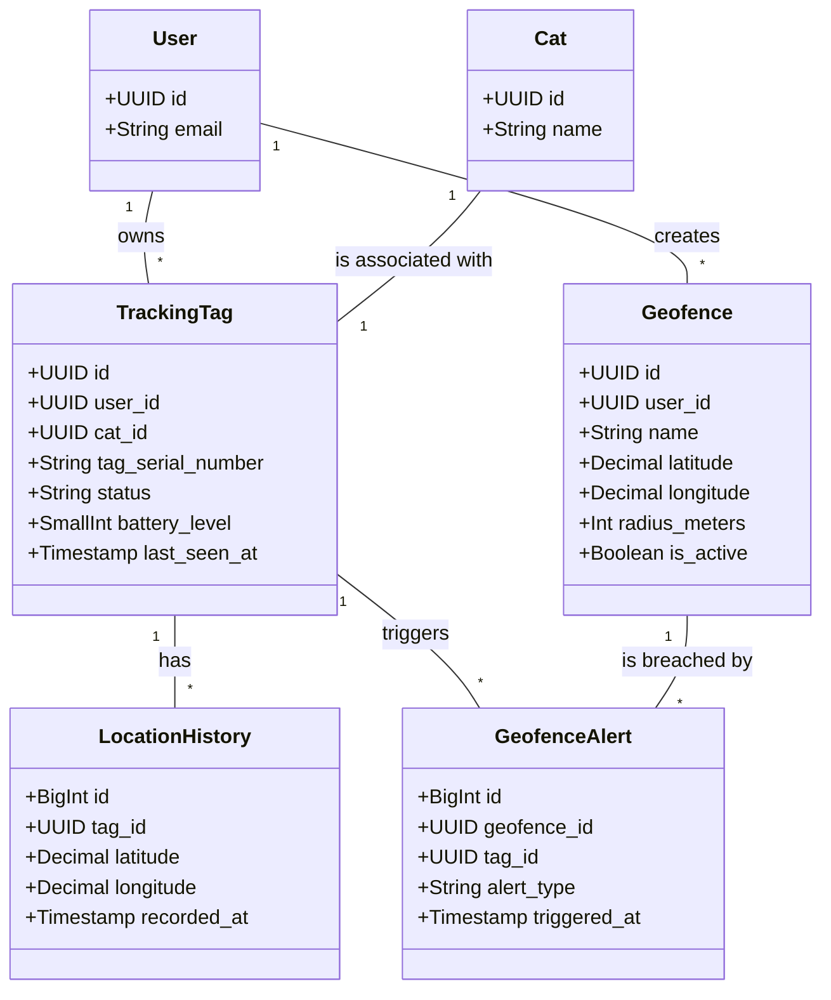

# CatSafetyMonitoring: Data Model

**Version:** 1.0  
**Date:** 2025-07-21  
**Status:** Draft  
**Author(s):** Gemini

## 1. Overview

This document describes the data model for the Cat Safety & Monitoring component. It defines the database schema, tables, columns, and relationships required to store and manage data for cat tracking, geofencing, and tag management.

## 2. Schema Design

### 2.1 Schema Name: `cat_safety`

This schema will contain all the tables related to the safety and monitoring features of the Cat Travel App.

## 3. Core Entities

### 3.1 Table: `tracking_tags`

- **Purpose**: Stores information about each tracking tag.

```sql
CREATE TABLE cat_safety.tracking_tags (
    id UUID PRIMARY KEY DEFAULT gen_random_uuid(),
    user_id UUID NOT NULL REFERENCES users.accounts(id),
    cat_id UUID NOT NULL REFERENCES cats.profiles(id),
    tag_serial_number VARCHAR(255) UNIQUE NOT NULL,
    status VARCHAR(50) NOT NULL DEFAULT 'INACTIVE', -- e.g., INACTIVE, ACTIVE, OFFLINE, LOW_BATTERY
    battery_level SMALLINT, -- Percentage (0-100)
    activated_at TIMESTAMPTZ,
    last_seen_at TIMESTAMPTZ,
    created_at TIMESTAMPTZ NOT NULL DEFAULT NOW(),
    updated_at TIMESTAMPTZ NOT NULL DEFAULT NOW()
);
```

| Column              | Type        | Description                                      | Constraints                |
| ------------------- | ----------- | ------------------------------------------------ | -------------------------- |
| id                  | UUID        | Primary key                                      | PK, NOT NULL               |
| user_id             | UUID        | Foreign key to the user who owns the tag         | FK, NOT NULL               |
| cat_id              | UUID        | Foreign key to the cat associated with the tag   | FK, NOT NULL               |
| tag_serial_number   | VARCHAR(255)| Unique serial number of the tracking tag         | UNIQUE, NOT NULL           |
| status              | VARCHAR(50) | Current status of the tag                        | NOT NULL                   |
| battery_level       | SMALLINT    | Current battery level of the tag                 |                            |
| activated_at        | TIMESTAMPTZ | Timestamp when the tag was first activated       |                            |
| last_seen_at        | TIMESTAMPTZ | Timestamp of the last communication from the tag |                            |
| created_at          | TIMESTAMPTZ | Record creation timestamp                        | NOT NULL                   |
| updated_at          | TIMESTAMPTZ | Record last update timestamp                     | NOT NULL                   |

### 3.2 Table: `location_history`

- **Purpose**: Stores the historical location data for each tracking tag.

```sql
CREATE TABLE cat_safety.location_history (
    id BIGSERIAL PRIMARY KEY,
    tag_id UUID NOT NULL REFERENCES cat_safety.tracking_tags(id),
    latitude DECIMAL(9, 6) NOT NULL,
    longitude DECIMAL(9, 6) NOT NULL,
    accuracy_meters DECIMAL(5, 2),
    recorded_at TIMESTAMPTZ NOT NULL
);
```

| Column          | Type           | Description                               | Constraints  |
| --------------- | -------------- | ----------------------------------------- | ------------ |
| id              | BIGSERIAL      | Primary key                               | PK, NOT NULL |
| tag_id          | UUID           | Foreign key to the tracking tag           | FK, NOT NULL |
| latitude        | DECIMAL(9, 6)  | Latitude of the location                  | NOT NULL     |
| longitude       | DECIMAL(9, 6)  | Longitude of the location                 | NOT NULL     |
| accuracy_meters | DECIMAL(5, 2)  | Accuracy of the location reading in meters|              |
| recorded_at     | TIMESTAMPTZ    | Timestamp when the location was recorded  | NOT NULL     |

### 3.3 Table: `geofences`

- **Purpose**: Stores user-defined geofences.

```sql
CREATE TABLE cat_safety.geofences (
    id UUID PRIMARY KEY DEFAULT gen_random_uuid(),
    user_id UUID NOT NULL REFERENCES users.accounts(id),
    name VARCHAR(255) NOT NULL,
    latitude DECIMAL(9, 6) NOT NULL,
    longitude DECIMAL(9, 6) NOT NULL,
    radius_meters INT NOT NULL,
    is_active BOOLEAN NOT NULL DEFAULT TRUE,
    created_at TIMESTAMPTZ NOT NULL DEFAULT NOW(),
    updated_at TIMESTAMPTZ NOT NULL DEFAULT NOW()
);
```

| Column        | Type        | Description                               | Constraints  |
| ------------- | ----------- | ----------------------------------------- | ------------ |
| id            | UUID        | Primary key                               | PK, NOT NULL |
| user_id       | UUID        | Foreign key to the user who created the geofence | FK, NOT NULL |
| name          | VARCHAR(255)| Name of the geofence                      | NOT NULL     |
| latitude      | DECIMAL(9, 6)| Latitude of the geofence center           | NOT NULL     |
| longitude     | DECIMAL(9, 6)| Longitude of the geofence center          | NOT NULL     |
| radius_meters | INT         | Radius of the geofence in meters          | NOT NULL     |
| is_active     | BOOLEAN     | Whether the geofence is currently active  | NOT NULL     |
| created_at    | TIMESTAMPTZ | Record creation timestamp                 | NOT NULL     |
| updated_at    | TIMESTAMPTZ | Record last update timestamp              | NOT NULL     |

### 3.4 Table: `geofence_alerts`

- **Purpose**: Logs alerts triggered by geofence breaches.

```sql
CREATE TABLE cat_safety.geofence_alerts (
    id BIGSERIAL PRIMARY KEY,
    geofence_id UUID NOT NULL REFERENCES cat_safety.geofences(id),
    tag_id UUID NOT NULL REFERENCES cat_safety.tracking_tags(id),
    alert_type VARCHAR(50) NOT NULL, -- e.g., 'ENTER', 'EXIT'
    triggered_at TIMESTAMPTZ NOT NULL DEFAULT NOW()
);
```

| Column       | Type        | Description                               | Constraints  |
| ------------ | ----------- | ----------------------------------------- | ------------ |
| id           | BIGSERIAL   | Primary key                               | PK, NOT NULL |
| geofence_id  | UUID        | Foreign key to the geofence that was breached | FK, NOT NULL |
| tag_id       | UUID        | Foreign key to the tag that triggered the alert | FK, NOT NULL |
| alert_type   | VARCHAR(50) | Type of alert (e.g., ENTER, EXIT)         | NOT NULL     |
| triggered_at | TIMESTAMPTZ | Timestamp when the alert was triggered    | NOT NULL     |

## 4. Entity Relationship Diagram



## 5. Indexes

```sql
-- For faster lookup of location history by tag
CREATE INDEX idx_location_history_tag_id ON cat_safety.location_history(tag_id);

-- For faster lookup of geofences by user
CREATE INDEX idx_geofences_user_id ON cat_safety.geofences(user_id);

-- For faster lookup of tags by user
CREATE INDEX idx_tracking_tags_user_id ON cat_safety.tracking_tags(user_id);
```

## 6. Constraints

- **Foreign Keys**: Enforce relationships between tables as defined in the ERD.
- **Check Constraints**: The `battery_level` in `tracking_tags` should be between 0 and 100. The `radius_meters` in `geofences` must be greater than 0.
- **Unique Constraints**: The `tag_serial_number` in `tracking_tags` must be unique.

## 7. Data Validation Rules

- Latitude values must be between -90 and 90.
- Longitude values must be between -180 and 180.
- The `status` in `tracking_tags` must be one of the predefined valid statuses.

## 8. Migration Strategy

Database migrations will be managed using a tool like Flyway or Alembic. All schema changes will be version-controlled and applied incrementally.
