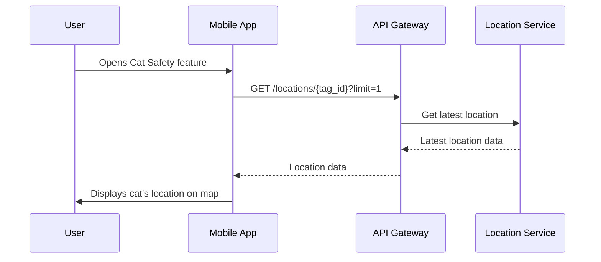
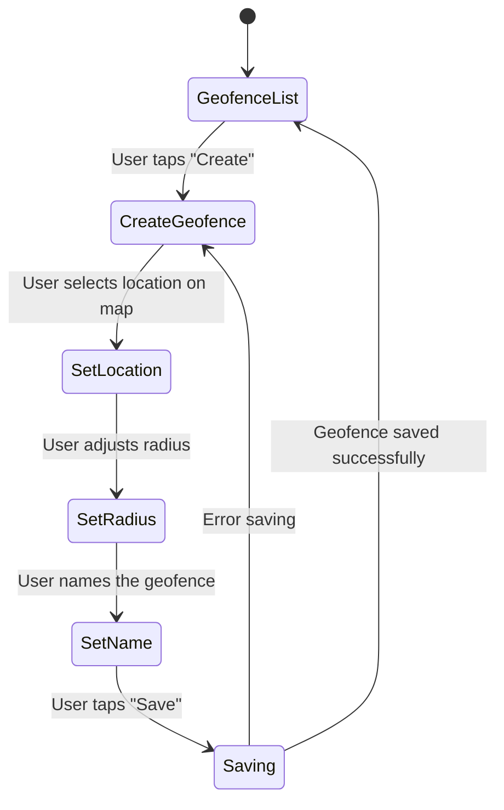
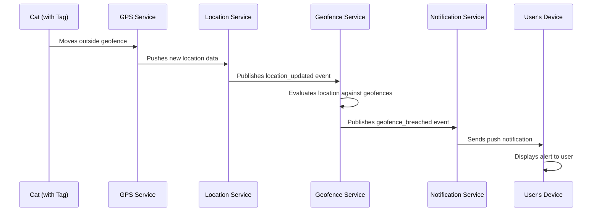

# CatSafetyMonitoring: UI/UX Design

**Version:** 1.0  
**Date:** 2025-07-21  
**Status:** Draft  
**Author(s):** Gemini

## 1. Overview

This document outlines the user interface (UI) and user experience (UX) design for the Cat Safety & Monitoring feature. The goal is to provide a simple, intuitive, and reassuring interface for users to monitor their cat's safety.

## 2. Wireframes and Mockups

*(Note: This section would typically contain visual wireframes and mockups from a design tool like Figma or Sketch. For this text-based representation, we will describe the key screens.)*

### 2.1 Main Tracking Screen
- **Description**: The primary screen for the feature. It will be a map-centric view.
- **Elements**:
    - A map that takes up most of the screen, displaying the cat's current location with a custom cat icon.
    - The user's current location is also shown for reference.
    - An overlay panel at the bottom with the cat's name, profile picture, and the tag's status (e.g., "Active", "Low Battery") and battery percentage.
    - A button to view location history.
    - A button to manage geofences.

### 2.2 Location History Screen
- **Description**: A screen to view the cat's past movements.
- **Elements**:
    - A map showing the historical path of the cat for a selected time period.
    - A date/time range selector to filter the history.
    - A list view of location points with timestamps.

### 2.3 Geofence Management Screen
- **Description**: A screen to create, view, and manage geofences.
- **Elements**:
    - A list of existing geofences with their name and status (active/inactive).
    - A button to create a new geofence.
    - When creating/editing a geofence, the user can set the center point on a map and adjust the radius with a slider.

## 3. User Flows

### 3.1 Viewing Cat's Location

### 3.2 Creating a Geofence

### 3.3 Receiving a Geofence Alert

## 4. Accessibility

- **Color Contrast**: The UI will use color combinations that meet WCAG AA standards.
- **Screen Readers**: All UI elements will have appropriate labels for screen readers.
- **Haptic Feedback**: The app will use haptic feedback for important actions, like when a geofence is successfully created or an alert is received.
