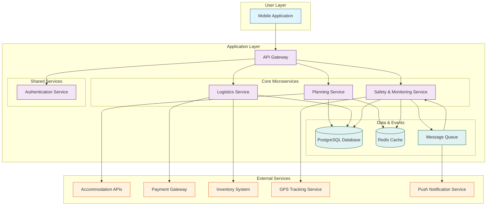

# Cat Travel App: System Architecture

**Version:** 1.0  
**Date:** 2025-07-21  
**Status:** Draft  
**Author(s):** Gemini

## 1. Introduction

This document outlines the high-level system architecture for the Cat Travel App. It illustrates how the three core components—`CatTravelPlanning`, `CatTravelLogistics`, and `CatSafetyMonitoring`—are organized and interact within a unified microservices architecture.

## 2. Architectural Goals

- **Modularity**: Each core component is an independent, deployable microservice, allowing for separate development, scaling, and maintenance.
- **Scalability**: The architecture is designed to scale each component based on its specific load.
- **Resilience**: The use of a message queue and an API gateway improves the system's resilience to the failure of individual services.
- **Unified User Experience**: Despite being composed of multiple services, the application provides a seamless and unified experience to the end-user.

## 3. Architectural Principles

- **Microservices**: The system is divided into services based on business capabilities.
- **Centralized Entry Point**: An API Gateway is used to provide a single, consistent entry point for the mobile client.
- **Asynchronous Communication**: A message queue is used for inter-service communication for non-blocking, event-driven workflows.
- **Shared Data Layer**: While each service has its own schema, they all reside within the same PostgreSQL database, allowing for easier data management and potential for data sharing if needed.

## 4. System Components

- **Mobile Application (Client)**: The single user-facing application for iOS and Android.
- **API Gateway**: The central gateway that routes requests to the appropriate service.
- **Planning Service**: Manages accommodation search and travel checklists.
- **Logistics Service**: Manages container rental and purchase.
- **Safety Service**: Manages real-time location tracking and geofencing.
- **Shared Services**: Common services such as User Authentication, which are used by all other components.

## 5. High-Level Architecture Diagram

