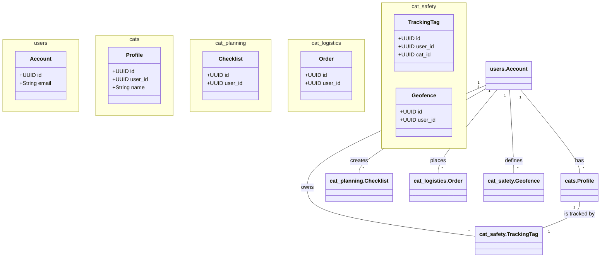

# Cat Travel App: Data Model

**Version:** 1.0  
**Date:** 2025-07-21  
**Status:** Draft  
**Author(s):** Gemini

## 1. Overview

This document provides a high-level overview of the data model for the Cat Travel App. It illustrates how the different data schemas for each component relate to each other and to shared data entities like users and cats.

## 2. Schema Organization

The database is organized into separate schemas to maintain modularity and clarity:

- **`users`**: Stores user account information.
- **`cats`**: Stores cat profile information.
- **`cat_planning`**: Contains tables for the Travel Planning component (checklists, etc.).
- **`cat_logistics`**: Contains tables for the Travel Logistics component (containers, orders, etc.).
- **`cat_safety`**: Contains tables for the Safety & Monitoring component (tags, locations, geofences, etc.).

## 3. High-Level Entity Relationship Diagram

This diagram shows the key relationships between the main tables in each schema.

## 4. Data Integrity

- **Foreign Keys**: Relationships between schemas are enforced using foreign keys to ensure data integrity. For example, the `user_id` in the `cat_planning.checklists` table is a foreign key to the `id` in the `users.accounts` table.
- **Data Ownership**: The `user_id` is a central element in almost every table, ensuring that all data is correctly associated with a specific user.
