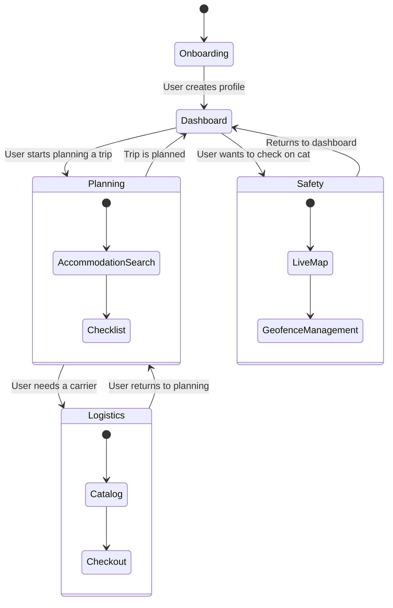

# Cat Travel App: UI/UX Design

**Version:** 1.0  
**Date:** 2025-07-21  
**Status:** Draft  
**Author(s):** Gemini

## 1. Overview

This document provides a high-level overview of the UI/UX design for the Cat Travel App. The design philosophy is to create a clean, intuitive, and reassuring experience for the user, guiding them through the three main stages of their journey: Planning, Logistics, and Safety.

## 2. Main Navigation

The application will feature a simple, tab-based navigation system at the bottom of the screen, allowing users to easily switch between the core components:

- **Plan**: The main screen for the `CatTravelPlanning` component, where users can search for accommodations and manage checklists.
- **Logistics**: The entry point for the `CatTravelLogistics` component, where users can browse and order travel containers.
- **Safety**: The dashboard for the `CatSafetyMonitoring` component, showing the real-time location and status of the user's cat.
- **Profile**: A screen for managing user and cat profiles.

## 3. High-Level User Flow

This diagram illustrates the typical journey a user might take through the application.

## 4. Design Principles

- **Consistency**: The UI will be consistent across all three components, with a shared color palette, typography, and button styles.
- **Clarity**: Information will be presented in a clear and concise manner, avoiding jargon.
- **Reassurance**: The design will use calming colors and clear iconography to provide a sense of reassurance, especially in the Safety component.
