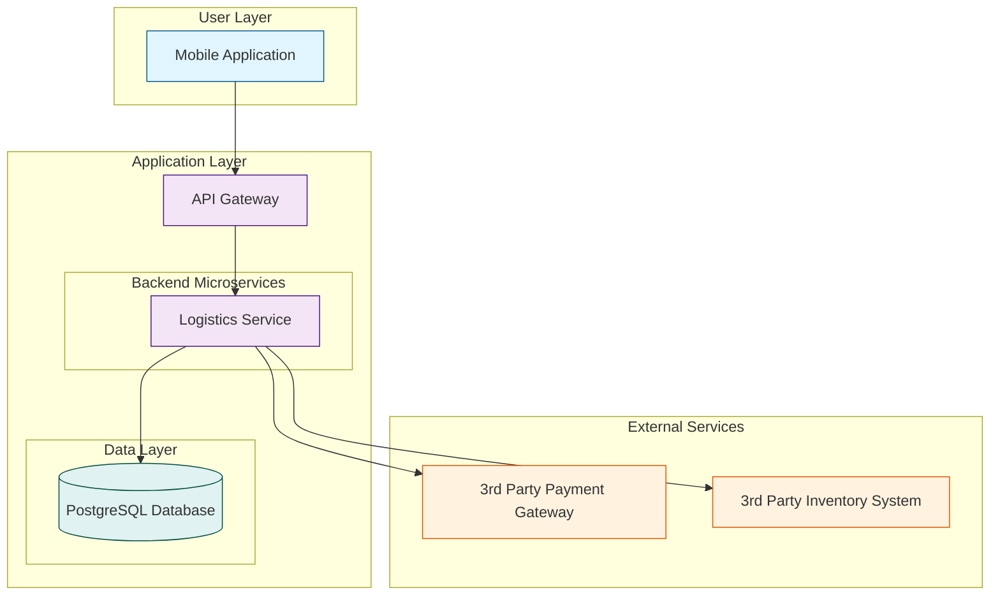

# CatTravelLogistics: System Architecture

**Version:** 1.0  
**Date:** 2025-07-21  
**Status:** Draft  
**Author(s):** Gemini

## 1. Introduction

This document outlines the system architecture for the Cat Travel Logistics component. It details the architectural design for providing users with the ability to rent or purchase cat-approved travel containers directly within the app.

## 2. Architectural Goals

- **Reliability**: Ensure the transaction process is reliable and that inventory data is accurate.
- **Security**: Protect user payment information and personal data.
- **Scalability**: The system must handle a growing product catalog and increasing transaction volumes.
- **Maintainability**: The component should be easy to update and manage.

## 3. Architectural Principles

- **Service-Oriented Architecture**: The logistics functionality will be encapsulated within a dedicated microservice.
- **Third-Party Integration**: Leverage trusted third-party services for payment processing and inventory management to reduce complexity and enhance security.
- **Secure by Design**: Implement security best practices throughout the component, especially in handling transactions.

## 4. System Components

### 4.1 Mobile Application (Client)
- **Description**: The user interface for browsing the container catalog, viewing product details, and completing the rental or purchase process.
- **Responsibilities**: Displays product information, collects user payment details securely, and communicates with the API Gateway.

### 4.2 API Gateway
- **Description**: The single entry point for all client requests related to travel logistics.
- **Responsibilities**: Handles authentication, rate limiting, and routes requests to the Logistics Service.

### 4.3 Logistics Service
- **Description**: The core backend service for managing travel container logistics.
- **Responsibilities**:
    - Manages the product catalog (containers for rent/purchase).
    - Interfaces with the Inventory Management System to check stock levels.
    - Initiates payment processing through the Payment Gateway.
    - Manages user orders and transaction history.

### 4.4 Inventory Management System (External)
- **Description**: A third-party system responsible for tracking the availability of rental containers and the stock of containers for sale.
- **Responsibilities**: Provides an API for querying stock levels and reserving items.

### 4.5 Payment Gateway (External)
- **Description**: A third-party service for securely processing credit card payments.
- **Responsibilities**: Handles all aspects of payment processing in a PCI-compliant manner.

## 5. Architecture Diagram

## 6. Technology Stack

| Layer                | Technology        | Purpose                                      |
| -------------------- | ----------------- | -------------------------------------------- |
| Mobile Application   | Swift (iOS), Kotlin (Android) | Native mobile application development        |
| API Gateway          | Kong / Traefik    | Request routing, authentication, rate limiting |
| Backend Microservice | Python (FastAPI)  | Building the Logistics Service API           |
| Database             | PostgreSQL        | Storing product catalog and order information|
| Deployment           | Docker, Kubernetes| Containerization and orchestration           |

## 7. Data Flow

1.  The **Mobile App** requests the container catalog from the **Logistics Service** via the **API Gateway**.
2.  The **Logistics Service** queries the **Inventory System** to get the latest stock information and combines it with product data from its own **Database**.
3.  When a user initiates a transaction, the **Mobile App** sends the order details to the **Logistics Service**.
4.  The **Logistics Service** reserves the item in the **Inventory System** and then redirects the user or forwards payment details to the **Payment Gateway**.
5.  Upon successful payment, the **Payment Gateway** sends a confirmation to the **Logistics Service**, which then finalizes the order and stores it in the **Database**.

## 8. Security Architecture

- **PCI Compliance**: All payment processing will be handled by a PCI-compliant third-party Payment Gateway. No sensitive credit card information will be stored on our servers.
- **Authentication**: All API requests will be authenticated using JWT tokens.
- **Data Encryption**: All data will be encrypted in transit (TLS 1.3) and at rest (AES-256).
