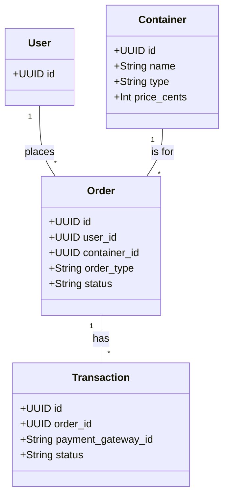

# CatTravelLogistics: Data Model

**Version:** 1.0  
**Date:** 2025-07-21  
**Status:** Draft  
**Author(s):** Gemini

## 1. Overview

This document describes the data model for the Cat Travel Logistics component. It defines the database schema for storing information about travel containers, orders, and transactions.

## 2. Schema Design

### 2.1 Schema Name: `cat_logistics`

This schema will contain all the tables related to the travel logistics features.

## 3. Core Entities

### 3.1 Table: `containers`

- **Purpose**: Stores the catalog of travel containers available for rent or purchase.

```sql
CREATE TABLE cat_logistics.containers (
    id UUID PRIMARY KEY DEFAULT gen_random_uuid(),
    name VARCHAR(255) NOT NULL,
    description TEXT,
    type VARCHAR(50) NOT NULL, -- e.g., RENTAL, PURCHASE
    price_cents INT, -- For purchase
    rental_price_per_day_cents INT, -- For rental
    dimensions_cm JSONB, -- {"length": 50, "width": 30, "height": 30}
    compliance_standards TEXT[], -- e.g., ["IATA", "Airline A"]
    image_url VARCHAR(255),
    is_active BOOLEAN NOT NULL DEFAULT TRUE,
    created_at TIMESTAMPTZ NOT NULL DEFAULT NOW(),
    updated_at TIMESTAMPTZ NOT NULL DEFAULT NOW()
);
```

### 3.2 Table: `orders`

- **Purpose**: Stores information about user orders for container rentals or purchases.

```sql
CREATE TABLE cat_logistics.orders (
    id UUID PRIMARY KEY DEFAULT gen_random_uuid(),
    user_id UUID NOT NULL REFERENCES users.accounts(id),
    container_id UUID NOT NULL REFERENCES cat_logistics.containers(id),
    order_type VARCHAR(50) NOT NULL, -- RENTAL or PURCHASE
    status VARCHAR(50) NOT NULL, -- e.g., PENDING, CONFIRMED, SHIPPED, DELIVERED, CANCELED
    rental_start_date DATE,
    rental_end_date DATE,
    total_price_cents INT NOT NULL,
    shipping_address JSONB,
    created_at TIMESTAMPTZ NOT NULL DEFAULT NOW(),
    updated_at TIMESTAMPTZ NOT NULL DEFAULT NOW()
);
```

### 3.3 Table: `transactions`

- **Purpose**: Stores information about payment transactions related to orders.

```sql
CREATE TABLE cat_logistics.transactions (
    id UUID PRIMARY KEY DEFAULT gen_random_uuid(),
    order_id UUID NOT NULL REFERENCES cat_logistics.orders(id),
    payment_gateway_id VARCHAR(255) NOT NULL, -- ID from the external payment gateway
    status VARCHAR(50) NOT NULL, -- e.g., SUCCEEDED, FAILED
    amount_cents INT NOT NULL,
    currency VARCHAR(10) NOT NULL DEFAULT 'USD',
    created_at TIMESTAMPTZ NOT NULL DEFAULT NOW()
);
```

## 4. Entity Relationship Diagram



## 5. Indexes

```sql
-- For faster lookup of orders by user
CREATE INDEX idx_orders_user_id ON cat_logistics.orders(user_id);

-- For faster lookup of transactions by order
CREATE INDEX idx_transactions_order_id ON cat_logistics.transactions(order_id);
```
