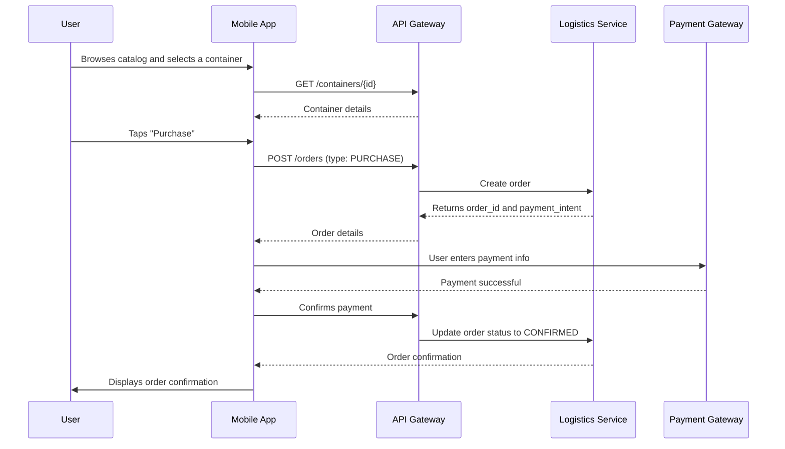
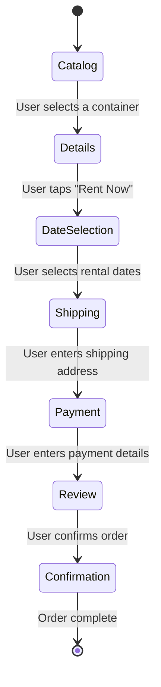

# CatTravelLogistics: UI/UX Design

**Version:** 1.0  
**Date:** 2025-07-21  
**Status:** Draft  
**Author(s):** Gemini

## 1. Overview

This document outlines the UI/UX design for the Cat Travel Logistics feature. The design aims to provide a simple and trustworthy e-commerce experience within the app.

## 2. Wireframes and Mockups

*(Note: This section would typically contain visual wireframes.)*

### 2.1 Container Catalog Screen
- **Description**: A screen displaying a grid or list of available travel containers.
- **Elements**:
    - Tabs or filters to switch between "Rent" and "Purchase".
    - Each item in the list will show a primary image, the container name, price, and a short description.
    - A search bar to find containers by name.

### 2.2 Container Details Screen
- **Description**: A screen showing all the details for a selected container.
- **Elements**:
    - A gallery of images.
    - The container name, price, and a full description.
    - A section detailing compliance standards (e.g., "IATA Compliant").
    - For rentals, a calendar to select start and end dates.
    - A prominent "Add to Cart" or "Rent Now" button.

### 2.3 Checkout Flow
- **Description**: A multi-step process to complete the transaction.
- **Steps**:
    1.  **Shipping Information**: A form to enter or select a shipping address.
    2.  **Payment**: A secure form (potentially a webview hosted by the payment gateway) to enter credit card details.
    3.  **Review and Confirm**: A final screen summarizing the order, including the container, price, and shipping address, with a "Confirm Order" button.

## 3. User Flows

### 3.1 Purchasing a Container

### 3.2 Renting a Container

