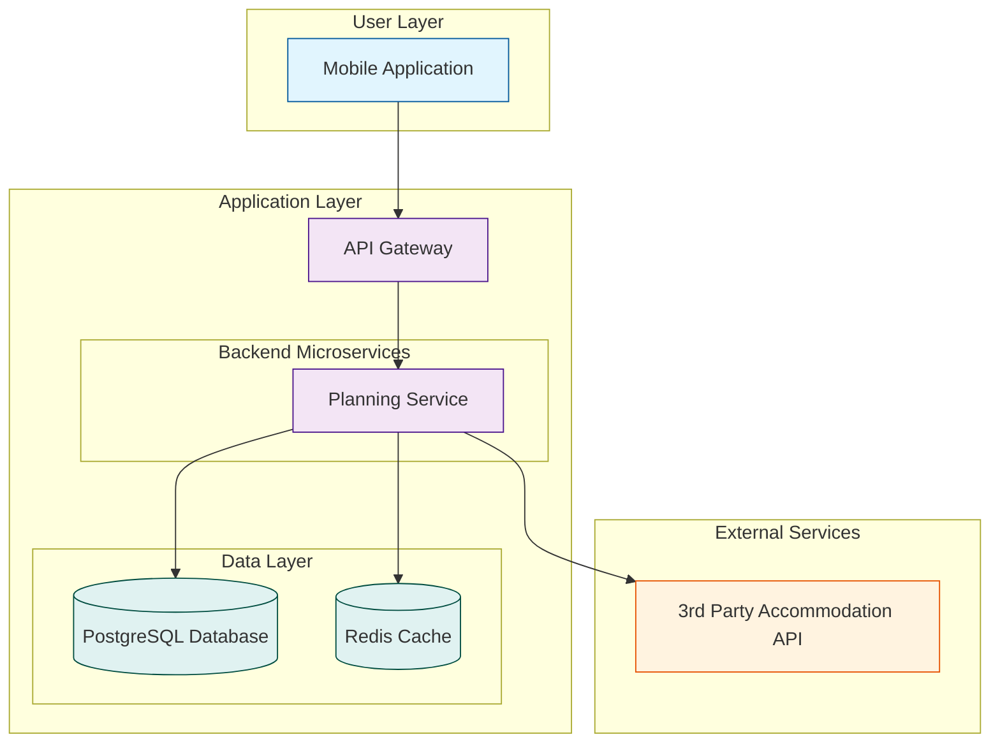

# CatTravelPlanning: System Architecture

**Version:** 1.0  
**Date:** 2025-07-21  
**Status:** Draft  
**Author(s):** Gemini

## 1. Introduction

This document outlines the system architecture for the Cat Travel Planning component. It details the design for the accommodation search and travel checklist features.

## 2. Architectural Goals

- **Performance**: The accommodation search must be fast and responsive.
- **Data Accuracy**: The information on accommodations and regulations must be accurate and up-to-date.
- **Scalability**: The system must handle a large number of search queries and a growing database of information.

## 3. Architectural Principles

- **Service-Oriented Architecture**: The planning features will be encapsulated within a dedicated microservice.
- **Third-Party Integration**: The system will rely on external APIs for accommodation data.
- **Caching**: A distributed cache will be used to optimize the performance of the accommodation search.

## 4. System Components

### 4.1 Mobile Application (Client)
- **Description**: The user interface for searching for accommodations and managing travel checklists.
- **Responsibilities**: Renders search results and checklists, and communicates with the API Gateway.

### 4.2 API Gateway
- **Description**: The single entry point for all client requests related to travel planning.
- **Responsibilities**: Handles authentication, rate limiting, and routes requests to the Planning Service.

### 4.3 Planning Service
- **Description**: The core backend service for managing travel planning features.
- **Responsibilities**:
    - Interfaces with external Accommodation Booking APIs to search for cat-friendly properties.
    - Caches search results to improve performance.
    - Manages customizable travel checklists.
    - Provides regulatory guidance information.

### 4.4 Accommodation Booking APIs (External)
- **Description**: Third-party APIs that provide data on accommodations, including pet policies.
- **Responsibilities**: Provides an API for searching and filtering properties.

## 5. Architecture Diagram

## 6. Technology Stack

| Layer                | Technology        | Purpose                                      |
| -------------------- | ----------------- | -------------------------------------------- |
| Mobile Application   | Swift (iOS), Kotlin (Android) | Native mobile application development        |
| API Gateway          | Kong / Traefik    | Request routing, authentication, rate limiting |
| Backend Microservice | Python (FastAPI)  | Building the Planning Service API            |
| Database             | PostgreSQL        | Storing checklists and regulatory information|
| Cache                | Redis             | Caching accommodation search results         |
| Deployment           | Docker, Kubernetes| Containerization and orchestration           |

## 7. Data Flow

1.  The **Mobile App** sends a search request for accommodations to the **Planning Service** via the **API Gateway**.
2.  The **Planning Service** first checks the **Redis Cache** for recent, similar search results.
3.  If no cached results are found, the **Planning Service** calls the external **Accommodation Booking API**.
4.  The results are then stored in the cache and returned to the **Mobile App**.
5.  Checklist management is handled directly by the **Planning Service** and the **PostgreSQL Database**.
