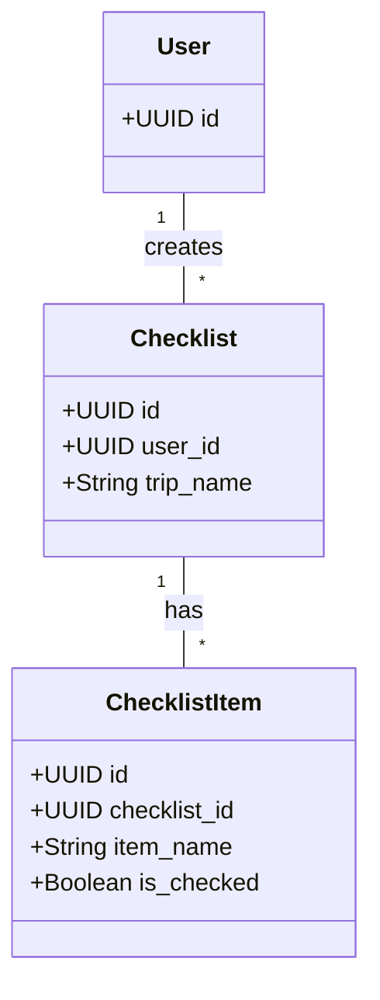

# CatTravelPlanning: Data Model

**Version:** 1.0  
**Date:** 2025-07-21  
**Status:** Draft  
**Author(s):** Gemini

## 1. Overview

This document describes the data model for the Cat Travel Planning component. It defines the database schema for storing travel checklists and regulatory guidance.

## 2. Schema Design

### 2.1 Schema Name: `cat_planning`

This schema will contain all the tables related to the travel planning features.

## 3. Core Entities

### 3.1 Table: `checklists`

- **Purpose**: Stores user-created travel checklists.

```sql
CREATE TABLE cat_planning.checklists (
    id UUID PRIMARY KEY DEFAULT gen_random_uuid(),
    user_id UUID NOT NULL REFERENCES users.accounts(id),
    trip_name VARCHAR(255) NOT NULL,
    created_at TIMESTAMPTZ NOT NULL DEFAULT NOW(),
    updated_at TIMESTAMPTZ NOT NULL DEFAULT NOW()
);
```

### 3.2 Table: `checklist_items`

- **Purpose**: Stores the items within a travel checklist.

```sql
CREATE TABLE cat_planning.checklist_items (
    id UUID PRIMARY KEY DEFAULT gen_random_uuid(),
    checklist_id UUID NOT NULL REFERENCES cat_planning.checklists(id),
    item_name VARCHAR(255) NOT NULL,
    is_checked BOOLEAN NOT NULL DEFAULT FALSE,
    created_at TIMESTAMPTZ NOT NULL DEFAULT NOW(),
    updated_at TIMESTAMPTZ NOT NULL DEFAULT NOW()
);
```

### 3.3 Table: `regulatory_guidance`

- **Purpose**: Stores information on travel regulations.

```sql
CREATE TABLE cat_planning.regulatory_guidance (
    id UUID PRIMARY KEY DEFAULT gen_random_uuid(),
    destination_country_code VARCHAR(10),
    destination_region_code VARCHAR(10),
    transport_type VARCHAR(50), -- e.g., AIRLINE, TRAIN
    guidance_text TEXT NOT NULL,
    source_url VARCHAR(255),
    last_verified_at TIMESTAMPTZ,
    created_at TIMESTAMPTZ NOT NULL DEFAULT NOW(),
    updated_at TIMESTAMPTZ NOT NULL DEFAULT NOW()
);
```

## 4. Entity Relationship Diagram



## 5. Indexes

```sql
-- For faster lookup of checklists by user
CREATE INDEX idx_checklists_user_id ON cat_planning.checklists(user_id);

-- For faster lookup of checklist items by checklist
CREATE INDEX idx_checklist_items_checklist_id ON cat_planning.checklist_items(checklist_id);

-- For faster lookup of regulatory guidance by destination
CREATE INDEX idx_regulatory_guidance_destination ON cat_planning.regulatory_guidance(destination_country_code, destination_region_code);
```
