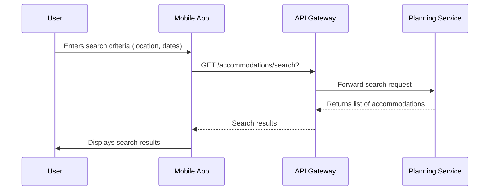
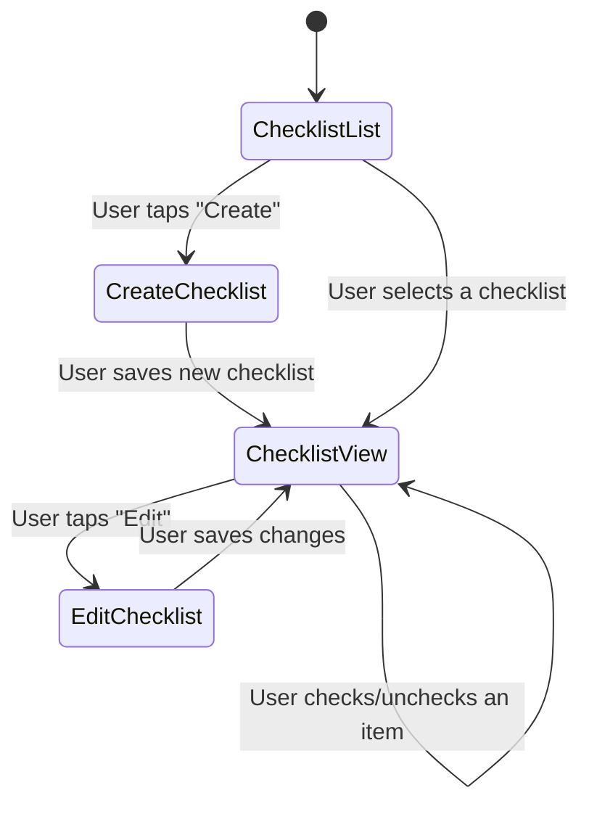

# CatTravelPlanning: UI/UX Design

**Version:** 1.0  
**Date:** 2025-07-21  
**Status:** Draft  
**Author(s):** Gemini

## 1. Overview

This document outlines the UI/UX design for the Cat Travel Planning feature. The design focuses on providing a clear and easy-to-use interface for planning trips.

## 2. Wireframes and Mockups

*(Note: This section would typically contain visual wireframes.)*

### 2.1 Accommodation Search Screen
- **Description**: The main screen for finding cat-friendly accommodations.
- **Elements**:
    - A search bar for location.
    - Date selectors for check-in and check-out.
    - A list of search results, each showing a picture of the property, its name, and key pet policy details.
    - A filter button to open advanced filtering options (e.g., by price, amenities).

### 2.2 Checklist Management Screen
- **Description**: A screen for managing travel checklists.
- **Elements**:
    - A list of the user's existing checklists.
    - A button to create a new checklist.
    - When viewing a checklist, each item has a checkbox next to it.
    - An option to add, edit, or delete items from the list.

## 3. User Flows

### 3.1 Searching for Accommodations

### 3.2 Managing a Checklist

