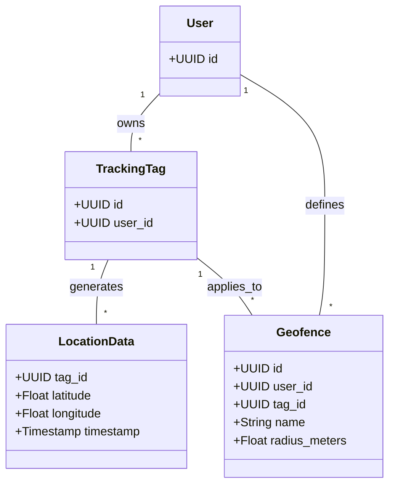
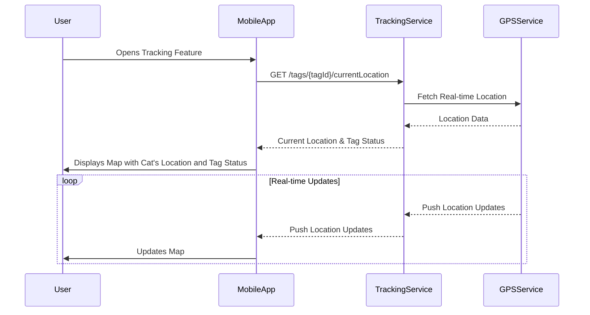
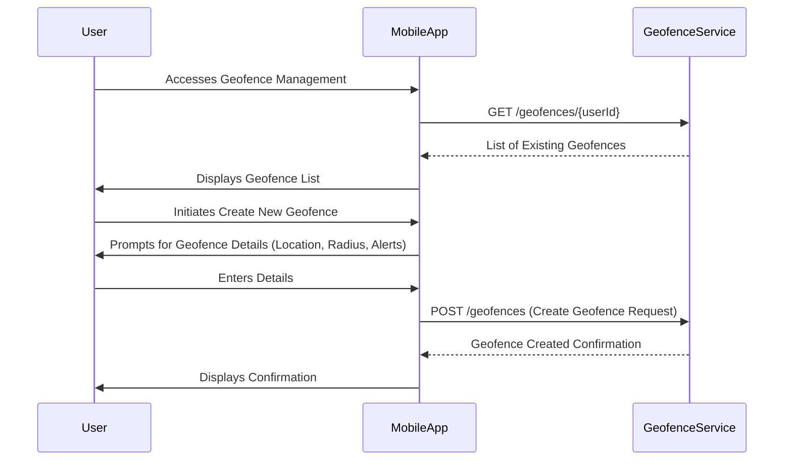

# Cat Travel App: Cat Safety & Monitoring Design

**Version:** 1.0  
**Date:** 2025-07-20  
**Status:** Draft  
**Author(s):** AI Interviewer

## Overview

This document details the design for the Cat Safety & Monitoring features of the Cat Travel App, specifically focusing on the integration of cat tracking tags for real-time location monitoring and alerts.

## 1. Introduction

This document specifies the detailed design for the Cat Safety & Monitoring module, addressing functional and non-functional requirements related to cat tracking tag integration.

## 2. Functional Requirements Addressed

This design addresses the following requirement from `cat_safety_monitoring_requirements.xml`:

*   **REQ-CAT-004: Cat Tracking Tag Integration**

## 3. System Components

### 3.1 Tracking Service

*   **Description:** Backend service responsible for ingesting, storing, and providing cat tracking data.
*   **Responsibilities:**
    *   Ingesting real-time location data from the `GPS Tracking Service`.
    *   Storing location history.
    *   Providing current and historical location data to the mobile app.
    *   Monitoring tag battery status and connectivity.
    *   Triggering alerts for geofence breaches and tag status changes.

### 3.2 Geofence Service

*   **Description:** Backend service responsible for managing and evaluating geofences.
*   **Responsibilities:**
    *   Managing user-defined geofences (create, read, update, delete).
    *   Evaluating real-time location data against defined geofences.
    *   Triggering alerts to the `Notification Service` upon geofence entry/exit.

### 3.3 Notification Service

*   **Description:** Backend service responsible for sending various notifications to users.
*   **Responsibilities:**
    *   Sending push notifications to mobile devices via `Push Notification Service`.
    *   Handling different types of alerts (geofence, low battery, connection loss).

## 4. Architecture Diagram

```mermaid
graph TD
    User((Cat Owner))

    subgraph "Mobile App (Client)"
        A[Tracking Map UI]
        B[Geofence Management UI]
        C[Notification Handler]
    end

    subgraph "Backend Services"
        D[Tracking Service]
        E[Geofence Service]
        F[Notification Service]
    end

    subgraph "Data Stores"
        G[(Location History DB)]
        H[(Geofence DB)]
    end

    subgraph "External Services"
        I[GPS Tracking Service]
        J[Push Notification Service]
    end

    User --> A: View Location
    A --> D: Request Location Data
    D --> I: Fetch Real-time Location
    I --> D: Location Data
    D --> G: Store Location History
    G --> D: Location History
    D --> A: Display Location on Map

    User --> B: Create/Manage Geofence
    B --> E: Save Geofence
    E --> H: Store Geofence Data
    H --> E: Geofence Data

    E --> D: Geofence Monitoring Trigger
    D --> F: Send Alert
    F --> J: Push Notification
    J --> C: Receive Notification
    C --> User: Display Alert

    D --> F: Send Battery/Connection Alert

    classDef client fill:#bbdefb,stroke:#1976d2
    classDef backend fill:#c8e6c9,stroke:#388e3c
    classDef data fill:#f8bbd0,stroke:#c2185b
    classDef external fill:#e1bee7,stroke:#7b1fa2

    class A,B,C client
    class D,E,F backend
    class G,H data
    class I,J external
```

## 5. Technology Stack

| Layer | Technology | Purpose |
|-------|------------|---------|
| Backend Services | Node.js (Express.js) / Python (FastAPI) | API Server, Business Logic |
| Database (Location History) | MongoDB / Cassandra | High-volume, time-series data storage |
| Database (Geofence) | PostgreSQL | Structured data storage |
| Notifications | FCM / APNs | Push Notifications |
| External | GPS Tracking Service Provider | Real-time location data |

## 6. Data Model

### 6.1 Schema Name: `safety_monitoring`

This schema will contain data related to cat tracking, location history, and geofences.

### 6.2 Core Entities

#### 6.2.1 Collection/Table: `location_data`

Stores real-time and historical location data for tracking tags. (Suitable for NoSQL like MongoDB/Cassandra)

```json
// Example Document/Row Structure
{
  "tagId": "uuid-tag-1",
  "latitude": 34.0522,
  "longitude": -118.2437,
  "timestamp": "2025-07-20T10:30:00Z",
  "accuracyMeters": 2.5
}
```

| Field | Type | Description | Constraints |
|--------|------|-------------|-------------|
| tagId | String | Unique identifier of the tracking tag | Index |
| latitude | Float | Latitude coordinate | |
| longitude | Float | Longitude coordinate | |
| timestamp | Datetime | Timestamp of the location reading | Index |
| accuracyMeters | Float | Accuracy of the location reading in meters | |

#### 6.2.2 Table: `geofences`

Stores user-defined geofence configurations.

```sql
CREATE TABLE safety_monitoring.geofences (
    id UUID PRIMARY KEY DEFAULT gen_random_uuid(),
    user_id UUID NOT NULL,
    tag_id UUID NOT NULL,
    name VARCHAR(255) NOT NULL,
    center_latitude DECIMAL(9,6) NOT NULL,
    center_longitude DECIMAL(9,6) NOT NULL,
    radius_meters DECIMAL(10,2) NOT NULL,
    alert_on_entry BOOLEAN DEFAULT FALSE,
    alert_on_exit BOOLEAN DEFAULT FALSE,
    is_active BOOLEAN DEFAULT TRUE,
    created_at TIMESTAMPTZ NOT NULL DEFAULT NOW(),
    updated_at TIMESTAMPTZ NOT NULL DEFAULT NOW()
);
```

| Column | Type | Description | Constraints |
|--------|------|-------------|-------------|
| id | UUID | Primary key | PK, NOT NULL |
| user_id | UUID | Foreign key to users table | FK, NOT NULL |
| tag_id | UUID | Foreign key to tracking_tags table | FK, NOT NULL |
| name | VARCHAR(255) | Name of the geofence | NOT NULL |
| center_latitude | DECIMAL(9,6) | Latitude of the geofence center | NOT NULL |
| center_longitude | DECIMAL(9,6) | Longitude of the geofence center | NOT NULL |
| radius_meters | DECIMAL(10,2) | Radius of the circular geofence in meters | NOT NULL |
| alert_on_entry | BOOLEAN | Alert when tag enters geofence | DEFAULT FALSE |
| alert_on_exit | BOOLEAN | Alert when tag exits geofence | DEFAULT FALSE |
| is_active | BOOLEAN | Indicates if the geofence is active | DEFAULT TRUE |
| created_at | TIMESTAMPTZ | Timestamp of record creation | NOT NULL, DEFAULT NOW() |
| updated_at | TIMESTAMPTZ | Timestamp of last update | NOT NULL, DEFAULT NOW() |

## 6.3 Entity Relationship Diagram



## 7. API Specification

### 7.1 Tracking Service API

**Base URL:** `/api/v1/tracking`

#### 7.1.1 Get Current Location

*   **Endpoint:** `GET /tags/{tagId}/currentLocation`
*   **Description:** Retrieve the real-time current location of a specific tracking tag.
*   **Authentication:** Required
*   **Path Parameters:**
    *   `tagId` (UUID): Unique identifier of the tracking tag.

**Response (200 OK):**
```json
{
  "status": "success",
  "data": {
    "tagId": "uuid-tag-1",
    "latitude": 34.0522,
    "longitude": -118.2437,
    "timestamp": "2025-07-20T10:30:00Z",
    "accuracyMeters": 2.5,
    "batteryLevel": 0.85,
    "isConnected": true
  }
}
```

#### 7.1.2 Get Location History

*   **Endpoint:** `GET /tags/{tagId}/locationHistory`
*   **Description:** Retrieve historical location data for a specific tracking tag within a time range.
*   **Authentication:** Required
*   **Path Parameters:**
    *   `tagId` (UUID): Unique identifier of the tracking tag.
*   **Query Parameters:**
    *   `from` (datetime): Start timestamp (ISO 8601).
    *   `to` (datetime): End timestamp (ISO 8601).

**Response (200 OK):**
```json
{
  "status": "success",
  "data": [
    {
      "latitude": 34.0522,
      "longitude": -118.2437,
      "timestamp": "2025-07-20T10:30:00Z",
      "accuracyMeters": 2.5
    },
    {
      "latitude": 34.0525,
      "longitude": -118.2440,
      "timestamp": "2025-07-20T10:31:00Z",
      "accuracyMeters": 2.8
    }
  ]
}
```

### 7.2 Geofence Service API

**Base URL:** `/api/v1/geofences`

#### 7.2.1 Create Geofence

*   **Endpoint:** `POST /geofences`
*   **Description:** Create a new geofence for a user and tag.
*   **Authentication:** Required
*   **Request Body:**
```json
{
  "userId": "uuid-user-1",
  "tagId": "uuid-tag-1",
  "name": "Hotel Room",
  "centerLatitude": 34.0522,
  "centerLongitude": -118.2437,
  "radiusMeters": 50.0,
  "alertOnEntry": false,
  "alertOnExit": true
}
```

**Response (201 Created):**
```json
{
  "status": "success",
  "data": {"id": "uuid-geofence-1", "name": "Hotel Room", "isActive": true}
}
```

## 8. UI/UX Flows

### 8.1 Real-time Tracking Flow



### 8.2 Geofence Management Flow



## 9. Key Architectural Decisions & Rationale

*   **Dedicated Tracking and Geofence Services:** Separates concerns for location data processing and geofence evaluation, allowing for independent scaling and optimization. This aligns with the modularity principle.
*   **NoSQL Database for Location History:** Chosen for its ability to handle high-volume, time-series data efficiently, which is typical for real-time tracking. This supports scalability and performance goals.
*   **External GPS Tracking Service:** Leverages specialized hardware and network infrastructure for accurate and reliable location data acquisition. This ensures reliability and reduces development complexity.
*   **External Push Notification Service:** Utilizes established platforms for reliable and scalable delivery of alerts to mobile devices. This supports reliability and scalability.
*   **Robust Error Handling for Tracking:** Critical for user trust, ensuring clear communication when tags are offline or have low battery. This enhances usability and reliability.

## 10. Open Questions / Future Considerations

*   **Detailed Integration with GPS Tracking Service:** Define the specific integration points, data format, authentication, and communication protocols (e.g., WebSockets, MQTT) for the chosen GPS tracking service provider.
*   **Indoor Tracking Solutions:** Investigate and design for indoor tracking solutions (e.g., Bluetooth beacons, Wi-Fi triangulation) to improve accuracy in environments where GPS is limited.
*   **Historical Data Retention Policy:** Establish a clear policy for managing historical location data retention, considering user preferences, privacy regulations, and storage costs.
*   **AI/ML for Behavior Analysis:** Explore the potential for applying AI/ML to analyze movement patterns, detect unusual behavior, and provide predictive insights for cat safety.

## Version History

| Version | Date | Changes | Author |
|---------|------|---------|--------|
| 1.0 | 2025-07-20 | Initial version | AI Interviewer |