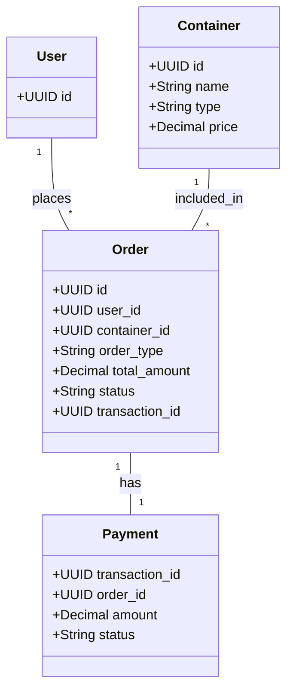
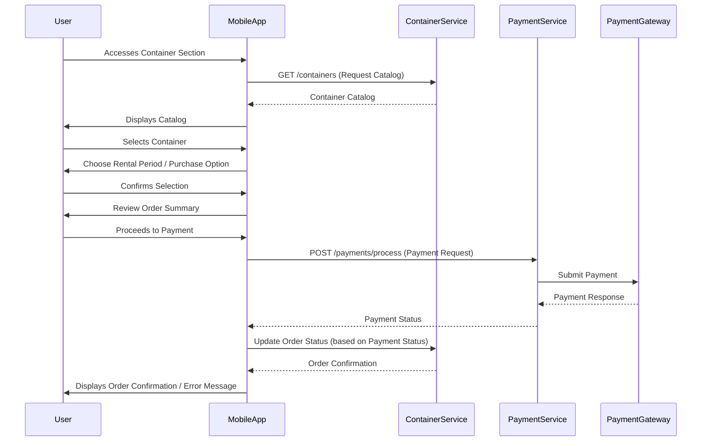

# Cat Travel App: Cat Travel Logistics Design

**Version:** 1.0  
**Date:** 2025-07-20  
**Status:** Draft  
**Author(s):** AI Interviewer

## Overview

This document details the design for the Cat Travel Logistics features of the Cat Travel App, specifically focusing on the rental and purchase of cat-approved travel containers.

## 1. Introduction

This document specifies the detailed design for the Cat Travel Logistics module, addressing functional and non-functional requirements related to the management of cat travel containers.

## 2. Functional Requirements Addressed

This design addresses the following requirement from `cat_travel_logistics_requirements.xml`:

*   **REQ-CAT-003: Cat Travel Container Rental/Purchase**

## 3. System Components

### 3.1 Container Management Service

*   **Description:** Backend service responsible for managing the catalog and transactions of cat travel containers.
*   **Responsibilities:**
    *   Managing the catalog of cat-approved travel containers (add, update, remove).
    *   Tracking container inventory and availability for rental.
    *   Handling rental and purchase order creation and fulfillment.
    *   Interacting with `Payment Processing Service` for financial transactions.
    *   Optionally integrating with `Logistics Partner APIs` for delivery/pickup.

### 3.2 Payment Processing Service

*   **Description:** Backend service responsible for securely handling payment transactions.
*   **Responsibilities:**
    *   Handling secure communication with the `Payment Gateway`.
    *   Processing payment requests from `Container Management Service`.
    *   Managing payment confirmations and error handling.

## 4. Architecture Diagram

```mermaid
graph TD
    User((Cat Owner))

    subgraph "Mobile App (Client)"
        A[Container Catalog UI]
        B[Rental/Purchase Workflow UI]
    end

    subgraph "Backend Services"
        C[Container Management Service]
        D[Payment Processing Service]
    end

    subgraph "Data Stores"
        E[(Container Inventory DB)]
        F[(Transaction DB)]
    end

    subgraph "External Services"
        G[Payment Gateway]
        H[Logistics Partner APIs (Optional)]
    end

    User --> A: Browse Catalog
    A --> C: Request Catalog Data
    C --> E: Retrieve Container Data
    E --> C: Container Data
    C --> A: Display Catalog

    User --> B: Initiate Rental/Purchase
    B --> C: Submit Order
    C --> F: Record Transaction
    C --> D: Process Payment Request
    D --> G: Submit Payment
    G --> D: Payment Response
    D --> C: Payment Status
    C --> B: Order Confirmation

    C --> H: Schedule Delivery/Pickup (Optional)
    H --> C: Delivery/Pickup Status

    classDef client fill:#bbdefb,stroke:#1976d2
    classDef backend fill:#c8e6c9,stroke:#388e3c
    classDef data fill:#f8bbd0,stroke:#c2185b
    classDef external fill:#e1bee7,stroke:#7b1fa2

    class A,B client
    class C,D backend
    class E,F data
    class G,H external
```

## 5. Technology Stack

| Layer | Technology | Purpose |
|-------|------------|---------|
| Backend Services | Node.js (Express.js) / Python (FastAPI) | API Server, Business Logic |
| Database | PostgreSQL | Data Storage |
| Payment Processing | External Payment Gateway (e.g., Stripe, PayPal) | Secure Payment Transactions |

## 6. Data Model

### 6.1 Schema Name: `travel_logistics`

This schema will contain tables related to container inventory and rental/purchase transactions.

### 6.2 Core Entities

#### 6.2.1 Table: `containers`

Stores information about cat travel containers.

```sql
CREATE TABLE travel_logistics.containers (
    id UUID PRIMARY KEY DEFAULT gen_random_uuid(),
    name VARCHAR(255) NOT NULL,
    type VARCHAR(50) NOT NULL, -- 'rental' or 'purchase'
    description TEXT,
    price DECIMAL(10,2) NOT NULL,
    rental_period VARCHAR(50), -- e.g., 'daily', 'weekly'
    availability BOOLEAN NOT NULL DEFAULT TRUE,
    airline_compliance_info JSONB, -- e.g., {'iata_approved': true, 'max_weight_kg': 10}
    image_url VARCHAR(255),
    created_at TIMESTAMPTZ NOT NULL DEFAULT NOW(),
    updated_at TIMESTAMPTZ NOT NULL DEFAULT NOW()
);
```

| Column | Type | Description | Constraints |
|--------|------|-------------|-------------|
| id | UUID | Primary key | PK, NOT NULL |
| name | VARCHAR(255) | Name of the container | NOT NULL |
| type | VARCHAR(50) | Type of offering (rental or purchase) | NOT NULL |
| description | TEXT | Description of the container | |
| price | DECIMAL(10,2) | Price for purchase or daily rental | NOT NULL |
| rental_period | VARCHAR(50) | Applicable rental period (e.g., 'daily', 'weekly') | |
| availability | BOOLEAN | Current availability status | NOT NULL, DEFAULT TRUE |
| airline_compliance_info | JSONB | JSON object with compliance details | |
| image_url | VARCHAR(255) | URL to container image | |
| created_at | TIMESTAMPTZ | Timestamp of record creation | NOT NULL, DEFAULT NOW() |
| updated_at | TIMESTAMPTZ | Timestamp of last update | NOT NULL, DEFAULT NOW() |

#### 6.2.2 Table: `orders`

Stores rental and purchase order details.

```sql
CREATE TABLE travel_logistics.orders (
    id UUID PRIMARY KEY DEFAULT gen_random_uuid(),
    user_id UUID NOT NULL,
    container_id UUID NOT NULL,
    order_type VARCHAR(50) NOT NULL, -- 'rental' or 'purchase'
    start_date DATE, -- For rentals
    end_date DATE, -- For rentals
    total_amount DECIMAL(10,2) NOT NULL,
    status VARCHAR(50) NOT NULL, -- e.g., 'pending', 'confirmed', 'shipped', 'delivered', 'returned', 'cancelled'
    transaction_id UUID, -- FK to payments table
    delivery_address TEXT,
    pickup_address TEXT,
    created_at TIMESTAMPTZ NOT NULL DEFAULT NOW(),
    updated_at TIMESTAMPTZ NOT NULL DEFAULT NOW()
);
```

| Column | Type | Description | Constraints |
|--------|------|-------------|-------------|
| id | UUID | Primary key | PK, NOT NULL |
| user_id | UUID | Foreign key to users table | FK, NOT NULL |
| container_id | UUID | Foreign key to containers table | FK, NOT NULL |
| order_type | VARCHAR(50) | Type of order (rental or purchase) | NOT NULL |
| start_date | DATE | Start date for rental orders | |
| end_date | DATE | End date for rental orders | |
| total_amount | DECIMAL(10,2) | Total amount of the order | NOT NULL |
| status | VARCHAR(50) | Current status of the order | NOT NULL |
| transaction_id | UUID | Foreign key to payments table | FK |
| delivery_address | TEXT | Address for delivery | |
| pickup_address | TEXT | Address for pickup (for rentals) | |
| created_at | TIMESTAMPTZ | Timestamp of order creation | NOT NULL, DEFAULT NOW() |
| updated_at | TIMESTAMPTZ | Timestamp of last update | NOT NULL, DEFAULT NOW() |

#### 6.2.3 Table: `payments`

Stores payment transaction details.

```sql
CREATE TABLE travel_logistics.payments (
    transaction_id UUID PRIMARY KEY DEFAULT gen_random_uuid(),
    order_id UUID NOT NULL,
    amount DECIMAL(10,2) NOT NULL,
    currency VARCHAR(10) NOT NULL,
    payment_method VARCHAR(50),
    status VARCHAR(50) NOT NULL, -- e.g., 'success', 'failed', 'pending'
    gateway_response TEXT,
    created_at TIMESTAMPTZ NOT NULL DEFAULT NOW()
);
```

| Column | Type | Description | Constraints |
|--------|------|-------------|-------------|
| transaction_id | UUID | Primary key | PK, NOT NULL |
| order_id | UUID | Foreign key to orders table | FK, NOT NULL |
| amount | DECIMAL(10,2) | Amount of the payment | NOT NULL |
| currency | VARCHAR(10) | Currency of the payment (e.g., USD) | NOT NULL |
| payment_method | VARCHAR(50) | Method of payment (e.g., 'credit_card', 'paypal') | |
| status | VARCHAR(50) | Status of the payment transaction | NOT NULL |
| gateway_response | TEXT | Raw response from payment gateway | |
| created_at | TIMESTAMPTZ | Timestamp of payment creation | NOT NULL, DEFAULT NOW() |

## 6.3 Entity Relationship Diagram



## 7. API Specification

### 7.1 Container Management Service API

**Base URL:** `/api/v1/containers`

#### 7.1.1 List Containers

*   **Endpoint:** `GET /containers`
*   **Description:** Retrieve a paginated list of available cat travel containers.
*   **Authentication:** Required
*   **Query Parameters:**
    *   `type` (string): Filter by 'rental' or 'purchase'.
    *   `availability` (boolean): Filter by availability (default: true).
    *   `page` (int): Page number (default: 1).
    *   `limit` (int): Items per page (default: 20).

**Response (200 OK):**
```json
{
  "status": "success",
  "data": {
    "items": [
      {
        "id": "uuid-container-1",
        "name": "Airline Approved Carrier",
        "type": "rental",
        "price": 15.00,
        "rentalPeriod": "daily",
        "availability": true,
        "complianceInfo": {"iataApproved": true},
        "imageUrl": "https://example.com/carrier1.jpg"
      }
    ],
    "pagination": {"page": 1, "limit": 20, "total": 50}
  }
}
```

#### 7.1.2 Get Container Details

*   **Endpoint:** `GET /containers/{id}`
*   **Description:** Retrieve detailed information for a specific container.
*   **Authentication:** Required
*   **Path Parameters:**
    *   `id` (UUID): Unique identifier of the container.

**Response (200 OK):**
```json
{
  "status": "success",
  "data": {
    "id": "uuid-container-1",
    "name": "Airline Approved Carrier",
    "type": "rental",
    "description": "Durable, IATA compliant carrier.",
    "price": 15.00,
    "rentalPeriod": "daily",
    "availability": true,
    "complianceInfo": {"airline": "All Major", "iataApproved": true, "maxWeightKg": 10},
    "imageUrl": "https://example.com/carrier1.jpg"
  }
}
```

#### 7.1.3 Create Rental Order

*   **Endpoint:** `POST /rentals`
*   **Description:** Create a new rental order for a container.
*   **Authentication:** Required
*   **Request Body:**
```json
{
  "userId": "uuid-user-1",
  "containerId": "uuid-container-1",
  "startDate": "2025-08-01",
  "endDate": "2025-08-05",
  "deliveryAddress": "123 Main St, Anytown"
}
```

**Response (201 Created):**
```json
{
  "status": "success",
  "data": {"orderId": "uuid-order-1", "status": "pending", "totalAmount": 75.00}
}
```

#### 7.1.4 Create Purchase Order

*   **Endpoint:** `POST /purchases`
*   **Description:** Create a new purchase order for a container.
*   **Authentication:** Required
*   **Request Body:**
```json
{
  "userId": "uuid-user-1",
  "containerId": "uuid-container-2",
  "deliveryAddress": "123 Main St, Anytown"
}
```

**Response (201 Created):**
```json
{
  "status": "success",
  "data": {"orderId": "uuid-order-2", "status": "pending", "totalAmount": 120.00}
}
```

### 7.2 Payment Processing Service API

**Base URL:** `/api/v1/payments`

#### 7.2.1 Process Payment

*   **Endpoint:** `POST /process`
*   **Description:** Process a payment for a given order.
*   **Authentication:** Required
*   **Request Body:**
```json
{
  "orderId": "uuid-order-1",
  "amount": 75.00,
  "currency": "USD",
  "paymentMethodToken": "stripe-token-xyz"
}
```

**Response (200 OK):**
```json
{
  "status": "success",
  "data": {"transactionId": "uuid-transaction-1", "status": "success"}
}
```

## 8. UI/UX Flows

### 8.1 Container Rental/Purchase Flow



## 9. Key Architectural Decisions & Rationale

*   **Dedicated Container Management Service:** Isolates inventory and order management logic, allowing for specialized scaling and integration with logistics partners. This adheres to the principle of modularity.
*   **External Payment Gateway:** Offloads PCI DSS compliance and complex payment processing to a specialized, secure third-party service. This aligns with security best practices and reduces the application's compliance burden.
*   **Separate Databases for Inventory and Transactions:** Ensures high availability and performance for both browsing and transactional operations. This supports scalability goals.
*   **Clear Error Handling for Transactions:** Critical for user trust and a smooth experience during financial operations. This enhances reliability and usability.

## 10. Open Questions / Future Considerations

*   **Detailed Integration with Payment Gateway:** Define the specific integration points, data mapping, and error handling mechanisms for the chosen payment gateway (e.g., Stripe, PayPal).
*   **Logistics Partner Integration:** Explore and design integration with logistics partners for automated delivery and pickup scheduling and tracking of rented containers.
*   **Physical Inventory Management:** Develop a strategy for managing the physical inventory of rental containers, including maintenance, cleaning, and tracking their physical location.
*   **Refunds and Cancellations:** Design the workflows and API endpoints for handling refunds and cancellations of rental and purchase orders.

## Version History

| Version | Date | Changes | Author |
|---------|------|---------|--------|
| 1.0 | 2025-07-20 | Initial version | AI Interviewer |