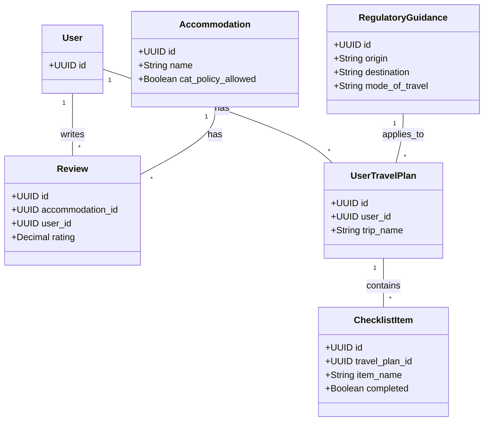
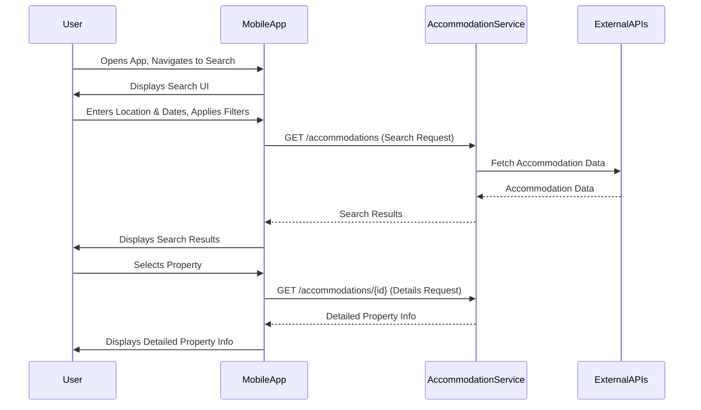
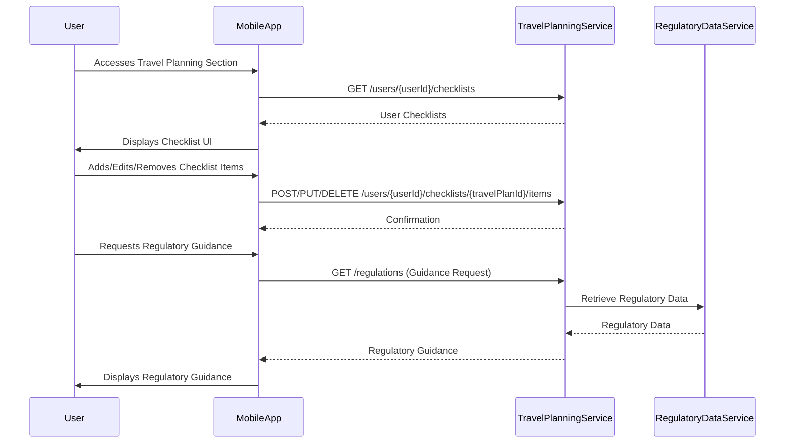

# Cat Travel App: Cat Travel Planning Design

**Version:** 1.0  
**Date:** 2025-07-20  
**Status:** Draft  
**Author(s):** AI Interviewer

## Overview

This document details the design for the Cat Travel Planning features of the Cat Travel App, encompassing the search and display of cat-friendly accommodations and the provision of a comprehensive travel checklist with regulatory guidance.

## 1. Introduction

This document specifies the detailed design for the Cat Travel Planning module, addressing functional and non-functional requirements related to accommodation search and travel checklist management.

## 2. Functional Requirements Addressed

This design addresses the following requirements from `cat_travel_planning_requirements.xml`:

*   **REQ-CAT-001: Search and Display Cat-Friendly Accommodations**
*   **REQ-CAT-002: Cat Travel Checklist and Regulatory Guidance**

## 3. System Components

### 3.1 Accommodation Service

*   **Description:** Backend service responsible for managing cat-friendly accommodation data.
*   **Responsibilities:**
    *   Receiving accommodation search requests (location, dates, cat-specific filters).
    *   Aggregating data from various `Accommodation Provider APIs`.
    *   Filtering and validating accommodations based on cat-friendly policies.
    *   Storing and retrieving curated accommodation data.
    *   Providing detailed accommodation information, including cat policies and amenities.

### 3.2 Travel Planning Service

*   **Description:** Backend service responsible for managing user travel plans and checklists.
*   **Responsibilities:**
    *   Managing user-specific travel checklists (create, read, update, delete items).
    *   Interacting with `Regulatory Data Service` to fetch relevant travel regulations.
    *   Generating packing lists based on checklist items.
    *   Storing user travel plans and checklists.

### 3.3 Regulatory Data Service

*   **Description:** Backend service responsible for providing up-to-date cat travel regulatory data.
*   **Responsibilities:**
    *   Storing and managing cat travel regulatory data (airline, import/export, health).
    *   Providing regulatory information based on origin, destination, and mode of travel.

## 4. Architecture Diagram

```mermaid
graph TD
    User((Cat Owner))

    subgraph "Mobile App (Client)"
        A[Accommodation Search UI]
        B[Checklist UI]
        C[Travel Plan Manager]
    end

    subgraph "Backend Services"
        D[Accommodation Service]
        E[Travel Planning Service]
        F[Regulatory Data Service]
    end

    subgraph "Data Stores"
        G[(Accommodation DB)]
        H[(User Travel Plans DB)]
        I[(Regulatory Data DB)]
    end

    subgraph "External Services"
        J[Accommodation Provider APIs]
    end

    User --> A: Search Input
    A --> D: Search Request
    D --> J: Fetch Accommodation Data
    J --> D: Accommodation Data
    D --> G: Store/Retrieve Accommodation Data
    G --> D: Accommodation Data
    D --> A: Search Results

    User --> B: Checklist Management
    B --> E: Save/Load Checklist
    E --> H: Store/Retrieve User Checklists
    H --> E: User Checklists
    E --> F: Regulatory Data Request
    F --> I: Retrieve Regulatory Data
    I --> F: Regulatory Data
    F --> E: Regulatory Guidance
    E --> B: Checklist & Guidance

    C --> E: Manage Travel Plans
    C --> D: Manage Accommodation Bookings

    classDef client fill:#bbdefb,stroke:#1976d2
    classDef backend fill:#c8e6c9,stroke:#388e3c
    classDef data fill:#f8bbd0,stroke:#c2185b
    classDef external fill:#e1bee7,stroke:#7b1fa2

    class A,B,C client
    class D,E,F backend
    class G,H,I data
    class J external
```

## 5. Technology Stack

| Layer | Technology | Purpose |
|-------|------------|---------|
| Backend Services | Node.js (Express.js) / Python (FastAPI) | API Server, Business Logic |
| Database | PostgreSQL | Data Storage |
| Caching | Redis | Distributed Caching |

## 6. Data Model

### 6.1 Schema Name: `travel_planning`

This schema will contain tables related to accommodations, user travel plans, and regulatory data.

### 6.2 Core Entities

#### 6.2.1 Table: `accommodations`

Stores information about cat-friendly accommodations.

```sql
CREATE TABLE travel_planning.accommodations (
    id UUID PRIMARY KEY DEFAULT gen_random_uuid(),
    name VARCHAR(255) NOT NULL,
    address VARCHAR(500),
    latitude DECIMAL(9,6),
    longitude DECIMAL(9,6),
    cat_policy_allowed BOOLEAN NOT NULL,
    cat_policy_fees TEXT,
    cat_policy_max_cats INTEGER,
    cat_policy_size_restrictions TEXT,
    amenities JSONB,
    rating DECIMAL(2,1),
    created_at TIMESTAMPTZ NOT NULL DEFAULT NOW(),
    updated_at TIMESTAMPTZ NOT NULL DEFAULT NOW()
);
```

| Column | Type | Description | Constraints |
|--------|------|-------------|-------------|
| id | UUID | Primary key | PK, NOT NULL |
| name | VARCHAR(255) | Name of the accommodation | NOT NULL |
| address | VARCHAR(500) | Full address of the accommodation | |
| latitude | DECIMAL(9,6) | Latitude coordinate | |
| longitude | DECIMAL(9,6) | Longitude coordinate | |
| cat_policy_allowed | BOOLEAN | Indicates if cats are allowed | NOT NULL |
| cat_policy_fees | TEXT | Description of cat-related fees | |
| cat_policy_max_cats | INTEGER | Maximum number of cats allowed | |
| cat_policy_size_restrictions | TEXT | Size or weight restrictions for cats | |
| amenities | JSONB | JSON array of amenities | |
| rating | DECIMAL(2,1) | Average user rating | |
| created_at | TIMESTAMPTZ | Timestamp of record creation | NOT NULL, DEFAULT NOW() |
| updated_at | TIMESTAMPTZ | Timestamp of last update | NOT NULL, DEFAULT NOW() |

#### 6.2.2 Table: `reviews`

Stores user reviews for accommodations.

```sql
CREATE TABLE travel_planning.reviews (
    id UUID PRIMARY KEY DEFAULT gen_random_uuid(),
    accommodation_id UUID NOT NULL,
    user_id UUID NOT NULL,
    comment TEXT,
    rating DECIMAL(2,1) NOT NULL,
    created_at TIMESTAMPTZ NOT NULL DEFAULT NOW()
);
```

| Column | Type | Description | Constraints |
|--------|------|-------------|-------------|
| id | UUID | Primary key | PK, NOT NULL |
| accommodation_id | UUID | Foreign key to accommodations table | FK, NOT NULL |
| user_id | UUID | Foreign key to users table | FK, NOT NULL |
| comment | TEXT | User's review comment | |
| rating | DECIMAL(2,1) | Rating given by the user | NOT NULL |
| created_at | TIMESTAMPTZ | Timestamp of review creation | NOT NULL, DEFAULT NOW() |

#### 6.2.3 Table: `user_travel_plans`

Stores user-specific travel plans.

```sql
CREATE TABLE travel_planning.user_travel_plans (
    id UUID PRIMARY KEY DEFAULT gen_random_uuid(),
    user_id UUID NOT NULL,
    trip_name VARCHAR(255) NOT NULL,
    destination VARCHAR(255),
    travel_start_date DATE,
    travel_end_date DATE,
    created_at TIMESTAMPTZ NOT NULL DEFAULT NOW(),
    updated_at TIMESTAMPTZ NOT NULL DEFAULT NOW()
);
```

| Column | Type | Description | Constraints |
|--------|------|-------------|-------------|
| id | UUID | Primary key | PK, NOT NULL |
| user_id | UUID | Foreign key to users table | FK, NOT NULL |
| trip_name | VARCHAR(255) | Name of the travel plan | NOT NULL |
| destination | VARCHAR(255) | Travel destination | |
| travel_start_date | DATE | Start date of the travel | |
| travel_end_date | DATE | End date of the travel | |
| created_at | TIMESTAMPTZ | Timestamp of record creation | NOT NULL, DEFAULT NOW() |
| updated_at | TIMESTAMPTZ | Timestamp of last update | NOT NULL, DEFAULT NOW() |

#### 6.2.4 Table: `checklists`

Stores items for user travel checklists.

```sql
CREATE TABLE travel_planning.checklists (
    id UUID PRIMARY KEY DEFAULT gen_random_uuid(),
    travel_plan_id UUID NOT NULL,
    item_name VARCHAR(255) NOT NULL,
    completed BOOLEAN DEFAULT FALSE,
    order_index INTEGER,
    created_at TIMESTAMPTZ NOT NULL DEFAULT NOW()
);
```

| Column | Type | Description | Constraints |
|--------|------|-------------|-------------|
| id | UUID | Primary key | PK, NOT NULL |
| travel_plan_id | UUID | Foreign key to user_travel_plans table | FK, NOT NULL |
| item_name | VARCHAR(255) | Name of the checklist item | NOT NULL |
| completed | BOOLEAN | Indicates if the item is completed | DEFAULT FALSE |
| order_index | INTEGER | Order of the item in the checklist | |
| created_at | TIMESTAMPTZ | Timestamp of item creation | NOT NULL, DEFAULT NOW() |

#### 6.2.5 Table: `regulatory_guidance`

Stores cat travel regulatory information.

```sql
CREATE TABLE travel_planning.regulatory_guidance (
    id UUID PRIMARY KEY DEFAULT gen_random_uuid(),
    origin VARCHAR(255) NOT NULL,
    destination VARCHAR(255) NOT NULL,
    mode_of_travel VARCHAR(50) NOT NULL,
    airline_regulations TEXT,
    import_requirements TEXT,
    health_documents TEXT,
    last_updated TIMESTAMPTZ NOT NULL DEFAULT NOW()
);
```

| Column | Type | Description | Constraints |
|--------|------|-------------|-------------|
| id | UUID | Primary key | PK, NOT NULL |
| origin | VARCHAR(255) | Origin location for regulations | NOT NULL |
| destination | VARCHAR(255) | Destination location for regulations | NOT NULL |
| mode_of_travel | VARCHAR(50) | Mode of travel (e.g., air, car) | NOT NULL |
| airline_regulations | TEXT | Specific airline regulations | |
| import_requirements | TEXT | Import requirements for the destination | |
| health_documents | TEXT | Required health documents | |
| last_updated | TIMESTAMPTZ | Timestamp of last update to regulations | NOT NULL, DEFAULT NOW() |

## 6.3 Entity Relationship Diagram



## 7. API Specification

### 7.1 Accommodation Service API

**Base URL:** `/api/v1/accommodations`

#### 7.1.1 List Accommodations

*   **Endpoint:** `GET /accommodations`
*   **Description:** Retrieve a paginated list of cat-friendly accommodations.
*   **Authentication:** Required
*   **Query Parameters:**
    *   `location` (string): City or region for search.
    *   `checkin` (date): Check-in date (YYYY-MM-DD).
    *   `checkout` (date): Check-out date (YYYY-MM-DD).
    *   `catsAllowed` (boolean): Filter by cat-friendly status (default: true).
    *   `filters` (object): JSON object for additional cat-specific amenities (e.g., `{"enclosedOutdoorSpace": true}`).

**Response (200 OK):**
```json
{
  "status": "success",
  "data": {
    "items": [
      {
        "id": "uuid-1",
        "name": "Purrfect Stay Hotel",
        "address": "123 Cat St, Feline City",
        "catPolicy": {"allowed": true, "fees": "$50/stay", "maxCats": 2},
        "rating": 4.5
      }
    ],
    "pagination": {"page": 1, "limit": 20, "total": 100}
  }
}
```

#### 7.1.2 Get Accommodation Details

*   **Endpoint:** `GET /accommodations/{id}`
*   **Description:** Retrieve detailed information for a specific accommodation.
*   **Authentication:** Required
*   **Path Parameters:**
    *   `id` (UUID): Unique identifier of the accommodation.

**Response (200 OK):**
```json
{
  "status": "success",
  "data": {
    "id": "uuid-1",
    "name": "Purrfect Stay Hotel",
    "address": "123 Cat St, Feline City",
    "location": {"lat": 34.0522, "lon": -118.2437},
    "catPolicy": {"allowed": true, "fees": "$50/stay", "maxCats": 2, "sizeRestrictions": "None", "amenities": ["enclosedOutdoorSpace", "catSitting"]},
    "rating": 4.5,
    "reviews": [{"userId": "user-a", "comment": "Great place for my cat!", "rating": 5.0}]
  }
}
```

### 7.2 Travel Planning Service API

**Base URL:** `/api/v1/travelplans`

#### 7.2.1 List User Checklists

*   **Endpoint:** `GET /users/{userId}/checklists`
*   **Description:** Retrieve all travel checklists for a specific user.
*   **Authentication:** Required
*   **Path Parameters:**
    *   `userId` (UUID): Unique identifier of the user.

**Response (200 OK):**
```json
{
  "status": "success",
  "data": [
    {
      "id": "checklist-1",
      "tripName": "Summer Vacation",
      "destination": "Maui",
      "checklist": [{"itemId": "item-a", "name": "Cat Food", "completed": false}]
    }
  ]
}
```

#### 7.2.2 Create Checklist Item

*   **Endpoint:** `POST /users/{userId}/checklists/{travelPlanId}/items`
*   **Description:** Add a new item to a specific travel checklist.
*   **Authentication:** Required
*   **Path Parameters:**
    *   `userId` (UUID): Unique identifier of the user.
    *   `travelPlanId` (UUID): Unique identifier of the travel plan.
*   **Request Body:**
```json
{
  "itemName": "string",
  "completed": boolean (optional, default: false)
}
```

**Response (201 Created):**
```json
{
  "status": "success",
  "data": {"itemId": "new-item-id", "itemName": "New Item", "completed": false}
}
```

#### 7.2.3 Get Regulatory Guidance

*   **Endpoint:** `GET /regulations`
*   **Description:** Retrieve regulatory guidance for cat travel based on origin, destination, and mode of travel.
*   **Authentication:** Required
*   **Query Parameters:**
    *   `origin` (string): Origin location.
    *   `destination` (string): Destination location.
    *   `mode` (string): Mode of travel (e.g., "air", "car").

**Response (200 OK):**
```json
{
  "status": "success",
  "data": {
    "airlineRegulations": "Specific airline rules...",
    "importRequirements": "Import documents needed...",
    "healthDocuments": "Vaccination records..."
  }
}
```

## 8. UI/UX Flows

### 8.1 Accommodation Search Flow



### 8.2 Travel Checklist Flow



## 9. Key Architectural Decisions & Rationale

*   **Separate Services for Accommodation and Travel Planning:** Promotes modularity, independent scaling, and development. This aligns with the microservices architectural style, allowing teams to work on distinct features without tight coupling.
*   **Relational Databases for Structured Data:** PostgreSQL is chosen for its strong ACID compliance, data integrity, and robust support for complex queries, which are beneficial for structured data like accommodations, user plans, and regulatory information.
*   **External API Integration for Accommodation Data:** Leveraging existing provider APIs (e.g., Booking.com, Expedia) avoids the need to build and maintain a vast accommodation database from scratch. This focuses development efforts on the value-add of cat-friendliness filtering and specialized features.
*   **Caching for Performance:** Implementing Redis as a caching layer significantly improves response times for frequently accessed data (e.g., popular search results, common regulatory guidance) and reduces the load on primary databases and external APIs.

## 10. Open Questions / Future Considerations

*   **Regulatory Data Update Strategy:** Define a robust process for regularly updating and validating regulatory information from official sources to ensure accuracy.
*   **Accommodation API Integration Complexity:** Develop a detailed integration strategy for normalizing data from various accommodation provider APIs, handling different data formats, authentication methods, and rate limits.
*   **Offline Access:** Explore options for providing offline access to checklists and regulatory guidance, especially for users in areas with limited connectivity.

## Version History

| Version | Date | Changes | Author |
|---------|------|---------|--------|
| 1.0 | 2025-07-20 | Initial version | AI Interviewer |
