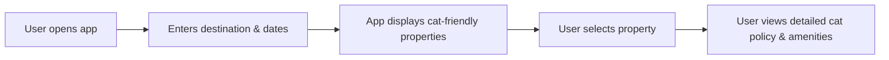

# User Story: Find Cat-Friendly Accommodations

**Story ID:** US-CAT-001
**Epic:** Cat Travel Planning
**Sprint:** 1
**Created:** 2025-07-20
**Last Updated:** 2025-07-20
**Author:** AI Interviewer

## Story Card

**As a** cat owner
**I want** to find and book cat-friendly accommodations
**So that** I can travel with my cat without stress about their acceptance

### Example
> As a cat owner
> I want to find hotels that explicitly welcome cats
> So that I can plan a trip knowing my cat is welcome

## Story Details

**Type:** Feature
**Priority:** High
**Story Points:** 5
**Business Value:** High
**Risk:** Medium
**Status:** Draft

**Tags:** `frontend` `backend` `api` `database`

## Context & Background

### User Persona
**Name:** Sarah the Cat Traveler
**Description:** A cat owner who loves to travel but struggles to find suitable places that genuinely accommodate cats, often encountering vague or restrictive pet policies.
**Goals:**
- To travel with her cat safely and comfortably.
- To easily identify and book truly cat-friendly places.

**Pain Points:**
- Lack of clear information on pet policies for cats.
- Fear of being turned away or having a negative experience due to her cat.

### Business Context
This story addresses the core problem of limited cat-friendly travel options, providing a direct solution to a significant pain point for cat owners. It forms the foundation of the app's value proposition.

### Current State vs Desired State
| Current State | Desired State |
|--------------|---------------|
| Manual, time-consuming search for cat-friendly places with uncertain results | Easy, reliable search and booking of verified cat-friendly accommodations |

## Acceptance Criteria

### AC-1: Search for Accommodations
**Priority:** Must Have

**Given** I am on the app's home screen
**When** I search for accommodations by location and dates
**Then** I should see a list of properties explicitly marked as cat-friendly
**And** each property listing should clearly display its cat policy (e.g., fees, number of cats, size restrictions)

### AC-2: Filter by Cat-Specific Needs
**Priority:** Should Have

**Given** I am viewing search results
**When** I apply filters for cat-specific amenities (e.g., enclosed outdoor space, cat-sitting services)
**Then** the search results should update to show only properties matching those criteria

### AC-3: View Detailed Property Information
**Priority:** Must Have

**Given** I have selected a cat-friendly property from the search results
**When** I view its details page
**Then** I should see comprehensive information about its cat policy, pet-friendly features, and user reviews related to cat stays

## User Flows

### Happy Path Flow

## Technical Considerations

### Performance Requirements
- Search results should load within 3-5 seconds.

### Security Requirements
- User data and search history must be securely stored and protected.

### Scalability Requirements
- The search and listing database should support 100,000 concurrent users.

### Usability Requirements
- The search interface must be intuitive and easy to navigate without prior training.

## Definition of Done

- [ ] Code complete and follows coding standards
- [ ] Unit tests written and passing
- [ ] Integration tests passing (search functionality, data retrieval)
- [ ] Code reviewed and approved
- [ ] API documentation updated for accommodation search
- [ ] Performance requirements met for search
- [ ] Security review completed for data handling
- [ ] Accessibility standards met for search interface
- [ ] Deployed to staging environment
- [ ] QA testing passed
- [ ] Product Owner acceptance
