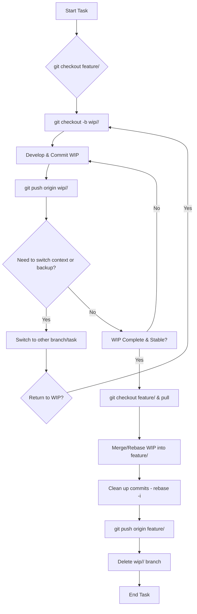

# SOP: Git Work-in-Progress (WIP) Remote Backup

## Document Information
- **Version**: 1.0
- **Effective Date**: 2025-07-20
- **Review Cycle**: Annual
- **Approval Authority**: Chief Technology Officer

## 1. Purpose and Scope

This SOP defines the process for developers to safely back up their incomplete Work-in-Progress (WIP) to a remote Git repository. This practice protects against data loss due to local machine failures (e.g., hard drive crash) and facilitates context switching without losing unsaved changes, while ensuring that unstable code does not interfere with shared development branches.

**Scope**: This SOP applies to all developers working on Git-managed projects who need to save their incomplete work to a remote location for safety or to facilitate switching between tasks.

## 2. Understanding WIP Remote Backups

Unlike `git stash` (which saves local changes) or committing to a shared feature branch (which implies readiness for integration), a WIP remote backup involves pushing incomplete, potentially broken, or experimental code to a *personal, temporary branch* on the remote repository. This branch serves as a personal safety net and is not intended for direct integration into `develop` or `main`.

## 3. Workflow Steps

### 3.1 Create a Personal WIP Branch (Initial Setup)

When you start working on a feature or task and anticipate needing to back up incomplete work, create a personal WIP branch. This branch should be based on the feature branch you are currently working on.

```bash
git checkout feature/<feature-name>
git pull origin feature/<feature-name> # Ensure your local feature branch is up-to-date
git checkout -b wip/<your-initials>/<feature-name-or-ticket-id>
```

- **Naming Convention**: `wip/<your-initials>/<descriptive-name>` (e.g., `wip/js/user-auth-login-form`, `wip/ah/ticket-1234-api-integration`). This clearly identifies it as a personal, work-in-progress branch.

### 3.2 Commit and Push Your WIP Regularly

As you work, commit your changes frequently to your personal WIP branch. Even if the code is incomplete, broken, or contains debugging statements, commit it. Then, push these commits to the remote repository.

```bash
git add .
git commit -m "WIP: <brief description of current progress>"
git push origin wip/<your-initials>/<feature-name-or-ticket-id>
```

- **Commit Messages**: Use `WIP:` prefix for clarity. These commits are temporary and will likely be squashed or rebased later.
- **Frequency**: Push your WIP as often as you feel necessary for safety (e.g., before leaving your desk, before a major refactor, after a significant chunk of work).

### 3.3 Switching Context (Optional)

If you need to switch to another branch (e.g., to fix a bug on `main`, review a PR), ensure your WIP is committed and pushed to your personal WIP branch. Then, you can safely checkout another branch.

```bash
git checkout main # Or any other branch
# ... do other work ...
git checkout wip/<your-initials>/<feature-name-or-ticket-id> # Return to your WIP
```

### 3.4 Integrating Ready Work into the Feature Branch

Once your work on the personal WIP branch is complete, stable, and ready to be integrated into the shared `feature/<feature-name>` branch, follow these steps:

1.  **Update Your Feature Branch**: Ensure your local `feature/<feature-name>` branch is up-to-date with the remote shared feature branch.
    ```bash
git checkout feature/<feature-name>
git pull origin feature/<feature-name>
    ```

2.  **Merge/Rebase WIP into Feature Branch**: Integrate your completed work from the personal WIP branch into your local `feature/<feature-name>` branch. **Prefer `rebase` for a cleaner history if your WIP commits are numerous and you want to squash them.**
    ```bash
git checkout feature/<feature-name>
git merge wip/<your-initials>/<feature-name-or-ticket-id>
# OR (for cleaner history, but be careful if others have pulled your WIP branch):
git rebase wip/<your-initials>/<feature-name-or-ticket-id>
    ```
    - **Resolve Conflicts**: If conflicts arise during the merge/rebase, follow the [Git Merge Conflict Resolution SOP](gitflow_merge_conflict_sop.md).

3.  **Clean Up Commits (Optional but Recommended)**: Before pushing to the shared `feature/<feature-name>` branch, consider using `git rebase -i` to squash your WIP commits into logical, clean commits that adhere to project commit message conventions.

4.  **Push to Shared Feature Branch**: Push your now-clean and complete work to the shared remote `feature/<feature-name>` branch.
    ```bash
git push origin feature/<feature-name>
    ```

### 3.5 Delete the Personal WIP Branch

Once your work has been successfully integrated into the shared `feature/<feature-name>` branch and pushed, delete your local and remote personal WIP branch.

```bash
git branch -d wip/<your-initials>/<feature-name-or-ticket-id>
git push origin --delete wip/<your-initials>/<feature-name-or-ticket-id>
```

## 4. Best Practices

- **Never Merge WIP Directly**: Do NOT merge `wip/` branches directly into `develop`, `main`, or `release` branches. They are for personal backup only.
- **Communicate**: Inform your team if you are using personal WIP branches, especially if you anticipate long-running WIP.
- **Regular Cleanup**: Delete personal WIP branches once their purpose is served to keep the remote repository clean.
- **Use `.gitignore`**: Ensure sensitive files or large temporary files are ignored by Git to prevent accidental commits.

## 5. Workflow Diagram


