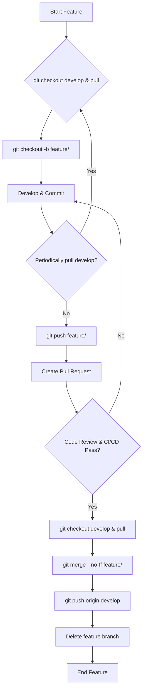

# SOP: GitFlow Feature Branch Workflow

## Document Information
- **Version**: 1.0
- **Effective Date**: 2025-07-20
- **Review Cycle**: Annual
- **Approval Authority**: Chief Technology Officer

## 1. Purpose and Scope

This SOP details the workflow for creating, developing, and integrating new features using GitFlow's feature branches. It ensures that new development is isolated, reviewed, and properly integrated into the `develop` branch without disrupting ongoing work.

**Scope**: This SOP applies to all developers working on new features or significant enhancements within a GitFlow-managed project.

## 2. Workflow Steps

### 2.1 Start a New Feature

When starting a new feature, create a feature branch off the `develop` branch.

```bash
git checkout develop
git pull origin develop
git checkout -b feature/<feature-name>
```

- **`<feature-name>`**: Use a descriptive name (e.g., `user-authentication`, `product-search-filter`).

### 2.2 Develop the Feature

Work on your feature, committing changes regularly to your feature branch.

```bash
git add .
git commit -m "feat: Add <specific-feature-aspect>"
```

- **Commit Messages**: Follow the project's [Commit Message Conventions](../git_sop.md#42-commit-message-conventions).
- **Regular Pulls**: Periodically pull changes from `develop` into your feature branch to keep it up-to-date and resolve conflicts early.

```bash
git checkout feature/<feature-name>
git pull origin develop
# Resolve any merge conflicts
git add .
git commit -m "merge: Merge develop into feature/<feature-name>"
```

### 2.3 Complete the Feature

Once the feature is complete, thoroughly tested, and ready for integration, push your feature branch to the remote repository and create a Pull Request (PR) or Merge Request (MR).

```bash
git push origin feature/<feature-name>
```

### 2.4 Code Review and CI/CD

- **Code Review**: Request a code review from designated team members (e.g., Technical Lead, peers).
- **CI/CD**: Ensure all automated tests and checks (linting, static analysis) pass on your feature branch via the CI/CD pipeline.
- **Address Feedback**: Incorporate feedback from code reviews and fix any CI/CD failures.

### 2.5 Merge the Feature

After successful code review and CI/CD, merge your feature branch into the `develop` branch.

```bash
git checkout develop
git pull origin develop
git merge --no-ff feature/<feature-name>
# Resolve any merge conflicts if they arise during the final merge
git push origin develop
```

- **`--no-ff`**: This option ensures a merge commit is always created, preserving the history of the feature branch.

### 2.6 Delete the Feature Branch

Once merged, delete the local and remote feature branch.

```bash
git branch -d feature/<feature-name>
git push origin --delete feature/<feature-name>
```

## 3. Best Practices

- **Small, Focused Features**: Keep feature branches focused on a single, manageable feature to simplify reviews and reduce merge conflicts.
- **Frequent Integration**: Regularly pull `develop` into your feature branch to minimize large, complex merges at the end.
- **Descriptive Branch Names**: Use clear and concise names for your feature branches.
- **Thorough Testing**: Ensure your feature is well-tested (unit, integration) before creating a PR/MR.
- **Communicate**: Inform your team when you start a new feature, when you need a review, and when you're ready to merge.

## 4. Workflow Diagram


