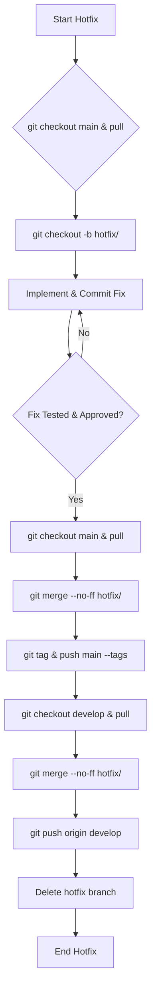

# SOP: GitFlow Hotfix Branch Workflow

## Document Information
- **Version**: 1.0
- **Effective Date**: 2025-07-20
- **Review Cycle**: Annual
- **Approval Authority**: Chief Technology Officer

## 1. Purpose and Scope

This SOP details the workflow for quickly patching production releases using GitFlow's hotfix branches. It ensures that critical bugs in the live environment can be addressed and deployed without disrupting ongoing development on the `develop` branch.

**Scope**: This SOP applies to developers and operations teams responsible for addressing urgent issues in production environments.

## 2. Workflow Steps

### 2.1 Create a Hotfix Branch

When a critical bug is identified in production, create a hotfix branch directly from the `main` branch.

```bash
git checkout main
git pull origin main
git checkout -b hotfix/<hotfix-name>
```

- **`<hotfix-name>`**: Use a descriptive name (e.g., `fix-login-issue`, `security-patch-v1.0.1`).

### 2.2 Implement the Fix

Apply the necessary bug fixes to the hotfix branch. Only changes directly related to the hotfix should be committed.

```bash
git add .
git commit -m "fix: Resolve <critical-bug-description>"
```

### 2.3 Complete the Hotfix

Once the hotfix is implemented, thoroughly tested, and approved for deployment, it needs to be merged into `main` and `develop`.

#### 2.3.1 Merge to `main`

Merge the hotfix branch into `main` and tag the new production version.

```bash
git checkout main
git pull origin main
git merge --no-ff hotfix/<hotfix-name>
git tag -a <new-version-number> -m "Hotfix <new-version-number>"
git push origin main --tags
```

- **`<new-version-number>`**: Increment the patch version (e.g., if `main` was `1.0.0`, the hotfix becomes `1.0.1`).

#### 2.3.2 Merge to `develop`

Merge the hotfix branch back into `develop` to ensure the fix is included in future releases. If a `release` branch is currently active, merge into the `release` branch instead of `develop`.

```bash
git checkout develop
git pull origin develop
git merge --no-ff hotfix/<hotfix-name>
git push origin develop
```

### 2.4 Delete the Hotfix Branch

After successfully merging into `main` and `develop`, delete the local and remote hotfix branch.

```bash
git branch -d hotfix/<hotfix-name>
git push origin --delete hotfix/<hotfix-name>
```

## 3. Best Practices

- **Urgency**: Hotfixes are for critical, production-breaking issues only.
- **Minimal Changes**: Keep hotfix changes as small and focused as possible.
- **Thorough Testing**: Despite the urgency, hotfixes must be thoroughly tested before deployment.
- **Communication**: Immediately communicate the hotfix deployment to relevant stakeholders.

## 4. Workflow Diagram


