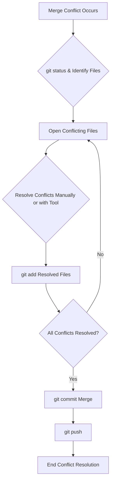

# SOP: Git Merge Conflict Resolution

## Document Information
- **Version**: 1.0
- **Effective Date**: 2025-07-20
- **Review Cycle**: Annual
- **Approval Authority**: Chief Technology Officer

## 1. Purpose and Scope

This SOP provides a standardized guide for resolving Git merge conflicts. It aims to equip developers with the necessary steps and best practices to efficiently resolve conflicts, maintain code integrity, and ensure a smooth integration process.

**Scope**: This SOP applies to all developers working with Git repositories who encounter merge conflicts during `git pull`, `git merge`, or `git rebase` operations.

## 2. Understanding Merge Conflicts

A merge conflict occurs when Git is unable to automatically reconcile differences between two branches being merged. This typically happens when:

- **Same Line, Different Changes**: The same lines of code have been modified differently in both branches.
- **File Renames/Deletions**: A file has been renamed or deleted in one branch and modified in another.

When a conflict occurs, Git will pause the merge process and mark the conflicting files. You will see markers like `<<<<<<<`, `=======`, and `>>>>>>>` in the conflicting files.

## 3. Workflow for Resolving Merge Conflicts

### 3.1 Identify Conflicting Files

When a merge conflict occurs, Git will inform you which files have conflicts. You can also use `git status` to see the list of unmerged paths.

```bash
git status
```

### 3.2 Open Conflicting Files

Open each conflicting file in your code editor. You will see conflict markers:

```
<<<<<<< HEAD
// Your changes on the current branch
======= 
// Incoming changes from the branch you are merging
>>>>>>> <branch-name>
```

- `<<<<<<< HEAD`: Marks the beginning of the changes from your current branch.
- `=======`: Separates your changes from the incoming changes.
- `>>>>>>> <branch-name>`: Marks the end of the incoming changes from the other branch.

### 3.3 Resolve Conflicts

For each conflict, you have three main options:

1.  **Keep Your Changes**: Delete the incoming changes and the conflict markers.
2.  **Keep Incoming Changes**: Delete your changes and the conflict markers.
3.  **Combine Changes**: Manually edit the code to integrate both sets of changes, then delete the conflict markers.

**Use a Merge Tool**: For complex conflicts, a graphical merge tool (e.g., VS Code's built-in merge editor, KDiff3, Beyond Compare) can be invaluable.

```bash
git mergetool
```

### 3.4 Stage Resolved Files

After resolving all conflicts in a file, stage the file to mark it as resolved.

```bash
git add <conflicting-file-name>
```

Repeat this for all conflicting files.

### 3.5 Complete the Merge

Once all conflicts are resolved and all conflicting files are staged, commit the merge.

```bash
git commit -m "Merge branch '<branch-name>' into <current-branch> with conflict resolution"
```

Git will often pre-populate a commit message for you; review and modify it if necessary.

### 3.6 Push Changes

Finally, push your merged changes to the remote repository.

```bash
git push origin <current-branch>
```

## 4. Best Practices for Avoiding and Resolving Conflicts

- **Pull Frequently**: Regularly pull changes from the `develop` or `main` branch into your feature branch to keep it up-to-date and resolve small conflicts early.
- **Small, Focused Commits**: Make small, logical commits. This makes conflicts easier to pinpoint and resolve.
- **Communicate**: Coordinate with your team members, especially when working on the same files or features.
- **Use Feature Branches**: Work on isolated feature branches to minimize interference with the main development line.
- **Understand the Code**: Before resolving, understand both sets of changes to make informed decisions.
- **Test After Resolution**: Always run tests after resolving conflicts to ensure no regressions were introduced.

## 5. Workflow Diagram


