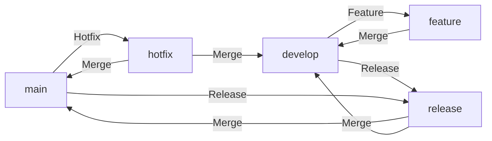

# SOP: GitFlow Overview

## Document Information
- **Version**: 1.0
- **Effective Date**: 2025-07-20
- **Review Cycle**: Annual
- **Approval Authority**: Chief Technology Officer

## 1. Purpose and Scope

This SOP provides an overview of the GitFlow branching model, a robust framework designed for managing large and continuous software releases. It aims to standardize the development workflow, ensure clear separation of concerns, and facilitate parallel development, release management, and hotfixes.

**Scope**: This SOP applies to all development teams utilizing the GitFlow branching model for their projects. It outlines the purpose and interaction of the main GitFlow branches.

## 2. GitFlow Branch Types

GitFlow defines a strict but flexible branching model with specific roles for each branch:

- **`main` (or `master`)**: This branch stores the official release history. It is always production-ready and stable. Commits to `main` are typically tagged with a version number.

- **`develop`**: This branch serves as an integration branch for ongoing development. It contains the latest delivered development changes for the next release. When the `develop` branch reaches a stable point and is ready for a new release, it is merged into a `release` branch.

- **`feature` branches**: These branches are used to develop new features for the upcoming or a distant future release. They typically branch off from `develop` and merge back into `develop` once the feature is complete and tested. Feature branches are temporary and exist only for the duration of the feature's development. For managing work-in-progress (WIP) within feature branches, refer to the [Git Work-in-Progress (WIP) Remote Backup SOP](git_wip_remote_backup_sop.md).

- **`release` branches**: These branches are used to prepare a new production release. They branch off from `develop` when the `develop` branch has enough features for a release. No new features are added to release branches; instead, they are used for bug fixes, final polishing, and preparing metadata (version numbers, build dates). Once ready, a `release` branch is merged into both `main` and `develop`.

- **`hotfix` branches**: These branches are used to quickly patch production releases. They branch off from `main` and merge back into both `main` and `develop` (or the current `release` branch if one exists). Hotfix branches are temporary and are deleted after the fix is applied.

## 3. GitFlow Workflow Diagram

## 4. Key Principles of GitFlow

- **Strict Branching Model**: Each branch has a well-defined purpose and set of rules for interaction.
- **Clear Separation of Concerns**: Development, release preparation, and hotfixes are handled on dedicated branches.
- **Parallel Development**: Developers can work on features independently without interfering with the main development line.
- **Release Management**: Provides a structured way to manage releases, including bug fixing and final preparations.
- **Hotfix Capability**: Allows for urgent production fixes without disrupting ongoing development.
- **Personal Work Safety**: Emphasizes the importance of regularly backing up work-in-progress (WIP) to prevent data loss and facilitate context switching.

## 5. Next Steps

Refer to the following SOPs for detailed instructions on working with each GitFlow branch type:

- [SOP: GitFlow Feature Branch Workflow](gitflow_feature_sop.md)
- [SOP: GitFlow Release Branch Workflow](gitflow_release_sop.md)
- [SOP: GitFlow Hotfix Branch Workflow](gitflow_hotfix_sop.md)
- [SOP: Git Merge Conflict Resolution](gitflow_merge_conflict_sop.md)
- [SOP: Git Work-in-Progress (WIP) Remote Backup](git_wip_remote_backup_sop.md)
