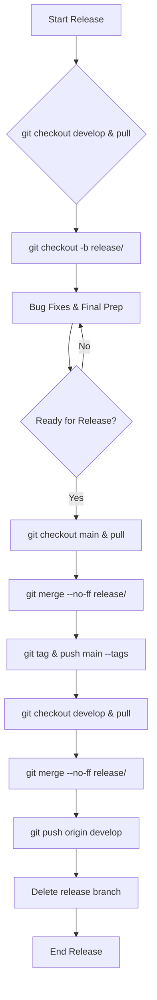

# SOP: GitFlow Release Branch Workflow

## Document Information
- **Version**: 1.0
- **Effective Date**: 2025-07-20
- **Review Cycle**: Annual
- **Approval Authority**: Chief Technology Officer

## 1. Purpose and Scope

This SOP details the workflow for preparing a new production release using GitFlow's release branches. It ensures a structured approach to bug fixing, final testing, and versioning before deploying to the `main` branch.

**Scope**: This SOP applies to release managers, technical leads, and QA teams responsible for preparing and deploying software releases.

## 2. Workflow Steps

### 2.1 Create a Release Branch

When the `develop` branch has accumulated enough features for a new release, create a release branch from `develop`.

```bash
git checkout develop
git pull origin develop
git checkout -b release/<version-number>
```

- **`<version-number>`**: Use semantic versioning (e.g., `1.0.0`, `2.1.0`).

### 2.2 Bug Fixes and Final Preparations

No new features are added to a release branch. This phase is dedicated to:

- **Bug Fixes**: Address any bugs found during testing of the release candidate.
- **Documentation Updates**: Update release notes, version numbers, and any other release-specific documentation.
- **Final Testing**: Conduct thorough system, integration, and user acceptance testing.

```bash
git add .
git commit -m "fix: Resolve <bug-description> on release branch"
```

### 2.3 Complete the Release

Once the release branch is stable, all tests pass, and it's approved for release, it needs to be merged into `main` and `develop`.

#### 2.3.1 Merge to `main`

Merge the release branch into `main` and tag the release.

```bash
git checkout main
git pull origin main
git merge --no-ff release/<version-number>
git tag -a <version-number> -m "Release <version-number>"
git push origin main --tags
```

#### 2.3.2 Merge to `develop`

Merge the release branch back into `develop` to ensure all bug fixes and release preparations are included in future development.

```bash
git checkout develop
git pull origin develop
git merge --no-ff release/<version-number>
git push origin develop
```

### 2.4 Delete the Release Branch

After successfully merging into `main` and `develop`, delete the local and remote release branch.

```bash
git branch -d release/<version-number>
git push origin --delete release/<version-number>
```

## 3. Best Practices

- **Strict Scope**: Do not add new features to a release branch. Its purpose is stabilization.
- **Early Creation**: Create release branches early enough to allow for proper testing and bug fixing.
- **Clear Communication**: Announce the creation of a release branch and its impending merge to the team.
- **Automated Testing**: Leverage CI/CD pipelines to automate testing on release branches.

## 4. Workflow Diagram

