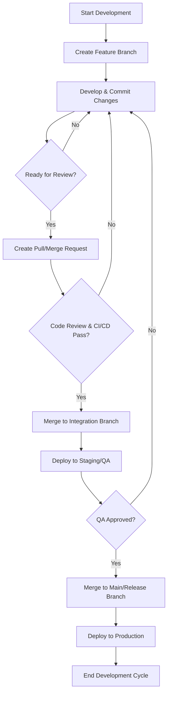

# SOP: Git Workflow and Best Practices

## Document Information
- **Version**: 1.0
- **Effective Date**: 2025-07-20
- **Review Cycle**: Annual
- **Approval Authority**: Chief Technology Officer

## 1. Purpose and Scope

This Standard Operating Procedure (SOP) defines the standardized Git workflow and best practices for all software development projects. It aims to ensure consistent version control, facilitate collaborative development, maintain code integrity, and streamline the release process.

**Scope**: This SOP applies to all project team members utilizing Git for source code management, including developers, QA engineers, and DevOps personnel. It covers:
- Branching strategy (e.g., GitFlow, Trunk-Based Development)
- Commit message conventions
- Code review processes
- Merging and rebasing guidelines
- Handling of sensitive information

## 2. Roles and Responsibilities

- **Developer (Primary)**: Responsible for adhering to the defined Git workflow, creating feature branches, committing changes, and participating in code reviews.
- **Technical Lead**: Oversees the Git repository, approves pull/merge requests, resolves complex merge conflicts, and ensures adherence to branching strategy.
- **DevOps Engineer**: Manages Git repository configurations, CI/CD pipeline integration, and provides support for Git-related issues.
- **Project Manager**: Ensures project timelines align with Git workflow and release cycles.

## 3. Process Framework: Git Workflow

## 4. Key Git Commands and Workflows

### 4.1 Branching Strategy (Example: Simplified GitFlow)
- `main`: Production-ready code. Only merges from `release` or `hotfix` branches.
- `develop`: Integration branch for ongoing development. Merges from `feature` branches.
- `feature/<feature-name>`: Branches for new features or significant changes. Created from `develop`.
- `release/<version>`: Branches for preparing a new production release. Created from `develop`.
- `hotfix/<hotfix-name>`: Branches for urgent bug fixes in production. Created from `main`.

### 4.2 Commit Message Conventions
- **Format**: `Type: Subject` (e.g., `feat: Add user authentication`)
- **Body**: Detailed explanation of *what* and *why* (optional, but encouraged for complex changes).
- **Types**:
    - `feat`: A new feature
    - `fix`: A bug fix
    - `docs`: Documentation only changes
    - `style`: Changes that do not affect the meaning of the code (white-space, formatting, missing semi-colons, etc.)
    - `refactor`: A code change that neither fixes a bug nor adds a feature
    - `perf`: A code change that improves performance
    - `test`: Adding missing tests or correcting existing tests
    - `build`: Changes that affect the build system or external dependencies (example scopes: gulp, broccoli, npm)
    - `ci`: Changes to our CI configuration files and scripts (example scopes: Travis, Circle, BrowserStack, SauceLabs)
    - `chore`: Other changes that don't modify src or test files
    - `revert`: Reverts a previous commit

### 4.3 Code Review Process
- All feature branches must be reviewed before merging into `develop`.
- Reviewers should provide constructive feedback and ensure adherence to coding standards.
- At least one approval is required from a Technical Lead or designated peer.

### 4.4 Merging and Rebasing
- **Feature to Develop**: Use `git merge --no-ff` to preserve history or `git rebase` for a cleaner history (team decision).
- **Develop to Release/Main**: Use `git merge --no-ff`.
- **Hotfix to Main/Develop**: Use `git merge --no-ff`.

### 4.5 Handling Sensitive Information
- Never commit API keys, passwords, or other sensitive credentials directly into the repository.
- Use environment variables, secret management services, or `.gitignore` for sensitive files.

## 5. Quality Gates

- **Automated Tests**: All unit, integration, and end-to-end tests must pass in the CI/CD pipeline.
- **Code Linting/Static Analysis**: Code must pass all linting and static analysis checks with no critical errors.
- **Code Review Approval**: All pull/merge requests must receive the required approvals.
- **Merge Conflict Resolution**: All merge conflicts must be resolved correctly before merging.

## 6. Tools and Templates

- **Git Client**: Command-line Git, Git GUI clients (e.g., GitKraken, SourceTree).
- **Code Hosting Platform**: GitHub, GitLab, Bitbucket, Azure DevOps (for pull/merge requests and code reviews).
- **CI/CD Pipeline**: Jenkins, GitLab CI/CD, GitHub Actions, Azure DevOps Pipelines.
- **`.gitignore` Template**: Standardized `.gitignore` files for different project types.

## 7. Metrics and KPIs

- **Pull Request Cycle Time**: Time from PR creation to merge.
- **Code Review Coverage**: Percentage of code changes reviewed.
- **Merge Conflict Frequency**: Number of merge conflicts per week/sprint.
- **Build Success Rate**: Percentage of successful builds in the CI/CD pipeline.
- **Commit Frequency**: Number of commits per developer per day/week.

## 8. Continuous Improvement

- **Regular Retrospectives**: Discuss Git workflow effectiveness and identify areas for improvement.
- **Training**: Provide ongoing training on Git best practices and advanced features.
- **Tooling Updates**: Evaluate and adopt new Git tools or features that enhance productivity and quality.
- **SOP Review**: Annually review and update this SOP based on project needs and industry best practices.
