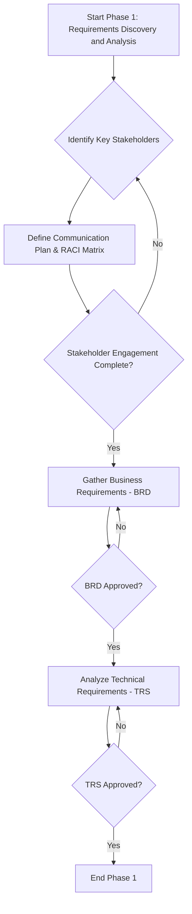

# SOP: Phase 1 - Requirements Discovery and Analysis

## Document Information
- **Version**: 1.0
- **Effective Date**: 2025-07-20
- **Review Cycle**: Annual
- **Approval Authority**: Chief Technology Officer

## 1. Purpose and Scope

This Standard Operating Procedure (SOP) defines the standardized process for discovering, gathering, and analyzing software requirements. It ensures that all project requirements are clearly understood, accurately documented, and aligned with business objectives before proceeding to subsequent phases of the software development lifecycle.

**Scope**: This SOP applies to all enterprise software development projects and covers:
- Stakeholder identification and engagement.
- Business requirements gathering and documentation.
- Technical requirements analysis and specification.
- Initial risk assessment related to requirements.

## 2. Roles and Responsibilities

- **Business Analyst (Primary)**: Leads requirements gathering, facilitates workshops, documents business requirements, and manages stakeholder communication. Obtains BRD approval.
- **Project Manager**: Oversees the requirements phase, manages timelines, allocates resources, and facilitates conflict resolution.
- **Software Architect**: Identifies and analyzes technical requirements, assesses feasibility, and defines non-functional requirements. Approves TRS.
- **Technical Lead**: Provides technical input during requirements gathering, assists in defining technical requirements, and reviews specifications for clarity and completeness.
- **Quality Assurance Lead**: Reviews requirements for testability, completeness, and clarity from a QA perspective.
- **Security Architect**: Identifies and analyzes security requirements and ensures compliance with security policies.
- **Data Architect**: Identifies data requirements, contributes to data modeling, and ensures data governance compliance.

## 3. Process Framework: Requirements Discovery and Analysis

### 3.1 Stakeholder Engagement

**Deliverable**: Stakeholder Analysis Matrix

**Activities**:
- **Identify Key Stakeholders**: Work with the Project Sponsor and Project Manager to identify all individuals or groups impacted by or influencing the project.
- **Stakeholder Mapping**: Categorize stakeholders by their influence, interest, and involvement (e.g., using a power/interest grid).
- **Define Communication Plan**: Establish preferred communication channels, frequency of updates, and escalation paths for each stakeholder group.
- **RACI Matrix Development**: Define Responsible, Accountable, Consulted, and Informed roles for key project activities and deliverables.

**Quality Gates**:
- **Stakeholder Identification Complete**: All primary stakeholders are identified and documented.
- **Communication Plan Approved**: The communication plan is reviewed and approved by the Project Manager and key stakeholders.
- **Initial Risk Register Established**: A preliminary risk register is created with initial risks related to stakeholder engagement (e.g., lack of availability, conflicting priorities).

### 3.2 Business Requirements Gathering

**Deliverable**: Business Requirements Document (BRD)

**Activities**:
- **Requirements Elicitation**: Conduct workshops, interviews, surveys, and observation sessions with stakeholders to gather business needs and expectations.
- **User Story Creation**: Translate high-level business needs into user stories, focusing on user value and desired outcomes (referencing `1_principles/1.1_user_story_principles.md`).
- **Process Modeling**: Document current-state and future-state business processes using Business Process Model and Notation (BPMN) diagrams.
- **Business Rule Definition**: Capture all relevant business rules, policies, and constraints that govern the system's behavior.
- **Scope Definition**: Clearly define the project scope, including what is in and out of scope, to manage expectations.
- **Requirements Prioritization**: Prioritize requirements using a methodology like MoSCoW (Must-have, Should-have, Could-have, Won't-have).

**Quality Gates**:
- **BRD Review and Approval**: The BRD must be formally reviewed and approved by the Business Sponsor and key business stakeholders.
- **Requirements Traceability**: Ensure traceability from business objectives to individual requirements is established.
- **Scope Baseline**: The project scope is baselined and agreed upon by all key stakeholders.

### 3.3 Technical Requirements Analysis

**Deliverable**: Technical Requirements Specification (TRS)

**Activities**:
- **Non-Functional Requirements (NFRs) Definition**: Define detailed NFRs covering performance, scalability, security, reliability, usability, and maintainability (referencing `docs/requirements_writing_style_guide.md`).
- **System Interface Definition**: Identify and document all external systems and interfaces the software will interact with.
- **Data Requirements Analysis**: Define data entities, attributes, relationships, and data flow. Consider data migration and integration needs.
- **Compliance and Regulatory Requirements**: Identify and document all legal, regulatory, and compliance requirements (e.g., GDPR, HIPAA, PCI DSS).
- **Technical Constraints and Assumptions**: Document any known technical limitations, dependencies, or assumptions that may impact the solution.
- **High-Level Component Identification**: Identify major system components and their high-level interactions (e.g., using UML component diagrams).

**Quality Gates**:
- **TRS Review and Approval**: The TRS must be formally reviewed and approved by the Software Architect, Technical Lead, and Security Architect.
- **Feasibility Assessment**: Technical feasibility of the requirements is confirmed by the Software Architect.
- **Security Requirements Validation**: All security requirements are validated against enterprise security policies.

## 4. Tools and Templates

- **Requirements Management System**: Jira, Azure DevOps, Confluence, or similar for capturing, tracking, and managing requirements.
- **Modeling Tools**: Lucidchart, PlantUML, Enterprise Architect for BPMN diagrams, UML use case diagrams, and high-level component diagrams.
- **Collaboration Tools**: Microsoft Teams, Slack, Zoom for facilitating workshops and communication.
- **Standard Templates**: Business Requirements Document (BRD) template, Technical Requirements Specification (TRS) template, Stakeholder Analysis Matrix template.

## 5. Metrics and KPIs

- **Requirements Completeness**: Percentage of identified requirements documented and approved.
- **Requirements Stability**: Number of changes to approved requirements after baseline.
- **Stakeholder Satisfaction**: Feedback from stakeholders on the requirements gathering process.
- **Requirements Traceability Coverage**: Percentage of requirements linked to business objectives and design elements.
- **Defect Detection Rate (Requirements Phase)**: Number of defects found in requirements before design begins.

## 6. Continuous Improvement

- **Post-Phase Retrospective**: Conduct a retrospective at the end of the requirements phase to identify lessons learned and areas for process improvement.
- **Feedback Loop**: Incorporate feedback from subsequent phases (design, development, testing) to refine requirements gathering processes.
- **Template Refinement**: Regularly review and update requirements templates and checklists based on project experiences and industry best practices.
