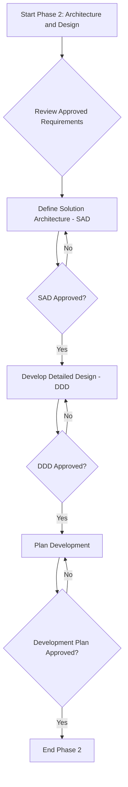

# SOP: Phase 2 - Architecture and Design

## Document Information
- **Version**: 1.0
- **Effective Date**: 2025-07-20
- **Review Cycle**: Annual
- **Approval Authority**: Chief Technology Officer

## 1. Purpose and Scope

This Standard Operating Procedure (SOP) outlines the standardized process for designing the software solution based on approved requirements. It ensures that the architecture and detailed designs are robust, scalable, secure, and align with enterprise standards and business objectives.

**Scope**: This SOP applies to all enterprise software development projects that have completed Phase 1 (Requirements Discovery and Analysis) and are proceeding to define the technical solution.

## 2. Roles and Responsibilities

- **Software Architect (Primary)**: Leads solution architecture, technology selection, and ensures alignment with enterprise architectural principles. Approves SAD.
- **Technical Lead (Primary)**: Leads detailed design, defines coding standards, and creates the development plan. Approves DDD and Development Plan.
- **Business Analyst**: Provides clarification on requirements, validates design against business needs, and participates in UX design.
- **Project Manager**: Manages design phase timeline, resources, and facilitates communication between teams.
- **Quality Assurance Lead**: Reviews design for testability, defines testing strategy, and ensures quality gates are met.
- **Security Architect**: Reviews and approves security aspects of the design.
- **Data Architect**: Reviews and approves data model design and data governance compliance.
- **DevOps Engineer**: Provides input on deployment architecture and environment planning.

## 3. Process Framework: Architecture and Design

### 3.1 Solution Architecture Definition

**Deliverable**: Solution Architecture Document (SAD)

**Activities**:
- **Review Approved Requirements**: Thoroughly review the Business Requirements Document (BRD) and Technical Requirements Specification (TRS) from Phase 1.
- **High-Level System Design**: Define the overall system structure, major components, and their interactions. Identify system boundaries and external interfaces.
- **Technology Stack Selection**: Propose and justify the core technologies (programming languages, frameworks, databases, cloud services) based on requirements, enterprise standards, and future scalability.
- **Architectural Patterns**: Select appropriate architectural patterns (e.g., microservices, monolithic, event-driven) and explain their rationale.
- **Quality Attributes Design**: Outline how non-functional requirements (performance, scalability, reliability, security, maintainability) will be addressed at an architectural level.
- **Data Architecture**: Define the high-level data flow, data storage mechanisms, and data governance considerations.
- **Deployment Architecture**: Sketch the high-level deployment model (e.g., cloud, on-premise, containerization).
- **Architecture Decision Records (ADRs)**: Document significant architectural decisions and their rationale.

**Quality Gates**:
- **SAD Review and Approval**: The SAD must be formally reviewed and approved by the Software Architect, Technical Lead, and relevant stakeholders (e.g., Enterprise Architecture Board).
- **Technology Alignment**: All proposed technologies must align with enterprise technology standards or have approved exceptions.
- **Feasibility Confirmation**: The proposed architecture must be deemed technically feasible within project constraints.

### 3.2 Detailed Design Specifications

**Deliverable**: Detailed Design Document (DDD)

**Activities**:
- **Component-Level Design**: Break down major architectural components into smaller, manageable modules or services. Define their responsibilities, interfaces, and internal structure.
- **API Specification**: Create detailed API specifications (e.g., OpenAPI/Swagger) for all internal and external APIs, including endpoints, request/response formats, authentication, and error handling.
- **Data Model Design**: Develop detailed database schemas (e.g., ERDs, DDL scripts) for all persistent data, including tables, relationships, indexes, and data validation rules.
- **User Interface (UI) / User Experience (UX) Design**: Create wireframes, mockups, and user flow diagrams for critical user interfaces. Define interaction patterns and accessibility standards.
- **Security Model Design**: Detail the security mechanisms, including authentication flows, authorization models (e.g., RBAC), data encryption strategies, and secure coding patterns.
- **Integration Design**: Specify how the system will integrate with other internal or external systems, including protocols, data formats, and error handling for integrations.
- **Error Handling Strategy**: Define a consistent, secure, and informative error handling approach across the application.

**Quality Gates**:
- **DDD Peer Review**: The DDD must undergo a peer review by at least two senior developers or architects not directly involved in its creation.
- **UX Validation**: UI/UX designs must be validated with representative users or business stakeholders.
- **Data Model Review**: The detailed data model must be reviewed and approved by the Data Architect.
- **Security Design Review**: The security model must be reviewed and approved by the Security Architect.

### 3.3 Development Planning

**Deliverable**: Development Plan and Standards

**Activities**:
- **Work Breakdown Structure (WBS)**: Create a detailed WBS, breaking down design components into estimable tasks.
- **Effort Estimation**: Provide granular effort estimates for each task, involving the development team.
- **Coding Standards and Guidelines**: Define language-specific coding standards (referencing `docs/style_guides/coding/` and `docs/style_guides/security/` guides) and development best practices.
- **Testing Strategy**: Detail the testing approach for each phase (unit, integration, system, performance, security, UAT) and define acceptance criteria for each test type.
- **Development Environment Setup**: Plan and document the setup for development, testing, and staging environments.
- **Tooling Requirements**: Identify and procure necessary development tools (IDEs, version control, CI/CD, static analysis).
- **Branching Strategy**: Define the Git branching strategy (e.g., GitFlow, Trunk-Based Development).

**Quality Gates**:
- **Development Plan Approval**: The Development Plan must be approved by the Project Manager, Technical Lead, and QA Lead.
- **Resource Allocation Confirmation**: Required development resources (human and technical) must be confirmed and allocated.
- **Environment Readiness**: Development environments must be provisioned and validated as ready for use.

## 4. Tools and Templates

- **UML Modeling Tool**: Enterprise Architect, Lucidchart, PlantUML, Mermaid (for diagrams).
- **API Specification Tool**: Swagger UI, Postman, Stoplight (for OpenAPI/Swagger).
- **Database Design Tool**: ER/Studio, pgAdmin, MySQL Workbench (for ERDs and DDL).
- **UI/UX Design Tool**: Figma, Sketch, Adobe XD (for wireframes and mockups).
- **Version Control System**: Git (with a centralized repository like GitHub Enterprise, GitLab, Azure DevOps).
- **Standard Templates**: Solution Architecture Document (SAD) template, Detailed Design Document (DDD) template, Development Plan template.

## 5. Metrics and KPIs

- **Design Completeness**: Percentage of requirements covered by design elements (target: 100%).
- **Design Review Feedback Cycle Time**: Time taken to address and resolve design review comments.
- **Design Rework Rate**: Number of design changes required after initial approval.
- **Estimated vs. Actual Effort (Design Phase)**: Variance in effort estimation for design tasks.
- **Security Vulnerabilities (Design Phase)**: Number of critical/high vulnerabilities identified during design reviews.

## 6. Continuous Improvement

- **Post-Design Retrospective**: Conduct a retrospective at the end of the design phase to identify lessons learned and areas for process improvement.
- **Feedback Loop**: Incorporate feedback from development and QA teams into future design processes.
- **Knowledge Sharing**: Regularly update design patterns, best practices, and ADRs based on new insights and technologies.
