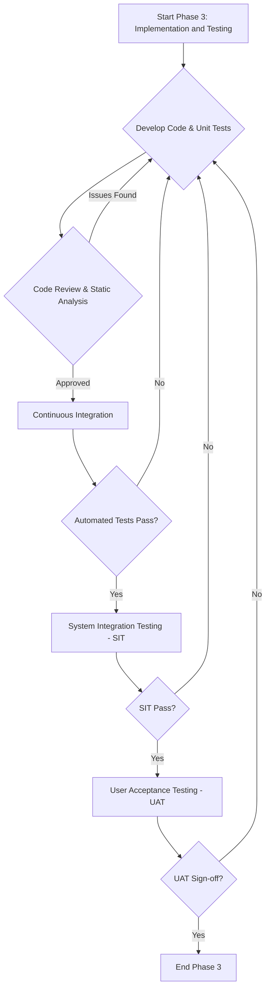

# SOP: Phase 3 - Implementation and Testing

## Document Information
- **Version**: 1.0
- **Effective Date**: 2025-07-20
- **Review Cycle**: Annual
- **Approval Authority**: Chief Technology Officer

## 1. Purpose and Scope

This Standard Operating Procedure (SOP) defines the standardized process for developing and testing the software solution based on approved designs. It ensures that the implemented software meets all functional and non-functional requirements, adheres to coding standards, and is thoroughly validated before deployment.

**Scope**: This SOP applies to all enterprise software development projects that have completed Phase 2 (Architecture and Design) and are proceeding with coding, unit testing, integration testing, and user acceptance testing.

## 2. Roles and Responsibilities

- **Technical Lead (Primary)**: Oversees development, ensures adherence to coding standards, conducts code reviews, and guides the development team. Approves code merges.
- **Software Developers (Primary)**: Implement features, write unit tests, participate in code reviews, and fix defects.
- **Quality Assurance Lead (Primary)**: Defines testing strategy, oversees test execution, manages defect lifecycle, and ensures quality gates are met. Approves test results.
- **QA Engineers**: Design and execute test cases (unit, integration, system, performance, security), report defects, and verify fixes.
- **Project Manager**: Manages implementation and testing timelines, tracks progress, and facilitates communication.
- **Business Analyst**: Clarifies requirements during development, assists in UAT planning, and validates implemented features.
- **DevOps Engineer**: Manages CI/CD pipelines, deployment environments, and ensures infrastructure readiness for testing.
- **Security Architect**: Reviews security test plans and results, and provides guidance on security vulnerabilities.

## 3. Process Framework: Implementation and Testing

### 3.1 Development Execution

**Deliverable**: Working Software Increments (e.g., feature branches, release candidates)

**Activities**:
- **Code Implementation**: Develop features and components according to the Detailed Design Document (DDD) and established coding standards (referencing `docs/style_guides/coding/` and `docs/style_guides/security/` guides).
- **Unit Testing**: Developers write comprehensive unit tests for all new or modified code, ensuring high code coverage (minimum 80% line, 70% branch).
- **Code Reviews**: All code changes must undergo a formal code review process by at least one peer and the Technical Lead. Reviews focus on quality, adherence to standards, security, and functional correctness.
- **Continuous Integration**: Integrate code changes frequently into a shared repository. Automated builds and unit tests are triggered on every commit.
- **Defect Resolution**: Developers are responsible for fixing defects identified during unit testing or code reviews.

**Quality Gates**:
- **Code Review Completion**: All code must be formally reviewed and approved before merging to the `develop` or `main` branch.
- **Unit Test Pass Rate**: All unit tests must pass with 100% success rate.
- **Code Coverage Thresholds**: Code coverage metrics must meet or exceed defined minimums.
- **Static Analysis Cleanliness**: Code must pass static analysis checks (linters, security scanners) with no critical or high-severity issues.

### 3.2 System Integration Testing (SIT)

**Deliverable**: Integration Test Results and Documentation

**Activities**:
- **Test Plan Development**: QA Lead and QA Engineers develop a detailed SIT plan based on the Solution Architecture Document (SAD) and DDD, focusing on interactions between components and external systems.
- **Test Environment Setup**: DevOps Engineers provision and configure a dedicated SIT environment that mirrors production as closely as possible.
- **Test Case Execution**: QA Engineers execute integration test cases, including functional flows, API contract validation, data integrity checks, and error handling across system boundaries.
- **Performance Testing**: Conduct performance tests (load, stress, scalability) to ensure the system meets non-functional requirements for response time, throughput, and resource utilization.
- **Security Testing**: Perform security tests, including vulnerability scanning, penetration testing (if applicable), and authentication/authorization mechanism validation.
- **Defect Management**: All identified defects are logged in the defect tracking system, prioritized, assigned to developers, and retested upon fix.

**Quality Gates**:
- **SIT Pass Rate**: All critical and high-priority integration test cases must pass (target: 95% overall pass rate).
- **Performance Benchmarks Met**: System performance must meet or exceed defined non-functional requirements.
- **Security Vulnerabilities Addressed**: All critical and high-severity security vulnerabilities identified during testing must be resolved or formally accepted with mitigation plans.
- **Defect Backlog Review**: A review of the remaining defect backlog is conducted to ensure no critical issues remain unresolved.

### 3.3 User Acceptance Testing (UAT)

**Deliverable**: UAT Results and Sign-off

**Activities**:
- **UAT Planning**: Business Analyst and QA Lead collaborate to define UAT scope, test scenarios, and success criteria, involving end-users or business stakeholders.
- **UAT Environment Setup**: DevOps Engineers provision a UAT environment, ensuring it is stable and contains representative data.
- **User Training**: Business Analyst or Project Manager provides necessary training to UAT participants on the system functionality.
- **Test Execution by Users**: End-users execute UAT scenarios, validating the system against their business requirements and workflows.
- **Feedback and Defect Collection**: User feedback and defects are meticulously collected, documented, and prioritized.
- **Final Business Process Validation**: Business stakeholders confirm that the system supports the defined future-state business processes.

**Quality Gates**:
- **UAT Sign-off**: Formal sign-off from the business sponsor or designated UAT lead, indicating acceptance of the software for deployment.
- **Critical Defect Resolution**: All critical and high-priority defects identified during UAT must be resolved and verified.
- **User Documentation Readiness**: User documentation and training materials are finalized and approved.
- **Operational Readiness Review**: A review with operations teams to ensure the system is ready for production support.

## 4. Tools and Templates

- **Integrated Development Environment (IDE)**: IntelliJ IDEA, Visual Studio, VS Code, PyCharm.
- **Version Control System**: Git (GitHub Enterprise, GitLab, Azure DevOps).
- **CI/CD Platform**: Jenkins, GitLab CI/CD, GitHub Actions, Azure DevOps Pipelines.
- **Code Quality Tools**: SonarQube, Checkstyle, ESLint, Black, clang-tidy.
- **Testing Frameworks**: JUnit, NUnit, pytest, Jest, Google Test.
- **Performance Testing Tools**: JMeter, LoadRunner, k6.
- **Security Testing Tools**: OWASP ZAP, Burp Suite, Nessus, Snyk.
- **Defect Tracking System**: Jira, Azure DevOps Boards.
- **Standard Templates**: Unit Test Plan, Integration Test Plan, UAT Plan, Defect Report.

## 5. Metrics and KPIs

- **Code Coverage**: Percentage of code covered by automated tests.
- **Defect Density**: Number of defects per thousand lines of code (KLOC).
- **Defect Resolution Time**: Average time taken to resolve defects.
- **Test Case Pass Rate**: Percentage of executed test cases that pass.
- **Automated Test Execution Time**: Time taken to run the full automated test suite.
- **UAT Defect Count**: Number of defects identified during User Acceptance Testing.
- **Estimated vs. Actual Effort (Implementation/Testing Phase)**: Variance in effort estimation.

## 6. Continuous Improvement

- **Post-Implementation Retrospective**: Conduct a retrospective at the end of the phase to identify lessons learned, process bottlenecks, and areas for improvement.
- **Automated Quality Gates Review**: Regularly review and refine CI/CD pipeline quality gates to ensure they are effective and efficient.
- **Knowledge Sharing**: Conduct internal workshops and share best practices for coding, testing, and defect resolution.
