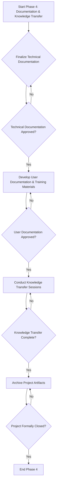

# SOP: Phase 4 - Documentation and Knowledge Transfer

## Document Information
- **Version**: 1.0
- **Effective Date**: 2025-07-20
- **Review Cycle**: Annual
- **Approval Authority**: Chief Technology Officer

## 1. Purpose and Scope

This Standard Operating Procedure (SOP) defines the standardized process for completing all project documentation and ensuring effective knowledge transfer to relevant stakeholders. It aims to provide comprehensive, accurate, and accessible information for ongoing maintenance, support, and future development of the software solution.

**Scope**: This SOP applies to all enterprise software development projects that have completed Phase 3 (Implementation and Testing) and are preparing for deployment and handover to operations and support teams.

## 2. Roles and Responsibilities

- **Technical Lead (Primary)**: Oversees the completion of all technical documentation, ensures its accuracy and completeness, and leads technical knowledge transfer sessions.
- **Business Analyst (Primary)**: Oversees the completion of user documentation, ensures its alignment with business processes, and leads user training sessions.
- **Project Manager (Primary)**: Ensures all documentation is completed on schedule, facilitates knowledge transfer, and obtains formal project sign-off.
- **Software Developers**: Contribute to technical documentation, participate in knowledge transfer sessions, and provide input for troubleshooting guides.
- **Quality Assurance Lead**: Reviews documentation for accuracy, especially regarding testing procedures and defect resolution.
- **DevOps Engineer**: Documents deployment procedures, infrastructure configurations, and contributes to operational runbooks.
- **Technical Writers (if applicable)**: Develop and refine user and technical documentation.
- **Operations Team**: Participates in knowledge transfer, reviews operational documentation, and provides feedback on support procedures.
- **Support Team**: Participates in knowledge transfer, reviews user documentation, and provides feedback on support procedures.

## 3. Process Framework: Documentation and Knowledge Transfer

### 3.1 Technical Documentation Completion

**Deliverable**: Complete Technical Documentation Suite

**Activities**:
- **API Documentation Finalization**: Ensure all API specifications (e.g., OpenAPI/Swagger) are up-to-date, include complete examples, error codes, and authentication details.
- **Database Documentation**: Finalize database schemas, ERDs, data dictionaries, and stored procedure documentation. Include data retention and archival policies.
- **Deployment Procedures**: Document detailed, step-by-step deployment procedures for all environments (staging, production), including rollback plans and environment-specific configurations.
- **Infrastructure as Code (IaC) Documentation**: Document IaC scripts (e.g., Terraform, Ansible) and their configurations.
- **Operational Runbooks**: Create comprehensive runbooks for common operational tasks, including system startup/shutdown, monitoring alerts, backup/restore procedures, and routine maintenance.
- **Troubleshooting Guides**: Develop guides for common issues, including symptoms, potential causes, and resolution steps.
- **Architecture Updates**: Update Solution Architecture Document (SAD) and Detailed Design Document (DDD) to reflect any changes made during implementation.
- **Code Documentation**: Ensure in-code comments and docstrings/TSDocs/Javadocs are complete and accurate, especially for public APIs and complex logic.

**Quality Gates**:
- **Technical Documentation Review**: All technical documentation must be reviewed and approved by the Technical Lead, Software Architect, and relevant DevOps/Operations personnel.
- **Accuracy and Completeness**: Documentation must accurately reflect the implemented system and cover all critical operational aspects.
- **Version Control**: All documentation must be stored in the project's version control system and follow established versioning standards.

### 3.2 User Documentation and Training

**Deliverable**: User Documentation and Training Materials

**Activities**:
- **User Manuals and Guides**: Create user-friendly manuals, quick start guides, and FAQs for end-users. Focus on task-oriented instructions and clear language.
- **Business Process Documentation**: Document any changes to existing business processes or new workflows introduced by the software.
- **Training Material Development**: Develop presentations, exercises, and hands-on labs for user training sessions.
- **Training Delivery**: Conduct training sessions for end-users, administrators, and support staff.
- **Support Procedures**: Document procedures for user support, including common issues, escalation paths, and contact information.

**Quality Gates**:
- **User Documentation Review**: User documentation must be reviewed and approved by the Business Analyst and key business stakeholders.
- **Usability Validation**: User documentation should be validated through usability testing with representative users.
- **Training Effectiveness**: Training materials should be assessed for clarity and effectiveness, potentially through post-training surveys or assessments.

### 3.3 Knowledge Transfer and Handover

**Deliverable**: Operational Readiness Package and Project Archival

**Activities**:
- **Technical Knowledge Transfer Sessions**: Conduct dedicated sessions with the Operations and Support teams to transfer in-depth technical knowledge about the system, its architecture, dependencies, and troubleshooting.
- **Codebase Walkthroughs**: Technical Lead and Developers conduct walkthroughs of the codebase, highlighting key modules, design patterns, and complex areas.
- **Support Handover**: Formally hand over support responsibilities to the designated support team, ensuring they have all necessary tools, access, and documentation.
- **Project Retrospective**: Conduct a comprehensive project retrospective with the entire project team to identify successes, challenges, and lessons learned for future projects.
- **Project Archival**: Archive all project artifacts (code, documentation, designs, test results, meeting minutes) in the designated enterprise repository, ensuring long-term accessibility and auditability.
- **Formal Project Closure**: Obtain formal project closure sign-off from the Project Sponsor, confirming all deliverables have been met and responsibilities transferred.

**Quality Gates**:
- **Operations Team Readiness**: Operations and Support teams confirm their readiness to support the system, demonstrated through successful completion of knowledge transfer and review of operational documentation.
- **Project Archival Verification**: All project artifacts are correctly archived and accessible in the enterprise repository.
- **Lessons Learned Document**: A comprehensive lessons learned document is created and shared with relevant organizational units.
- **Project Sponsor Sign-off**: Formal project closure is obtained.

## 4. Tools and Templates

- **Document Management System**: SharePoint, Confluence, or similar for storing and versioning all documentation.
- **Diagramming Tools**: Lucidchart, draw.io, PlantUML, Mermaid (for updating diagrams).
- **Technical Writing Tools**: Sphinx, GitBook, Docusaurus (for generating documentation from code).
- **Training Platforms**: Learning Management Systems (LMS) for delivering and tracking user training.
- **Standard Templates**: Operational Runbook template, Troubleshooting Guide template, User Manual template, Project Retrospective template.

## 5. Metrics and KPIs

- **Documentation Completeness**: Percentage of required documentation artifacts completed and approved (target: 100%).
- **Knowledge Transfer Effectiveness**: Assessed through post-transfer quizzes or operational team confidence levels.
- **Support Ticket Escalation Rate**: Number of tickets escalated from Tier 1 to Tier 2/3 support in the initial post-deployment period.
- **Defect Density (Post-Deployment)**: Number of critical/high defects found in production after initial deployment.
- **User Training Attendance and Completion Rates**.

## 6. Continuous Improvement

- **Post-Deployment Review**: Conduct a review a few weeks after deployment to assess system stability, operational efficiency, and user adoption.
- **Feedback Mechanisms**: Establish channels for ongoing feedback from operations, support, and end-users to continuously improve documentation and training.
- **Documentation Updates**: Implement a process for regularly updating documentation as the system evolves or new issues are identified.
