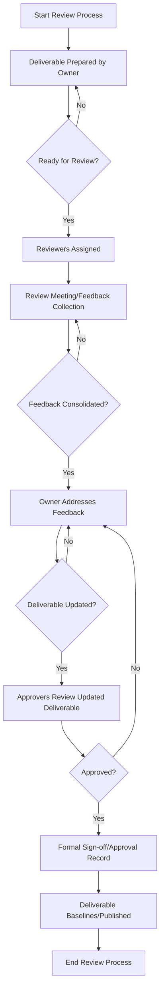
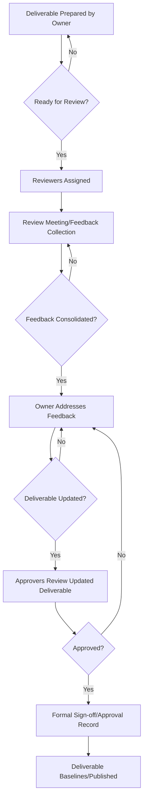

# SOP: Review and Approval Process

## Document Information
- **Version**: 1.0
- **Effective Date**: 2025-07-20
- **Review Cycle**: Annual
- **Approval Authority**: Chief Technology Officer

## 1. Purpose and Scope

This Standard Operating Procedure (SOP) defines the standardized process for conducting reviews and obtaining approvals for all key deliverables and decisions throughout the software development lifecycle. It ensures that all artifacts meet defined quality standards, align with project objectives, and have the necessary stakeholder consensus and formal sign-off.

**Scope**: This SOP applies to all enterprise software development projects and covers the review and approval of:
- Requirements documents (BRD, TRS)
- Design documents (SAD, DDD)
- Test plans and results (SIT, UAT)
- Code changes (via Code Reviews)
- Technical and User Documentation
- Project plans and major milestones
- Risk mitigation strategies

## 2. Roles and Responsibilities

- **Deliverable Owner (Primary)**: Responsible for preparing the deliverable, scheduling reviews, addressing feedback, and obtaining approvals.
- **Reviewers (Primary)**: Provide constructive feedback, identify issues, and ensure the deliverable meets quality and functional criteria.
- **Approvers (Primary)**: Have the authority to formally approve a deliverable or decision, signifying their acceptance and readiness to proceed.
- **Project Manager**: Oversees the review and approval process, ensures adherence to timelines, and facilitates conflict resolution.
- **Quality Assurance Lead**: Ensures review processes are followed, and quality gates are met.
- **Software Architect / Technical Lead**: Approves technical designs and code quality.
- **Business Sponsor / Product Owner**: Approves requirements, user experience, and business value.

## 3. Process Framework: Review and Approval

### 3.1 General Review Principles

- **Timeliness**: Reviews should be conducted promptly to avoid project delays.
- **Constructive Feedback**: Feedback should be specific, actionable, and focused on improving the deliverable.
- **Clear Communication**: All review comments, discussions, and decisions must be clearly documented.
- **Traceability**: All review activities and approvals must be traceable to the specific deliverable and project phase.

### 3.2 Review and Approval Workflow

### 3.3 Specific Review Types and Quality Gates

#### 3.3.1 Requirements Review (Phase 1)
- **Deliverables**: Business Requirements Document (BRD), Technical Requirements Specification (TRS).
- **Reviewers**: Business Sponsor, Business Analyst, Software Architect, Technical Lead, QA Lead.
- **Focus**: Clarity, completeness, consistency, testability, feasibility, alignment with business objectives.
- **Quality Gate**: BRD and TRS formally approved by Business Sponsor and Software Architect.

#### 3.3.2 Design Review (Phase 2)
- **Deliverables**: Solution Architecture Document (SAD), Detailed Design Document (DDD).
- **Reviewers**: Software Architect, Technical Lead, Senior Developers, Security Architect, Data Architect, QA Lead.
- **Focus**: Robustness, scalability, security, maintainability, alignment with requirements, technical feasibility.
- **Quality Gate**: SAD approved by Architecture Review Board. DDD approved by Technical Lead and peer reviewers.

#### 3.3.3 Code Review (Phase 3)
- **Deliverables**: Source Code.
- **Reviewers**: Peer Developers, Technical Lead.
- **Focus**: Adherence to coding standards, functional correctness, security vulnerabilities, performance, readability, test coverage.
- **Quality Gate**: All code changes formally approved before merging to `develop` or `main` branches. Automated tests pass.

#### 3.3.4 Test Plan Review (Phase 3)
- **Deliverables**: SIT Plan, UAT Plan.
- **Reviewers**: QA Lead, Technical Lead, Business Analyst, Project Manager.
- **Focus**: Test coverage, test case accuracy, environment readiness, resource allocation.
- **Quality Gate**: Test plans approved by QA Lead and Project Manager.

#### 3.3.5 Test Results Review (Phase 3)
- **Deliverables**: SIT Results, UAT Results.
- **Reviewers**: QA Lead, Technical Lead, Business Analyst, Business Sponsor.
- **Focus**: Defect status, test pass rates, adherence to acceptance criteria, overall quality.
- **Quality Gate**: Formal sign-off on test results by relevant stakeholders (e.g., UAT sign-off by Business Sponsor).

#### 3.3.6 Documentation Review (Phase 4)
- **Deliverables**: Technical Documentation Suite, User Documentation.
- **Reviewers**: Technical Lead, Software Architect, Operations Team, Business Analyst, End-Users.
- **Focus**: Accuracy, completeness, clarity, usability, adherence to documentation standards.
- **Quality Gate**: All documentation formally approved and archived.

## 4. Tools and Templates

- **Document Management System**: For version control and storage of deliverables (e.g., SharePoint, Confluence).
- **Code Review Tools**: For facilitating code reviews (e.g., GitHub Pull Requests, GitLab Merge Requests, Azure DevOps Pull Requests, SonarQube).
- **Defect Tracking System**: For logging and managing feedback and defects (e.g., Jira, Azure DevOps Boards).
- **Review Checklists**: Standardized checklists for each deliverable type to ensure consistency in reviews.
- **Approval Forms/Workflows**: Digital or physical forms for formal sign-off.

## 5. Metrics and KPIs

- **Review Cycle Time**: Average time from deliverable submission to approval.
- **Review Feedback Density**: Number of comments/issues per deliverable.
- **Rework Effort**: Time spent addressing review feedback.
- **Approval Rate**: Percentage of deliverables approved on the first review cycle.
- **Defect Escape Rate**: Number of defects found in later phases that should have been caught in earlier reviews.

## 6. Continuous Improvement

- **Post-Review Retrospective**: Conduct mini-retrospectives after major reviews to identify areas for process improvement.
- **Feedback on Feedback**: Periodically review the quality and effectiveness of feedback provided by reviewers.
- **Training**: Provide training to reviewers and deliverable owners on effective review practices and tools.
- **Process Automation**: Explore opportunities to automate parts of the review and approval workflow (e.g., automated checks in CI/CD).
