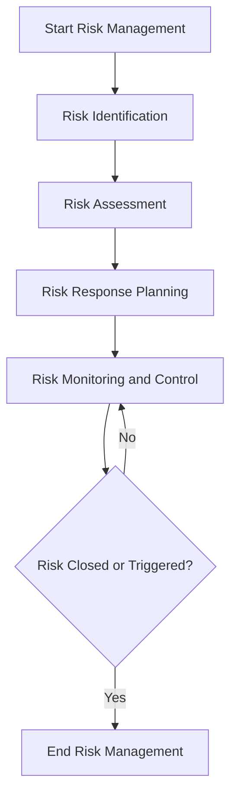

# SOP: Risk Management

## Document Information
- **Version**: 1.0
- **Effective Date**: 2025-07-20
- **Review Cycle**: Annual
- **Approval Authority**: Chief Technology Officer

## 1. Purpose and Scope

This Standard Operating Procedure (SOP) defines the standardized process for identifying, assessing, mitigating, and monitoring risks throughout the software development lifecycle. It aims to minimize potential negative impacts on project objectives, ensure project success, and promote a proactive approach to unforeseen challenges.

**Scope**: This SOP applies to all enterprise software development projects and covers:
- Identification of project, technical, operational, security, and business risks.
- Assessment of risk likelihood and impact.
- Development and implementation of risk response strategies.
- Continuous monitoring and reporting of risk status.

## 2. Roles and Responsibilities

- **Project Manager (Primary)**: Overall responsibility for risk management, maintains the Risk Register, and facilitates risk review meetings. Approves risk response plans.
- **Risk Owner (Primary)**: Individual assigned responsibility for a specific risk, including monitoring and executing mitigation strategies.
- **Project Team Members**: Responsible for identifying and reporting risks within their areas of expertise.
- **Software Architect / Technical Lead**: Identifies and assesses technical risks, proposes mitigation strategies.
- **Business Analyst**: Identifies and assesses business and requirements-related risks.
- **Quality Assurance Lead**: Identifies and assesses quality and testing-related risks.
- **Security Architect**: Identifies and assesses security and compliance risks.
- **Project Sponsor**: Provides high-level guidance on risk tolerance and approves major risk response strategies.

## 3. Process Framework: Risk Management

### 3.1 Risk Identification

**Activity**: Continuous throughout the project lifecycle.

**Techniques**:
- **Brainstorming Sessions**: Regular meetings with the project team and stakeholders to identify potential risks.
- **Checklists**: Use predefined risk checklists (e.g., technical, security, operational, project management).
- **Interviews**: Conduct interviews with subject matter experts and experienced personnel.
- **SWOT Analysis**: Analyze Strengths, Weaknesses, Opportunities, and Threats.
- **Lessons Learned**: Review historical data from previous projects.
- **Assumption Analysis**: Identify risks associated with project assumptions.

**Deliverable**: Initial Risk Register entry for each identified risk.

### 3.2 Risk Assessment

**Activity**: For each identified risk, assess its characteristics.

**Techniques**:
- **Likelihood Assessment**: Determine the probability of the risk occurring (e.g., Very Low, Low, Medium, High, Very High).
- **Impact Assessment**: Determine the potential effect if the risk occurs (e.g., Insignificant, Minor, Moderate, Major, Catastrophic) on project scope, schedule, cost, and quality.
- **Risk Scoring**: Combine likelihood and impact to calculate a risk score (e.g., using a 5x5 matrix).
- **Categorization**: Assign risks to categories (e.g., Technical, Schedule, Cost, Operational, Security, External).

**Deliverable**: Updated Risk Register with likelihood, impact, and score for each risk.

### 3.3 Risk Response Planning

**Activity**: Develop strategies to address each significant risk.

**Strategies**:
- **Avoid**: Eliminate the threat by removing the cause (e.g., changing scope).
- **Mitigate**: Reduce the probability or impact of the risk (e.g., additional testing, prototyping).
- **Transfer**: Shift the impact or ownership to a third party (e.g., insurance, outsourcing).
- **Accept**: Acknowledge the risk and its potential impact, and do nothing (e.g., for low-priority risks).
- **Escalate**: For risks beyond the project manager's authority, escalate to the project sponsor or steering committee.

**Contingency Planning**: Develop fallback plans for risks that cannot be fully mitigated.

**Deliverable**: Updated Risk Register with assigned risk owners, response strategies, and contingency plans.

### 3.4 Risk Monitoring and Control

**Activity**: Continuously track, review, and report on risk status.

**Techniques**:
- **Risk Register Updates**: Regularly update the status of each risk (e.g., open, closed, triggered).
- **Risk Review Meetings**: Conduct periodic (e.g., weekly or bi-weekly) risk review meetings with the project team.
- **Risk Reporting**: Provide regular risk reports to stakeholders and the project steering committee.
- **Trigger Identification**: Monitor for early warning signs or conditions that indicate a risk is about to occur.
- **Reassessment**: Reassess risks periodically or when significant project changes occur.

**Deliverable**: Regular Risk Status Reports, updated Risk Register.

## 4. Tools and Templates

- **Risk Register Template**: A standardized template for documenting all identified risks, their attributes, and response plans.
- **Risk Matrix**: A visual tool (e.g., 5x5 matrix) for assessing and prioritizing risks.
- **Project Management Software**: Tools like Jira, Azure DevOps, or Asana can be configured to manage risk items.
- **Communication Tools**: For reporting and escalating risks.

## 5. Metrics and KPIs

- **Number of Identified Risks**: Total risks identified over time.
- **Number of Open Risks**: Risks currently active and unaddressed.
- **Risk Exposure**: Sum of (Likelihood x Impact) for all open risks.
- **Risk Mitigation Effectiveness**: Percentage of mitigated risks that did not occur or had reduced impact.
- **Risk Response Time**: Average time from risk identification to response plan implementation.

## 6. Continuous Improvement

- **Lessons Learned**: Conduct a lessons learned session at the end of each project phase and at project closure to capture insights on risk management effectiveness.
- **Risk Register Refinement**: Continuously improve the risk register template and risk identification checklists based on project experiences.
- **Training**: Provide ongoing training to project teams on risk management principles and practices.
