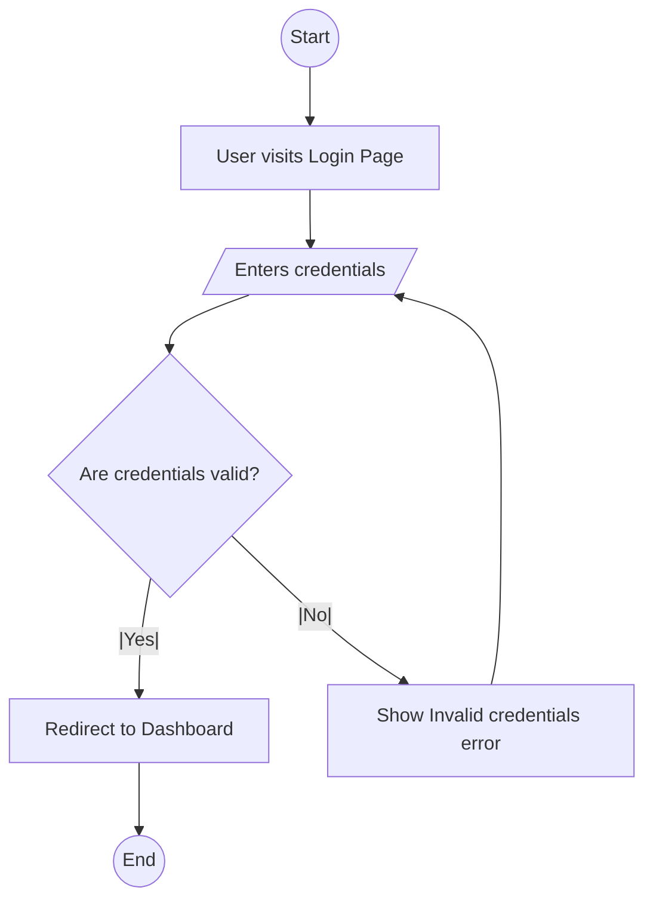
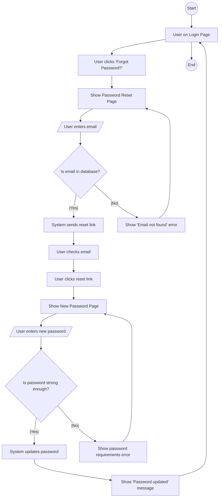

# Standard Operating Procedure: User Flow Diagramming

**Version:** 1.0  
**Date:** 2025-07-22  
**Owner:** Head of UI/UX  
**Status:** Approved  

## 1. Purpose

To provide a standardized method for creating user flow diagrams. User flows are diagrams that illustrate the complete path a user takes to accomplish a specific task within a product. They are essential for visualizing the user journey, identifying potential friction points, and ensuring a logical and intuitive user experience.

## 2. Scope

This SOP applies to the design of any multi-step process or task within our software. It is typically created after the initial user stories are defined and alongside the wireframing process.

## 3. Roles and Responsibilities

- **UI/UX Designer:** Responsible for creating and maintaining the user flow diagrams.
- **Product Manager:** Validates that the flow aligns with user stories and business requirements.
- **Developers:** Use the diagrams to understand the sequence of events and the relationship between different screens and states.

## 4. Diagramming Standards (Using Mermaid)

To maintain consistency with our other technical documentation, all user flow diagrams **must** be created using Mermaid syntax. This allows them to be embedded directly into our Markdown documents.

### 4.1 Core Shapes

| Shape | Mermaid Syntax | Purpose |
|-------|----------------|---------|
| **Rectangle** | `id[Screen/Action]` | Represents a screen, page, or a specific action taken by the user. |
| **Rhombus** | `id{Decision?}` | Represents a decision point or a question with multiple outcomes (e.g., Yes/No). |
| **Circle** | `id((Start/End))` | Represents the starting or ending point of the flow. |
| **Parallelogram** | `id[/Input/Output/]` | Represents data input from the user or data output from the system. |

### 4.2 Connectors

-   `-->`: Solid line for the primary path.
-   `-- text -->`: Solid line with a label describing the action.
-   `-.->`: Dotted line for secondary or less common paths.

## 5. Procedure

### 5.1 Phase 1: Define the Flow

1.  **Select a Task:** Choose a single, specific user task to map (e.g., "Reset a forgotten password").
2.  **Identify the Trigger:** Determine what initiates the flow (e.g., User clicks "Forgot Password?").
3.  **Define the Goal:** Clarify the successful outcome of the flow (e.g., "User is logged in with a new password").

### 5.2 Phase 2: Create the Diagram

1.  **Start Point:** Begin the diagram with a `Start` node.
2.  **Map the Path:** Using the standard Mermaid shapes, map out each step the user takes and each screen they see.
3.  **Include Decision Points:** Use rhombus shapes for any decisions the user or system makes (e.g., "Is email valid?").
4.  **Map All Branches:** Ensure you map out all possible paths, including "happy paths," alternative paths, and error paths.
5.  **End Point(s):** Every branch of the flow must conclude with an `End` node, which can be a success state or a failure state.

### 5.3 Phase 3: Review and Refine

1.  **Self-Review:** The designer reviews the diagram to check for logical gaps or dead ends.
2.  **Team Review:** The diagram is reviewed by the Product Manager and Lead Developer to ensure it accurately reflects requirements and is technically feasible.
3.  **Iterate:** The diagram is updated based on feedback.

### 5.4 Phase 4: Documentation

1.  **Embed in Documentation:** The final Mermaid code for the user flow is embedded in the appropriate design document (e.g., `05_UI_UX_Design.md`).
2.  **Add Context:** Include a brief description above the diagram explaining the flow's purpose and context.

## 6. Example User Flows

### 6.1 Simple Login Flow

### 6.2 Complex Password Reset Flow

