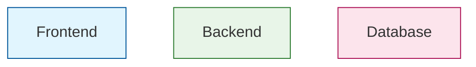

# Complete Mermaid Diagram Syntax Guide

## Basic Structure

Every Mermaid diagram starts with a diagram type declaration:

```mermaid
graph TD
    %% Your diagram content here
```

**Common diagram types:**
- `graph TD` - Top Down flowchart
- `graph LR` - Left to Right flowchart
- `sequenceDiagram` - Sequence diagrams
- `classDiagram` - Class diagrams
- `gitgraph` - Git flow diagrams

## Node Syntax Rules

### 1. Node Shapes
```mermaid
A[Rectangle]
B(Rounded Rectangle)
C((Circle))
D{Diamond}
E[/Parallelogram/]
F[\Reverse Parallelogram\]
G[(Database)]
H{{Hexagon}}
```

### 2. Node ID Rules
✅ **Good IDs:**
- `A`, `B1`, `node_1`, `userService`
- Keep them short and alphanumeric
- Use underscores, not spaces

❌ **Avoid:**
- `User Service` (spaces)
- `node-with-dashes` (can cause issues)
- Very long IDs

### 3. Node Text Rules
✅ **Safe text:**
```mermaid
A[Simple Text]
B[Text with Numbers 123]
C[Text & Symbols]
```

❌ **Problematic text:**
```mermaid
A[Text with "quotes"]  %% Use single quotes instead
B[Text with (parentheses) in middle]  %% Can confuse parser
```

## Connection Syntax

### 1. Basic Connections
```mermaid
A --> B          %% Arrow
A --- B          %% Line
A -.-> B         %% Dotted arrow
A ==> B          %% Thick arrow
A -.- B          %% Dotted line
```

### 2. Connection Labels
✅ **Correct:**
```mermaid
A -->|Label Text| B
A --|Label Text|--- B
```

❌ **Incorrect:**
```mermaid
A --> B: Label Text    %% This causes parse errors!
```

### 3. Conditional Connections
```mermaid
A{Decision} -->|Yes| B
A -->|No| C
```

## Subgraph Syntax

### 1. Basic Subgraph


**Important Rules:**
- Always close with `end`
- Use quotes around titles with spaces
- Define connections AFTER all subgraphs

### 2. Multiple Subgraphs


## Common Syntax Errors & Solutions

### Error 1: Parse error with connections
❌ **Wrong:**
```mermaid
subgraph "Services"
    A[Service]
end
A --> B: Connection  %% Error here!
```

✅ **Correct:**
```mermaid
subgraph "Services"
    A[Service]
end

A -->|Connection| B
```

### Error 2: Missing end statements
❌ **Wrong:**
```mermaid
subgraph "Group 1"
    A[Node]
subgraph "Group 2"  %% Missing 'end'
    B[Node]
end
```

✅ **Correct:**
```mermaid
subgraph "Group 1"
    A[Node]
end

subgraph "Group 2"
    B[Node]
end
```

### Error 3: Invalid characters in labels
❌ **Wrong:**
```mermaid
A[Service "API"] --> B  %% Quotes inside brackets
```

✅ **Correct:**
```mermaid
A[Service API] --> B
%% or
A["Service 'API'"] --> B  %% Use single quotes inside
```

### Error 4: Mixing node definitions
❌ **Wrong:**
```mermaid
A[Start] --> B{Decision} --> C[End]  %% Defining shape in connection
```

✅ **Correct:**
```mermaid
A[Start]
B{Decision}
C[End]

A --> B
B --> C
```

## Styling Best Practices

### 1. Using Classes


### 2. Inline Styling
```mermaid
A[Node]:::className
B[Node]:::anotherClass
```

## Comments

Use `%%` for comments:
```mermaid
graph TD
    %% This is a comment
    A[Start] --> B[Process]
    %% Comments help organize your diagram
    B --> C[End]
```

## Testing Your Diagrams

### 1. Start Simple
Begin with basic nodes and connections, then add complexity:

```mermaid
%% Step 1: Basic structure
graph TD
    A --> B

%% Step 2: Add more nodes
graph TD
    A[Start] --> B[Process] --> C[End]

%% Step 3: Add decision points
graph TD
    A[Start] --> B{Decision}
    B -->|Yes| C[Process]
    B -->|No| D[End]
```

### 2. Validate Incrementally
- Add one subgraph at a time
- Test connections after each addition
- Use comments to disable problematic sections temporarily

## Quick Troubleshooting Checklist

When you get a parse error:

1. **Check subgraph closure:** Every `subgraph` needs an `end`
2. **Review connection syntax:** Use `A -->|label| B`, not `A --> B: label`
3. **Validate node IDs:** No spaces or special characters
4. **Check quotes:** Consistent quote usage in labels
5. **Verify structure:** All connections defined after subgraphs
6. **Remove complexity:** Comment out styling and labels to isolate the issue

## Example: Clean, Error-Free Diagram

```mermaid
graph TD
    %% Define all nodes first
    User((User))
    
    subgraph "Frontend Layer"
        UI[User Interface]
        Auth[Authentication]
    end
    
    subgraph "Backend Layer"
        API[API Gateway]
        Service[Business Service]
    end
    
    subgraph "Data Layer"
        DB[(Database)]
        Cache[(Cache)]
    end
    
    %% Define all connections after subgraphs
    User --> UI
    UI --> Auth
    Auth --> API
    API --> Service
    Service --> DB
    Service --> Cache
    
    %% Apply styling last
    classDef frontend fill:#bbdefb,stroke:#1976d2
    classDef backend fill:#c8e6c9,stroke:#388e3c
    classDef data fill:#ffcdd2,stroke:#d32f2f
    
    class UI,Auth frontend
    class API,Service backend
    class DB,Cache data
```

## Pro Tips

1. **Build incrementally** - Start with basic structure, add details later
2. **Use consistent naming** - Pick a naming convention and stick to it
3. **Group related connections** - Use comments to organize connection blocks
4. **Test frequently** - Validate your diagram after each major change
5. **Keep it simple** - Complex diagrams are harder to debug and maintain

This guide should help you create clean, error-free Mermaid diagrams every time!